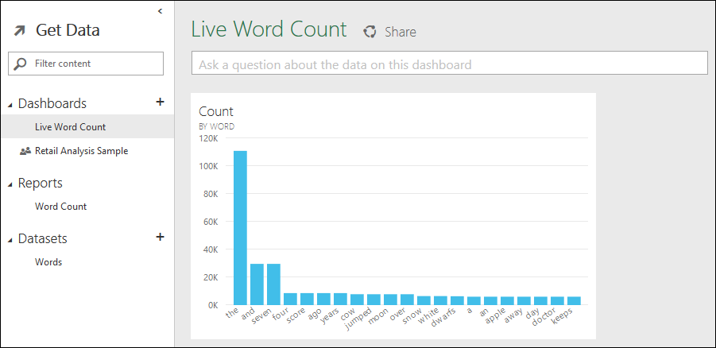

<properties
 pageTitle="将数据从 Apache Storm 写入 Power BI | Microsoft Azure"
 description="将数据从 HDInsight 中 Apache Storm 群集上运行的 C# 拓扑写入 Power BI。此外，使用 Power BI 创建报表和实时仪表板。"
 services="hdinsight"
 documentationCenter=""
 authors="Blackmist"
 manager="paulettm"
 editor="cgronlun"
	tags="azure-portal"/>

<tags
	ms.service="hdinsight"
	ms.date="01/08/2016"
	wacn.date="02/26/2016"/>

# 使用 Power BI（预览版）从 Apache Storm 拓扑可视化数据

Power BI 预览版允许你以可视方式将数据显示为报告或仪表板。借助 Power BI REST API 可以轻松地在 Power BI 中使用 HDInsight 群集上 Apache Storm 运行的拓扑中的数据。

在本文档中，你将学习如何使用 Power BI，基于 Storm 拓扑创建的数据创建报告和仪表板。

## 先决条件

- Azure 订阅。请参阅[获取 Azure 试用版](/pricing/1rmb-trial/)。

* 具有 [Power BI](https://powerbi.com) 访问权限的 Azure Active Directory 用户

* Visual Studio（以下版本之一）

    * Visual Studio 2012 [Update 4](http://www.microsoft.com/download/details.aspx?id=39305)

    * Visual Studio 2013 [Update 4](http://www.microsoft.com/download/details.aspx?id=44921) 或 [Visual Studio 2013 Community](http://download.microsoft.com/download/7/1/B/71BA74D8-B9A0-4E6C-9159-A8335D54437E/vs_community.exe)

    * Visual Studio 2015 [CTP6](http://visualstudio.com/downloads/visual-studio-2015-ctp-vs)

* HDInsight Tools for Visual Studio：有关安装方面的信息，请参阅 [HDInsight Tools for Visual Studio 入门](/documentation/articles/hdinsight-hadoop-visual-studio-tools-get-started)。

## 工作原理

本示例包含一个 C# Storm 拓扑，该拓扑可随机生成句子、将该句子拆分成单词、统计单词数目，然后将单词和计数发送到 Power BI REST API。[PowerBi.Api.Client](https://github.com/Vtek/PowerBI.Api.Client) Nuget 包用来与 Power BI 通信。

此项目中的以下文件实现 Power BI 特定的功能：

* **PowerBiBolt.cs**：实现用于将数据发送到 Power BI 的 Storm Bolt

* **Data.cs**：描述要发送到 Power BI 的数据对象/行

> [AZURE.WARNING] Power BI 似乎允许多个同名的数据集。如果数据集不存在，并且你的拓扑结构会创建 Power BI Bolt 的多个实例，则可能会发生这种情况。若要避免此问题，请将 Bolt 的并行性提示设置为 1（如本示例中所示），或在部署拓扑之前创建数据集。
> 
此解决方案中包含的 **CreateDataset** 控制台应用程序是作为示例提供的，介绍如何在拓扑结构外部创建数据集。

## 注册 Power BI 应用程序

遵循[注册应用](https://powerbi.microsoft.com/en-us/documentation/powerbi-developer-register-a-client-app/)中的步骤创建应用程序注册。在访问 Power BI REST API 时将要用到此注册信息。

> [AZURE.IMPORTANT] 保存应用程序注册的“客户端 ID”。

## 下载示例

下载 [HDInsight C# Storm Power BI 示例](https://github.com/Blackmist/hdinsight-csharp-storm-powerbi)。若要下载该示例，请使用 [git](http://git-scm.com/) 复制/克隆它，或使用“下载”链接下载 .zip 存档。

## 配置示例

1. 在 Visual Studio 中打开该示例。在“解决方案资源管理器”中，打开“App.config”文件，然后找到 **<OAuth .../>** 元素。输入此元素的以下属性的值。

    * **客户端**：先前创建的应用程序注册的客户端 ID。

    * **用户**：有权访问 Power BI 的 Azure Active Directory 帐户。

    * **密码**：Azure Active Directory 帐户的密码。

2. （可选）。此项目使用的默认数据集名称为 **Words**。若要更改此名称，请在“解决方案资源管理器”中右键单击“WordCount”项目，选择“属性”，然后选择“设置”。将“DatasetName”条目更改为所需的值。

2. 保存并关闭文件。

## 部署示例

1. 在“解决方案资源管理器”中，右键单击“WordCount”项目，然后选择“提交到 Storm on HDInsight”。从“Storm 群集”下拉对话框中选择 选择 HDInsight 群集。

    > [AZURE.NOTE] 可能需要在几秒钟后，“Storm 群集”下拉对话框中才会填充服务器名称。
    >
    > 如果出现提示，请输入你 Azure 订阅的登录凭据。如果你有多个订阅，请登录包含 Storm on HDInsight 群集的订阅。

2. 成功提交拓扑之后，应该会出现群集的“Storm 拓扑”。从列表中选择“WordCount”拓扑，以查看有关正在运行的拓扑的信息。

    

    > [AZURE.NOTE] 你也可以展开“Azure”>“HDInsight”，右键单击 Storm on HDInsight 群集，然后选择“查看 Storm 拓扑”，来从“服务器资源管理器”查看“Storm 拓扑”。

3. 在查看“拓扑摘要”时不断滚动，直到看到“Bolt”部分。在此部分中，注意 **PowerBI** Bolt 的 **Executed** 列。使用页面顶部的刷新按钮刷新，直到值更改为非零值。当此数字开始递增时，即表示正在将项写入 Power BI。

## 创建报告

1. 在浏览器中访问 [https://PowerBI.com](https://powerbi.com)。使用你的帐户登录。

2. 在页面左侧展开“数据集”。选择 **Words** 条目。这是示例拓扑创建的数据集。

    

3. 在 **Fields** 区域中，展开 **WordCount**。将 **Count** 和 **Word** 条目拖放到页面的中间部分。这将会创建一个新的图表，其中为每个单词显示一栏，指示该单词的出现次数。

    

4. 在页面的左上角，选择“保存”以创建新的报告。输入 **Word Count** 作为报告名称。

5. 选择 Power BI 徽标返回到仪表板。现在，**Word Count** 报告将出现在“报告”下面。

## 创建实时仪表板

1. 在“仪表板”旁边，选择“+”图标创建新仪表板。将新仪表板命名为 **Live Word Count**。

2. 选择前面创建的 **Word Count** 报告。在显示图表时，请选择该图表，然后选择图表右上角的图钉图标。此时，你应该会收到一条通知，指出该图表已固定到仪表板。

    

2. 选择 Power BI 徽标返回到仪表板。选择 **Live Word Count** 仪表板。现在，它应该已包含 Word Count 图表，并且在将新条目从 HDInsight 上运行的 WordCount 拓扑发送到 Power BI 时，仪表板会更新。

    

## 停止 WordCount 拓扑

在你停止该拓扑或者删除 Storm on HDInsight 之前，该拓扑会一直运行。执行以下步骤可停止拓扑。

1. 在 Visual Studio 中，打开 WordCount 拓扑的“拓扑摘要”窗口。如果拓扑摘要尚未打开，请转到“服务器资源管理器”，展开“Azure”和“HDInsight”条目，右键单击 HDInsight 群集，然后选择“查看 Storm 拓扑”。最后，选择 **WordCount** 拓扑。

2. 选择“终止”按钮以停止 **WordCount** 拓扑。

    

## 后续步骤

在本文档中，你已学习如何使用 REST 将数据从 Storm 拓扑发送到 Power BI。有关如何使用其他 Azure 技术的信息，请参阅以下文章：

* [Storm on HDInsight 的示例拓扑](/documentation/articles/hdinsight-storm-example-topology)

<!---HONumber=Mooncake_0215_2016-->