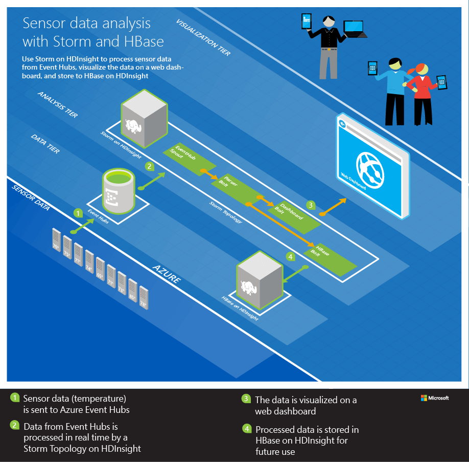

<properties
   pageTitle="使用 Apache Storm 和 HBase 分析传感器数据 | Azure"
   description="了解如何使用虚拟网络连接到 Apache Storm。了解如何使用 Storm 和 HBase 处理来自 Azure 事件中心的传感器数据，然后使用 D3.js 来可视化这些数据。"
   services="hdinsight"
   documentationCenter=""
   authors="Blackmist"
   manager="paulettm"
   editor="cgronlun"/>

<tags
	ms.service="hdinsight"
	ms.date="01/28/2016"
	wacn.date="01/21/2016"/>

# 使用 Apache Storm、事件中心和 HDInsight 中的 HBase (Hadoop) 分析传感器数据

了解如何使用 Apache Storm on HDInsight 处理来自 Azure 事件中心的传感器数据，然后使用 D3.js 来可视化这些数据。本文档还将介绍如何使用 Azure 虚拟网络来连接 Storm on HDInsight 和 HBase on HDInsight，然后将拓扑中的数据存储到 HBase。

## 先决条件

* Azure 订阅。请参阅[获取 Azure 试用版](/pricing/1rmb-trial/)。

* 一个 [Apache Storm on HDInsight 群集](/documentation/articles/hdinsight-apache-storm-tutorial-get-started)

* [Node.js](http://nodejs.org/)：用于 Web 仪表板，以及将传感器数据发送到事件中心。

* [Java 和 JDK 1.7](http://www.oracle.com/technetwork/java/javase/downloads/index.html)

* [Maven](http://maven.apache.org/what-is-maven.html)

* [Git](http://git-scm.com/)

> [AZURE.NOTE]Java、JDK、Maven 和 Git 也可通过 [Chocolatey NuGet](http://chocolatey.org/) 包管理器获得。

## 体系结构

本示例包括以下组成部分：

* **Azure 事件中心**：提供从传感器收集的数据。对于本示例，将提供用于生成虚构数据的应用程序。

* **Storm on HDInsight**：用于实时处理来自事件中心的数据。

* **HBase on HDInsight**（可选）：提供持久性 NoSQL 数据存储。

* **Azure 虚拟网络服务**（可选，使用 HBase 时必需）：在 Storm on HDInsight 和 HBase on HDInsight 群集之间启用安全通信。

* **仪表板 Web 应用**：实时绘制数据图表的示例仪表板。

	* 该 Web 应用在 Node.js 中实现，因此它可以在用于测试的任何客户端操作系统上运行，或者可以部署到 Azure Web 应用。

	* [Socket.io](http://socket.io/) 用于 Storm 拓扑和 Web 应用之间的实时通信。

		> [AZURE.NOTE]这是实现详细信息。你可以使用任何通信框架，例如原始 WebSockets 或 SignalR。

	* [D3.js](http://d3js.org/) 用于绘制发送到 Web 应用的数据的图表。

拓扑中使用从事件中心读取数据 **com.microsoft.eventhubs.spout.EventHubSpout** 类，该类在 Storm on HDInsight 群集中提供。与 Web 应用的通信可通过使用 [socket.io client.java](https://github.com/nkzawa/socket.io-client.java) 来实现。

或者，可以使用 Storm 随附的 [org.apache.storm.hbase.bolt.HBaseBolt](https://storm.apache.org/javadoc/apidocs/org/apache/storm/hbase/bolt/class-use/HBaseBolt.html) 来实现与 HBase 的通信。

下面是拓扑图。

> [AZURE.NOTE]这是一个非常简单的拓扑视图。在运行时，每个组件的实例为每个分区创建事件中心所读取。这些实例分布在群集中，节点和数据在它们之间路由，如下所示：
>
> * 从 spout 到分析器的数据已经过负载平衡。
> * 从分析器到仪表板和 HBase（如果已使用）已按设备 ID 分组，因此来自同一设备的消息始终流向同一组件。

### 组件

* **事件中心 Spout**：GitHub 上的 [HDInsight Storm 示例](https://github.com/hdinsight/hdinsight-storm-examples)随附了 spout。

* **ParserBolt.java**：spout 发出的数据是原始的 JSON，有时每次会发出多个事件。此 bolt 演示如何读取 spout 发出的数据，并将它作为包含多个字段的元组形式发送到新流。

* **DashboardBolt.java**：演示如何使用 Java 的 Socket.io 客户端库将数据实时发送到 Web 仪表板。

## 准备环境

在使用本示例之前，必须创建要由 Storm 读取的 Azure 事件中心。你还必须创建 Storm on HDInsight 拓扑，从事件中心读取数据的组件只在群集中可用。

> [AZURE.NOTE]最终，事件中心 spout 将从 Maven 提供。

### 配置事件中心

事件中心是此示例的数据源。按照下列步骤创建一个新的事件中心。

1. 在 [Azure 管理门户](https://manage.windowsazure.cn)中，选择“新建”|“服务总线”|“事件中心”|“自定义创建”。

2. 在“添加新事件中心”对话框中，输入“事件中心名称”，选择要在其中创建中心的“区域”，然后创建新的命名空间或选择现有的命名空间。最后，单击箭头以继续。

2. 在“配置事件中心”对话框中，输入“分区计数”和“消息保留期”值。对于本示例，请使用分区计数 10，消息保留期 1。

3. 创建事件中心后，选择命名空间，然后选择“事件中心”。最后，选择前面创建的事件中心。

4. 选择“配置”，然后使用以下信息创建两个新的访问策略。

	<table>
	<tr><th>Name</th><th>权限</th></tr>
	<tr><td>设备</td><td>发送</td></tr>
	<tr><td>Storm</td><td>侦听</td></tr>
	</table>

	创建权限后，在页面底部选择“保存”图标。这将创建共享的访问策略，该策略将用于向此中心发送消息以及从中读取消息。

5. 保存策略后，使用页面底部的“共享访问密钥生成器”检索设备和 storm 策略的密钥。保存这些密钥，因为稍后将要用到。

### 创建 Storm on HDInsight 群集

1. 登录到 [Azure 管理门户](https://manage.windowsazure.cn/)。

2. 在左窗格中单击“HDInsight”，然后单击页面左下角的“+新建”。

3. 单击第二列中的 HDInsight 图标，然后选择“自定义”。

4. 在“群集详细信息”页上，输入新群集的名称，然后选择“Storm”作为“群集类型”。单击箭头继续。

5. 输入 1 作为用于此群集的“数据节点”数量。

	> [AZURE.NOTE]为了最大程度减少本文所用群集的成本，请将“群集大小”减至 1，并在群集使用完后删除群集。

6. 输入管理员“用户名”和“密码”，然后单击箭头继续。

4. 对于“存储帐户”，请选择“创建新存储”或选择已有的存储帐户。选择或输入要使用的“帐户名称”和“默认容器”。选择左下角复选标记图标以创建 Storm 群集。

## 下载并安装 EventHubSpout

1. 下载 [HDInsight Storm 示例项目](https://github.com/hdinsight/hdinsight-storm-examples/)。下载后，找到 **lib/eventhubs/eventhubs-storm-spout-0.9-jar-with-dependencies.jar** 文件。

2. 在命令提示符下，使用以下命令将 **eventhubs-storm-spout-0.9-jar-with-dependencies.jar** 文件安装到本地 Maven 存储。这样，你便可以在稍后的步骤中轻松地将其作为一个引用添加到 Storm 项目中。

		mvn install:install-file -Dfile=target/eventhubs-storm-spout-0.9-jar-with-dependencies.jar -DgroupId=com.microsoft.eventhubs -DartifactId=eventhubs-storm-spout -Dversion=0.9 -Dpackaging=jar

## 下载并配置项目

使用以下命令从 GitHub 中下载项目。

	git clone https://github.com/Blackmist/hdinsight-eventhub-example

命令执行完毕后，你将得到以下目录结构：

	hdinsight-eventhub-example/
		TemperatureMonitor/ - this is the Java topology
			conf/
				Config.properties
				hbase-site.xml
			src/
			test/
			dashboard/ - this is the node.js web dashboard
			SendEvents/ - utilities to send fake sensor data

> [AZURE.NOTE]本文档不会深入介绍本示例中包含的代码；但是，代码带有全面的注释。

打开 **Config.properties** 文件并添加先前创建事件中心时使用的信息。在添加此信息后，请保存该文件。

	eventhubspout.username = storm

	eventhubspout.password = <the key of the 'storm' policy>

	eventhubspout.namespace = <the event hub namespace>

	eventhubspout.entitypath = <the event hub name>

	eventhubspout.partitions.count = <the number of partitions for the event hub>

	## if not provided, will use storm's zookeeper settings
	## zookeeper.connectionstring=localhost:2181

	eventhubspout.checkpoint.interval = 10

	eventhub.receiver.credits = 1024

## 编译并在本地测试

测试之前，必须启动仪表板以查看拓扑的输出，并生成要在事件中心中存储的数据。

### 启动 Web 应用

1. 打开新的命令提示符或终端，并将目录更改为 将目录更改为 **hdinsight-eventhub-example/dashboard**，并使用以下命令安装 Web 应用所需的依赖项：

		npm install

2. 使用以下命令启动 Web 应用：

		node server.js

	你应看到类似于下面的消息：

		Server listening at port 3000

2. 打开 Web 浏览器，并输入 **http://localhost:3000/** 作为地址。你应看到类似于下面的页面：

	

	将此命令提示符或终端保持打开状态。测试完成后，使用 Ctrl-C 停止 Web 服务器。

### 开始生成数据

> [AZURE.NOTE]本部分中的步骤使用 Node.js，以便它们可以在任何平台上运行。对于其他语言示例，请参阅 **SendEvents** 目录。

1. 打开新的命令提示符或终端，将目录切换为 **hdinsight-eventhub-example/SendEvents/nodejs**，然后使用以下命令安装应用程序所需的依赖项：

		npm install

2. 在文本编辑器中打开 **app.js** 文件，并添加你之前获取的事件中心信息：

		// ServiceBus Namespace
		var namespace = 'servicebusnamespace';
		// Event Hub Name
		var hubname ='eventhubname';
		// Shared access Policy name and key (from Event Hub configuration)
		var my_key_name = 'devices';
		var my_key = 'key';

2. 使用以下命令在事件中心插入新条目：

		node app.js

	你应会看到包含发送到事件中心的数据的多个输出行。这些信息如下所示：

		{"TimeStamp":"2015-02-10T14:43.05.00320Z","DeviceId":0,"Temperature":7}
		{"TimeStamp":"2015-02-10T14:43.05.00320Z","DeviceId":1,"Temperature":39}
		{"TimeStamp":"2015-02-10T14:43.05.00320Z","DeviceId":2,"Temperature":86}
		{"TimeStamp":"2015-02-10T14:43.05.00320Z","DeviceId":3,"Temperature":29}
		{"TimeStamp":"2015-02-10T14:43.05.00320Z","DeviceId":4,"Temperature":30}
		{"TimeStamp":"2015-02-10T14:43.05.00320Z","DeviceId":5,"Temperature":5}
		{"TimeStamp":"2015-02-10T14:43.05.00320Z","DeviceId":6,"Temperature":24}
		{"TimeStamp":"2015-02-10T14:43.05.00320Z","DeviceId":7,"Temperature":40}
		{"TimeStamp":"2015-02-10T14:43.05.00320Z","DeviceId":8,"Temperature":43}
		{"TimeStamp":"2015-02-10T14:43.05.00320Z","DeviceId":9,"Temperature":84}

### 启动拓扑

2. 使用下列命令从本地启动拓扑

	mvn compile exec:java -Dstorm.topology=com.microsoft.examples.Temperature

	此操作将启动拓扑、从事件中心中读取文件并将其发送到 Azure 中运行的仪表板中。你应看到各行显示在 Web 仪表板中，如下所示：

	

3. 当仪表板正在运行时，使用前面步骤中的 `node app.js` 命令将新数据发送到仪表板。由于温度值是随机生成的，因此图表应会更新以显示新值。

3. 验证其运行情况后，按 Ctrl+C 停止拓扑。若要停止 SendEvent 应用，请选中窗口并按下任何键。也可以使用 Ctrl+C 来停止 Web 服务器。

## 打包拓扑并将其部署到 HDInsight 中

在你的开发环境中，按照以下步骤在你的 HDInsight Storm 群集中执行“Temperature”拓扑。

### 发布 Web 应用仪表板

1. 若要将仪表板部署到 Azure Web 应用，请遵循[构建 Node.js Web 应用并将其部署到 Azure](/documentation/articles/web-sites-nodejs-develop-deploy-mac) 中的步骤。记下 Web 应用的 URL，它类似于 **mywebsite.chinacloudsites.cn**。

2. 创建 Web 应用后，转到 Azure 管理门户中的站点，然后选择“配置”选项卡。启用“Web 套接字”，然后在页面底部单击“保存”。

2. 打开 **hdinsight-eventhub-example\\TemperatureMonitor\\src\\main\\java\\com\\microsoft\\examples\\bolts\\DashboardBolt.java** 并将以下行更改为指向已发布仪表板的 URL：

		socket = IO.socket("http://mywebsite.chinacloudsites.cn");

3. 保存 **DashboardBolt.java** 文件。

### 打包并部署拓扑

1. 使用以下命令从你的项目中创建一个 JAR 程序包：

		mvn package

	此操作将在项目的 **target** 目录中创建一个名为 **TemperatureMonitor-1.0-SNAPSHOT.jar** 的文件。

2. 根据[部署和管理 Storm 拓扑](/documentation/articles/hdinsight-storm-deploy-monitor-topology)中的步骤，在 Storm on HDInsight 群集上使用 **Storm 仪表板**上载和启动拓扑。

3. 启动拓扑后，打开浏览器到 Azure 发布的 Web 应用，然后使用 `node app.js` 命令将数据发送到事件中心。你应该看到 Web 仪表板更新以显示信息。

	

## 可选：使用 HBase

若要将 Storm 和 HBase 一起使用，必须创建 Azure 虚拟网络，并在该网络中创建 Storm 和 HBase 群集。

### 创建 Azure 虚拟网络（可选）

如果你打算对本示例使用 HBase，必须创建 Azure 虚拟网络并在其中包含 Storm on HDInsight 群集和 HBase on HDInsight 群集。

1. 登录到 [Azure 管理门户](https://manage.windowsazure.cn)。

2. 在页面底部，单击“+新建”>“网络服务”>“虚拟网络”>“快速创建”。

3. 键入或选择以下值：

	- **名称**：虚拟网络的名称。

	- **地址空间**：为虚拟网络提供大到足以为群集中的所有节点提供地址的地址空间。否则，设置将失败。

	- **最大 VM 计数**：选择最大虚拟机计数之一。

	- **位置**：该位置必须与要创建的 HBase 群集相同。

	- **DNS 服务器**：本文使用 Azure 提供的内部 DNS 服务器，因此，你可以选择“无”。此外，也支持使用自定义 DNS 服务器的高级网络配置。有关详细指导，请参阅[名称解析 (DNS)](/documentation/articles/virtual-networks-name-resolution-for-vms-and-role-instances)。

4. 单击“创建虚拟网络”。新虚拟网络名称将显示在列表中。等到“状态”列显示“已创建”。

5. 在主窗格中，单击刚创建的虚拟网络。

6. 在页面顶部，单击“仪表板”。

7. 在“速览”下，记住“虚拟网络 ID”。在设置 Storm 和 HBase 群集时将要用到它。

8. 在页面顶部，单击“配置”。

9. 在页面底部，默认子网名称为 **Subnet-1**。使用“添加子网”按钮添加 **Subnet-2**。Storm 和 HBase 群集将位于这些子网中。

	> [AZURE.NOTE]在本文中，我们将使用只有一个节点的群集。如果你创建的是多节点群集，你必须为用于群集的子网验证其 **CIDR（地址数）**。地址数必须大于辅助节点数加上七（网关：2，头节点：2，ZooKeeper：3）。例如，如果需要一个 10 节点 HBase 群集，子网的地址数必须大于 17 (10+7)。否则，部署将失败。
	> 
强烈建议为一个群集指定一个子网。

11. 单击页面底部的“保存”。

### 在虚拟网络中创建 Storm 和 HBase 群集

1. 登录到 [Azure 管理门户](https://manage.windowsazure.cn/)。

2. 在左窗格中单击“HDInsight”，然后单击页面左下角的“+新建”。

3. 单击第二列中的 HDInsight 图标，然后选择“自定义”。

4. 在“群集详细信息”页上，输入新群集的名称，然后选择“Storm”作为“群集类型”。单击箭头继续。

5. 输入 1 作为用于此群集的“数据节点”数量。对于“区域/虚拟网络”，请选择先前创建的 Azure 虚拟网络。对于“虚拟网络子网”，请选择“Subnet-1”。

	> [AZURE.NOTE]为了最大程度减少本文所用群集的成本，请将“群集大小”减至 1，并在群集使用完后删除群集。

6. 输入管理员“用户名”和“密码”，然后单击箭头继续。

4. 对于“存储帐户”，请选择“创建新存储”或选择已有的存储帐户。选择或输入要使用的“帐户名称”和“默认容器”。选择左下角复选标记图标以创建 Storm 群集。

5. 重复上述步骤以创建新的 **HBase** 群集。下面是主要区别：

	* **群集类型**：选择“HBase”

	* **虚拟网络子网**：选择“Subnet-2”

	* **存储帐户**：你应使用一个不同于 Storm 群集所用的容器。

### 发现 HBase DNS 后缀

为了从 Storm 群集写入 HBase，你必须为 HBase 群集使用完全限定域名 (FQDN)。使用以下命令发现此信息：

	curl -u <username>:<password> -k https://<clustername>.azurehdinsight.cn/ambari/api/v1/clusters/<clustername>.azurehdinsight.cn/services/hbase/components/hbrest

在返回的 JSON 数据中, 找到 **"host\_name"** 条目。其中包含群集中节点的 FQDN，例如：

	...
	"host_name": "wordkernode0.<clustername>.b1.chinacloudapp.cn
	...

群集名称开头的域名称的部分是 DNS 后缀，例如 **mycluster.b1.chinacloudapp.cn**。

### 启用 HBase bolt

1. 打开 **hdinsight-eventhub-example\\TemperatureMonitor\\conf\\hbase-site.xml** 并将以下行中的 `suffix` 条目替换前面为 HBase 群集获取的 DNS 后缀。进行这些更改之后，保存该文件。

		<value>zookeeper0.suffix,zookeeper1.suffix,zookeeper2.suffix</value>

	这将用于通过 HBase bolt 与 HBase 群集通信。

1. 在文本编辑器中打开 **hdinsight-eventhub-example\\TemperatureMonitor\\src\\main\\java\\com\\microsoft\\examples\\bolts**，通过删除开头的 `//` 取消注释以下行。进行此更改之后，保存该文件。

		topologyBuilder.setBolt("HBase", new HBaseBolt("SensorData", mapper).withConfigKey("hbase.conf"), spoutConfig.getPartitionCount())
    	  .fieldsGrouping("Parser", "hbasestream", new Fields("deviceid")).setNumTasks(spoutConfig.getPartitionCount());

	这将启用 HBase Bolt。

	> [AZURE.NOTE]仅当你要部署到 Storm 群集而不是在本地测试时，才应启用 HBase bolt。

### HBase 和 Storm 数据

在运行拓扑之前，必须准备 HBase 接受数据。

1. 使用远程桌面连接到 HBase 群集。

2. 从桌面中启动 HDInsight 命令行并输入以下命令。

    cd %HBASE\_HOME%
    bin\\hbase shell

3. 从 HBase Shell 中，输入以下命令以创建存储传感器数据的表。

    create 'SensorData', 'cf'

4. 通过输入以下命令验证表中不包含数据：

    scan 'SensorData'

在 Storm 群集上启动拓扑并已开始处理数据后，你可以再次使用 `scan 'SensorData'` 命令来验证数据是否已插入 HBase。

## 后续步骤

现在，你已了解如何使用 Storm 从事件中心读取数据，以及使用 SignalR 和 D3.js 将 Storm 中的信息显示在 的外部仪表板上。如果你使用了可选步骤，则还已了解如何在虚拟网络中配置 HDInsight，以及如何使用 HBase bolt 在 Storm 拓扑与 HBase 之间进行通信。

* 有关 HDinsight Storm 拓扑的更多示例，请参阅：

    * [Storm on HDInsight 的示例拓扑](/documentation/articles/hdinsight-storm-example-topology)

* 有关 Apache Storm 的详细信息，请参阅 [Apache Storm](https://storm.incubator.apache.org/) 站点。

* 有关 HBase on HDInsight 的详细信息，请参阅 [HDInsight 上的 HBase 概述](/documentation/articles/hdinsight-hbase-overview)。

* 有关 Socket.io 的详细信息，请参阅 [socket.io](http://socket.io/) 站点。

* 有关 D3.js 的详细信息，请参阅 [D3.js - 数据驱动的文档](http://d3js.org/)。

* 有关以 Java 创建拓扑的信息，请参阅[为 Apache Storm on HDInsight 开发 Java 拓扑](/documentation/articles/hdinsight-storm-develop-java-topology)。

* 有关以 .NET 创建拓扑的信息，请参阅[使用 Visual Studio 为 Apache Storm on HDInsight 开发 C# 拓扑](/documentation/articles/hdinsight-storm-develop-csharp-visual-studio-topology)。

[azure-portal]: https://manage.windowsazure.cn/

<!---HONumber=82-->