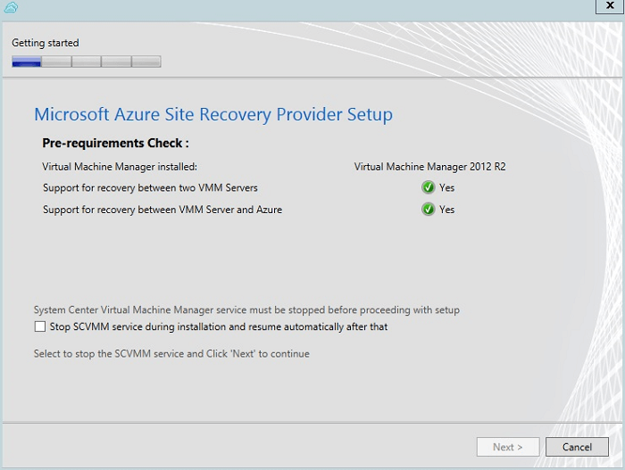
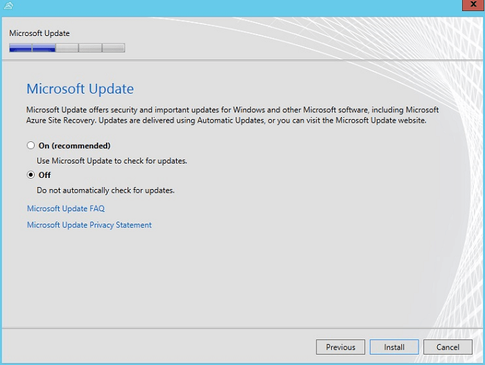
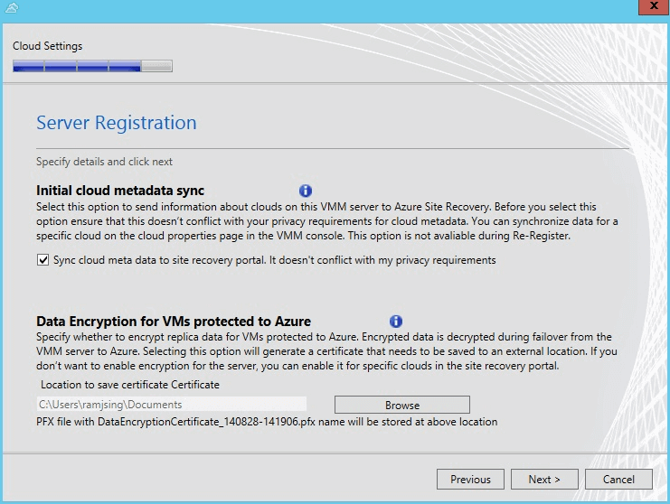
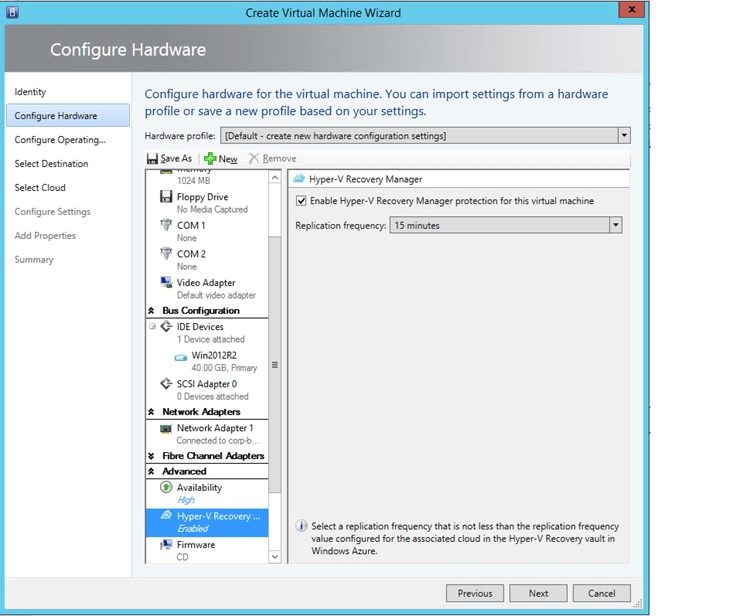
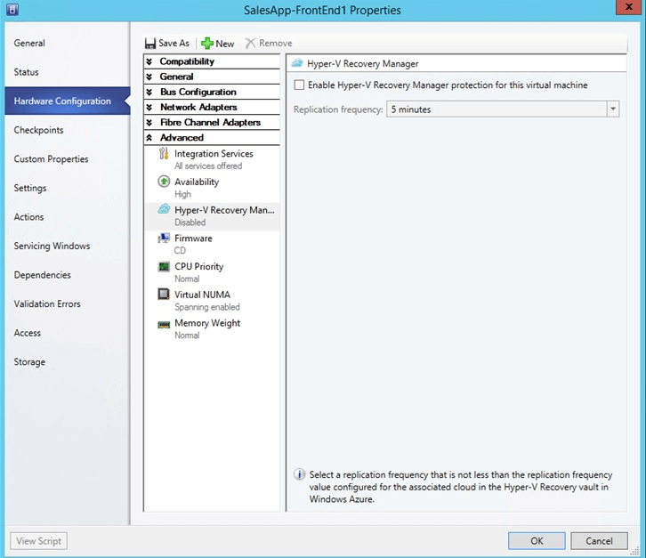

<properties urlDisplayName="configure-Azure-Site-Recovery" pageTitle="Azure Site Recovery 入门：使用 Hyper-V 复制提供本地到 Azure 的保护" metaKeywords="Azure Site Recovery, VMM, clouds, disaster recovery" description="Azure Site Recovery coordinates the replication, failover and recovery of Hyper-V virtual machines located in on-premises VMM clouds to Azure." metaCanonical="" umbracoNaviHide="0" disqusComments="1" title="Getting Started with Azure Site Recovery: On-Premises VMM Site to Azure protection with Hyper-V Replication
" editor="jimbe" manager="johndaw" authors="raynew" />
<tags ms.service=""
    ms.date="02/18/2015"
    wacn.date=""
    />

# Azure Site Recovery 入门：使用 Hyper-V 复制提供本地 VMM 站点到 Azure 的保护

 

Azure Site Recovery 可在许多部署方案中协调虚拟机的复制、故障转移和恢复，为业务和工作负载连续性策略发挥作用。

本教程介绍如何使用 Hyper-V 复制部署 Azure Site Recovery，以协调本地 VMM 站点与 Azure 之间的保护。本教程尽可能使用最快的部署路径和默认设置。

<UL>
<LI>如需详细了解完整部署，请阅读<a href="http://msdn.microsoft.com/zh-cn/library/azure/dn469074.aspx">规划</a>和<a href="http://msdn.microsoft.com/zh-cn/library/dn788903.aspx">部署</a>指南。</LI>
<LI>若要了解其他 Azure Site Recovery 部署方案，请参阅 <a href="/zh-cn/documentation/articles/hyper-v-recovery-manager-overview/">Azure Site Recovery 概述</a>。</LI>
<LI>如果在使用本教程期间遇到问题，请查阅 Wiki 文章 <a href="http://go.microsoft.com/fwlink/?LinkId=389879">Azure Site Recovery：常见错误情况和解决方法</a>，或者在 <a href="https://social.msdn.microsoft.com/Forums/azure/zh-CN/home?forum=windowsazurezhchs">Azure 恢复服务论坛</a>上发布你的问题。</LI>
</UL>

<h2>先决条件</h2> 

 

开始使用本教程之前，请确保做好了一切准备工作。

<UL>
<LI><b>Azure 帐户</b> - 你需要一个 Azure 帐户。如果没有帐户，请参阅 <a href="http://www.windowsazure.cn/pricing/1rmb-trial/">Azure 免费试用版</a>。可在 <a href="http://www.windowsazure.cn/pricing/details/site-recovery/">Azure Site Recovery Manager 定价详细信息</a>中获取订阅定价信息。</LI>

<LI><b>Azure 存储帐户</b> - 你需要使用一个 Azure 存储帐户将复制的数据存储到 Azure。需要为帐户启用地域复制。该帐户应位于 Azure Site Recovery 服务所在的同一区域，并与同一订阅相关联。若要了解有关如何设置 Azure 存储服务的详细信息，请参阅 <a href="/zh-cn/documentation/articles/storage-introduction/">Windows Azure 存储服务简介</a>。</LI><LI><b>VMM 服务器</b> - 在 System Center 2012 R2 上运行的 VMM 服务器。</LI>
<LI><b>VMM 云</b> - VMM 服务器上至少有一个云。云应包含：
	<UL>
	<LI>一个或多个 VMM 主机组</LI>
	<LI>每个主机组中有一个或多个 Hyper-V 主机服务器或群集。</LI>
	<li>一个或多个位于云中源 Hyper-V 服务器上的虚拟机。虚拟机应该是第 1 代。</li>
		</UL></LI>	
<LI><b>虚拟机</b> - 需要提供符合 Azure 要求的虚拟机。请参阅规划指南中的<a href="http://msdn.microsoft.com/zh-cn/library/dn469078.aspx">先决条件和支持</a>。</LI>
<LI>有关故障转移到 Azure 所要满足的虚拟机支持要求的完整列表，请阅读  </LI>
</UL>

<h2>教程步骤</h2> 

在确认符合先决条件后，执行以下操作：
<UL>

<LI><a href="#vault">步骤 1：创建保管库</a> - 创建 Azure Site Recovery 保管库。</LI>
<LI><a href="#download">步骤 2：在 VMM 服务器上安装提供程序应用程序</a> - 在保管库中生成注册密钥，并下载提供程序安装程序文件。在 VMM 服务器上运行安装程序，以安装该提供程序并在保管库中注册 VMM 服务器。</LI>
<LI><a href="#storage">步骤 3：添加 Azure 存储帐户</a> - 如果你没有帐户，请创建一个帐户。 </LI>
<LI><a href="#agent">步骤 4：安装代理应用程序</a> - 在 VMM 云中要保护的每个 Hyper-V 主机上安装 Windows Azure 恢复服务代理。</LI>
<LI><a href="#clouds">步骤 5：配置云保护</a> - 为 VMM 云配置保护设置。</LI>
<LI><a href="#NetworkMapping">步骤 6：配置网络映射</a> - 你可以选择配置网络映射，以将源 VM 网络映射到目标 Azure 网络。</LI>
<LI><a href="#virtualmachines">步骤 7：为虚拟机启用保护</a> - 为受保护 VMM 云中的虚拟机启用保护。</LI>
<LI><a href="#test">步骤 8：测试部署</a> - 你可以针对单个虚拟机运行测试故障转移，或者创建一个恢复计划并根据该计划运行测试故障转移，以确保部署能够正常工作。</LI>
</UL>

 <h2>步骤 1：创建保管库</h2>

1. 登录到[管理门户](https://manage.windowsazure.cn)。

2. 依次展开<b>"数据服务"</b>、<b>"恢复服务"</b>，然后单击<b>"Site Recovery 保管库"</b>。

3. 依次单击<b>"新建"</b>、<b>"快速创建"</b>。
	

4. 在<b>"名称"</b>中，输入一个友好名称以标识此保管库。

5. 在<b>"区域"</b>中，为保管库选择地理区域。可用地理区域包括"亚洲东部"、"欧洲西部"、"美国西部"、"美国东部"、"欧洲北部"和"亚洲东南部"。
6. 单击<b>"创建保管库"</b>。 

	

查看状态栏以确认是否已成功创建保管库。该保管库将在主"恢复服务"页上列为<b>"活动"</b>。

  <h2>步骤 2：生成注册密钥并安装 Azure Site Recovery 提供程序</h2>
 

1. 在<b>"恢复服务"</b>页中，单击该保管库以打开"快速开始"页面。也可随时使用该图标打开"快速开始"。

	

2. 在下拉列表中，选择**"本地 Hyper-V 站点与 Windows Azure 之间"**。
3. 在**"准备 VMM 服务器"**中，单击**"生成注册密钥文件"**。该密钥生成后，有效期为 5 天。请将该文件复制到 VMM 服务器。安装提供程序时将会需要用到它。

	

4. 在<b>"快速开始"</b>页上的**"准备 VMM 服务器"**中，单击<b>"下载用于 VMM 服务器安装的 Windows Azure Site Recovery 提供程序"</b>，以获取该提供程序安装文件的最新版本。

2. 在源 VMM 服务器上运行此文件。

3. 在**"先决条件检查"**中，选择停止 VMM 服务以开始安装提供程序。该服务会停止，并将在安装程序完成时自动重新启动。

	

4. 在**"Microsoft 更新"**中，你可以选择获取更新。启用此设置后，将会根据你的 Microsoft 更新策略安装提供程序更新。

	

安装提供程序后，继续设置以在保管库中注册服务器。

5. 在**"Internet 连接"**中，指定在 VMM 服务器上运行的提供程序如何连接到 Internet。选择<b>"使用默认系统代理设置"</b>以使用服务器上配置的默认 Internet 连接设置。

	

6. 在**"注册密钥"**中，选择你从 Azure Site Recovery 下载并复制到 VMM 服务器的文件。
7. 在**"保管库名称"**中，验证将要在其中注册服务器的保管库的名称。
8. 在**"服务器名称"**中，指定友好名称以标识保管库中的 VMM 服务器。

	
	

8. 在**"初始云元数据同&#xFFFD;&#xFFFD;&#xFFFD;"**中，选择是否要为 VMM 服务器上的所有云将元数据与保管库同步。此操作在每个服务器上只需执行一次。如果你不想同步所有云，可不选中此设置，而是在 VMM 控制台的云属性中个别地同步各个云。

9. 在**"数据加密"**中，指定用于保存为数据加密自动生成的 SSL 证书的位置。如果在 Azure Site Recovery 门户中为受 Azure 保护的云启用数据加密，则会使用此证书。请确保该证书安全。当你运行到 Azure 的故障转移时，将选择该证书以便对加密的数据进行解密。 
如果你要在两个本地站点之间复制，则不需要此选项。

	

8. 单击<b>"注册"</b>以完成此过程。注册后，Azure Site Recovery 将检索 VMM 服务器中的元数据。服务器显示在保管库中**"服务器"**页上的<b>"资源"</b>选项卡上。

<h2>步骤 3：创建 Azure 存储帐户</h2>
如果你没有 Azure 存储帐户，请单击**"添加 Azure 存储帐户"**。该帐户应已启用地域复制。该帐户应与 Azure Site Recovery 服务位于同一区域，并与同一订阅相关联。

使用本教程在本地到 Azure 的部署中为 Azure Site Recovery 设置快速概念证明。本教程尽可能使用最快的路径和默认设置。你将要创建一个 Azure Site Recovery 保管库，在源 VMM 服务器中安装 Azure Site Recovery 提供程序，在 VMM 云中的 Hyper-V 主机服务器上安装 Azure 恢复服务代理，配置云保护设置，为虚拟机启用保护，然后测试你的部署。

<h2>步骤 4：在 Hyper-V 主机上安装 Azure 恢复服务代理</h2>

在 VMM 云中要保护的每个 Hyper-V 主机服务器上安装 Azure 恢复服务代理。

1. 在"快速启动"页上，单击<b>"下载 Azure Site Recovery 服务代理并安装在主机上"</b>，以获取最新版本的代理安装文件。

	

2. 在 VMM 云中要保护的每个 Hyper-V 主机服务器上运行安装文件。
3. 在**"先决条件检查"**页上，单击<b>"下一步"</b>。将自动安装任何缺少的必备组件。

	

4. 在**"安装设置"**页上，指定要安装代理的位置，并选择将在其中安装备份元数据的缓存位置。然后单击<b>"安装"</b>。

<h2>步骤 5：配置云保护设置</h2>

在注册了 VMM 服务器之后，你可以配置云保护设置。你在安装提供程序时启用了**"将云数据与保管库同步"**选项，所以 VMM 服务器上的所有云都将出现在保管库中的<b>"受保护的项"</b>选项卡中。

1. 在"快速启动"页上，单击**"为 VMM 云设置保护"**。

2. 在**"受保护的项"**选项卡上，单击你要配置的云，然后转到**"配置"**选项卡。
3. 在<b>"目标"</b>中，选择<b>"Windows Azure"</b>。
4. 在<b>"存储帐户"</b>中，选择要用来存储 Azure 虚拟机的 Azure 存储服务。
5. 将<b>"加密存储的数据"</b>设置为<b>"关闭"</b>。此设置指定应该加密在本地站点与 Azure 之间复制的数据。
6. 在<b>"复制频率"</b>中，保留默认设置。此值指定数据应在源和目标位置之间同步的频率。  
7. 在<b>"恢复点保留时长"</b>中，保留默认设置。当默认值为零时，副本主机服务器上只存储主虚拟机的最新恢复点。 
8. 在<b>"与应用程序一致的快照的频率"</b>中，保留默认设置。此值指定创建快照的频率。快照使用卷影复制服务 (VSS) 来确保应用程序在拍摄快照时处于一致状态。如果确实要设置一个值，请确保该值小于配置的附加恢复点数。
9. 在<b>"复制开始时间"</b>中，指定应开始向 Azure 进行初始数据复制的时间。将使用 Hyper-V 主机服务器上的时区。我们建议你将初始复制安排在非高峰时段进行。 

	

保存设置之后，将会创建一个作业，在<b>"作业"</b>选项卡上可以监控到该作业。VMM 源云中的所有 Hyper-V 主机服务器将为复制进行配置。

保存后，可以在<b>"配置"</b>选项卡上修改云设置。若要修改目标位置或目标存储，需要删除云配置，然后重新配置云。请注意，如果你更改存储帐户，在修改存储帐户后，只对已启用保护的虚拟机应用更改。现有虚拟机不会迁移到新的存储帐户。

<h2>步骤 6：配置网络映射</h2>

本教程说明了在测试环境中部署 Azure Site Recovery 的最简单的路径。作为本教程的组成部分，如果你确定想配置网络映射，请阅读"规划指南"中的<a href="http://msdn.microsoft.com/zh-cn/library/azure/dn469073.aspx">准备网络映射</a>。要配置映射，请遵循部署指南中<a href="http://msdn.microsoft.com/zh-cn/library/dn337346.aspx">配置网络映射</a>的步骤。

<h2>步骤 7：为虚拟机启用保护</h2>

在正确配置服务器、云和网络后，可以在云中为虚拟机启用保护。注意以下各项：

<ul>
<li>虚拟机必须符合 Azure 要求。可以在规划指南中的<a href="http://msdn.microsoft.com/zh-cn/library/dn469078.aspx">先决条件和支持</a>中查看这些要求。</li>
<li>若要启用保护，必须为虚拟机设置操作系统和操作系统磁盘属性。当你使用虚拟机模板在 VMM 中创建虚拟机时，可以设置属性。也可以在虚拟机属性的**"常规"**和**"硬件配置"**选项卡中为现有虚拟机设置这些属性。如果未在 VMM 中设置这些属性，可以在 Azure Site Recovery 门户中配置这些属性。</li>
</ul>

1. 若要启用保护，请在虚拟机所在的云中的<b>"虚拟机"</b>选项卡上，单击<b>"启用保护"</b>，然后选择<b>"添加虚拟机"</b>
2. 从云中的虚拟机列表中，选择要保护的虚拟机。 

	

3. 验证虚拟机属性并根据需要进行修改。

	

在**"作业"**选项卡中跟踪"启用保护"操作的进度，包括初始复制。在"完成保护"作业运行之后，虚拟机就可以进行故障转移了。启用保护并复制虚拟机之后，你就可以在 Azure 中查看它们了。

<h2>步骤 8：测试部署</h2>
若要测试你的部署，可针对一台虚拟机运行测试故障转移，或者创建一个包括多个虚拟机的恢复计划并针对该计划运行测试故障转移。测试故障转移在隔离的网络中模拟你的故障转移和恢复机制。注意以下各项：
<UL>
<li>如果想要在故障转移之后使用远程桌面连接到 Azure 中的虚拟机，请在虚拟机上启用远程桌面连接，然后运行测试故障转移。</li>
<li>故障转移后，你将要使用公共 IP 地址通过远程桌面连接到 Azure 中的虚拟机。如果想要执行此操作，请确保没有任何域策略阻止你使用公共地址连接到虚拟机。</li>
</UL>
<UL>
<li>有关创建恢复计划的说明，请参阅<a href="http://msdn.microsoft.com/zh-cn/library/azure/dn788799.aspx">创建并自定义恢复计划：本地到 Azure</a>。</li>
<li>有关运行测试故障转移的说明，请参阅<a href="http://msdn.microsoft.com/zh-cn/library/azure/dn788912.aspx">测试本地到 Azure 的部署</a>。</li>
</UL>

<h3>监视活动</h3>

你可以使用<b>"作业"</b>选项卡和<b>"仪表板"</b>来查看和监视由 Azure Site Recovery 保管库执行的主作业，包括为云配置保护、为虚拟机启用和禁用保护、运行故障转移（有计划的、非计划的或测试），以及提交非计划故障转移。

从<b>"作业"</b>选项卡中，你可以查看作业，深入了解作业详细信息和错误，运行作业查询以检索符合特定条件的作业，将作业导出到 Excel，以及重新启动失败的作业。

从<b>"仪表板"</b>中，你可以下载提供程序和代理安装文件的最新版本，获取保管库的配置信息，查看其保护是由保管库管理的虚拟机的数量，查看最近的作业，管理保管库证书，以及重新同步虚拟机。

有关与作业和仪表板交互的详细信息，请参阅<a href="http://msdn.microsoft.com/zh-cn/library/dn788906.aspx">操作和监视指南</a>。

<h2>后续步骤</h2>
<UL>
<LI>若要在完全的生产环境中规划和部署 Azure Site Recovery，请参阅 <a href="http://msdn.microsoft.com/zh-cn/library/azure/dn469074.aspx">Azure Site Recovery 规划指南</a>和 <a href="http://msdn.microsoft.com/zh-cn/library/azure/dn168841.aspx">Azure Site Recovery 部署指南</a>。</LI>

<LI style="display:none">如有问题，请访问 <a href="http://go.microsoft.com/fwlink/?LinkId=313628">Azure 恢复服务论坛</a>。</LI> 
</UL>
