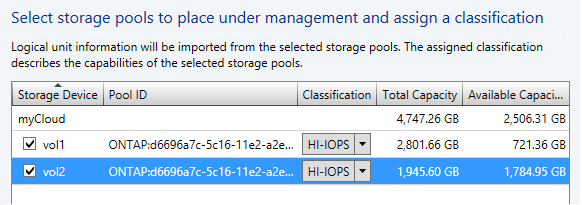
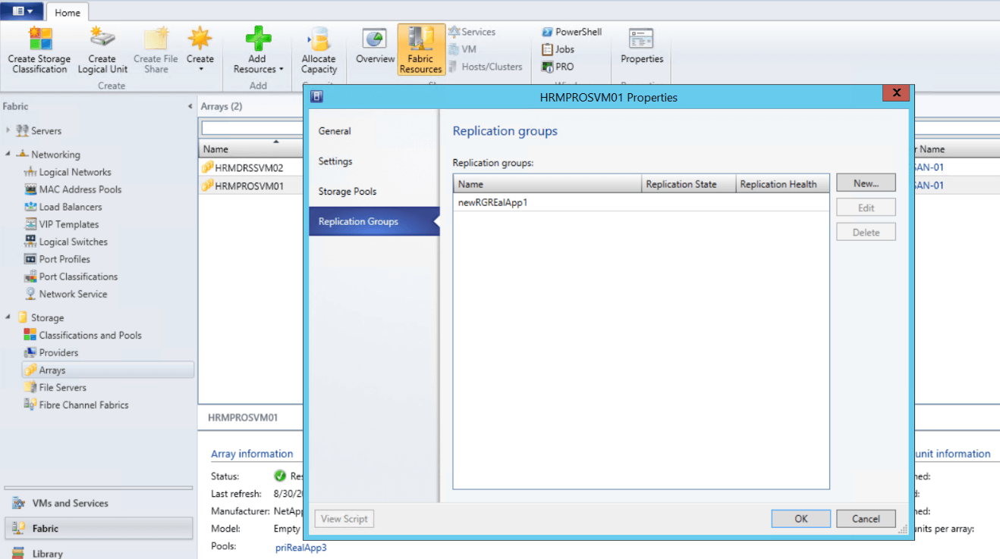
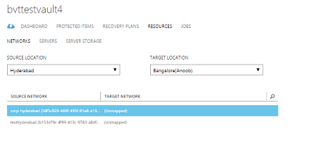
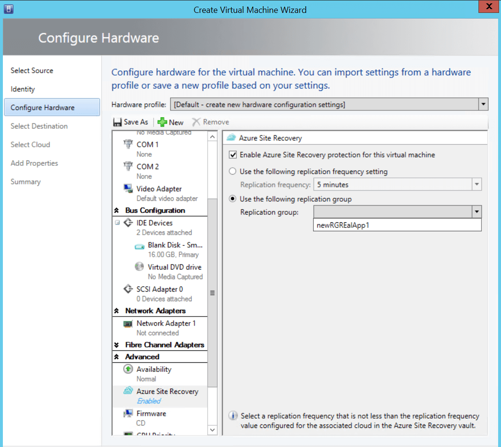
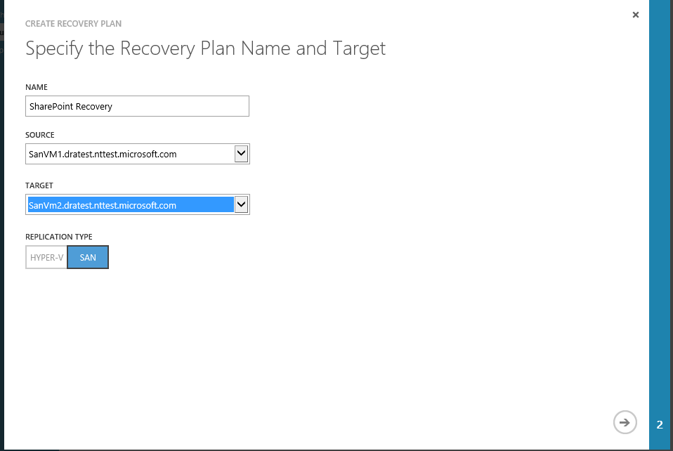
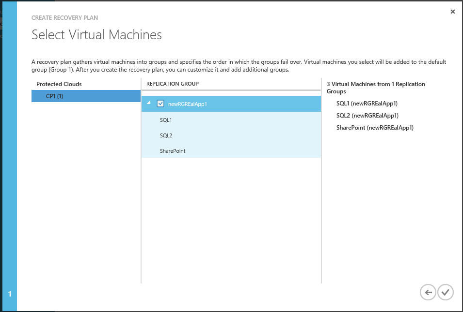

<properties linkid="configure-hyper-v-recovery-vault" urlDisplayName="configure-Azure-Site-Recovery" pageTitle="Azure Site Recovery 入门：使用 SAN 提供本地到本地 VMM 站点的保护" metaKeywords="Azure Site Recovery, VMM, clouds, disaster recovery, SAN" description="Azure Site Recovery coordinates the replication, failover and recovery of Hyper-V virtual machines between on-premises sites using SAN replication." metaCanonical="" umbracoNaviHide="0" disqusComments="1" title="Getting Started with Azure Site Recovery: On-Premises to On-Premises VMM Site Protection with SAN replication" editor="jimbe" manager="cfreeman" authors="raynew" />

# Azure Site Recovery 入门：使用 SAN 复制提供本地到本地 VMM 站点的保护

 

Azure Site Recovery 可在许多部署方案中协调虚拟机的复制、故障转移和恢复，为业务和工作负载连续性策略发挥作用。

部署 Azure Site Recovery 可以保护虚拟机，并通过复制、故障转移和恢复来确保业务连续性。本指南介绍如何部署 Azure Site Recovery，以使用基于存储阵列 (SAN) 的复制在两个本地 VMM 站点之间提供保护。在此方案中：

	

本教程介绍如何部署 Azure Site Recovery，以使用 SAN 复制在两个本地 VMM 站点之间协调保护。在此方案中：
 

<ul>
	<li>利用现有的 SAN 基础结构来保护 Hyper-V 群集中部署的任务关键型应用程序。</li>
	<li>SAN 复制支持来宾群集，并确保根据存储阵列功能，通过同步和异步复制在不同的应用程序层之间提供复制一致性。</li>
	<li>可以在 VMM 和 Azure Site Recovery 保管库中配置并启用复制。你可以发现和分类 VMM 中的 SAN 存储，设置 LUN，以及向 Hyper-V 群集分配存储。Azure Site Recovery 会自动完成复制并协调故障转移。 </li>
	</ul>

本教程尽可能使用最快的部署路径和默认设置。

<UL>
<LI>如需详细了解完整部署，请阅读<a href="http://msdn.microsoft.com/zh-cn/library/azure/dn469074.aspx">规划</a>和<a href="http://msdn.microsoft.com/zh-cn/library/azure/dn872852.aspx">Deployment</a>指南。</LI>
<LI>若要了解其他 Azure Site Recovery 部署方案，请参阅 <a href="/zh-cn/documentation/articles/hyper-v-recovery-manager-overview/">Azure Site Recovery 概述</a>。</LI>
<LI>在使用本教程过程中如果遇到问题，请查阅 wiki 文章 <a href="http://go.microsoft.com/fwlink/?LinkId=389879">Azure Site Recovery：常见错误情况和解决方法</a>，或者在 <a href="https://social.msdn.microsoft.com/Forums/azure/zh-CN/home?forum=windowsazurezhchs">Azure 恢复服务论坛</a>上发布你的问题。</LI>
</UL>

<h2>先决条件</h2> 

 

开始使用本教程之前，请确保做好了一切准备工作。

<UL>
<LI><b>Azure 帐户</b> - 你需要一个 Azure 帐户。如果没有帐户，请参阅 <a href="http://www.windowsazure.cn/pricing/1rmb-trial/">Azure 免费试用版</a>。可在 <a href="http://www.windowsazure.cn/pricing/details/site-recovery/">Azure Site Recovery Manager 定价详细信息</a>中获取订阅定价信息。</LI>
<LI>如果想要了解在执行 Azure Site Recovery 操作期间系统会收集、处理或传输哪些信息，请阅读 MSDN 上的<a href="http://msdn.microsoft.com/zh-cn/library/azure/dn337349.aspx">隐私要求</a>。</LI>
<LI><b>VMM 服务器</b> - 需要在每个本地站点中准备一台 VMM 服务器，该服务器部署为独立的物理或虚拟服务器，或部署为虚拟群集，在装有 <a href="http://support.microsoft.com/kb/3011473">VMM 更新汇总 5.0 预览版</a>的 System Center 2012 R2 上运行。</LI>
<LI>需要在主站点和辅助站点上部署一个 Hyper-V 主机群集，该群集至少需要运行装有最新更新的 Windows Server 2012。</LI>
<LI><b>VMM 云</b> - 要保护的主 VMM 服务器上和辅助 VMM 服务器上都至少有一个云。要保护的主云必须包含以下各项：<UL>
	<LI>一个或多个 VMM 主机组</LI>
	<LI>每个主机组中有一个或多个 Hyper-V 群集。</LI>
	<li>一个或多个位于云中源 Hyper-V 服务器上的虚拟机。</li>
		</UL>若要了解有关设置 VMM 云的详细信息，请参阅规划指南中的<a href="http://msdn.microsoft.com/zh-cn/library/azure/dn469075.aspx">规划 VMM 基础结构</a>。</LI>
<LI>借助 SAN 复制，你可以使用 iSCSI 或光纤通道存储或使用共享虚拟硬盘 (vhdx) 复制来宾群集虚拟机。SAN 先决条件如下所述：</LI>
	<UL>
	<LI>需要设置两个 SAN 阵列，一个主站点中，一个辅助站点中。</LI>
	<LI>应该在阵列之间设置网络基础结构。应该配置对等互连和复制。应该根据存储阵列要求设置复制许可证。</LI>
	<LI>应该在 Hyper-V 主机服务器与存储阵列之间设置网络，使主机能够使用 ISCSI 或光纤通道与存储 LUN 通信。</LI>
	<LI>在<a href="http://go.microsoft.com/fwlink/?LinkId=518669">使用 VMM 和 SAN 部署 Azure Site Recovery - 支持的存储阵列</a>中查看支持的存储阵列中的列表。</LI>
	<LI>应安装 EMC 和 NetApp 提供的 SMI-S 提供程序，并且 SAN 阵列应由提供程序管理。根据提供程序的文档设置提供程序。</LI>
	<LI>确保阵列的 SMI-S 提供程序在 VMM 服务器可以使用 IP 地址或 FQDN 通过网络访问的服务器上。</LI>
	<LI>每个 SAN 阵列应有一个或多个可在此部署中使用的存储池。</LI>
	<LI>主站点上的 VMM 服务器需要管理主阵列，辅助 VMM 服务器将管理辅助阵列。</LI>
	</UL>
<LI>你可以选择配置网络映射，以确保在故障转移后以最佳方式将副本虚拟机放置在 Hyper-V 主机服务器上，并确保它们连接到适当的网络。启用网络映射后，位于主位置的虚拟机将连接到网络，其位于目标位置的副本将连接到其映射网络。如果未配置网络映射，虚拟机在故障转移后将不会连接到 VM 网络。若要在 Azure Site Recovery 中配置网络映射，请检查是否满足以下条件：</LI>
	<UL>
	<LI>已在 VMM 中设置 VM 网络。有关详细信息，请阅读<a href="http://technet.microsoft.com/zh-cn/library/jj721575.aspx">在 VMM 中配置 VM 网络和网关</a>。
	<LI>已将源 VMM 服务器上的虚拟机连接到 VM 网络。源 VM 网络应已链接到与云关联的逻辑网络。</LI>
	</UL>
</UL>

<h2>教程步骤</h2> 

在确认符合先决条件后，执行以下操作：
<OL>
<LI><a href="#VMM">步骤 1：准备 VMM 基础结构</a></LI>
	<ul>
	<li>集成并分类 VMM 中的 SAN 存储</li>
	<li>设置逻辑单元 (LUN) 和存储池，并将存储分配给 Hyper-V 群集。</li>
	<li>为应该一起复制的 LUN 创建复制组。</li>
	</ul>
<LI><a href="#vault">步骤 2：创建保管库</a> - 创建 Azure Site Recovery 保管库。</LI>
<LI><a href="#download">步骤 3：在 VMM 服务器上安装提供程序</a> - 在保管库中生成注册密钥，并下载提供程序安装程序文件。在 VMM 服务器上运行安装程序，以安装该提供程序并在保管库中注册服务器。</LI>

<LI><a href="#storage">步骤 4：映射存储阵列和池</a> - 映射阵列，以指定哪个辅助存储池要从主池接收复制数据。之所以要在配置云保护之前映射存储，是因为当你为复制组启用保护时要使用映射信息。</LI>
<LI><a href="#clouds">步骤 5：配置云保护</a> - 为 VMM 云配置保护设置。</LI>
<LI><a href="#networkmapping">步骤 6：配置网络映射<a> - 你可以选择映射源和目标 VM 网络，以便在故障转移后将虚拟机连接到网络。</LI>
<LI><a href="#replication">步骤 7：启用复制组</a> - 在为虚拟机启用保护之前，需要为存储复制组启用复制。</LI
<LI><a href="#enablevirtual">步骤 8：为虚拟机启用保护</a> - 复制组开始复制后，为虚拟机启用保护。</LI>
<LI><a href="#recovery plans">步骤 9：创建恢复计划并测试部署</a> - 为虚拟机启用保护后，可以配置恢复计划。恢复计划会将选定复制组中的虚拟机组合在一起以进行故障转移和恢复，并指定故障转移的顺序。</LI>

</OL>

 <h2>步骤 1：准备 VMM 基础结构</h2>

 <h3>集成并分类 VMM 中的 SAN 存储</h3>

1. 在**"结构"**工作区中，单击**"存储"**。单击**"主页"**>**"添加资源"**>**"存储设备"**以启动"添加存储设备向导"。
2. 在**"选择存储提供程序类型"**页上，选择**"SMI-S 提供程序发现和管理的 SAN 与 NAS 设备"**。

	

3. 在**"指定存储 SMI-S 提供程序的协议和地址"**页上，选择**"SMI-S CIMXML"**并指定用于连接提供程序的设置。
4. 在**"提供程序 IP 地址或 FQDN"**和**"TCP/IP 端口"**中，指定用于连接提供程序的设置。对于 SMI-S CIMXML，只能使用 SSL 连接。

	

5. 在**"运行方式帐户"**中，指定可以访问该提供程序的 VMM 运行方式帐户，或创建新的帐户。
6. 在**"收集信息"**页上，VMM 会自动尝试发现并导入存储设备信息。若要重试发现，请单击**"扫描提供程序"**。如果发现过程成功，发现的存储阵列、存储池、制造商、型号和容量将列在页中。

	

7. 在**"选择要接受管理的存储池并分配分类"**中，选择 VMM 将要管理的存储池，并为其分配一个分类。将从存储池导入 LUN 信息。根据需要保护的应用程序、其容量要求以及你对需要同时复制的内容提出的要求创建 LUN。

	

 <h3>创建 LUN 并分配存储</h3>

1. 将 SAN 存储集成到 VMM 后，需要创建（设置）LUN。有关详细信息，请参阅：
	
	- <a href="http://technet.microsoft.com/zh-cn/library/gg610624.aspx">如何选择在 VMM 中创建逻辑单元的方法</a>
	- <a href="http://technet.microsoft.com/zh-cn/library/gg696973.aspx">如何在 VMM 中设置存储逻辑单元</a>	
2. 然后，向 Hyper-V 主机分配存储容量，使 VMM 能够将虚拟机数据部署到设置的存储中： 
	- 在向群集分配存储之前，需要向群集所在的 VMM 主机组分配存储。请参阅<a href="http://technet.microsoft.com/zh-cn/library/gg610686.aspx">如何向主机组分配存储逻辑单元</a>和<a href="http://technet.microsoft.com/zh-cn/library/gg610635.aspx">如何向主机组分配存储池</a>。
	- 然后，根据<a href="http://technet.microsoft.com/zh-cn/library/gg610692.aspx">如何在 VMM 中的 Hyper-V 主机群集上配置存储</a>中所述，向群集分配存储容量。
	

 <h3>创建复制组</h3>

1. 创建一个复制组，其中包含需要一起复制的所有 LUN。
2. 在 VMM 控制台中，打开存储阵列属性的**"复制组"**选项卡，然后单击**"新建"**。
	

 <h2>步骤 2：创建保管库</h2>
验证部署先决条件之后，创建 Azure Site Recovery 保管库。或者，可以使用现有存储库并配置 SAN 复制。

1. 登录到[管理门户](https://manage.windowsazure.com)。

2. 依次展开<b>"数据服务"</b>、<b>"恢复服务"</b>，然后单击<b>"Site Recovery 保管库"</b>。

3. 依次单击<b>"新建"</b>、<b>"快速创建"</b>。
	
4. 在<b>"名称"</b>中，输入一个友好名称以标识此保管库。

5. 在<b>"区域"</b>中，为保管库选择地理区域。若要查看支持的区域，请参阅 <a href="http://www.windowsazure.cn/pricing/details/site-recovery/">Azure Site Recovery 定价详细信息</a>中的"上市地区"

6. 单击<b>"创建保管库"</b>。 

	

查看状态栏以确认是否已成功创建保管库。该保管库将在主"恢复服务"页上列为<b>"活动"</b>。

 <h2>步骤 2：配置保管库</h2>

1. 在<b>"恢复服务"</b>页中，单击该保管库以打开"快速开始"页面。也可随时使用该图标打开"快速开始"。

	

2. 在下拉列表中，选择**"使用阵列复制在 Hyper-V 本地站点之间进行"**。

 <h2>步骤 3：安装 Azure Site Recovery 提供程序</h2>
创建保管库后，生成包含注册密钥的注册文件。在安装 Azure Site Recovery 提供程序时，将要选择此文件。 

1. 在<b>"快速启动"</b>页上的**"准备 VMM 服务器"**中，单击**"生成注册密钥文件"**。该密钥生成后，有效期为 5 天。应将该文件下载到 VMM 服务器可以访问的安全位置。例如，下载到某个共享中。安装提供程序时需要选择它。

	

2. 在<b>"快速开始"</b>页上的**"准备 VMM 服务器"**中，单击<b>"下载用于 VMM 服务器安装的 Windows Azure Site Recovery 提供程序"</b>，以获取该提供程序安装文件的最新版本。
3. 在源和目标 VMM 服务器上运行此文件。
4. 在**"先决条件检查"**中，选择停止 VMM 服务以开始安装提供程序。该服务会停止，并将在安装程序完成时自动重新启动。 

	

5. 在**"Microsoft 更新"**中，你可以选择获取更新。启用此设置后，将会根据你的 Microsoft 更新策略安装提供程序更新。

安装提供程序后，继续设置以在保管库中注册服务器。

6. 在"Internet 连接"页面上，指定 VMM 服务器上运行的提供程序连接 Internet 的方式。选择<b>"使用默认系统代理设置"</b>以使用服务器上配置的默认 Internet 连接设置。

	

7. 在**"注册密钥"**中，选择你从 Azure Site Recovery 下载并复制到 VMM 服务器的文件。
8. 在**"服务器名称"**中，指定友好名称以标识保管库中的 VMM 服务器。

	

9. 在**"初始云元数据同&#xFFFD;&#xFFFD;&#xFFFD;"**中，选择是否要为 VMM 服务器上的所有云将元数据与保管库同步。此操作在每个服务器上只需执行一次。如果你不想同步所有云，可不选中此设置，而是在 VMM 控制台的云属性中个别地同步各个云。

10. **"数据加密"**选项不适用于此方案。 

	

11. 单击<b>"注册"</b>以完成此过程。注册后，Azure Site Recovery 将检索 VMM 服务器中的元数据。服务器显示在保管库中**"服务器"**页上的<b>"资源"</b>选项卡中。安装提供程序后，在 VMM 控制台中修改提供程序设置。

 
<h2>步骤 4：映射存储阵列和池</h2>

需要在主站点和辅助站点中的存储阵列和池之间创建映射。

在开始操作之前，请检查云是否已显示在保管库中。若要检测云，你可以在安装提供程序时选择同步所有云，也可以在 VMM 控制台中云属性的**"常规"**选项卡上选择同步特定的云。然后按如下所述映射存储阵列：

1. 单击**"资源"**>**"服务器存储"**>**"映射源和目标阵列"**。
	
2. 选择主站点上的存储阵列，并将其映射到辅助站点上的存储阵列。
3.  映射阵列中的源和目标存储池。为此，请在**"存储池"**中选择要映射的源和目标存储池。

	

<h2>步骤 5：配置云保护设置</h2>

在注册了 VMM 服务器之后，你可以配置云保护设置。你在安装提供程序时启用了**"将云数据与保管库同步"**选项，所以 VMM 服务器上的所有云都将出现在保管库中的<b>"受保护的项"</b>选项卡中。

1. 在"快速启动"页上，单击**"为 VMM 云设置保护"**。
2. 在**"受保护的项"**选项卡上，选择你要配置的云并转至**"配置"**选项卡。注意：
3. 在<b>"目标"</b>中，选择<b>"VMM"</b>。
4. 在<b>"目标位置"</b>中，选择管理要用于恢复的云的现场 VMM 服务器。
5. 在<b>"目标云"</b>中，选择要用于源云中虚拟机故障转移的目标云。注意：
	- 我们建议你选择可满足你要保护的虚拟机的恢复要求的目标云。
	- 云只能属于单个云对 - 要么作为主云，要么作为目标云。
6. Azure Site Recovery 将验证云是否有权访问支持 SAN 复制的存储，并且是否为存储阵列建立了对等互连。将显示参与的阵列对等方。
7. 如果验证成功，请在**"复制类型"**中选择**"SAN"**。

保存设置之后，将会创建一个作业，在<b>"作业"</b>选项卡上可以监控到该作业。可以在<b>"配置"</b>选项卡上修改云设置。要修改目标位置或目标云，必须删除云配置，然后重新配置该云。

<h2>步骤 6：配置网络映射</h2>

配置云保护设置后，可以将源服务器上的 VM 网络映射到目标服务器上的 VM 网络。你可以配置网络映射，以确保在故障转移后以最佳方式将副本虚拟机放置在 Hyper-V 主机服务器上，并确保它们连接到适当的网络。启用网络映射后，位于主位置的虚拟机将连接到网络，其位于目标位置的副本将连接到其映射网络。如果未配置网络映射，虚拟机在故障转移后将不会连接到 VM 网络。

 <h3>准备工作</h3>
 
- 建议你在启用保护之前配置网络映射，以便在放置副本虚拟机的过程中可使用网络映射。如果你之后配置网络映射，则可能需要将一些副本虚拟机迁移到更适合的 Hyper-V 主机上。
- 检查是否已在 VMM 中设置 VM 网络。有关详细信息，请阅读<a href="http://technet.microsoft.com/zh-cn/library/jj721575.aspx">在 VMM 中配置 VM 网络和网关</a>。
- 验证源 VMM 服务器上的虚拟机是否已连接到 VM 网络。此源 VM 网络应已链接到与云关联的逻辑网络。

 <h3>网络映射</h3>

1. 在"快速启动"页上，单击**"映射网络"**。
2. 选择你要在其中映射网络的源 VMM 服务器，然后选择要将网络映射到其中的目标 VMM 服务器。此时将显示源网络及其关联的目标网络的列表。对于当前未映射的网络将显示空值。单击源和目标网络名称旁边的信息图标，以查看每个网络的子网。
3.	在**"源的网络"**中选择一个网络，然后单击**"映射"**。服务将检测目标服务器上的 VM 网络并显示它们。 

	

4.	在显示的对话框中，从目标 VMM 服务器选择其中一个 VM 网络。

	

5.	当你选择目标网络时，将显示使用源网络的受保护的云。此时也会显示与用于保护的云关联的可用目标网络。我们建议你选择可用于进行保护的所有云的目标网络。
6.	单击复选框以完成映射过程。作业开始跟踪映射进度。你可以在"作业"选项卡上查看该作业。

<h2>步骤 7：为复制组启用复制</h2>

在为虚拟机启用保护之前，需要为存储复制组启用复制。 

1. 在 Azure Site Recovery 门户中，在主云的属性页上打开**"虚拟机"**选项卡。单击**"添加复制组"**。
2. 选择与云关联的一个或多个 VMM 复制组，验证源和目标阵列，然后指定复制频率。

完成此操作后，Azure Site Recovery 以及 VMM 和 SMI-S 提供程序将设置目标站点存储 LUN，并启用存储复制。如果复制组已复制，Azure Site Recovery 将重用现有的复制关系并更新 Azure Site Recovery 中的信息。

<h2>步骤 8：启用虚拟机保护</h2>

存储组开始复制后，请在 VMM 控制台中使用以下方法之一为虚拟机启用保护：

- **新的虚拟机** - 在创建新的虚拟机时，可以在 VMM 控制台中启用 Azure Site Recovery 保护，并将虚拟机与复制组相关联。
如果选择此选项，VMM 将使用智能定位以最佳方式将虚拟机存储放置在复制组的 LUN 上。Azure Site Recovery 将协调辅助站点上的阴影虚拟机的创建并分配容量，以便在故障转移后可以启动副本虚拟机。
- **现有虚拟机** - 如果已在 VMM 中部署虚拟机，你可以启用 Azure Site Recovery 保护，并执行到复制组的存储迁移。完成此操作后，VMM 和 Azure Site Recovery 将检测新虚拟机，并开始在 Azure Site Recovery 中对它进行管理，以提供保护。将在辅助站点上创建阴影虚拟机并为其分配容量，以便在故障转移后可以启动副本虚拟机。

	
	

为虚拟机启用保护后，它们将显示在 Azure Site Recovery 控制台中。你可以查看虚拟机属性，跟踪状态，以及故障转移包含多个虚拟机的复制组。请注意，在 SAN 复制中，与复制组关联的所有虚拟机必须一起故障转移。这是因为，故障转移会先在存储层发生。必须正确组合复制组，并只将关联的虚拟机放置在一起。

在**"作业"**选项卡中跟踪"启用保护"操作的进度，包括初始复制。在"完成保护"作业运行之后，虚拟机就可以进行故障转移了。 
	

<h2>步骤 9：测试部署</h2>

在为虚拟机启用保护后，便可以配置恢复计划了。恢复计划会将选定复制组中的虚拟机组合在一起以进行故障转移和恢复。可以将某个复制组中的虚拟机拆分到不同的恢复计划组中。虚拟机将会按照恢复计划组的顺序启动。按如下所述创建并自定义恢复计划：

<OL>
<LI><a href="#createplan">创建恢复计划</a> - 创建一个计划并在其中添加包含虚拟机的复制组。</LI>
<LI><a href="#customplan">自定义恢复计划</a> - 可以通过添加更多复制组、添加自动运行的脚本或添加手动操作来自定义恢复计划</LI>

</OL>

<h3>创建恢复计划</h3>

1. 在**"恢复计划"**选项卡上，单击**"创建恢复计划"**。
2. 指定恢复计划的名称以及源和目标 VMM 服务器。源服务器必须具有启用了故障转移和恢复的虚拟机。选择**"SAN"**，以仅查看为 SAN 复制配置的云。
	
4. 在**"选择虚拟机"**中，将复制组添加到计划。将选择与复制组关联的所有虚拟机，并将其添加到恢复计划。这些虚拟机将添加到恢复计划的默认组（组 1）中。
		
5. 在创建恢复计划后，它将显示在**"恢复计划"**选项卡上的列表中。 

<h3>自定义恢复计划</h3>
在创建恢复计划后，你可以按如下所述进行自定义：
<UL>
<LI>**添加新组** - 你可以向计划中添加其他组。你添加的组将按照添加时的顺序进行命名。例如，在默认组 1 之后添加的第一个其他组为组 2。当恢复计划运行时，虚拟机将按组顺序进行故障转移。最多可以添加七个组。</LI>
<LI>**将虚拟机添加到组** - 只能添加其虚拟机当前不在恢复计划中的复制组。可以将一个复制组添加到多个恢复计划，但此复制组只能在每个计划中出现一次。请注意，你可以将同一复制组中的虚拟机添加到不同的恢复计划组，以控制启动顺序。</LI>
<LI>**将脚本添加到恢复计划** - 你可以选择在恢复计划中添加要在特定组之前或之后运行的脚本。添加脚本时，将为组创建一组新的操作。例如，将使用以下名称创建组 1 的一组预先步骤：组 1:预先步骤。该集中将列出所有预先步骤。使用"上移"和"下移"命令按钮上下移动脚本的位置，并指定它在恢复计划中的哪个点运行。</LI>
<LI>**将手动操作添加到恢复计划** - 可以选择添加在所选组之前或之后运行的手动操作。为该操作指定一个名称和一系列说明。可以指定是应在测试故障转移、计划的故障转移、非计划的故障转移还是这些故障转移的组合中包含此操作。使用"手动操作"命令按钮指定在什么时点运行手动操作。在恢复计划运行时，将会在手动操作应运行的位置停止，并且将显示一个对话框，以供你用来指定手动操作已完成。使用"上移"和"下移"命令按钮上下移动手动操作的位置，并指定它应在恢复计划中的哪个点发生。</LI>
<LI>**删除或移动虚拟机** - 你可以从恢复计划中删除虚拟机，方法是删除整个复制组及其关联的所有虚拟机。</LI>
<LI>**从恢复计划中删除组** - 如果删除了某个组，该组下面的组都会上移。例如，如果你删除组 2，则组 3 将变成组 2。你无法删除默认组 - 组 1。删除组也会删除预自定义操作步骤和后自定义操作步骤（如果有）。</LI>
</UL>
按如下所示自定义计划：

1. 在**"恢复计划"**选项卡上，单击该计划以打开**"自定义"**选项卡。
2. 若要将另一个组添加到该计划，请在**"步骤"**中选择任意项，然后单击**"组"**。
3. 若要将更多的虚拟机添加到恢复计划，请在**"步骤"**列表中，单击要添加到的组的名称，然后单击**"虚拟机"**。
4. 可以将脚本或手动操作添加到计划中的任何步骤之前或之后。单击**"步骤"**列表中的任意项，然后单击**"脚本"**或**"手动操作"**。指定在所选项之前或之后是要运行脚本还是等待手动操作。

若要了解有关准备和运行脚本的详细信息，请参阅<a href="http://msdn.microsoft.com/zh-cn/library/azure/dn337331.aspx">为恢复计划准备脚本</a>。

<h2>运行测试故障转移</h2>

若要测试你的部署，可以针对恢复计划中的复制组运行测试故障转移。测试故障转移在隔离的网络中模拟你的故障转移和恢复机制。 

1. 若要运行测试故障转移，请遵循<a href="http://msdn.microsoft.com/zh-cn/library/dn788912.aspx">测试本地到本地部署</a>中的说明。
2. 如果 DNS IP 地址是从静态池发出的，请在运行测试故障转移后更新该地址。

<h4>更新 IP 地址</h4>
在复制之后，副本虚拟机将具有与主虚拟机的 IP 地址不同的 IP 地址，并且 DNS 根据需要进行更新。这一过程对于 DHCP 发出的地址是自动发生的。对于 DNS，你可以添加两个脚本以更新 IP 地址。第一个示例脚本检索 IP 地址，以便你可以在用于更新 DNS 服务器的第二个脚本中指定它。

<h5>验证 IP 地址</h5>
运行此示例脚本以验证从静态池中分配的 IP 地址。注意，如果 IP 地址是从静态池中分配的，或者对于配置为使用 Windows 网络虚拟化的 VM 网络，可以使用此脚本。

**$vm = Get-SCVirtualMachine -Name <VM_NAME>
$na = $vm[0].VirtualNetworkAdapters
$ip = Get-SCIPAddress -GrantToObjectID $na[0].id
$ip.address**

<h5>更新 DNS</h5>
使用以下示例脚本并指定你通过前一个示例脚本检索的 IP 地址更新 DNS。

**[string]$Zone,
[string]$name,
[string]$IP
)
$Record = Get-DnsServerResourceRecord -ZoneName $zone -Name $name
$newrecord = $record.clone()
$newrecord.RecordData[0].IPv4Address  =  $IP
Set-DnsServerResourceRecord -zonename com -OldInputObject $record -NewInputObject $Newrecord**

<h3>监视活动</h3>

你可以使用<b>"作业"</b>选项卡和<b>"仪表板"</b>来查看和监视由 Azure Site Recovery 保管库执行的主作业，包括为云配置保护、为虚拟机启用和禁用保护、运行故障转移（有计划的、非计划的或测试），以及提交非计划故障转移。

从<b>"作业"</b>选项卡中，你可以查看作业，深入了解作业详细信息和错误，运行作业查询以检索符合特定条件的作业，将作业导出到 Excel，以及重新启动失败的作业。

从<b>"仪表板"</b>中，你可以下载提供程序和代理安装文件的最新版本，获取保管库的配置信息，查看其保护是由保管库管理的虚拟机的数量，查看最近的作业，管理保管库证书，以及重新同步虚拟机。

有关与作业和仪表板交互的详细信息，请参阅<a href="http://msdn.microsoft.com/zh-cn/library/dn788906.aspx">操作和监视指南</a>。

	
<h2>后续步骤</h2>
<UL>
<LI>若要在完全的生产环境中规划和部署 Azure Site Recovery，请参阅 <a href="http://go.microsoft.com/fwlink/?LinkId=321294">Azure Site Recovery 规划指南</a>和 <a href="http://go.microsoft.com/fwlink/?LinkId=321295">Azure Site Recovery 部署指南</a>。</LI>
<LI style="display:none">如有问题，请访问 <a href="http://go.microsoft.com/fwlink/?LinkId=313628">Azure 恢复服务论坛</a>。</LI> 
</UL>
