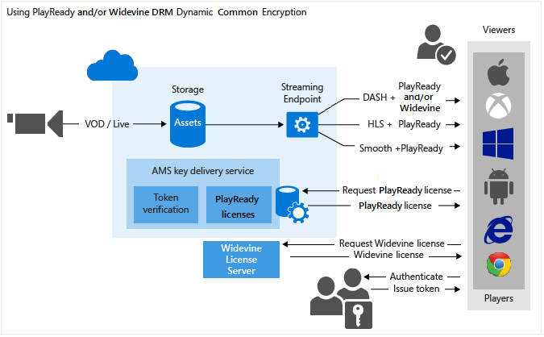
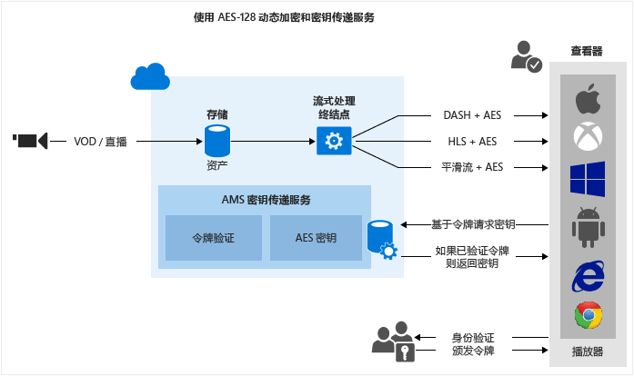

<properties 
	pageTitle="保护内容概述" 
	description="本文概述了如何使用媒体服务来保护内容。" 
	services="media-services" 
	documentationCenter="" 
	authors="Juliako" 
	manager="dwrede" 
	editor=""/>

<tags
	ms.service="media-services"
	ms.date="12/05/2015"
	wacn.date="01/14/2016"/>

#保护内容概述

使用 Windows Azure 媒体服务，可以在媒体从离开计算机到存储、处理和传送的整个过程中确保其安全。借助媒体服务，你可以传送使用高级加密标准（AES，使用 128 位加密密钥）和通用加密（CENC，使用 PlayReady 和/或 Widevine DRM）进行动态加密的内容。媒体服务还提供了用于向已授权客户端传送密钥和 PlayReady 许可证的服务。目前，媒体服务不提供 Widevine 许可证服务器。你可以通过以下 AMS 合作伙伴来交付 Widevine 许可证：[EZDRM](http://ezdrm.com/)、[castLabs](http://castlabs.com/company/partners/azure/)。

- 下图演示了“PlayReady 和/或 Widevine DRM 动态通用加密”工作流。有关详细信息，请参阅[使用 PlayReady 和/或 Widevine DRM 动态通用加密](/documentation/articles/media-services-protect-with-drm)。

	

- 下图演示了“AES-128 动态加密”工作流。有关详细信息，请参阅[使用 AES-128 动态加密和密钥传送服务](/documentation/articles/media-services-protect-with-aes128)。

	

>[AZURE.NOTE]若要使用动态加密，首先必须获取你想要从中流式传输加密内容的流式处理终结点的至少一个流式处理保留单元。

##概念

###资产加密选项

根据你要上载、存储和传递的内容的不同类型，媒体服务提供了多个加密选项供你选择。

**无** - 不使用加密。这是默认值。请注意，使用此选项时，你的内容在传送过程中或静态存储过程中都不会受到保护。

如果计划使用渐进式下载交付 MP4，则使用此选项上载内容。

**StorageEncrypted** - 使用此选项可以通过 AES 256 位加密在本地加密明文内容，然后将其上载到 Azure 存储空间中以加密形式静态存储相关内容。受存储加密保护的资产将在编码前自动解密并放入经过加密的文件系统中，并可选择在重新上载为新的输出资产前重新加密。存储加密的主要用例是在磁盘上通过静态增强加密来保护高品质的输入媒体文件。

若要传送存储加密资产，必须配置资产的传送策略，以使媒体服务了解要如何传送你的内容。在流式传输资产之前，流式处理服务器会删除存储加密，然后再使用指定的传传送策略（例如 AES、通用加密或无加密）流式传输你的内容。

**CommonEncryptionProtected** - 如果要采用“通用加密”加密内容（或上载已加密的内容），请使用此选项。PlayReady 和 Widewine 都是按通用加密 (CENC) 规范加密的，且都受 AMS 支持。

**EnvelopeEncryptionProtected** - 如果要保护（或上载已加密的）采用高级加密标准 (AES) 加密的 HTTP 实时流 (HLS)，请使用此选项。请注意，如果上载已采用 AES 加密的 HLS，则该 HLS 必须已经由 Transform Manager 加密。

###动态加密

借助 Windows Azure 媒体服务，你可以传送使用高级加密标准（AES，使用 128 位加密密钥）以及 PlayReady 和/或 Widevine DRM 动态加密的内容。

当前你可以加密以下流格式：HLS、MPEG DASH 和平滑流。无法加密 HDS 流格式或渐进式下载。

如果你需要媒体服务来加密资产，则需要将加密密钥（CommonEncryption 或 EnvelopeEncryption）与资产相关联，并且配置密钥的授权策略。

你还需要配置资产的传送策略。如果你要流式传输存储加密的资产，请确保通过配置资产传送策略来指定该资产的传送方式。

当播放器请求流时，媒体服务将使用指定的密钥通过 AES 或通用加密来动态加密你的内容。为了解密流，播放器将从密钥传送服务请求密钥。为了确定用户是否被授权获取密钥，服务将评估你为密钥指定的授权策略。

>[AZURE.NOTE]若要利用动态加密，首先必须获取你计划从中传送内容的流式处理终结点的至少一个点播流单元。有关详细信息，请参阅[如何缩放媒体服务](/documentation/articles/media-services-manage-origins#scale_streaming_endpoints)。

###PlayReady DRM 许可证和 AES 明文密钥传送服务

媒体服务提供用于向已授权客户端传送 PlayReady 许可证和 AES 明文密钥的服务。你可以使用 Azure 管理门户、REST API 或 Media Services SDK for .NET 来配置许可证和密钥的授权与身份验证策略。

请注意，如果使用门户，则你可以配置一个 AES 策略（将应用到所有 AES 加密内容）和一个 PlayReady 策略（将应用到所有 PlayReady 加密内容）。如果你想要以更大的力度控制配置，请使用 Media Services SDK for .NET。

###PlayReady 许可证模板

媒体服务提供了用于传送 PlayReady 许可证的服务。当最终用户播放器（例如 Silverlight）尝试播放受 PlayReady 保护的内容时，将向许可证交付服务发送请求以获取许可证。如果许可证服务批准了该请求，则会颁发该许可证，该许可证将发送到客户端，并可用于解密和播放指定的内容。

许可证包含在用户尝试播放受保护的内容时要由 PlayReady DRM 运行时强制实施的权限和限制。媒体服务提供了可让你配置 PlayReady 许可证的 API。有关详细信息，请参阅[媒体服务 PlayReady 许可证模板概述](/documentation/articles/media-services-playready-license-template-overview)。

###令牌限制

内容密钥授权策略可能受到一种或多种授权限制：开放或令牌限制。令牌限制策略必须附带由安全令牌服务 (STS) 颁发的令牌。媒体服务支持采用简单 Web 令牌 (SWT) 格式和 JSON Web 令牌 (JWT) 格式的令牌。媒体服务不提供安全令牌服务。你可以创建自定义 STS 或利用 Microsoft Azure ACS 来颁发令牌。必须将 STS 配置为创建令牌，该令牌使用指定密钥以及你在令牌限制配置中指定的颁发声明进行签名。如果令牌有效，而且令牌中的声明与为密钥（或许可证）配置的声明相匹配，则媒体服务密钥传送服务会将请求的密钥（或许可证）返回到客户端。

在配置令牌限制策略时，必须指定主验证密钥、颁发者和受众参数。主验证密钥包含用来为令牌签名的密钥，颁发者是颁发令牌的安全令牌服务。受众（有时称为范围）描述该令牌的意图，或者令牌授权访问的资源。媒体服务密钥交付服务将验证令牌中的这些值是否与模板中的值匹配。

###Widevine

AMS 还允许你传送通过 Widevine DRM 加密的 MPEG DASH。PlayReady 和 Widewine 都是按通用加密 (CENC) 规范加密的。你可以通过 [AMS .NET SDK](https://www.nuget.org/packages/windowsazure.mediaservices/)（从版本 3.5.1 开始）或 REST API 来配置 AssetDeliveryConfiguration 以使用 Widevine。

从媒体服务 .NET SDK 版本 3.5.2 开始，媒体服务允许你配置 Widevine 许可证模板并获取 Widevine 许可证。你还可以通过以下 AMS 合作伙伴来交付 Widevine 许可证：[EZDRM](http://ezdrm.com/)、[castLabs](http://castlabs.com/company/partners/azure/)。

##常见方案

###在存储中保护内容，以动态方式传送加密的流媒体，使用 AMS 密钥/许可证传送服务

1. 将优质夹层文件引入资产。向资产应用存储加密选项。
2. 配置流式处理终结点。
1. 编码为自适应比特率 MP4 集。向输出资产应用存储加密选项。
1. 为播放期间想要动态加密的资产创建加密内容密钥。
2. 配置内容密钥授权策略。
1. 配置资产传送策略（由动态打包和动态加密使用）。
1. 通过创建 OnDemand 定位符来发布资产。
1. 流式传输已发布的内容。

###结合你自己的加密和流式处理服务使用 Media Service 密钥和许可证交付服务

有关详细信息，请参阅[如何将 Azure PlayReady 许可证服务与你自己的加密程序/流式处理服务器集成](http://mingfeiy.com/integrate-azure-playready-license-service-encryptorstreaming-server)。

###与合作伙伴集成

[使用 castLabs 将 DRM 许可证传送到 Azure 媒体服务](/documentation/articles/media-services-castlabs-integration)

[AZURE.INCLUDE [media-services-user-voice-include](../includes/media-services-user-voice-include.md)]

##相关链接

[将 PlayReady 声明为服务并使用 Azure 媒体服务进行 AES 动态加密](http://mingfeiy.com/playready)

[Azure 媒体服务 PlayReady 许可证交付定价详述](http://mingfeiy.com/playready-pricing-explained-in-azure-media-services)

[如何在 Azure 媒体服务中调用 AES 加密流](http://mingfeiy.com/debug-aes-encrypted-stream-azure-media-services)

[JWT 令牌身份验证](http://www.gtrifonov.com/2015/01/03/jwt-token-authentication-in-azure-media-services-and-dynamic-encryption/)

[将基于 Azure 媒体服务 OWIN MVC 的应用与 Azure Active Directory 相集成，并基于 JWT 声明限制内容密钥传送](http://www.gtrifonov.com/2015/01/24/mvc-owin-azure-media-services-ad-integration/)。

[使用 Azure ACS 颁发令牌](http://mingfeiy.com/acs-with-key-services)。

[content-protection]: ./media/media-services-content-protection-overview/media-services-content-protection.png

<!---HONumber=Mooncake_1221_2015-->