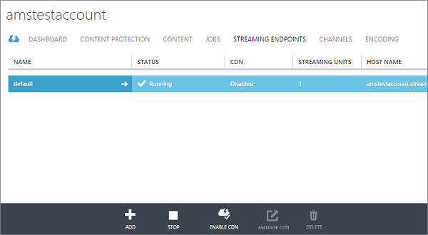

<properties linkid="scripting-center-index" urlDisplayName="index" pageTitle="Scripting Center Index" metaKeywords="" description="" metaCanonical="" services="" documentationCenter="" title="How to Manage Origins in a Media Services Account" authors="juliako" solutions="" manager="" editor="" />
<tags ms.service=""
    ms.date="03/10/2015"
    wacn.date="04/11/2015"
    />

如何在 Media Services 帐户中管理来源
====================================

使用 Media Services，你可以在帐户中添加多个流式来源并配置这些来源。每个 Media Services 帐户至少与一个名为 **default** 的流式来源关联。

添加和删除来源
--------------

1.  在[管理门户](https://manage.windowsazure.cn/)中单击**“Media Services”**。然后，单击媒体服务的名称。
2.  选择“来源”页。
3.  单击页底部的“添加”或“删除”按钮。请注意，不能删除 default 来源。
4.  单击“开播”按钮以开播来源。
5.  如果要配置来源，请单击来源的名称。

    

配置来源
--------

使用“配置”选项卡可以进行以下配置：

1.  设置在 HTTP 响应的缓存控制标头中指定的最长缓存期。此值将不覆盖在 blob 内容上显式设置的最大缓存值。

2.  指定将允许连接到发布的流式处理终结点的 IP 地址。如果未指定 IP 地址，则任何 IP 地址都可以连接。

3.  为来自 Akami 服务器的 G20 身份验证请求指定配置。

    

    此页上的配置仅适用于至少具有一个保留单元的来源。若要保留按需流式处理保留单位，请转到“缩放”选项卡。有关保留单位的详细信息，请参阅[缩放 Media Services](http://go.microsoft.com/fwlink/?LinkID=275847&clcid=0x409/)。

