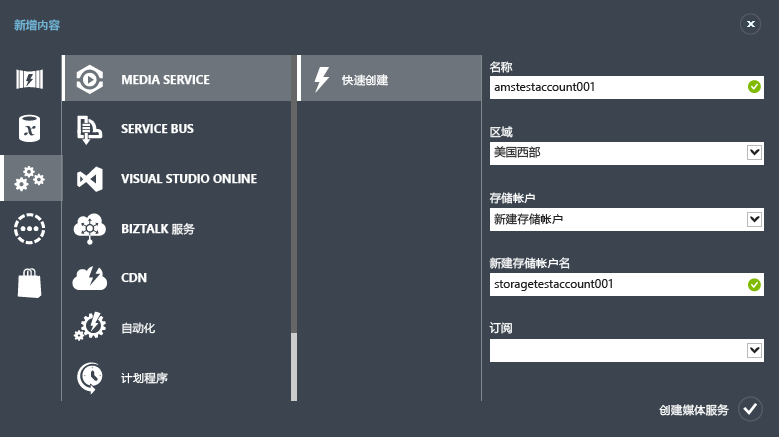
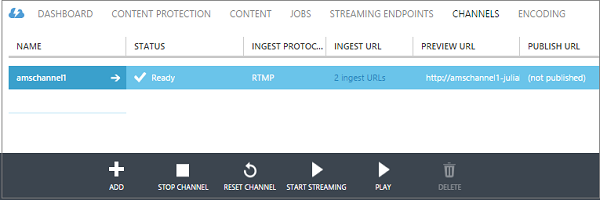
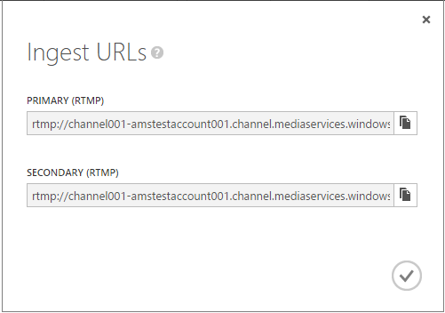
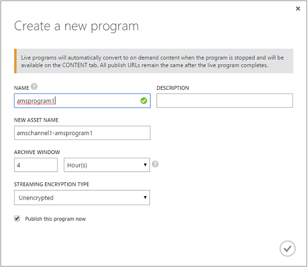

<properties 
	pageTitle="使用管理门户创建从本地编码器接收多比特率实时流的通道 - Azure 教程" 
	description="本教程将指导你完成实施一个基本 Media Services 实时流式处理应用程序的步骤，在该应用程序中，某个通道将从本地实时编码器接收多比特率实时流。" 
	services="media-services" 
	documentationCenter="" 
	authors="Juliako" 
	manager="dwrede" 
	editor=""/>

<tags 
	wacn.date="05/15/2015"
	ms.service="media-services" 
	ms.workload="media" 
	ms.tgt_pltfrm="na" 
	ms.devlang="ne" 
	ms.topic="article" 
	ms.date="04/16/2015" 
	ms.author="juliako"/>

# 使用管理门户创建从本地编码器接收多比特率实时流的通道

[AZURE.INCLUDE [media-services-selector-manage-channels](../includes/media-services-selector-manage-channels.md)]

>[AZURE.NOTE]
若要完成本教程，你需要一个 Azure 帐户。如果你没有帐户，只需花费几分钟就能创建一个试用帐户。 
有关详细信息，请参阅 <a href="/pricing/1rmb-trial/" target="_blank">Azure 试用</a>。
>
你还需要一个网络摄像头和实时编码器。本教程将使用 <a href="http://www.telestream.net/wirecast/overview.htm">Telestream Wirecast</a> 实时编码器。

本教程将指导你完成实施一个基本 Media Services 实时流式处理应用程序的步骤，在该应用程序中，某个通道将从本地实时编码器接收多比特率实时流。 

在 Azure 媒体服务 (AMS) 中，**通道**表示用于处理实时流内容的管道。**节目**用于控制实时流中的片段的发布和存储。通道管理节目。通道和节目的关系非常类似于传统媒体，通道具有恒定的内容流，而节目的范围限定为该通道上的一些定时事件。 

在使用实时流式处理时，参与工作流的组件之一是实时视频编码器，该组件可将相机的信号转换成可发送到实时流式处理服务的流。**通道**可以从输出多比特率 RTMP 或分段 MP4（平滑流）流的本地实时编码器接收实时输入流。你可以使用以下输出平滑流的实时编码器：Elemental、Envivio、Cisco。以下实时编码器可输出 RTMP：Adobe Flash Live、Telestream Wirecast 和 Tricaster 转码器。引入的流将会直接通过**通道**，而不会经过任何进一步的处理。实时编码器也可以引入单比特率流，但由于不处理流，因此客户端应用程序也会接收单比特率流（不建议使用此选项）。发布收到的内容后，可以通过一个或多个**流式处理终结点**将内容流式传输到客户端播放应用程序。可以使用以下自适应流式处理协议播放流：HLS、MPEG DASH、平滑流、HDS。 

**流式处理终结点**表示一个流服务，该服务可以直接将内容传递给客户端播放器应用程序，也可以传递给内容交付网络 (CDN) 以进一步分发。流式传输终结点服务的出站流可以是实时流，也可以是你的媒体服务帐户中的视频点播资产。此外，还可以通过调整流式传输保留单元来控制流式处理终结点服务处理不断增长的带宽需求的能力。你至少应该为生产环境中的应用程序分配一个保留单元。有关详细信息，请参阅[如何缩放 Media Services](/documentation/articles/media-services-manage-origins#scale_streaming_endpoints)。

有关使用通道和相关组件的详细概述，请参阅[使用从本地编码器接收多比特率实时流的通道](/documentation/articles/media-services-channels-overview)。   

在本教程中，将使用 Azure 管理门户完成以下任务： 

1.  创建 Media Services 帐户
2.  配置流式处理终结点
3.  创建通道
1.  配置实时编码器，并将实时流引入通道（此步骤将使用 Wirecast）
1.  创建节目（和资产）
1.  发布资产并获取流 URL  
1.  播放内容 
2.  清理

## 创建 Media Services 帐户

1. 在[管理门户](https://manage.windowsazure.cn/)中，依次单击"新建"、"Media Services"和"快速创建"。
   
	

2. 在"名称"中，输入新帐户的名称。Media Services 帐户名称由小写字母或数字构成（不含空格），长度为 3 - 24 个字符。 

3. 在"区域"中，选择将用于存储 Media Services 帐户的元数据记录的地理区域。下拉列表中仅显示可用的 Media Services 区域。 

4. 在"存储帐户"中，选择一个存储帐户以便为 Media Services 帐户中的媒体内容提供 Blob 存储。你可以选择位于 Media Services 帐户所在的地理区域内的现有存储帐户，也可以创建一个新的存储帐户。将在同一区域内创建一个新的存储帐户。 

5. 如果你创建了一个新的存储帐户，请在"新建存储帐户名称"中输入该存储帐户的名称。适用于存储帐户名的规则对 Media Services 帐户同样适用。

6. 单击窗体底部的"快速创建"。

	可以在窗口底部的消息区域中监视过程的状态。

	成功创建帐户后，状态将更改为"活动"。 
	
	在页面底部，将出现"管理密钥"按钮。当你单击此按钮时，将会显示一个对话框，其中包含 Media Services 帐户名以及主要密钥和辅助密钥。你必须要有帐户名和主要密钥信息，才能以编程方式访问 Media Services 帐户。 

	
	

	当你双击帐户名称时，默认情况下将显示"快速启动"页。可从此页执行某些管理任务，而这些管理任务也可从该门户的其他页执行。例如，你可以从此页上载视频文件，也可以从"内容"页执行此操作。

	 
## 使用门户配置流式处理终结点

使用 Azure Media Services 时最常见的方案之一是将自适应比特率流传送至你的客户端。通过自适应比特率流，客户端可以在视频显示时，根据当前网络带宽、CPU 利用率和其他因素，切换至较高或较低的比特率流。Media Services 支持下列自适应比特率流技术：HTTP 实时流 (HLS)、平滑流、MPEG DASH 和 HDS（仅适用于 Adobe PrimeTime/Access 许可证持有人）。 

使用实时流时，本地实时编码器（在本例中为 Wirecast）会将多比特率实时流引入你的通道。当用户请求流时，Media Services 会使用动态打包将源流重新打包成自适应比特率流（HLS、DASH 或平滑流）。 

若要利用动态打包，你需要获取计划从中传送内容的**流式处理终结点**的至少一个流式处理单元。

若要更改流式处理保留单元数，请执行以下操作：

1. 在[管理门户](https://manage.windowsazure.cn/)中单击"Media Services"。然后，单击 Media Services 的名称。

2. 选择"流式处理终结点"页。然后，单击要修改的流式处理终结点。

3. 若要指定流式处理单位数，请选择"缩放"选项卡并移动"保留容量"滑块。

4. 按"保存"按钮保存更改。

	分配所有新的单元大约需要 20 分钟才能完成。 

	 
	>[AZURE.NOTE] 当前，将流式处理单位的任何正值设置回"无"可将流式处理功能禁用最多 1 小时。
	>
	> 为 24 小时期间指定的最大单位数将用于计算成本。有关定价详细信息，请参阅 [Media Services 定价详细信息](/home/features/media-services/#price)。

## 创建通道

在 Azure 管理门户中选择"通道"页。然后单击"新建"。

在"创建新的实时通道"对话框中输入通道的名称，然后指定引入协议。Wirecast 将输出 RTMP，因此我们将保留此协议。

按"确定"。   

 

几分钟后，将会创建并启动通道。

## 获取引入 URL

创建通道后，你可以获得要提供给实时编码器的引入 URL。编码器将使用这些 URL 来输入实时流。

有关引入 URL 的详细信息，请参阅[使用本地编码器向通道发送多比特率实时流](/documentation/articles/media-services-channels-overview)。   

## 配置实时编码器并引入实时流 

>[AZURE.NOTE]此步骤需要上一步中提到的通道引入 URL。

>[AZURE.NOTE]如果出于任何原因停止了编码器，然后需要重新启动它，你应该先重置通道，方法是在 Azure 管理门户中单击"重置"命令。

## 创建和管理节目

### 概述

频道与节目相关联，使用节目，你可以控制实时流中的段的发布和存储。通道管理节目。频道和节目的关系非常类似于传统媒体，频道具有恒定的内容流，而节目的范围限定为该频道上的一些定时事件。

你可以通过设置 **ArchiveWindowLength** 属性，指定你希望保留多少小时的节目录制内容。此值的设置范围是最短 5 分钟，最长 25 小时。存储时间窗口长度还决定了客户端能够从当前实时位置按时间向后搜索的最长时间。超出指定时间长度后，节目也能够运行，但落在时间窗口长度后面的内容将全部被丢弃。此属性的这个值还决定了客户端清单能够增加多长时间。

每个节目都与某个资产关联。若要发布节目，必须为关联的资产创建按需定位符。创建此定位符后，你可以生成提供给客户端的流 URL。

一个通道最多支持三个并发运行的节目，因此你可以为同一传入流创建多个存档。这样，你便可以根据需要发布和存档事件的不同部分。例如，你的业务要求是存档 6 小时的节目，但只广播过去 10 分钟的内容。为了实现此目的，你需要创建两个同时运行的节目。一个节目设置为存档 6 小时的事件但不发布该节目。另一个节目设置为存档 10 分钟的事件，并且要发布该节目。

不应当将现有节目重用于新事件。而是应当为每个事件创建并启动一个新节目，如"对实时流式传输应用程序进行编程"部分中所述。

在准备好开始流式传输和存档时，启动节目。在要停止对事件进行流式传输和存档时，停止节目。 

若要删除存档的内容，请停止并删除节目，然后删除关联的资产。如果资产被某个节目使用，则无法将其删除，必须先删除该节目。 

即使你停止并删除了节目，只要你没有删除资产，用户也将能够按需将你的已存档内容作为视频进行流式传输。

如果希望保留已存档的内容但不希望其可供流式传输，请删除流式传输定位符。

### 创建/启动/停止节目

将流传输到通道后，你可以通过创建资产、节目和流定位符来启动流式传输事件。这将会存档流，并使观看者可通过流式处理终结点使用该流。 

可通过两种方式启动该事件： 

1. 在"通道"页上，按"添加"以添加新节目。

	指定：节目名称、资产名称、存档时段和加密选项。
	
	
	
	如果保留选中"立即发布此节目"，将会创建节目的发布 URL。
	
	在准备好流式传输节目时，可以按"启动"。

	启动节目后，你可以按"播放"开始播放内容。

	

2. 或者，可以使用快捷方式以及在"通道"页上按"开始流式传输"按钮。这将会创建资产、节目和流定位符。

	节目命名为 DefaultProgram，存档时段设置为 1 小时。

	你可以从"通道"页播放发布的节目。 

	

如果你在"通道"页上单击"停止流式传输"，将会停止并删除默认节目。资产仍在那里，并且你可以从"内容"页发布或取消发布它。

如果你切换到"内容"页，你将看到为节目创建的资产。

## 播放内容

若要为用户提供一个可用来流式传输内容的 URL，你首先需要通过创建定位符（当你使用门户发布资产时，系统已经为你创建了定位符）来"发布"资产（如上一部分中所述）。定位符提供对资产中所含文件的访问权限。 

根据你要用来播放内容的流式处理协议，你可能需要修改从通道\节目的"发布 URL"链接获取的 URL。

动态打包负责将实时流打包成指定的协议。 

默认情况下，流 URL 采用以下格式，你可以用它来播放平滑流资产：

	{streaming endpoint name-media services account name}.streaming.mediaservices.chinacloudapi.cn/{locator ID}/{filename}.ism/Manifest

若要生成 HLS 流 URL，请将 (format=m3u8-aapl) 附加到 URL。

	{streaming endpoint name-media services account name}.streaming.mediaservices.chinacloudapi.cn/{locator ID}/{filename}.ism/Manifest(format=m3u8-aapl)

若要生成 MPEG DASH 流 URL，请将 (format=mpd-time-csf) 附加到 URL。

	{streaming endpoint name-media services account name}.streaming.mediaservices.chinacloudapi.cn/{locator ID}/{filename}.ism/Manifest(format=mpd-time-csf)

有关传送内容的详细信息，请参阅[传送内容](/documentation/articles/media-services-deliver-content-overview)。

你可以使用 [AMS 播放器](http://amsplayer.azurewebsites.net/azuremediaplayer.html)播放平滑流，或使用 iOS 和 Android 设备播放 HLS 版本 3。

## 清理

如果你已完成流式处理事件，并想要清理先前设置的资源，请遵循以下过程。

- 停止从编码器推送流。
- 停止通道。停止通道后，将不会产生任何费用。当你需要重新启动它时，它将采用相同的引入 URL，因此你无需重新配置编码器。
- 除非你想要继续以点播流形式提供实时事件的存档，否则你可以停止流式处理终结点。如果通道处于停止状态，将不会产生任何费用。

## 后续步骤

了解有关生成实时流式处理应用程序的详细信息[生成实时流式处理应用程序](/documentation/articles/media-services-live-streaming-workflow)

<!--HONumber=53-->