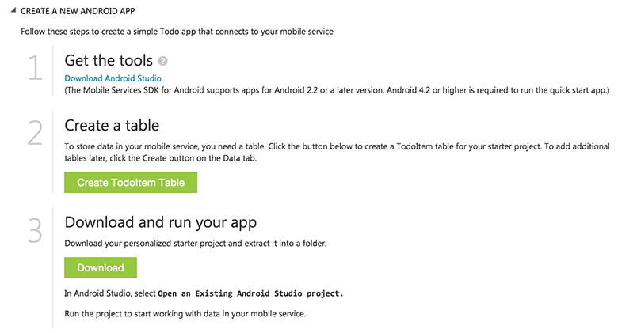

<properties
	pageTitle="适用于 Android 应用的 Azure 移动服务入门（JavaScript 后端）"
	description="遵照本教程开始使用 Azure 移动服务进行 Android 开发（JavaScript 后端）。"
	services="mobile-services"
	documentationCenter="android"
	authors="RickSaling"
	manager="dwrede"
	editor=""/>

<tags 
	ms.service="mobile-services" 
	ms.date="10/08/2015"
	wacn.date="11/27/2015"/>

# 移动服务入门

[AZURE.INCLUDE [mobile-services-selector-get-started](../includes/mobile-services-selector-get-started.md)]

&nbsp;

[AZURE.INCLUDE [mobile-services-hero-slug](../includes/mobile-services-hero-slug.md)]

本教程说明如何使用 Azure 移动服务向 Android 应用程序添加基于云的后端服务。在本教程中，你将要创建一个新的移动服务，以及一个在新移动服务中存储应用程序数据的简单**待办事项列表**应用程序。

以下是完成的应用程序的屏幕快照：
	

## 先决条件

完成本教程需要你安装 [Android 开发人员工具](https://developer.android.com/sdk/index.html)，其中包含 Android Studio 集成开发环境和最新的 Android 平台。需要使用 Android 4.2 或更高版本。

下载的快速入门项目包含适用于 Android 的 Azure 移动服务 SDK。

> [AZURE.IMPORTANT]若要完成本教程，你需要一个 Azure 帐户。如果你没有帐户，可以创建一个试用帐户，只需几分钟即可完成。有关详细信息，请参阅 [Azure 试用](/pricing/1rmb-trial/)。

## 创建新的移动服务

[AZURE.INCLUDE [mobile-services-create-new-service](../includes/mobile-services-create-new-service.md)]

## 创建新的 Android 应用程序

创建移动服务后，你可以在管理门户中遵照一个简易的快速入门项目来创建新应用程序或修改现有应用程序，以连接到你的移动服务。

在本部分中，你将要创建一个连接到移动服务的新的 Android 应用程序。

1.  在管理门户中单击“移动服务”，然后单击你刚刚创建的移动服务。

2. 在快速入门选项卡中，单击“选择平台”下的“Android”，然后展开“创建新的 Android 应用程序”。

   	

   	此时将显示三个简单步骤，描述如何创建与移动服务连接的 Android 应用程序。

  	

3. 在本地计算机或虚拟机上下载并安装 [Android 开发人员工具](https://go.microsoft.com/fwLink/p/?LinkID=280125)（如果尚未这么做）。

4. 单击“创建 TodoItem 表”以创建用于存储应用程序数据的表。

5. 现在，请按“下载”按钮下载你的应用。

## 运行 Android 应用程序

[AZURE.INCLUDE [mobile-services-run-your-app](../includes/mobile-services-android-get-started.md)]

## 后续步骤
完成快速入门后，请了解如何在移动服务中执行其他重要任务：

* [数据处理入门]
 了解有关使用移动服务存储和查询数据的详细信息。

* [身份验证入门]
 了解如何使用标识提供程序对应用程序的用户进行身份验证。

* [推送通知入门 ]
 了解如何向应用程序发送一条很基本的推送通知。

[AZURE.INCLUDE [app-service-disqus-feedback-slug](../includes/app-service-disqus-feedback-slug.md)]

<!-- URLs. -->
[Get started (Eclipse)]: /documentation/articles/mobile-services-android-get-started-ec
[数据处理入门]: /documentation/articles/mobile-services-android-get-started-data
[身份验证入门]: /documentation/articles/mobile-services-android-get-started-users
[推送通知入门 ]: /documentation/articles/mobile-services-javascript-backend-android-get-started-push
[Mobile Services Android SDK]: https://go.microsoft.com/fwLink/p/?LinkID=266533

[Management Portal]: https://manage.windowsazure.cn/

<!---HONumber=82-->