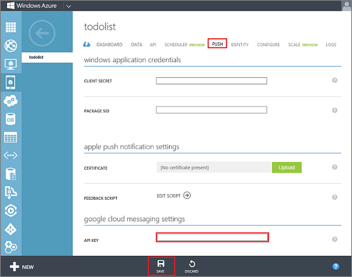

<properties linkid="develop-mobile-tutorials-get-started-with-push-js-vs2013" urlDisplayName="开始使用推送 (JS)" pageTitle="开始使用推送通知 (Android JavaScript) |移动开发人员中心" metaKeywords="" description="了解如何使用 Windows Azure 移动服务向 Android JavaScript 应用程序发送推送通知。" metaCanonical="http://www.windowsazure.cn/zh-cn/documentation/articles/mobile-services-javascript-backend-windows-store-dotnet-get-started-push/" services="" documentationCenter="Mobile" title="Get started with push notifications in Mobile Services" authors="ricksal"  solutions="" writer="ricksal" manager="" editor=""  />
<tags ms.service=""
    ms.date=""
    wacn.date=""
    />

<tags ms.service="mobile-services" ms.workload="mobile" ms.tgt_pltfrm="Mobile-Android" ms.devlang="Java" ms.topic="article" ms.date="10/16/2014" ms.author="ricksal" />

# 向移动服务应用程序添加推送通知

[WACOM.INCLUDE [mobile-services-selector-get-started-push](../includes/mobile-services-selector-get-started-push.md)]

本主题演示如何使用 Azure 移动服务将推送通知发送到使用 Google Cloud Messaging (GCM)的 Android 应用程序。在本教程中，你将要使用 Azure 通知中心为快速入门项目启用推送通知。完成本教程后，每次插入一条记录时，你的移动服务就会发送一条推送通知。

本教程将指导你完成启用推送通知的以下基本步骤：

1. [启用 Google Cloud Messaging](#register)
2. [配置移动服务](#configure)
3. [向应用程序添加推送通知](#add-push)
4. [更新脚本以发送推送通知](#update-scripts)
5. [插入数据以接收通知](#test)

>[AZURE.NOTE] 如果您想要查看已完成的应用程序的源代码，请转到 <a href="https://github.com/RickSaling/mobile-services-samples/tree/futures/GettingStartedWithPush/Android" target="_blank">此处</a>。

##先决条件

[WACOM.INCLUDE [mobile-services-android-prerequisites](../includes/mobile-services-android-prerequisites.md)]

##启用 Google Cloud Messaging

>[WACOM.NOTE]若要完成此过程，你必须拥有一个包含已验证电子邮件地址的 Google 帐户。若要新建一个 Google 帐户，请转至 <a href="http://go.microsoft.com/fwlink/p/?LinkId=268302" target="_blank">accounts.google.com</a>。

[WACOM.INCLUDE [Enable GCM](../includes/mobile-services-enable-Google-cloud-messaging.md)]

接下来，你将使用此 API 密钥值，让移动服务向 GCM 进行身份验证并代表你的应用程序发送推送通知。

##配置移动服务以发送推送请求

1. 登录到 [Azure 管理门户]、单击"移动服务"，然后单击您的应用。

   

2. 单击"推送"选项卡，输入你在执行前一过程时从 GCM 获取的**API 密钥**值，然后单击**保存**。

	>[WACOM.NOTE]完成本教程中使用较旧的移动服务的操作后，您可能会看到**推送**选项卡底部的链接上指出**启用增强推送**。单击此链接升级你的移动服务，以便与通知中心相集成。此更改无法恢复。有关如何在生产移动服务中启用增强的推送通知的详情，请参阅 <a href="http://go.microsoft.com/fwlink/p/?LinkId=391951">本指南</a>。

   

    
<b>重要说明</b>
	
在门户的"推送"选项卡中为增强型推送通知设置 GCM 凭据后，这些凭据将与通知中心共享，以使用你的应用程序配置通知中心。

    

现在，你的移动服务和应用程序都已配置为使用 GCM 和通知中心。

##向应用程序添加推送通知

###验证 Android SDK 版本

[WACOM.INCLUDE [Verify SDK](../includes/mobile-services-verify-android-sdk-version.md)]

下一步就是安装 Google Play Services。Google Cloud Messaging 对开发和测试提出了一些最低的 API 级别要求，清单中的**minSdkVersion**属性必须符合这些要求。 

如果你要对某台较旧的设备进行测试，请查阅[设置 Google Play Services SDK]，以确定此值可设置到的最小值，并相应地进行设置。

###将 Google Play Services 添加到项目

[WACOM.INCLUDE [Add Play Services](../includes/mobile-services-add-Google-play-services.md)]

###添加代码

[WACOM.INCLUDE [mobile-services-android-getting-started-with-push](../includes/mobile-services-android-getting-started-with-push.md)]

##在管理门户中更新已注册的插入脚本

1. 在管理门户中，单击**数据**选项卡，然后单击**TodoItem**表。 

   

2. 在 **todoitem** 中，单击**脚本**选项卡，然后选择**插入**。
   
  	

   将显示当 **TodoItem** 表中发生插入时所调用的函数。

3. 将 insert 函数替换为以下代码，然后单击"保存"：

		function insert(item, user, request) {
		// Define a payload for the Google Cloud Messaging toast notification.
		var payload = {
		    data: {
		        message: item.text 
		    }
		};		
		request.execute({
		    success: function() {
		        // If the insert succeeds, send a notification.
		        push.gcm.send(null, payload, {
		            success: function(pushResponse) {
		                console.log("Sent push:", pushResponse, payload);
		                request.respond();
		                },              
		            error: function (pushResponse) {
		                console.log("Error Sending push:", pushResponse);
		                request.respond(500, { error: pushResponse });
		                }
		            });
		        },
		    error: function(err) {
		        console.log("request.execute error", err)
		        request.respond();
		    }
		  });
		}

   	这将会注册一个新的插入脚本，插入成功后，该脚本将使用[gcm 对象]向所有已注册的设备发送推送通知。 

##在应用程序中测试推送通知

你可以通过以下方式测试应用程序：使用 USB 电缆直接连接 Android 手机，或者在模拟器中使用虚拟设备。

###设置模拟器以进行测试

当你在模拟器中运行此应用程序时，请确保使用支持 Google API 的 Android 虚拟设备 (AVD)。

1. 重新启动 Eclipse，在包资源管理器中，右键单击项目，单击**属性**，单击**Android**，选中**Google API**，然后单击**确定**。

	

  	这样便指定了项目要使用 Google API。

2. 从**窗口**中选择**Android 虚拟设备管理器**，选择你的设备，然后单击**编辑**。

	

3. 在**目标**中选择**Google API**，然后单击"确定"。

   

	这样便指定了 AVD 要使用 Google API。

###运行测试

1. 在 Eclipse 中打开**运行**菜单，然后单击**运行**以启动应用程序。

2. 在应用程序中键入有意义的文本（例如 A new Mobile Services task），然后单击添加**按钮。

  	

3. 从屏幕顶部向下轻扫，打开设备的通知中心以查看通知。

你已成功完成本教程。

## 后续步骤

<!---本教程演示了启用 Android 应用程序以便使用移动服务和通知中心发送推送通知的基础知识。接下来，请考虑完成下一个教程，[向已经过身份验证的用户发送推送通知]，它显示如何使用标记将推送通知从移动服务发送到只有经过身份验证的用户。

+ [向经过身份验证的用户发送推送通知]
	 了解如何使用标记将推送通知从移动服务发送到只有经过身份验证的用户。

+ [将广播通知发送到订阅用户]
	 了解用户如何注册并接收其感兴趣的类别的推送通知。

+ [将基于模板的通知发送到订阅用户]
	 了解如何使用模板通过移动服务发送推送通知，而无需在后端处理特定于平台的负载。
-->

下面的主题介绍了有关移动服务和通知中心的详细信息：

* [数据处理入门]
   了解有关使用移动服务存储和查询数据的详细信息。

* [身份验证入门]
   了解如何通过不同帐户类型（使用移动服务）对应用程序的用户进行身份验证。

* [什么是通知中心？]
   了解有关通知中心跨所有主要的客户端平台向您的应用程序交付通知的详细信息。

* [调试通知中心应用程序](http://go.microsoft.com/fwlink/p/?linkid=386630)
   获取故障排除和调试通知中心解决方案的指南。 

* [如何使用适用于移动服务的 Android 客户端库]
   了解有关如何将移动服务与 Android 一起使用的详细信息。

* [移动服务服务器脚本参考]
   了解有关如何在移动服务中实施业务逻辑的详细信息。

<!-- Anchors. -->
[注册用于推送通知的应用程序并配置移动服务]: #register
[更新生成的推送通知代码]: #update-scripts
[插入数据以接收通知]: #test
[后续步骤]:#next-steps

<!-- Images. -->
[13]: ./media/mobile-services-windows-store-javascript-get-started-push/mobile-quickstart-push1.png
[14]: ./media/mobile-services-windows-store-javascript-get-started-push/mobile-quickstart-push2.png

<!-- URLs. -->
[提交应用程序页]: http://go.microsoft.com/fwlink/p/?LinkID=266582
[我的应用程序]: http://go.microsoft.com/fwlink/p/?LinkId=262039
[Live SDK for Windows]: http://go.microsoft.com/fwlink/p/?LinkId=262253
[移动服务入门]: /zh-cn/documentation/articles/mobile-services-android-get-started/
[数据处理入门]: /zh-cn/documentation/articles/mobile-services-android-get-started-data/
[身份验证入门]: /zh-cn/documentation/articles/mobile-services-android-get-started-users
[推送通知入门]: /zh-cn/documentation/articles/mobile-services-javascript-backend-windows-store-dotnet-get-started-with-push-js
[向应用程序用户推送通知]: /zh-cn/documentation/articles/mobile-services-javascript-backend-windows-store-javascript-get-started-push
[使用脚本为用户授权]: /zh-cn/documentation/articles/mobile-services-windows-store-javascript-authorize-users-in-scripts
[JavaScript 和 HTML]: /zh-cn/documentation/articles/mobile-services-javascript-backend-windows-store-dotnet-get-started-with-push-js
[设置 Google Play Services SDK]: http://go.microsoft.com/fwlink/?LinkId=389801
[Windows Azure 管理门户]: https://manage.windowsazure.cn/
[如何使用适用于移动服务的 Android 客户端库]: /zh-cn/documentation/articles/mobile-services-android-how-to-use-client-library
[gcm 对象]: http://go.microsoft.com/fwlink/p/?LinkId=282645
[移动服务服务器脚本参考]: /zh-cn/documentation/articles/mobile-services-how-to-use-server-scripts/
[通知中心入门]: /zh-cn/documentation/articles/notification-hubs-windows-store-dotnet-get-started

[向订阅者发送通知]: /zh-cn/documentation/articles/notification-hubs-windows-store-dotnet-send-breaking-news/
[向用户发送通知]: /zh-cn/documentation/articles/mobile-services-dotnet-backend-windows-store-dotnet-push-notifications-app-users/
[向用户发送跨平台通知]: /zh-cn/documentation/articles/mobile-services-dotnet-backend-windows-store-dotnet-push-notifications-app-users-xplat-mobile-services/
