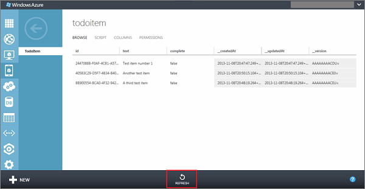

<properties urlDisplayName="Get Started with Data" pageTitle="数据处理入门（Windows 通用） |移动开发人员中心" metaKeywords="" description="了解如何通过移动服务来利用 Android 应用程序中的数据。" metaCanonical="" services="mobile-services" documentationCenter="Mobile" title="Get started with data in Mobile Services" authors="glenga" solutions="" manager="dwrede" editor="" />

<tags 
wacn.date="04/11/2015"
ms.service="mobile-services" ms.workload="mobile" ms.tgt_pltfrm="mobile-windows-store" ms.devlang="dotnet" ms.topic="article" ms.date="09/26/2014" ms.author="glenga" />

# 将移动服务添加到现有应用程序

[WACOM.INCLUDE [mobile-services-selector-get-started-data](../includes/mobile-services-selector-get-started-data.md)]

此主题说明如何通过 Azure 移动服务来利用通用 Windows 应用程序中的数据。通用 Windows 应用程序解决方案包括面向 Windows 应用商店 8.1 和 Windows Phone 应用商店 8.1 应用程序的项目以及常见的共享项目。有关详细信息，请参阅[构建面向 Windows 和 Windows Phone 的通用 Windows 应用程序](http://msdn.microsoft.com/library/windows/apps/xaml/dn609832.aspx)。

在本教程中，你将要下载一个可在内存中存储数据的 Visual Studio 2013 应用程序项目，创建一个新的移动服务，将该移动服务与该应用程序相集成，然后登录到 Azure 管理门户以查看运行该应用程序时对数据所做的更改。

>[AZURE.NOTE]本主题演示如何在 Visual Studio Professional 2013 Update 3 中使用此工具，以便将新的移动服务连接到通用的 Windows 应用程序。可以使用相同的步骤将移动服务连接到 Windows 应用商店或 Windows Phone 应用商店 8.1 应用程序。将移动服务连接到 Windows Phone 8.0 或 Windows Phone Silverlight 8.1 应用程序，请参阅[面向 Windows Phone 的数据处理入门](/zh-cn/documentation/articles/mobile-services-windows-phone-get-started-data)。

> 如果您无法升级到 Visual Studio Professional 2013 Update 3，或者您更喜欢手动将您的移动服务项目添加到 Windows 应用商店应用程序解决方案，请参阅该主题的[此版本](/zh-cn/documentation/articles/mobile-services-windows-store-dotnet-get-started-data)。

本教程将指导您完成以下基本步骤：

1. [下载 Windows 应用商店应用程序项目][获取 Windows 应用商店应用程序] 
2. [从 Visual Studio 创建移动服务]
3. [添加用于存储的数据表]
4. [更新应用程序以使用移动服务]
5. [针对移动服务测试应用程序]
6. [在 Azure 管理门户中查看上载的数据]

若要完成本教程，您需要以下各项：

* 有效的 Azure 帐户。如果没有帐户，则可创建一个免费的试用帐户，只需几分钟即可完成。有关详细信息，请参阅 [Azure 免费试用](/zh-cn/pricing/1rmb-trial/?WT.mc_id=A0E0E5C02&amp;returnurl=http%3A%2F%2Fwww.windowsazure.cn%2Fzh-cn%2Fdocumentation%2Farticles%2Fmobile-services-javascript-backend-windows-universal-dotnet-get-started-data%2F)。
* <a href="https://go.microsoft.com/fwLink/p/?LinkID=257546" target="_blank">Visual Studio Express 2013 for Windows</a> （update 2 或更高版本）。 

##下载 GetStartedWithData 项目

[WACOM.INCLUDE [mobile-services-windows-universal-dotnet-download-project](../includes/mobile-services-windows-universal-dotnet-download-project.md)]
 

##从 Visual Studio 创建新的移动服务

[WACOM.INCLUDE [mobile-services-create-new-service-vs2013](../includes/mobile-services-create-new-service-vs2013.md)]

<ol start="8"><li>
在解决方案资源管理器中，在 GetStartedWithData.Shared 项目文件夹中，打开 App.xaml.cs 代码文件，并注意已添加的新静态字段 <strong>应用程序</strong> Windows 应用商店应用程序的条件编译块中的类与下面的示例相似：
 

		<pre><code>public static Microsoft.WindowsAzure.MobileServices.MobileServiceClient 
		    todolistClient = new Microsoft.WindowsAzure.MobileServices.MobileServiceClient(
		        "https://todolist.azure-mobile.cn/",
		        "XXXXXXXXXXXXXXXXXXXXXXXXXXXXXXXXX");
		</code></pre>

	
此代码通过使用 MobileServiceClient 类的一个实例提供对应用程序中新移动服务的访问权限。 <a href="http://go.microsoft.com/fwlink/p/?LinkId=302030">MobileServiceClient 类</a>。客户端是通过提供新移动服务的 URI 和应用程序密钥来创建的。此静态字段可用于你的应用程序中的所有页面。

</li>
<li>
右键单击 Windows Phone 应用程序项目，单击 <strong>将</strong>，单击 <strong>"连接的服务..."</strong>，选择您刚创建的移动服务，然后单击 <strong>确定</strong>。 

相同的代码将添加到共享的 App.xaml.cs 文件中，但这一次在 Windows Phone 应用程序的条件编译块内。
</li>
</ol>

此时，Windows 应用商店和 Windows Phone 应用商店应用程序连接到新的移动服务。下一步是在移动服务中创建一个新的 TodoItem 表。

##将新表添加到移动服务

[WACOM.INCLUDE [mobile-services-create-new-table-vs2013](../includes/mobile-services-create-new-table-vs2013.md)]

>[AZURE.NOTE]将使用 Id、__createdAt、__updatedAt 和 __version 列创建新表。启用动态架构后，移动服务将基于插入或更新请求中的 JSON 对象自动生成新列。有关详细信息，请参阅[动态架构](http://msdn.microsoft.com/library/windowsazure/jj193175.aspx)。

#更新应用程序以使用移动服务

[WACOM.INCLUDE [mobile-services-windows-dotnet-update-data-app](../includes/mobile-services-windows-dotnet-update-data-app.md)]

##测试在 Azure 中托管的移动服务

现在我们可以根据在 Azure 中托管的移动服务，测试这两个版本的通用 Windows 应用程序。

[WACOM.INCLUDE [mobile-services-windows-universal-test-app](../includes/mobile-services-windows-universal-test-app.md)]

<ol start="4">
<li>
在 <a href="https://manage.windowsazure.cn/" target="_blank">管理门户</a>，单击 <strong>移动服务</strong>，然后单击你的移动服务。
</li>
<li>
单击 <strong>数据</strong> 选项卡，然后单击 <strong>浏览</strong>。

请注意， <strong>TodoItem</strong> 表现在包含了数据以及移动服务生成的 ID 值，并且已在该表中自动添加了列，以匹配应用程序中的 TodoItem 类。
</li>
</ol>

     	
"数据处理入门"教程到此结束。

## 后续步骤

本教程演示了有关如何使通用 Windows 应用程序处理移动服务中的数据的基础知识。接下来，建议您完成下列教程之一，这些教程是基于本教程中创建的 GetStartedWithData 应用程序制作的：

* [使用脚本验证和修改数据]
   了解有关在移动服务中使用服务器脚本验证和更改从应用程序发送的数据的详细信息。

* [使用分页优化查询]
   了解如何在查询中使用分页来控制单个请求中处理的数据量。

完成数据系列教程后，请试着学习下列教程之一：

* [身份验证入门]
   了解如何对应用程序的用户进行身份验证。

* [推送通知入门] 
   了解如何将非常简单的推送通知发送到您的应用程序。

* [移动服务 .NET 操作方法概念性参考]
   了解有关如何将移动服务与 .NET 一起使用的详细信息。
  
<!-- Anchors. -->

[获取 Windows 应用商店应用程序]: #download-app
[从 Visual Studio 创建移动服务]: #create-service
[添加用于存储的数据表]: #add-table
[更新应用程序以使用移动服务]: #update-app
[针对移动服务测试应用程序]: #test-app
[在 Azure 管理门户中查看上载的数据]: #view-data
[后续步骤]:#next-steps

<!-- Images. -->

<!-- URLs. -->
[使用脚本验证和修改数据]: /zh-cn/documentation/articles/mobile-services-windows-store-dotnet-validate-modify-data-server-scripts/
[使用分页优化查询]: /zh-cn/documentation/articles/mobile-services-windows-store-dotnet-add-paging-data/
[移动服务入门]: /zh-cn/documentation/articles/mobile-services-javascript-backend-windows-store-dotnet-get-started/
[数据处理入门]: /zh-cn/documentation/articles/mobile-services-windows-store-dotnet-get-started-data/
[身份验证入门]: /zh-cn/documentation/articles/mobile-services-windows-store-dotnet-get-started-users/
[推送通知入门]: /zh-cn/documentation/articles/mobile-services-javascript-backend-windows-store-dotnet-get-started-push/
[移动服务 .NET 操作方法概念性参考]: /zh-cn/documentation/articles/mobile-services-windows-dotnet-how-to-use-client-library/

[Azure 管理门户]: https://manage.windowsazure.cn/
[管理门户]: https://manage.windowsazure.cn/
[移动服务 SDK]: http://go.microsoft.com/fwlink/p/?LinkId=257545
[开发人员代码示例网站]:  http://go.microsoft.com/fwlink/p/?LinkID=510826

[MobileServiceClient 类]: http://go.microsoft.com/fwlink/p/?LinkId=302030
