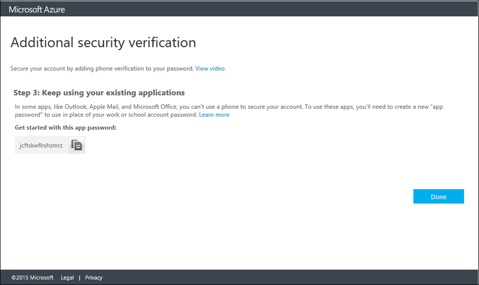

<properties 
	pageTitle="在 Azure MFA 中使用办公电话作为联系方法" 
	description="本页说明用户如何使用办公电话作为 Azure MFA 的主要联系方法。" 
	services="multi-factor-authentication" 
	documentationCenter="" 
	authors="billmath" 
	manager="terrylan" 
	editor="bryanla"/>

<tags 
	ms.service="multi-factor-authentication" 
	ms.date="06/02/2015" 
	wacn.date="12/17/2015"/>

# 在 Azure 多重身份验证中使用办公电话作为联系方法

如果要使用办公电话作为主要联系方法，你可以参考本文。本文将会引导你设置多重身份验证，以使用办公电话呼叫作为联系方法。

## 使用办公电话作为联系方法

<ol>
<li>从下拉列表中选择“办公电话”</li>

<li>通过下拉列表指定你的国家/地区，然后输入你的手机号码。</li>
<li>选择想要使用的手机通信模式 - 短信或呼叫。</li>
<li>单击“下一步”。</li>
<li>单击“立即验证”按钮。随后将向你的办公电话发起呼叫。请务必待在办公电话旁边。 
<li>单击“下一步”</li>
<li>此时，你已设置好联系方法，接着可以设置非浏览器应用（例如 Outlook 2010 或更低版本）的应用密码。如果你不使用这些应用，请单击“完成”。  否则，请继续下一步骤。
<li>如果你正在使用这些应用程序，请复制提供的应用密码。</li>

<li>将复制到剪贴板的密码粘贴到非浏览器应用程序。有关在每个应用程序（例如 Outlook 和 Lync）上执行的步骤，请参阅“如何将电子邮件中的密码更改为应用密码”和“如何将应用程序中的密码更改为应用密码”。</li>
<li>单击“Done”（完成）。</li>

<!---HONumber=69-->