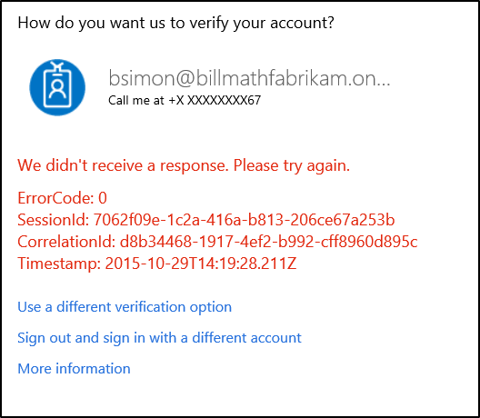
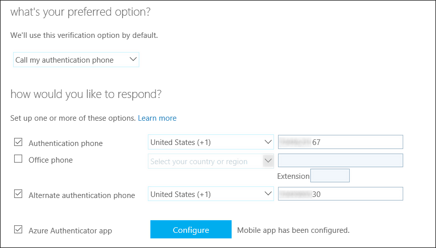
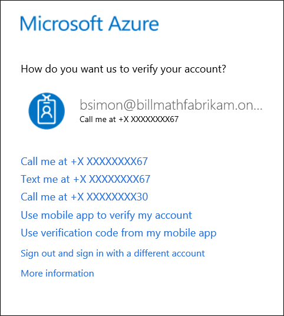
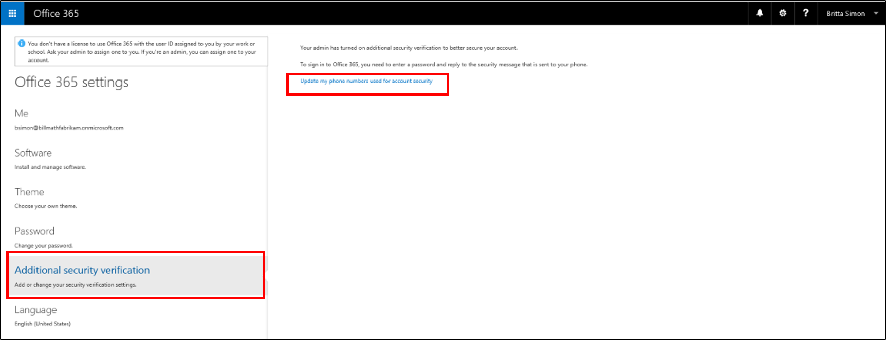
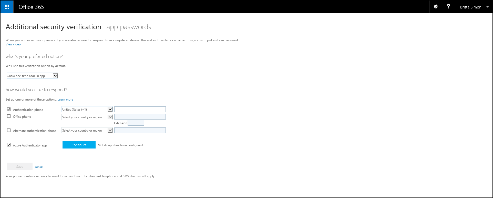
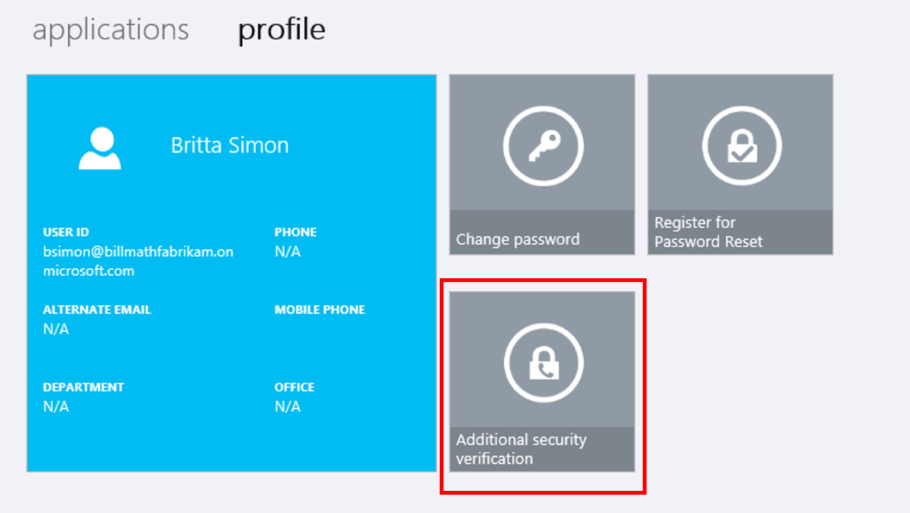
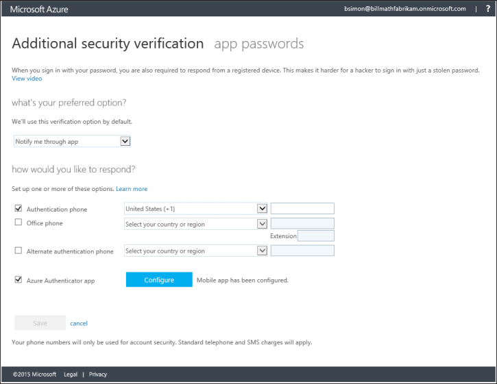
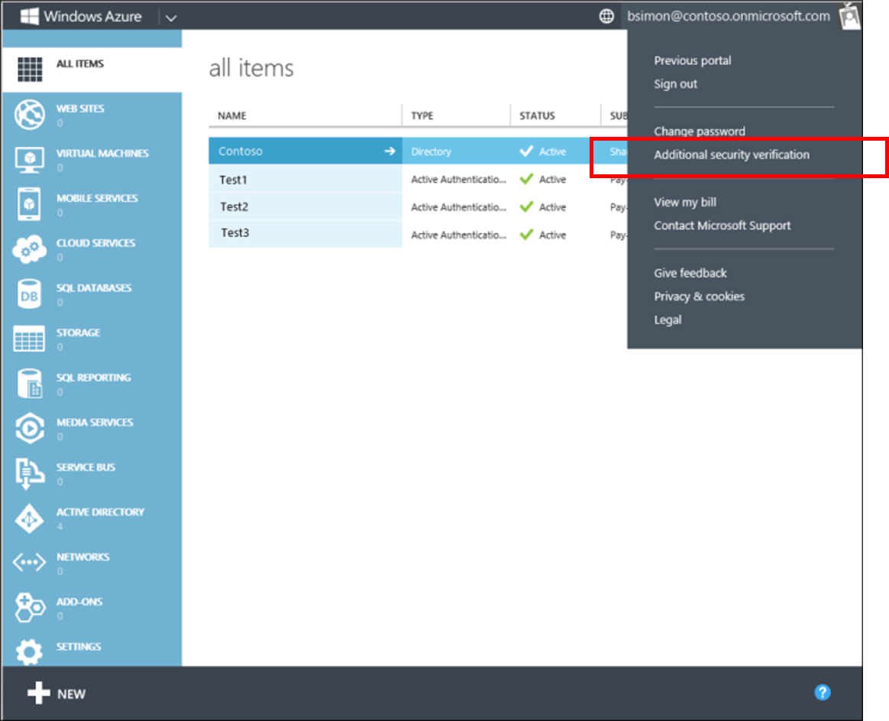

<properties 
	pageTitle="使用 Azure Multi-Factor Authentication 时遇到问题 | Windows Azure" 
	description="本文档向用户提供有关如何解决 Azure Multi-Factor Authentication 问题的信息。" 
	services="multi-factor-authentication" 
	documentationCenter="" 
	authors="billmath" 
	manager="stevenpo" 
	editor="curtland"/>

<tags 
	ms.service="multi-factor-authentication" 
	ms.date="10/29/2015" 
	wacn.date="01/21/2016"/>
# 使用 Azure 多重身份验证时遇到问题
以下信息旨在帮助你解决可能遇到的一些常见问题。

- [相关性 ID 错误](#correlation-id-errors)
- [我的手机已丢失或被盗](#i-have-lost-my-phone-or-it-was-stolen?)
- [我想要更改我的电话号码](#i-want-to-change-my-phone-number)
- [我的手机上未收到代码](#i-am-not-receiving-a-code-on-my-phone)
- [应用密码不起作用](#app-passwords-are-not-working)
- [如何从旧设备清理 Azure 验证器并将其迁移到新设备？](#how-do-i-clean-up-azure-authenticator-from-my-old-device-and-move-to-a-new-one)

##相关性 ID 错误
如果你已尝试过以下故障排除步骤，但仍遇到问题，请将问题发布到 [Azure AD 论坛](https://social.msdn.microsoft.com/Forums/zh-cn/home?forum=WindowsAzureAD)、[搜索 Microsoft 知识库 (KB)](https://www.microsoft.com/zh-CN/Search/result.aspx?q=azure%20active%20directory%20connect&form=mssupport) 或者[与支持人员联系](https://support.microsoft.com/zh-CN)，我们将尽快解答你的问题。

与支持人员联系时，建议你包含以下信息：

 - **错误的一般描述** – 用户实际看到的错误消息。 如果没有任何错误消息，请详细描述你所发现的意外行为。
 - **页面** – 你看到错误时所在的页面（包括 URL）。
 - **ErrorCode** – 你收到的具体错误代码。
 - **SessionId** – 你收到的具体会话 ID。
 - **相关性 ID** – 用户看到错误时所生成的相关性 ID 代码。
 - **时间戳** – 你看到错误时的精确日期和时间（包括时区）。
 

 - **用户 ID** – 看到错误的用户的 ID（例如 user@contoso.com)?）
 - **有关用户的信息** – 用户是否已联合、密码哈希是否已同步、是否只在云中？ 用户是否已获得 Azure AD Premium、Enterprise Mobility 或 Azure AD Basic 许可证？ 用户是否在使用 Office 365 等产品？

包含这些信息将有助于我们尽快为你解决问题。

##我的手机已丢失或被盗
如果你的手机已丢失或被盗，建议你让管理员重置你的[应用密码](/documentation/articles/multi-factor-authentication-manage-users-and-devices#delete-users-existing-app-passwords)并清除所有[已记住的设备](/documentation/articles/multi-factor-authentication-manage-users-and-devices#restore-mfa-on-all-suspended-devices-for-a-user)。

若要取回你的帐户，可以采取两种做法。第一种做法是，如果你已设置备用身份验证电话号码，你可以使用此号码来取回你的帐户并更改安全设置。

如果你指定了辅助身份验证电话号码，可以使用该号码登录。

请注意，在上面的屏幕截图中，已设置两个电话号码。一个以 67 结尾，另一个以 30 结尾。
  
若要使用备用电话号码登录，请像平时一样登录，然后选择“使用其他验证选项”。

接下来，选择其他电话号码。在本例中，应该选择“拨打我的电话号码 +X XXXXXXXX30”

>[AZURE.IMPORTANT]必须配置辅助身份验证电话号码。由于你的主要电话号码和移动应用可能在同一部手机上，因此，当你的手机丢失或被盗时，只能通过辅助电话号码访问你的帐户。

如果你未配置辅助身份验证电话号码，则需要与管理员联系并让他们清除你的设置，这样，当你下次登录时，系统将提示你再次[设置多重身份验证](/documentation/articles/multi-factor-authentication-manage-users-and-devices#require-selected-users-to-provide-contact-methods-again)。

## 我想要更改我的电话号码
根据多重身份验证的使用方式，你可以在多个位置更改设置，例如你的电话号码。使用下表来帮助选择最适合自己的方式。

如何使用多重身份验证|说明
:------------- | :------------- | 
[我要将它用于 Office 365](#changing-your-settings-with-office-365)| 这意味着你要通过 Office 365 门户更改设置。
[我不知道](#changing-your-settings-with-the-myapps-portal)|这意味着你要登录 [http://myapps.microsoft.com](http://myapps.microsoft.com) 并在该 Web 应用上更改设置。
[我要将它用于 Microsoft Azure](#changing-your-settings-with-microsoft-azure)| 这意味着你要通过 Azure 门户更改设置。

 
### 在 Office 365 中更改设置

如果你在 Office 365 上使用多重身份验证，则需要通过 Office 365 门户管理其他安全性验证设置。

#### 在 Office 365 门户中更改设置

1. 登录到 [Office 365 门户](https://login.microsoftonline.com/)。
2. 在右上角选择小组件并选择“Office 365 设置”。
3. 单击“其他安全性验证”。
4. 在右侧，单击“更新用于帐户安全性的电话号码”链接。
5. 随后你将转到可以更改设置的页面。

### 使用 Myapps 门户更改设置

如果你不确定多重身份验证的使用方式，你始终可以通过 myapps 门户更改设置。

#### 在 Myapps 门户中更改设置

1. 登录到 [https://myapps.microsoft.com](https://myapps.microsoft.com)	
2. 在顶部选择配置文件。
3. 选择“其他安全性验证”。
4. 随后你将转到可以更改设置的页面。

### 使用 Microsoft Azure 更改设置

如果你在 Azure 上使用多重身份验证，则需要通过 Azure 门户更改设置。

#### 在 Azure 门户中访问其他安全性验证设置

1. 登录到 Azure 门户。
2. 在 Azure 门户的顶部，单击你的用户名。此时将显示一个下拉框。
3. 在下拉框中，选择“其他安全性验证”。
4. 随后你将转到可以更改设置的页面。

## 我的手机上未收到代码

首先，需要确保满足以下条件：

- 如果你已选择通过手机短信接收验证码，请确保你的服务计划和设备支持短信传递。传递速度和服务可用性因位置和服务提供商的不同而异。另外，在尝试接收这些代码时，请确保有足够强的手机信号。
- 如果你已选择通过移动应用接收验证码，请确保有足够强的手机信号。另请记住，传递速度和服务可用性因位置和服务提供商的不同而异。 

<!-- 如果你使用智能手机，我们建议你使用 [Azure 验证器应用](/documentation/articles/multi-factor-authentication-azure-authenticator)。-->

你可以在登录时通过选择“使用其他验证选项”，切换为通过短信或移动应用接收验证码。

有时，其中一种服务传递方式比另一种方式更可靠。

请注意，如果你收到了多个验证码，只有最新的一个验证码才起作用。

如果先前已配置备用电话，建议你在登录页出现提示时选择该电话，然后再试一次。如果你未配置其他方法，请与管理员联系并让他们清除你的设置，这样，当你下次登录时，系统将提示你再次[设置多重身份验证](/documentation/articles/multi-factor-authentication-manage-users-and-devices#require-selected-users-to-provide-contact-methods-again)。

## 应用密码不起作用
首先，请确保正确输入应用密码。如果仍然无法解决问题，请尝试登录并[创建新的应用密码](/documentation/articles/multi-factor-authentication-end-user-app-passwords)。如果还是不起作用，请与管理员联系并让他们[删除现有应用密码](/documentation/articles/multi-factor-authentication-manage-users-and-devices#delete-users-existing-app-passwords)，然后请新建一个应用密码并使用该密码。

## 如何从旧设备清理 Azure 验证器并将其迁移到新设备？
当你从设备上卸载应用或者在设备上刷机时，不会在后端删除激活信息。<!-- 你应该使用[转移到新设备](/documentation/articles/multi-factor-authentication-azure-authenticator#how-to-move-to-the-new-azure-authenticator-app)中所述的步骤。-->

<!---HONumber=Mooncake_1207_2015-->