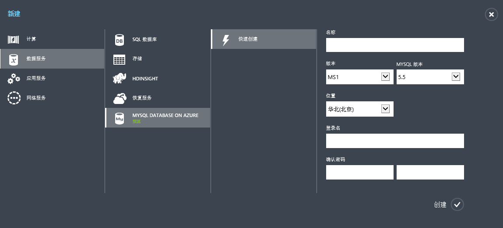
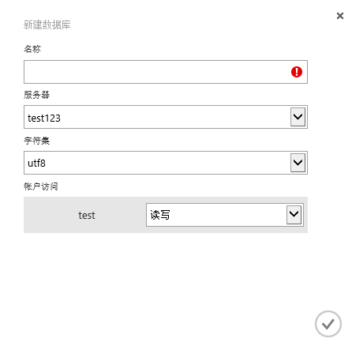

<properties linkid="" urlDisplayName="" pageTitle="Introduction to MySQL Database on Azure – Microsoft Azure cloud" metakeywords="Azure Cloud, technical documentation, documents and resources, MySQL, database, beginner’s guide, Azure MySQL, MySQL PaaS, Azure MySQL PaaS, Azure MySQL Service, Azure RDS" description="This quick-start guide will help you create, connect, migrate, monitor, and manage your MySQL database in just a few minutes. By following the steps in this introduction, you will be able to create and use your own MySQL database." metaCanonical="" services="MySQL" documentationCenter="Services" title="" authors="" solutions="" manager="" editor="" />

<tags ms.service="mysql" ms.date="" wacn.date="12/28/2015"/>

#Introduction to MySQL Database on Azure
> [AZURE.SELECTOR]
- [中文版](/documentation/articles/mysql-database-get-started)
- [In English](/documentation/articles/mysql-database-enus-get-started)

This course will help you to understand how to use the Azure portal to quickly create, configure, and connect to MySQL Database on Azure. Once you have completed this course, you will have a sample MySQL database server on Azure and will understand how to use the Azure portal to perform basic management tasks.

###Contents
- [Step 1: Sign in to the Azure portal and create a MySQL server](#step1)
- [Step 2: Configure the firewall](#step2)
- [Step 3: Set the scheduled backup time](#step3)
- [Step 4: Create the database](#step4)
- [Step 5: Connect to the database](#step5)
- [Step 6: Migrate data (optional)](#step6)
- [Subsequent steps](#nextstep)

##Step 1: Sign in to the Azure portal and create a MySQL server
1.	Sign in to the Azure portal, and then select MySQL Database on Azure in the navigation bar on the right. 
2.	Click “Create” at the bottom of the page. A list of content that can be created will then be displayed.
3.	Click “MySQL Database on Azure,” and then click on “Quick Create.”
 

>[AZURE.NOTE]**Your username is composed of “server name%username”. Ensure that you fill in the complete username when you connect to the database. **

Enter the parameters that are required to create a new server, and then click “Create.” In a minute or two, you will have a new MySQL server.

>[AZURE.NOTE]** We strongly recommend that you put Azure services in the same region and select the location closest to you. **

##Step 2: Configure the firewall
Before you connect to MySQL Database on Azure from your client for the first time, you must configure the firewall and add the client’s public network IP address (or IP address range) to the whitelist. In the portal, click your instance, and then click “Configure.” You can then add the IP addresses by using the interface below.

By default, your other services on Azure (including virtual machines [VMs] on Azure) are allowed to access your MySQL database, so you don’t need to manually add other IP addresses. You can also change this default setting by selecting “No” for “Microsoft Azure Services” under “Allowed Services.”

##Step 3: Set the scheduled backup time
MySQL Database on Azure supports two types of backup: on-demand and daily scheduled. After selecting your MySQL server, you can click “Configure” to set the scheduled time for daily backups. You can choose an automatic backup time from the drop-down menu.

##Step 4: Create the database
Users can create multiple databases within a MySQL server. There is no limit to the number of databases that can be created, but multiple databases will share server resources. To create a database, select the MySQL server, click “Databases,” and then click “Create” in the lower-left corner.

##Step 5: Connect to the database
You can find the server address by using the “dashboard” in the Azure portal, and can connect to your MySQL Database on Azure database by using the app.
>[AZURE.NOTE]MySQL Database on Azure supports SSL connections. If your app is not in the same Azure datacenter as the MySQL database, we recommend that you use SSL connections to increase security.

##Step 6: Migrate data (optional)
If you need to migrate the database from another location to MySQL Database on Azure and the amount of data involved is considerable, we recommend using the following migration procedure. 
- Step 1: Export the data from the existing database to a file (for example, by using the mysqldump tool). 
- Step 2: Send the file exported from the database to your specific VM on Azure. You can do this by using any data transfer tool that you are familiar with (such as FTP) or by using the [AzCopy](/documentation/articles/storage-use-azcopy) tool. If you use the AzCopy tool, you need to send the file to a storage blob before you send it to the VM. 
- Step 3: Import the data from your Azure VM into your MySQL Database on Azure database. **This can reduce the chance of experiencing migration failures due to connection dropouts.**

##Subsequent steps
Once you have completed the steps above, you will have created a MySQL Database on Azure database and gained an understanding of how to use the portal. Next, you can try out other features, such as checking database usage, backups, and recovery, as well as version upgrades and downgrades.

If you encounter any problems during operation, you can look at the management portal guide, contact technical support, or post your issue on the [MSDN forums](https://social.msdn.microsoft.com/Forums/zh-cn/home?forum=AzureMySQLRDS).

<!--HONumber=81-->