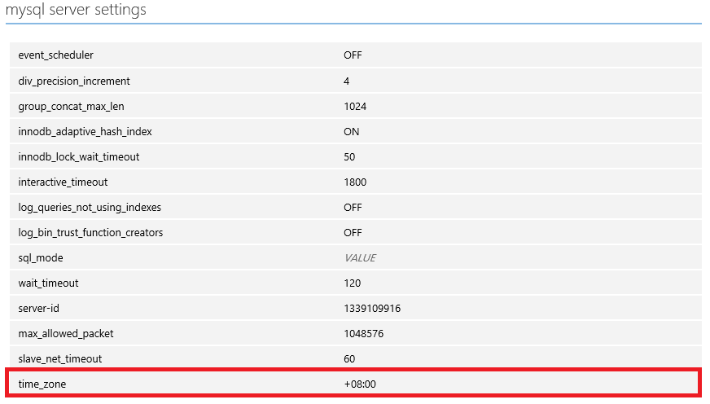

<properties linkid="" urlDisplayName="" pageTitle="Time zone configuration on MySQL on Azure – Azure Cloud" metaKeywords="Azure Cloud, technical documentation, documents and resources, MySQL, database, beginner’s guide, Azure MySQL, MySQL PaaS, Azure MySQL PaaS, Azure MySQL Service, Azure RDS" description="Time zone configuration on MySQL on Azure" metaCanonical="" services="MySQL" documentationCenter="Services" title="" authors="" solutions="" manager="" editor="" />

<tags ms.service="mysql_en" ms.date="07/05/2016" wacn.date="07/05/2016" wacn.lang="en" />

> [AZURE.LANGUAGE]
- [中文](/documentation/articles/mysql-database-timezone-config)
- [English](/documentation/articles/mysql-database-enus-timezone-config)

## Time zone configuration on MySQL on Azure

MySQL Database on Azure currently supports changing the time zone by modifying the parameter settings. To change the time zone:

1. Sign in to the Azure Management Portal.
2. In **Configuration**, select **MySQL server configuration**.
3. Select **time_zone**.

MySQL on Azure currently defaults to using UTC (Coordinated Universal Time) as the system time. You can configure offsets to update the time. For example, “+10:00” corresponds to the UTC+10 time zone, while “-06:00” corresponds to the UTC-6 time zone.

For example, if you are changing to Beijing time, you can set the time\_zone parameter in the diagram below to: +08:00.

>[AZURE.NOTE] **Named time zones such as "Europe/Helsinki", "US/Eastern" or "MET" are not currently supported.**
*

See [Setting MySQL Database on Azure server parameters](/documentation/articles/mysql-database-advanced-settings) for the specific intervals and details of other parameters.

<!---HONumber=Acom_0218_2016_MySql-->