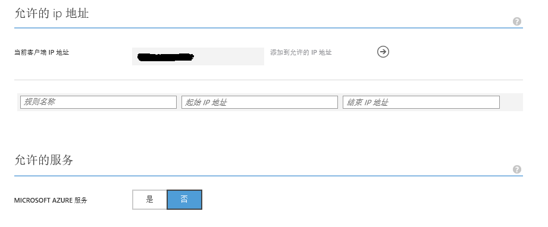

<properties linkid="" urlDisplayName="" pageTitle="Introduction to MySQL Database on Azure – Microsoft Azure Cloud" metaKeywords="Azure 云,技术文档,文档与资源,MySQL,数据库,入门指南,Azure MySQL, MySQL PaaS,Azure MySQL PaaS, Azure MySQL Service, Azure RDS" description="This quick start guide helps you come to grips with MySQL Database on Azure, enabling you to create, connect, migrate, monitor and manage your MySQL database in just a few minutes. By following the steps laid out in this introduction, you will be able to create and use your own MySQL database." metaCanonical="" services="MySQL" documentationCenter="Services" title="" authors="" solutions="" manager="" editor="" />

<tags ms.service="mysql" ms.date="" wacn.date="05/21/2015"/>

#Introduction to MySQL Database on Azure
This course will help you to understand how to use the Azure management portal to quickly create, configure and connect to MySQL Database on Azure. Once you have completed this course, you will have a sample MySQL database server on Azure, and will understand how to use the management portal to perform basic management tasks.

###Contents
- [Step 1: Log in to the Azure management portal and create a MySQL server](#step1)
- [Step 2: Configure the firewall](#step2)
- [Step 3: Set the scheduled backup time](#step3)
- [Step 4: Create the database](#step4)
- [Step 5: Connect to the database](#step5)
- [Step 6: Data migration (optional)](#step6)
- [Subsequent steps](#nextstep)

##Step 1: Log in to the Azure management portal and create a MySQL server
1.	Log in to the Azure management portal, and then select MySQL Database on Azure in the navigation bar on the right. 
2.	Click on the “Create” button at the bottom of the page; a list of content that can be created will then be displayed.
3.	Click on “MySQL Database on Azure,” then click on “Quick Create”.
 

>[AZURE.NOTE] **Your username is composed of “server name%username”; please ensure that you fill in the complete username when connecting to the database.**

Enter the parameters required to create a new server and then click on “Create.” In a minute or two, you will have a new MySQL server.

>[AZURE.NOTE] **We strongly recommend that you put Azure services in the same region and select the location closest to you.**

##Step 2: Configure the firewall
Before you connect to MySQL Database on Azure from your client for the first time, you must configure the firewall and add the client’s public network IP address (or IP address range) to the whitelist. In the management portal, click on your instance and then click on “Configure”; you can then add the IP addresses using the interface below.

By default, your other services on Azure (including VMs on Azure) are allowed to access your MySQL database, so you don’t need to manually add other IP addresses. You can also change this default setting by selecting “No” for “Microsoft Azure Services” under “Allowed Services”.

##Step 3: Set the scheduled backup time
MySQL Database on Azure supports two types of backup: on-demand backups and daily scheduled backups. After selecting your MySQL server, you can click on “Configure” to set the scheduled time for daily backups. You can choose an automatic backup time from the drop-down menu.

##Step 4: Create the database
Users can create multiple databases within a MySQL server. There is no limit to the number of databases that can be created, but multiple databases will share server resources. To create a database, select the MySQL server, click on “Databases,” and then click on “Create” in the lower left corner.

##Step 5: Connect to the database
You can find the server address using the “dashboard” in the Azure management portal, and connect to your MySQL Database on Azure database using the app.
>[AZURE.NOTE] MySQL Database on Azure supports SSL connections; if your app is not in the same Azure data center as the MySQL database, we recommend that you use SSL connections to increase security.

##Step 6: Data migration (optional)
If you need to migrate the database from somewhere else to MySQL Database on Azure and the amount of data involved is considerable, we recommend using the following migration procedure. - Step 1: Export the data from the existing database to a file (for example by using the mysqldump tool). - Step 2: Send the file exported from the database to your specific VM on Azure. You can do this using any data transfer tool that you are familiar with (such as FTP), or by using the [AzCopy](/documentation/articles/storage-use-azcopy) tool (if you use the AzCopy tool, you need to send the file to a storage blob before sending it to the VM). - Step 3: Import the data from your Azure VM into your MySQL Database on Azure. **This can reduce the chance of experiencing migration failures due to connection dropouts.**

##Subsequent steps
Once you have completed the steps above, you will have created a MySQL Database on Azure database, and will have gained an understanding of how to use the management portal. Next, you can try out other features, such as checking database usage, backups, and recovery, as well as version upgrades and downgrades.

If you encounter any problems during operation, you can look at the management portal guide, contact technical support, or post your issue on the [MSDN forums](https://social.msdn.microsoft.com/Forums/zh-cn/home?forum=AzureMySQLRDS).

