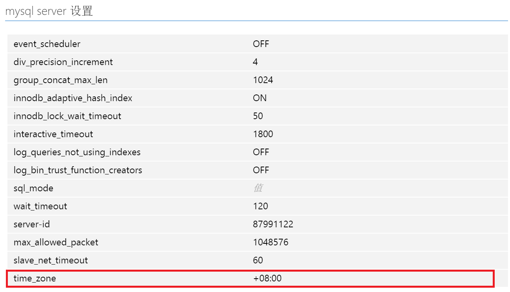

<properties linkid="" urlDisplayName="" pageTitle="MySQL on Azure上的时区配置 - Azure 微软云" metaKeywords="Azure 云,技术文档,文档与资源,MySQL,数据库,入门指南,Azure MySQL, MySQL PaaS,Azure MySQL PaaS, Azure MySQL Service, Azure RDS" description="在MySQL on Azure上如何配置时区" metaCanonical="" services="MySQL" documentationCenter="Services" title="" authors="" solutions="" manager="" editor="" />  

<tags ms.service="mysql" ms.date="" wacn.date="01/11/2015"/>

## MySQL on Azure上的时区配置

MySQL Database on Azure目前支持用户通过修改参数设定的方式来进行时区更改。用户可以通过登陆[Azure管理门户](https://manage.windowsazure.cn),选择“**配置**”中的"MySQL server配置"选中time_zone进行更改。MySQL on Azure目前默认采用UTC 协调世界时作为系统时间System， 用户可以通过配置补偿值(offsite)来进行时间更新。比如，'+10:00'或‘-06：00’分别对应UTC+10、UTC-6的时区。

具体的取值区间以及其他参数的信息，都可以参见[定制MySQL 数据库 on Azure服务器参数](/documentation/articles/mysql-database-advanced-settings).

以用户变更到北京时间为例， 用户可以将以下图中time_zone的参数设置为：+08：00.

>[AZURE.NOTE]**目前暂不支持已命名时区如"Europe/Helsinki", "US/Eastern" or "MET"等**

>[AZURE.NOTE]**对于已有的数据库服务器实例，time_zone配置可能不可见。在这种情况下，您可以通过变更其他参数或更改SKU，重启实例之后，便可以进行time_zone的配置。**

