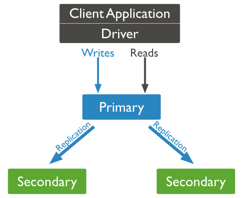
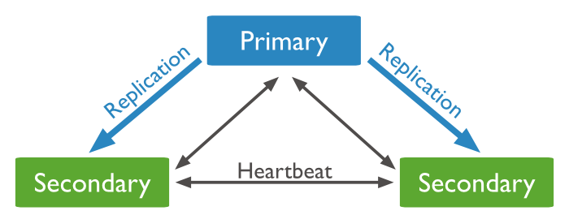
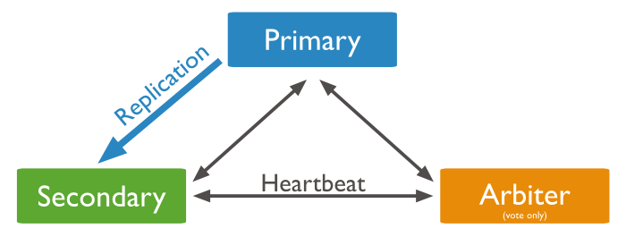
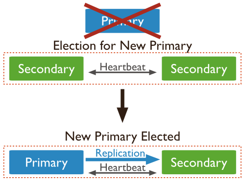
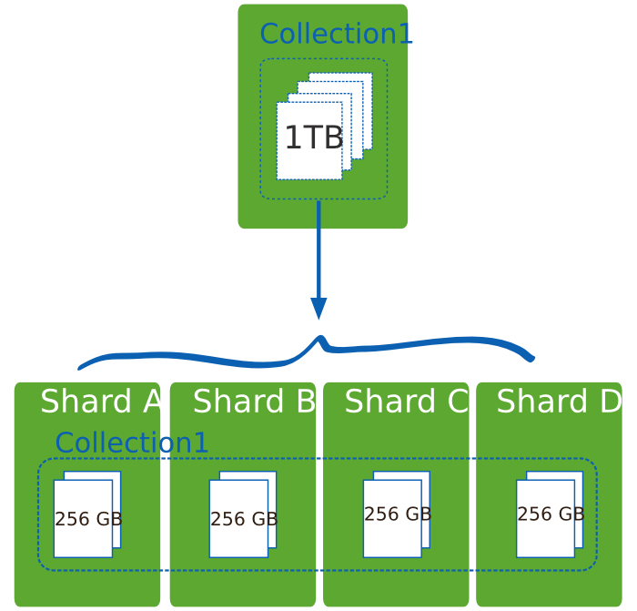
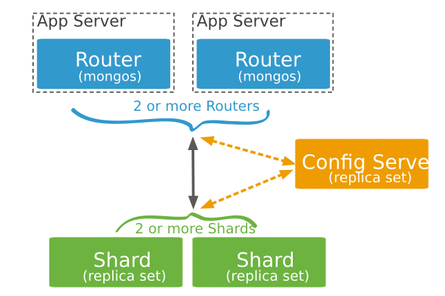

<properties
	pageTitle="在 Azure 虚拟机上管理配置 MongoDB 集群 | Azure "
	description="了解如何管理配置 MongoDB 集群"
	services=" open-resource "
	documentationCenter=""
	authors=""
	manager=""
	editor="Lingli"/>

<tags
	ms.service="open-source-mongodb" 
	wacn.date="06/20/2016"/>

#在 Azure 虚拟机上管理配置 MongoDB 集群

##目录  

[介绍](#introduction)

[安装 MongoDB](#install-MongoDB)

- [Redhat based Linux](#Redhat-based-Linux)
- [Ubuntu](#Ubuntu)
- [SUSE](#SUSE)

[配置管理复制集的集群](#config-cluster)

- [介绍](#introduction-1)
- [配置复制集集群](#config-copy-cluster)
- [自动故障切换](#auto-trouble-switch)
- [移除从节点](#remove-childnode)
- [添加从节点](#add-childnode)
- [修改复制集设置](#modify-copycluster-config)

[配置管理MongoDB分片集群](#manage-config-MongoDB-neafcluster)

- [介绍](#introduction-2)
- [配置MongoDB分片集群](#config-MongoDB-neafcluster)

##	介绍
MongoDB 是一个跨平台的面向文档的 NoSQL 数据库，本文档介绍如何在Azure虚拟机上配置管理 MongoDB 集群。
## 在虚拟机上手动安装 MongoDB
如果您还没有 Azure Linux 虚拟机，请参考 [Azure Linux VM tutorial](/documentation/articles/virtual-machines-linux-tutorial-portal-rm/) 创建 Linux 虚拟机。
如果这是您第一次使用Azure的Linux虚拟机，请参考 [Azure Linux VM tutorial](/documentation/articles/virtual-machines-linux-tutorial-portal-rm/) 如何使用虚拟机。

不同的 Linux 发行版在安装 MongoDB 时有少许不同，请根据您的Linux版本选择对应的步骤。

**Redhat based Linux**    
	(以 CentOS 7.0 64x, MongoDB 3.2为例)  

1.	创建文件 /etc/yum.repos.d/mongodb-org-3.2.repo 这样就能通过 yum 直接安装 MongoDB。   
		
		$sudo vi /etc/yum.repos.d/mongodb-org-3.2.repo
		[mongodb-org-3.2]
		name=MongoDB Repository
		baseurl=https://mirror.chinacloudapp.cn/mongodb/yum/redhat/$releasever/mongodb-org/3.2/x86_64/
		gpgcheck=0
		enabled=1

2.	安装 MongoDB 包  

			$sudo yum install -y mongodb-org

3.	(可选)当新的版本可用的时候，yum 会更新这些包，为防止这些“无意”的更新，添加下列行到 /etc/yum.conf 文件  
	
		exclude=mongodb-org,mongodb-org-server,mongodb-org-shell,mongodb-org-mongos,mongodb-org-tools 

4.	关闭 selinux  

		$sudo sed -i '/^[^#]/s/\(SELINUX=\)\([a-z]\+\)/\1disabled/' /etc/sysconfig/selinux
		$sudo sed -i 's/^SELINUX=.*/SELINUX=disabled/' /etc/selinux/config
		$sudo setenforce 0

5.	启动 MongoDB (有许多种启动 MongoDB 的方式, 这里我们用下列命令启动)     

		$ sudo mongod --dbpath /var/lib/mongo/ --logpath /var/log/mongodb/mongod.log --fork
  
6.	检查 MongoDB日志文件，查看是否启动成功  
		
		$sudo cat /var/log/mongodb/mongod.log  

7.	停止 MongoDB 

		$MongoPid=`sudo ps -ef |grep -v grep |grep mongod|awk '{print $2}'`
		$sudo kill $MongoPid

**Ubuntu**   

(以Ubuntu 14.04 64x, MongoDB 3.2 为例)
  
1.	导入 public key  
		
		$sudo apt-key adv --keyserver hkp://keyserver.ubuntu.com:80 --recv EA312927 

2.	创建一个list文件  
		
		$echo "deb http://mirror.chinacloudapp.cn/mongodb/apt/ubuntu trusty/mongodb-org/3.2 multiverse" | sudo tee /etc/apt/sources.list.d/mongodb-org-3.2.list

3.	更新  
	
		$sudo apt-get update

4.	安装 MongoDB 包  
	
		$sudo apt-get install -y mongodb-org 

5.	(可选) 当新的版本可用的时候，apt-get 会更新这些包，为防止这些“无意”的更新, 执行下列命令  

		$echo "mongodb-org hold" | sudo dpkg --set-selections
		$echo "mongodb-org-server hold" | sudo dpkg --set-selections
		$echo "mongodb-org-shell hold" | sudo dpkg --set-selections
		$echo "mongodb-org-mongos hold" | sudo dpkg --set-selections
		$echo "mongodb-org-tools hold" | sudo dpkg --set-selections

6.	启动 MongoDB(有许多种启动MongoDB的方式, 这里我们用下列命令启动)  

		$sudo service mongod stop
		$ sudo mongod --dbpath /var/lib/mongodb/ --logpath /var/log/mongodb/mongod.log --fork
  
7.	查看MongoDB日志，验证是否启动成功   

		$sudo cat /var/log/mongodb/mongod.log
  
8.	停止 MongoDB   

		$MongoPid=`sudo ps -ef |grep -v grep |grep mongod|awk '{print $2}'`
		$sudo kill $MongoPid
   

**SUSE**  

(以SLES 12 64x, MongoDB 3.2 为例)  

1.	配置包管理系统    

		$sudo zypper addrepo --no-gpgcheck https://mirror.chinacloudapp.cn/mongodb/zypper/suse/12/mongodb-org/3.2/x86_64/ mongodb
  
2.	安装mongoDB 包  
	
		$sudo zypper -n install mongodb-org  

3.	(可选) 当新的版本可用的时候，zypper会更新这些包，为防止这些“无意”的更新, 执行下列命令  

		$sudo zypper addlock mongodb-org-3.2.0 mongodb-org-server-3.2.0 mongodb-org-shell-3.2.0 mongodb-org-mongos-3.2.0 mongodb-org-tools-3.2.0
  
4.	启动 MongoDB(有许多种启动MongoDB的方式, 这里我们用下列命令启动)    
5.	
		$ sudo mongod --dbpath /var/lib/mongo/ --logpath /var/log/mongodb/mongod.log --fork 

5.	查看MongoDB日志，验证是否启动成功  
6.	
		$sudo cat /var/log/mongodb/mongod.log  

6.	停止 MongoDB 

		$MongoPid=`sudo ps -ef |grep -v grep |grep mongod|awk '{print $2}'`
		$sudo kill $MongoPid
  
##配置管理复制集的集群
###介绍  
复制是在多台服务器间同步数据的过程，提供冗余，增加了数据可用性，数据在不同服务器上的多份副本提供了容错性。在某些场合，复制增加了读能力，因为可以把用户的读请求分发到不同的服务器上。利用复制的特性可以用在灾难恢复，报告，备份等场景中。
MongoDB 复制集是一组 mongod 实例，它们维护着同样的数据集。复制集的成员有以下几种：主节点，从节点，投票节点。
主节点接收所有写操作。

   

从节点通过应用主节点传来的数据变动操作来保持其数据集与主节点的一致，从节点也可以通过增加额外的参数配置来对应特殊的需求。

   

我们也可以为复制集设置一个投票节点 ，投票节点其本身并不包含数据集。但是，一旦当前的主节点不可用时，投票节点就会参与到新的主节点选举的投票中。  

   

###配置复制集集群
我们以下图所示的三节点为例

   

自动故障切换:

   

1. 个节点的基本信息如下  
	<table class="table table-bordered table-striped table-condensed" width="1">
 	  <tr>
      <th>操作系统</th>
      <th>MongoDB 版本号</th>
      <th>端口号(默认配置)</th>   
      <th>数据库存放目录(默认配置)</th>
      <th>日志存放目录(默认配置)</th>
  	 </tr>  
  	<tr>
      <td>CentOS 7.0</td>
      <td>3.2</td>
      <td>27017</td>
      <td>/var/lib/mongo</td>
      <td>/var/log/mongodb/mongod.log</td>
   	</tr>
  	<tr>
      <td>Ubuntu 14.04</td>
      <td>3.2</td>
      <td>27017</td>
      <td>/var/lib/mongodb</td>
      <td>/var/log/mongodb/mongod.log</td>
 	 </tr>
 	<tr>
      <td>SLES 12</td>
      <td>3.2</td>
      <td>27017</td>
      <td>/var/lib/mongo</td>
      <td>/var/log/mongodb/mongod.log</td>
 	 </tr>
	</table>

2.	在Azure虚机管理界面中打开以上三个节点的27017端口，具体操作请参考[链接](/documentation/articles/virtual-machines-set-up-endpoints/)。  
3.	确保这三个节点能够互相连接。建议都位于同一个数据中心下，比如区域都是中国东部或者中国北部，以降低网络延迟。  
4.	/etc/mongod.conf 配置文件里默认绑定了IP地址127.0.0.1。修改此项配置，所有三个节点都执行下面命令    
		
		$sudo sed -i 's/\(bindIp\)/#\1/' /etc/mongod.conf

5.	启动 MongoDB。  
	在 CentOS 和 SLES 节点执行如下命令    
		
		#mongod --dbpath /var/lib/mongo/ --replSet repset --logpath /var/log/mongodb/mongod.log --fork

	在 Ubuntu 节点执行如下命令  

		#mongod --dbpath /var/lib/mongodb/ --replSet repset --logpath /var/log/mongodb/mongod.log --fork

6.	使用 mongo shell 连接到复制集的一个成员。在一个节点上执行以下命令（请根据实际情况填写IP地址）：  
	
		$mongo
		>use admin
		>config = { _id:"repset", members:[
		{_id:0,host:"CentOS Node IP:27017"},
		{_id:1,host:"Ubuntu Node IP:27017"},
		{_id:2,host:"SLES Node IP:27017" }]
		}

	初始化复制集    

		>rs.initiate(config)
		
	验证复制集配置  

		>rs.status()  
		>rs.conf()

	登录到其他两个节点验证   
 
		$mongo
		>rs.status()
		>rs.conf()
 
7.	验证数据复制。  
	到主节点执行  

    	$mongo
    	>db
    	>db. mycol.insert({"title":"MongoDB Overview"})
    	>show collections
    	>db.mycol.find()
  
	登录到其他两个节点执行  

    	>mongo
    	>db
    	>db.getMongo().setSlaveOk()
    	>show collections
    	>db.mycol.find()
 
	如果我们能看到和主节点同样的结果，表明复制集配置成功。   
###自动故障切换  
1.	停止主节点mongod进程，到主节点执行以下命令：

		$sudo ps -ef |grep mongod  #获取mongod进程ID  
		$sudo kill -9 <PID> #用上面获取的进程ID代替此命名中的<PID>
 
2.	到其他两个节点查看复制集状态  

		$mongo
		>rs.status()

	您会看到其中一台从节点此时已经成为主节点，而原先的主节点的状态是 ‘not reachable’ .   
3.	到原先的主节点，重启 mongod 进程  
	在 CentOS 和 SLES 节点执行如下命令：  

		#mongod --dbpath /var/lib/mongo/ --replSet repset --logpath /var/log/mongodb/mongod.log --fork 
		#mongo
	    >rs.status()
 
	在Ubuntu节点执行如下命令：  

		#mongod --dbpath /var/lib/mongodb --replSet repset --logpath /var/log/mongodb/mongod.log --fork 
		#mongo
		>rs.status()

	您会看到它的状态变成从节点了。重新加入了此复制集。  
###移除从节点  
1.	在想要移除的从节点上执行  

	    $mongo
	    >db.isMaster()
	    >use admin
	    >db.shutdownServer()
 
2.  在主节点上执行   

	    $mongo
	    >rs.remove(“ip:port”) #这里IP是要移除的从节点的IP, 端口是 27017
  
###添加从节点  
1.	在想要添加到复制集的节点上执行(如果是 Ubuntu OS, dbpath 则是 /var/lib/mongodb )    

		#mongod --dbpath /var/lib/mongo/ --replSet repset --logpath /var/log/mongodb/mongod.log --fork
  
2.	在主节点上执行   

		$mongo
		>rs.add(“ip:port”) #这里IP是要添加的节点的IP，端口是27017
		>rs.status()  
  
###修改复制集设置  
比如说修改优先级, 我们更新复制集对象的 members 数组  
在主节点上执行  

		$mongo
		>cfg=rs.conf()
		>cfg.members[0].priority=1
		>rs.reconfig(cfg,{"force":true})
		>rs.status()
  
关于更多复制集群配置操作，可以参考 [MongoDB 官方文档](https://docs.mongodb.com/manual/tutorial/deploy-replica-set/)。  

##配置管理 MongoDB 分片集群
###介绍
分片( Sharding )是使用多个机器存储数据的方法,MongoDB使用分片以支持巨大的数据存储量与对数据操作  

  

MongoDB 分片

   

Shards 保存数据。为了提供高可用性和数据一致性，在生产环境的分片集群中，每一个 shards 都是一个复制集。
Query Routers (或者叫 mongos ) 负责与用户程序打交道，同时“引流”到合适的 shards 上。客户端发送一个请求，然后被路由至某个 shards, 再返回结果给客户端。一个分片集群可以有多个 mongos。
Config servers 保存分片集群元数据信息。  

###配置 MongoDB 分片集群  

1. 使用上图作为此次分片集群的结构。5个节点的基本信息如下：  
	<table class="table table-bordered table-striped table-condensed" width="1">
  	 <tr>
      <th>操作系统</th>
      <th>MongoDB 版本号</th>
      <th>角色</th>   
      <th>IP 地址</th>
      <th>端口号</th>
   	</tr>  
  	<tr>
      <td>CentOS 7.0</td>
      <td>3.2</td>
      <td>router</td>
      <td>10.2.0.1</td>
      <td>27017</td>
   	</tr>
  	<tr>
      <td>CentOS 7.0</td>
      <td>3.2</td>
      <td>router</td>
      <td>10.2.0.2</td>
      <td>27017</td>
  	</tr>
 	<tr>
      <td>CentOS 7.0</td>
      <td>3.2</td>
      <td>Config server</td>
      <td>10.2.0.3</td>
      <td>27019</td>
  	</tr>
 	<tr>
      <td>CentOS 7.0</td>
      <td>3.2</td>
      <td>shard1复制集</td>
      <td>10.2.0.4</td>
      <td>27017</td>
 	 </tr>
 	 <tr>
      <td>CentOS 7.0</td>
      <td>3.2</td>
      <td>shard1复制集</td>
      <td>10.2.0.5</td>
      <td>27017</td>
 	 </tr>
	</table> 
注意：10.2.0.4 和10.2.0.5 是属于同一个复制集集群, 由于实验环境限制，我这里只演示了一个复制集集群分片的方法，生产情况会有多个复制集集群的分片，以及至少三个 config servers。  
2. 在每个节点上安装mongodb包。  
3. 在Azure虚机管理界面中打开以上三个节点的27017端口，并保证每个节点能互相访问。建议都位于同一个数据中心下，比如区域都是中国东部或者中国北部，以降低网络延迟。然后修改 /etc/mongod.conf  

		$sudo sed -i 's/\(bindIp\)/#\1/' /etc/mongod.conf
  
4.	配置复制集(在shard节点配置，即10.2.0.4，10.2.0.5)  
	每个shard节点启动 mongod 进程  

		#mongod --dbpath /var/lib/mongo/ --replSet repset --logpath /var/log/mongodb/mongod.log --fork
  
	在其中一个shard节点执行如下命令    

		$mongo
		>use admin
		>config={ _id:"repset", members:[
		{_id:0,host:"10.2.0.4:27017"},
		{_id:1,host:”10.2.0.5:27017"}]
		}
		>rs.initiate(config)
		>rs.status()
 
	到另一个 shard 节点验证    

		$mongo
		>rs.status()

5.	到 Config server(10.2.0.3) 执行如下   

		#mongod --configsvr --dbpath /var/lib/mongo/ --logpath /var/log/mongodb/mongod.log --fork
   
6.	router节点设置  
	登录到每个router节点执行    

		#mongos --configdb 10.2.0.3 --logpath /var/log/mongodb/mongod.log --fork
  
	在一个 router 节点上执行  

		#mongo  
 
	添加复制集主节点到分片集群, 从节点会自动添加进来   

		>sh.addShard("repset/10.2.0.4:27017")  #假设10.2.0.4为主节点
  
	启用 sharding  

		>use admin
		>db.runCommand({enableSharding: "<database-name>" })
		>sh.status() 
     
	给集合分片

		>sh.shardCollection("<database-name >.<collection>", shard-key-pattern)
		比如，sh.shardCollection("records.people", { "zipcode": 1, "name": 1 } )

关于更多分片集群配置操作，可以参考 [MongoDB 官方文档](https://docs.mongodb.com/manual/core/sharding-introduction/)。
