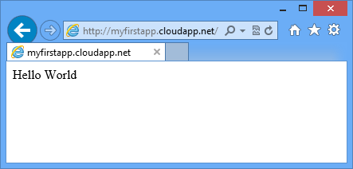

<properties linkid="develop-python-django-with-visual-studio" urlDisplayName="Django with Visual Studio" pageTitle="Django with Visual Studio (Python) - Azure tutorial" metaKeywords="Azure Django web app, Azure Django virtual machine" description="A tutorial that teaches you how to build a Django web application hosted in an Azure virtual machine." metaCanonical="" services="cloud-services" documentationCenter="Python" title="Creating Django applications with Python Tools for Visual Studio 1.5" authors="" solutions="" manager="" editor="" />
<tags ms.service="cloud-services"
    ms.date="10/16/2014"
    wacn.date="04/11/2015"
    />

# 使用 Python Tools for Visual Studio 1.5 创建 Django 应用程序

**注意：**本教程还制作成了 [Youtube 视频][Youtube 视频]。

**注意：**我们目前已发布了针对 PTVS 2.0 Beta 的[更新且更全面的教程][更新且更全面的教程]。

使用现成的工具可以让 Azure 开发变得很轻松。
本教程假定你之前未使用过 Azure。
完成本指南之后，你将能够在云中启动和运行 Django 应用程序。

你将了解到以下内容：

-   如何创建基本 Django 应用程序
-   如何使用 Django 测试服务器在本地运行并调试你的 Django 应用程序
-   如何在计算模拟器中本地运行你的 Django 应用程序
-   如何将应用程序发布和重新发布到 Azure。

遵循本教程中的说明，你可以生成一个简单的 Hello World Web应用程序。该应用程序将托管在一个 Web 角色实例中，此实例在 Azure 中运行时将托管在专用虚拟机 (VM) 中。

以下是已完成应用程序的屏幕快照：

![][0]

[WACOM.INCLUDE [create-account-note](../includes/create-account-note.md)]

##  </a>设置开发环境

在你可以开始开发 Azure 应用程序之前，你需要获取一些工具并设置开发环境。有关获取并安装 Azure SDK for Python 的详细信息，请参阅[如何安装 Python][如何安装 Python]。

**注意：**本教程需要 Python 2.7 和 Django 1.4。这些版本已包含在最新的 Azure SDK for Python 中。

**注意：**部署到计算模拟器和/或 Azure 需要完整版本的 Visual Studio（不支持集成外壳）。

## 创建新的 Django 应用程序

若要创建新的 Django 应用程序，请首先启动 Visual Studio，然后使用“文件”-\>“新建项目”来创建新项目。找到“Python”选项卡（位于顶级或“其他语言”区域中），然后选择“Django 应用程序”模板：

![新 Python 项目模板][新 Python 项目模板]

单击“确定”，你将创建你的第一个 Django 应用程序。

![显示你的第一个 Django 项目的已打开的 Visual Studio][显示你的第一个 Django 项目的已打开的 Visual Studio]

接下来，你将要开始开发第一个 Django 应用程序。你可以右键单击模块节点并选择“添加新的 Django 应用程序...”来在你的项目中设置新应用程序：

![添加新应用程序菜单项][添加新应用程序菜单项]

之后，你可以为你的应用程序输入新名称：

![添加新应用程序名称提示][添加新应用程序名称提示]

在为应用程序输入名称并单击“确定”后，将向你的项目中添加一个新应用程序：

![添加了新应用程序的解决方案资源管理器][添加了新应用程序的解决方案资源管理器]

现在，请更新 **settings.py**，以注册你的应用程序。这会导致 Django 自动发现添加到你的应用程序 Templates 目录中的模板文件。将应用程序名称添加到 INSTALLED\_APPS 节：

    'DjangoApplication.MyFirstApp',

![将应用程序添加到 INSTALLED\_APPS 中的 settings.py][将应用程序添加到 INSTALLED\_APPS 中的 settings.py]

接下来，让我们向应用程序的 **views.py** 中添加一些代码，以便可以返回一个简单的模板文件：

    from django.http import HttpResponse
    from django.template.loader import render_to_string
    def home(request):
        return HttpResponse(render_to_string(
                                            'index.html',
                                            {'content': 'Hello World'}
                                            ))

![将应用程序添加到 INSTALLED\_APPS 中的 settings.py][1]

然后，让我们添加将在你访问此视图时呈现的简单模板文件。为此，我们可以右键单击 Templates 文件夹并选择“添加新项”：

![向 Templates 文件夹中添加新项][向 Templates 文件夹中添加新项]

你现在可以从模板列表中选择“Django HTML 模板”并输入 **index.html** 作为文件名：

![向 Templates 文件夹中添加新项][2]

之后，该模板将添加到项目中并打开。在这里，你可以看到为模板标记突出显示的一些语法的起始内容：

![添加到解决方案资源管理器的模板][添加到解决方案资源管理器的模板]

此时，你可以开始更新模板以更改呈现的 HTML，并且在执行该操作时，你将获得较好的智能感知体验：

![Django 筛选器的模板智能感知功能][Django 筛选器的模板智能感知功能]

你可以保留或取消大写格式，因为它基本上不会改变本教程的结果。最后，你只需在 **urls.py** 中使用 url 模式注册你的视图。将以下代码添加到 **urlpatterns** 中：

    url(r'^$', 'DjangoApplication.MyFirstApp.views.home', name='home'),

![注册 URL][注册 URL]

## 在测试服务器中本地运行你的应用程序

此时，你已创建你的第一个 Django 应用程序。现在，你只需**按 F5** 即可在本地运行它。

![浏览器和测试服务器中的 Django Hello World][浏览器和测试服务器中的 Django Hello World]

这会启动运行 Django 的 **manage.py** 的 Python 解释程序以运行测试服务器。在测试服务器成功启动后，它还会启动 Web 浏览器以查看网站。因为你是使用 F5 启动应用程序的，而这会在调试器中启动该应用程序，所以我们还可以在任何 Python 代码（例如视图代码）或模板文件本身中设置断点：

![停在模板断点处的调试器][停在模板断点处的调试器]

你现在可以**单击停止按钮**并转为在 Azure 计算模拟器中运行。

## 在模拟器中本地运行应用程序

若要在计算模拟器内运行，你只需将 Azure 部署项目添加到你的 Django 项目解决方案中。

**注意：**部署到计算模拟器和/或 Azure 需要完整版本的 Visual Studio（不支持集成外壳）。

这可通过右键单击解决方案资源管理器中的 Django 项目节点并选择“添加 Azure 云服务项目”来实现：

![添加部署项目][添加部署项目]

在执行此命令后，你将在解决方案资源管理器中看到新添加的项目：

![添加部署项目之后][添加部署项目之后]

此新项目现在还在解决方案中标记为启动项目。此时，你将需要**以管理员身份重新启动 Visual Studio** 以使应用程序能够在计算模拟器中运行。执行该操作后，我们只需**按 F5**，应用程序即可运行并部署在计算模拟器中：

![添加部署项目之后][3]

现在，你会发现我们获得了相同的网页，但其 URL 略微不同。你还会发现没有 python.exe 正在运行 Django 测试服务器。相反，我们通过 IIS，使用 FastCGI 网关（在从 Visual Studio 运行时会自动包括并设置该网关）运行 Django。

在计算模拟器中运行时，你可以快速循环访问你的应用程序 - 只需切换回 Visual Studio，更新你的文件并刷新 Web 浏览器。你将立即看到结果！

## 将应用程序部署到 Azure

现在，你已准备好将项目部署到 Azure。为此，你只需在解决方案资源管理器中右键单击 Azure 部署项目并选择“发布”：

![打包应用程序菜单][打包应用程序菜单]

在选择“发布”后，将提示你登录 Azure。你可以在此处导入你的现有凭据或设置新凭据：

![打包订阅][打包订阅]

在选择凭据后，你将看到“Azure 发布设置”屏幕。你可以选择各种有关你的部署将如何进行的选项，也可以直接按“发布”：

![打包设置][打包设置]

你现在将需要等待来设置和部署应用程序。

![打包部署][打包部署]

在完成所有设置后，你可以单击 DNS 名称下面的链接来查看运行在云中的网站：

  [Youtube 视频]: http://www.youtube.com/watch?v=UsLti4KlgAY
  [更新且更全面的教程]: ../web-sites-python-create-deploy-django-app/
  [0]: ./media/python-django-app-tools-visual-studio/ptvs-dj-FirstAppInCloud.png
  [create-account-note]: ../includes/create-account-note.md
  [如何安装 Python]: ../python-how-to-install/

<!-- Images. -->

  [新 Python 项目模板]: ./media/python-django-app-tools-visual-studio/ptvs-dj-NewProject.png
  [显示你的第一个 Django 项目的已打开的 Visual Studio]: ./media/python-django-app-tools-visual-studio/ptvs-dj-FirstProject.png
  [添加新应用程序菜单项]: ./media/python-django-app-tools-visual-studio/ptvs-dj-AddNewApp.png
  [添加新应用程序名称提示]: ./media/python-django-app-tools-visual-studio/ptvs-dj-AddNewAppPrompt.png
  [添加了新应用程序的解决方案资源管理器]: ./media/python-django-app-tools-visual-studio/ptvs-dj-MyFirstApp.png
  [将应用程序添加到 INSTALLED\_APPS 中的 settings.py]: ./media/python-django-app-tools-visual-studio/ptvs-dj-InstallApp.png
  [1]: ./media/python-django-app-tools-visual-studio/ptvs-dj-FirstView.png
  [向 Templates 文件夹中添加新项]: ./media/python-django-app-tools-visual-studio/ptvs-dj-AddFirstTemplate.png
  [2]: ./media/python-django-app-tools-visual-studio/ptvs-dj-NewDjangoTemplate.png
  [添加到解决方案资源管理器的模板]: ./media/python-django-app-tools-visual-studio/ptvs-dj-TemplateAdded.png
  [Django 筛选器的模板智能感知功能]: ./media/python-django-app-tools-visual-studio/ptvs-dj-TemplateIntellisense.png
  [注册 URL]: ./media/python-django-app-tools-visual-studio/ptvs-dj-RegisterUrl.png
  [浏览器和测试服务器中的 Django Hello World]: ./media/python-django-app-tools-visual-studio/ptvs-dj-DjangoHelloWorldTestServer.png
  [停在模板断点处的调试器]: ./media/python-django-app-tools-visual-studio/ptvs-dj-TemplateBreakpoint.png
  [添加部署项目]: ./media/python-django-app-tools-visual-studio/ptvs-dj-AddDeploymentProject.png
  [添加部署项目之后]: ./media/python-django-app-tools-visual-studio/ptvs-dj-AfterDeployProjAdded.png
  [3]: ./media/python-django-app-tools-visual-studio/ptvs-dj-ComputeEmulator.png
  [打包应用程序菜单]: ./media/python-django-app-tools-visual-studio/ptvs-dj-publish1.png
  [打包订阅]: ./media/python-django-app-tools-visual-studio/ptvs-dj-publish2.png
  [打包设置]: ./media/python-django-app-tools-visual-studio/ptvs-dj-publish3.png
  [打包部署]: ./media/python-django-app-tools-visual-studio/ptvs-dj-publish4.png
 