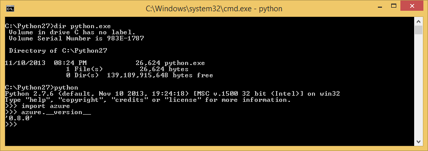
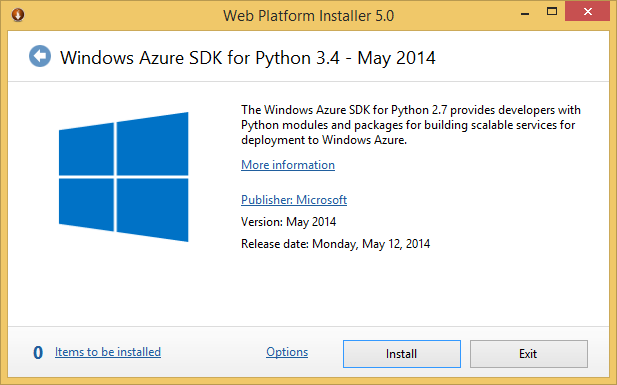
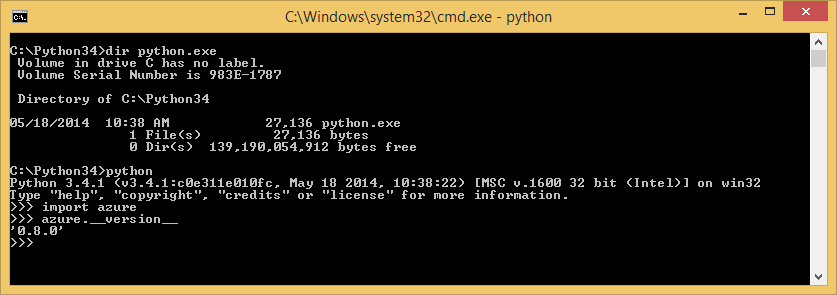

<properties
	pageTitle="安装 Python 和 SDK - Azure"
	description="了解如何安装 Python 和 SDK 以与 Azure 一起使用。"
	services=""
	documentationCenter="python"
	authors="huguesv"
	manager="wpickett"
	editor=""/>

<tags
	ms.service="multiple"
	ms.date="08/31/2015"
	wacn.date="01/21/2016"/>

# 安装 Python 和 SDK

在 Windows 上安装 Python 相当简单，并且它可能已预安装在 Mac 和 Linux 上。本指南将指导你完成安装过程，并使你的计算机可随时用于 Azure。

## Python Azure SDK 包含哪些内容？

Azure SDK for Python 包括允许您针对 Azure 开发、部署和管理 Python 应用程序的组件。具体而言，Azure SDK for Python 包括以下组件：

* **Azure 的 Python 客户端库**。这些类库提供用于访问 Azure 功能（例如存储和服务总线）和管理 Azure 资源（例如存储帐户、虚拟机等）的接口。
* **Azure 模拟器（仅限 Windows）**。计算和存储模拟器是一系列云服务和数据管理服务的本地模拟器，允许你在本地测试应用程序。Azure 模拟器仅在 Windows 上运行。

## 要使用哪种 Python 以及哪个版本

提供了多种形式的 Python 解释程序 - 示例包括：

* CPython - 最常用的标准 Python 解释程序
* IronPython - 在 .Net/CLR 上运行的 Python 解释程序
* Jython - 在 JVM 上运行的 Python 解释程序

仅 **CPython** 经过测试且支持 Python Azure SDK 和 Azure 服务（如 Web 应用和云服务）。我们建议使用 2.7 或 3.4 版本。

## 从哪里获得 Python？

有多种方法可获得 CPython：

* 直接从 [www.python.org][] 获取
* 从知名发行版本（例如 [www.continuum.io][]、[www.enthought.com][] 或 [www.activestate.com][]）获取
* 从源构建！

除非你有特定需求，否则建议使用前两个选项，如下所述。

## 在 Windows、Linux 和 MacOS 上安装（仅限客户端库）

如果你已安装 Python，则可以使用 pip 在现有的 Python 2.7 或 Python 3.3+ 环境中安装所有客户端库的捆绑包。这将从 [Python 包索引][] (PyPI) 中下载包。

请注意，你可能需要在 Linux 和 MacOS 上使用 `sudo` 命令，例如 `sudo pip install azure`。

	pip install azure

从版本 1.0.0 开始，这些库已拆分为多个包。现在，你可以只安装所需的包或安装捆绑包。

若要安装 Azure 存储空间运行时客户端库，请执行以下操作：

	pip install azure-storage

若要安装 Azure 服务总线运行时客户端库，请执行以下操作：

	pip install azure-servicebus

若要安装 Azure 资源管理器 (ARM) 客户端库，请执行以下操作：

	pip install azure-mgmt

若要安装 Azure 服务管理 (ASM) 客户端库，请执行以下操作：

	pip install azure-servicemanagement-legacy

## 在 Windows 上安装（Python、Azure 模拟器和客户端库）

可以使用 Web 平台安装程序来简化安装。安装的项包括来自 [www.python.org][] 的 CPython。

* [Microsoft Azure SDK for Python 2.7][]
* [Microsoft Azure SDK for Python 3.4][]

**注意：**在 Windows Server 上，若要下载 WebPI 安装程序，可能需要配置 IE ESC 设置（单击“开始”/“管理工具”/“服务器管理器”/“本地服务器”，然后单击 **IE 增强的安全配置**，将其设置为“关闭”）

### Python 2.7

WebPI 安装程序提供了开发 Python Azure 应用程序所需的所有内容。

安装完成后，在提示符处键入 **python** 以确保一切正常。根据你的安装方式，你可能需要设置“path”变量以找到（正确版本的）Python：

安装后，您应该具有位于默认位置的 Python 和客户端库：

	C:\Python27\Lib\site-packages\azure

### Python 3.4

WebPI 安装程序提供了开发 Python Azure 应用程序所需的所有内容。

安装完成后，在提示符处键入 python 以确保一切正常。根据你的安装方式，你可能需要设置“path”变量以找到（正确版本的）Python：

安装后，您应该具有位于默认位置的 Python 和客户端库：

		C:\Python34\Lib\site-packages\azure

### Windows 卸载

一般而言，**Azure SDK for Python** WebPI 产品不是应用程序，它实际上是捆绑在一起的不同产品（例如 32 位 Python 2.7/3.4、用于 Python 的 Azure 客户端库等）的集合。由于它没有自己的常规卸载程序，因此你需要从 Windows 控制面板中逐个删除它所安装的程序。

如果你希望重新安装 **Azure SDK for Python**，只需以管理员身份打开 PowerShell 命令提示符并运行以下命令：

	rm -force "HKLM:\SOFTWARE\Microsoft\Python Tools for Azure"

然后重新运行 WebPI。

## 获取多个软件包

[Python 包索引][] (PyPI) 提供丰富的 Python 库。如果你选择安装发行版本，表明你重点关注的是从 Web 开发到技术计算的各种方案。

## Python Tools for Visual Studio

[Python Tools for Visual Studio][] (PTVS) 是 Microsoft 提供的免费/OSS 插件，可将 VS 转换为完备的 Python IDE：

是否使用 PTVS 是可选择的，但建议使用，因为它能够为您提供 Python 和 Web 项目/解决方案支持、调试、分析、交互式窗口、模板编辑和智能感知。

PTVS 还可以轻松实现部署到 Microsoft Azure，同时支持部署到[云服务][]和[ Web 应用][]。

PTVS 适用于你现有的 Visual Studio 2013 或 2015 版本的安装。有关文档、下载和讨论的信息，请参阅 [Python Tools for Visual Studio]。

## Python Azure 方案适用于 Linux 和 MacOS

对于 Linux 或 MacOS，以下是所支持的主要 Azure 方案：

1. 通过使用 Python 的客户端库来使用 Azure 服务

2. 在 Linux VM 中运行你的应用程序

3. 使用 Git 开发和发布到 Azure Web 应用

第一个方案使你能够通过 Azure REST API 的 Pythonic 包装来创作利用 Azure PaaS 功能（例如 [Blob 存储][]、[队列存储][]、[表存储][]等）的丰富 Web 应用。这些应用程序的工作方式与在 Windows、Mac 和 Linux 上相同。此外可以从本地开发计算机或在 Azure 上运行的 Linux VM 中使用这些客户端库。

对于 VM 方案，你只需启动所选的 Linux VM（Ubuntu、CentOS、Suse）并运行/管理所需内容。例如，你可以在 Windows/Mac/Linux 计算机上运行 [IPython][] REPL/notebook，并使你的浏览器指向在 Azure 上运行 IPython 引擎的 Linux 或 Windows 多处理器 VM。请参阅 [Azure 上的 IPython Notebook][] 教程，以了解详细信息。

有关如何安装 Linux VM 的信息，请参阅[创建运行 Linux 的虚拟机][]教程。

使用 Git 部署，可以从任何操作系统开发 Python Web 应用并将其发布到 Azure Web 应用。当将您的存储库推送到 Azure 时，它将自动创建虚拟环境和 pip 安装所需的包。

有关开发和发布 Azure Web 应用的详细信息，请参阅有关教程：[使用 Django 创建 Web 应用][]、[使用 Bottle 创建 Web 应用][]和[使用 Flask 创建 Web 应用][]。有关使用任何 WSGI 合规框架的更多常规信息，请参阅[使用 Azure Web 应用配置 Python][]。

## 其他软件和资源：

* [Continuum Analytics Python 分发][]
* [Enthought Python 分发][]
* [ActiveState Python 分发][]
* [SciPy - Scientific Python 库套件][]
* [NumPy - Python 的数字库][]
* [Django 项目 - 成熟的 Web 框架/CMS][]
* [IPython - Python 的高级 REPL/Notebook][]
* [Azure 上的 IPython Notebook][]
* [GitHub 上的 Python Tools for Visual Studio][]
* [Python 开发人员中心](/develop/python/)

[Continuum Analytics Python 分发]: http://continuum.io
[Enthought Python 分发]: http://www.enthought.com
[ActiveState Python 分发]: http://www.activestate.com
[www.python.org]: http://www.python.org
[www.continuum.io]: http://continuum.io
[www.enthought.com]: http://www.enthought.com
[www.activestate.com]: http://www.activestate.com
[SciPy - Scientific Python 库套件]: http://www.scipy.org
[NumPy - Python 的数字库]: http://www.numpy.org
[Django 项目 - 成熟的 Web 框架/CMS]: http://www.djangoproject.com
[IPython - Python 的高级 REPL/Notebook]: http://ipython.org
[IPython]: http://ipython.org
[Azure 上的 IPython Notebook]: /documentation/articles/virtual-machines-python-ipython-notebook
[云服务]: /documentation/articles/cloud-services-python-ptvs
[ Web 应用]: /documentation/articles/web-sites-python-ptvs-django-mysql
[Python Tools for Visual Studio]: http://aka.ms/ptvs
[GitHub 上的 Python Tools for Visual Studio]: http://microsoft.github.io/PTVS/
[Python 包索引]: http://pypi.python.org/pypi
[Microsoft Azure SDK for Python 2.7]: http://go.microsoft.com/fwlink/?LinkId=254281&clcid=0x409
[Microsoft Azure SDK for Python 3.4]: http://go.microsoft.com/fwlink/?LinkID=516990&clcid=0x409
[Setting up a Linux VM via the Azure portal]: /documentation/articles/create-and-configure-opensuse-vm-in-portal
[How to use the Azure Command-Line Interface]: /documentation/articles/crossplat-cmd-tools
[创建运行 Linux 的虚拟机]: /documentation/articles/virtual-machines-linux-tutorial-portal-rm
[使用 Django 创建 Web 应用]: /documentation/articles/web-sites-python-create-deploy-django-app
[使用 Bottle 创建 Web 应用]: /documentation/articles/web-sites-python-create-deploy-bottle-app
[使用 Flask 创建 Web 应用]: /documentation/articles/web-sites-python-create-deploy-flask-app
[使用 Azure Web 应用配置 Python]: /documentation/articles/web-sites-python-configure
[表存储]: /documentation/articles/storage-python-how-to-use-table-storage
[队列存储]: /documentation/articles/storage-python-how-to-use-queue-storage
[Blob 存储]: /documentation/articles/storage-python-how-to-use-blob-storage

<!---HONumber=Mooncake_1221_2015-->