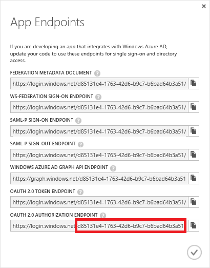
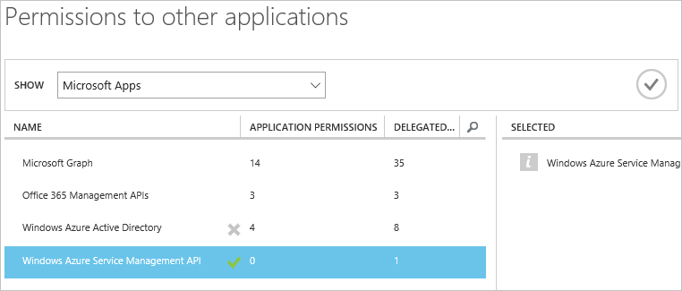

<properties
   pageTitle="在门户中创建 AD 应用程序和服务主体 | Azure"
   description="介绍如何创建新的 Active Directory 应用程序和服务主体，在 Azure 资源管理器中将此服务主体与基于角色的访问控制配合使用可以管理对资源的访问权限。"
   services="azure-resource-manager"
   documentationCenter="na"
   authors="tfitzmac"
   manager="wpickett"
   editor=""/>

<tags
   ms.service="azure-resource-manager"
   ms.date="04/18/2016"
   wacn.date="06/20/2016"/>

# 使用门户创建 Active Directory 应用程序和服务主体

## 概述
当你的自动化进程或应用程序需要访问或修改资源时，你可以使用门户来创建 Active Directory 应用程序。通过门户创建某个 Active Directory 应用程序时，实际上会同时创建该应用程序和一个服务主体。你可以使用应用程序自身的标识或应用程序的登录用户标识执行应用程序。这两种应用程序身份验证方法分别称为交互式（用户登录）和非交互式（应用程序提供自身的凭据）方法。在非交互式模式下，你必须将服务主体分配给具有正确权限的角色。

本主题说明如何使用门户创建新的应用程序和服务主体。目前，你必须使用门户来创建新的 Active Directory 应用程序。在以后的版本中，此功能将添加到 Azure 门户。可以使用门户将应用程序添加到角色。你也可以通过 Azure PowerShell 或 Azure CLI 执行这些步骤。若要使用 PowerShell 或 CLI 处理服务主体的详细信息，请参阅[使用 Azure 资源管理器对服务主体进行身份验证](/documentation/articles/resource-group-authenticate-service-principal)。

## 概念
1. Azure Active Directory (AAD) - 云的标识与访问管理服务生成版。有关详细信息，请参阅：[什么是 Azure Active Directory](/documentation/articles/active-directory-whatis)
2. 服务主体 - 目录中应用程序的实例。
3. AD 应用程序 - AAD 中向 AAD 标识某个应用程序的目录记录。 

有关应用程序和服务主体的详细说明，请参阅[应用程序对象和服务主体对象](/documentation/articles/active-directory-application-objects)。有关 Active Directory 身份验证的详细信息，请参阅 [Azure AD 的身份验证方案](/documentation/articles/active-directory-authentication-scenarios)。

## 创建应用程序

对于交互式和非交互式应用程序，必须创建并配置 Active Directory 应用程序。

1. 通过 [Azure 门户](https://manage.windowsazure.cn/)登录到你的 Azure 帐户。

2. 在左侧窗格中选择“Active Directory”。

     ![选择“Active Directory”][1]

3. 选择你要用来创建新应用程序的目录。

     ![选择目录][2]

3. 若要查看目录中的应用程序，请单击“应用程序”。

     ![查看应用程序][11]

4. 如果你之前尚未在该目录中创建应用程序，则应该会看到与下面类似的图像。单击“添加应用程序”。

     ![添加应用程序][6]

     或者，单击底部窗格中的“添加”。

     ![添加][12]

5. 选择你想要创建的应用程序类型。对于本教程，我们将不使用库中的应用程序。

     ![新应用程序][10]

6. 填写应用程序名称，然后选择你要使用的应用程序类型。选择你要创建的应用程序类型。在本教程中，我们将选择创建“WEB 应用程序和/或 WEB API”，然后单击“下一步”按钮。

     ![命名应用程序][9]

7. 填写应用程序的属性。对于“登入 URL”，请提供用于描述应用程序的网站 URI。将不验证网站是否存在。对于“应用程序 ID URI”，请提供用于标识应用程序的 URI。将不验证终结点的唯一性或存在性。如果你选择“本机客户端应用程序”作为应用程序类型，则需要提供“重定向 URI”值。单击“完成”创建 AAD 应用程序。

     ![应用程序属性][4]

你已创建应用程序。

## 获取客户端 ID 和租户 ID

以编程方式访问应用程序时，需要应用程序的 ID。选择“配置”选项卡并复制“客户端 ID”。
  
   ![客户端 ID][5]

在某些情况下，你需要连同身份验证请求一起传递租户 ID。对于 Web Apps 和 Web API Apps，可以通过选择屏幕底部的“查看终结点”，然后检索如下所示的 ID，来检索租户 ID。

   

终结点不适用于本机客户端应用程序。你可以通过 PowerShell 来检索租户 ID：

    PS C:\> Get-AzureRmSubscription

也可以使用 Azure CLI：

    azure account show --json

## 创建身份验证密钥

如果应用程序要使用自身的凭据来运行，则你必须为应用程序创建密钥。

1. 单击“配置”选项卡以配置应用程序的密码。

     ![配置应用程序][3]

2. 向下滚动到“密钥”部分，并选择你希望密码保持有效的时间。

     ![密钥][7]

3. 选择“保存”以创建密钥。

     ![保存][13]

     随后将显示保存的密钥，你可以复制该密钥。以后你无法检索该密钥，因此建议你复制该密钥。

     ![保存的密钥][8]

你的应用程序现已准备就绪，并且租户上已创建服务主体。以服务主体身份登录时，请务必使用：

* **客户端 ID** - 与你的用户名相同。
* **密钥** - 与你的密码相同。

## 设置委派权限

如果应用程序代表登录用户来访问资源，则你必须向应用程序授予访问其他应用程序的委派权限。可以在“配置”选项卡的“对其他应用程序的权限”部分中执行此操作。默认情况下，Azure Active Directory 已启用委派权限。请将此委派权限保持不变。

1. 选择“添加应用程序”。

2. 在列表中选择“Azure 服务管理 API”。

      

3. 为服务管理 API 添加“访问 Azure 服务管理(预览)”委派权限。

       

4. 保存更改。

## 配置多租户应用程序

如果其他 Azure Active Directory 的用户可以同意应用程序并登录，则你必须启用多租户。在“配置”选项卡上，将“应用程序属于多租户型”设置为“是”。

## 在代码中获取访问令牌

如果你正在使用 .NET，可以通过以下代码检索应用程序的访问令牌。

首先，必须将 Active Directory 身份验证库安装到你的 Visual Studio 项目中。执行此操作的最简单方法是使用 NuGet 包。打开包管理器控制台并键入以下命令。

    PM> Install-Package Microsoft.IdentityModel.Clients.ActiveDirectory -Version 2.19.208020213
    PM> Update-Package Microsoft.IdentityModel.Clients.ActiveDirectory -Safe

若要使用客户端 ID 和机密来登录，请使用以下方法检索令牌。

    public static string GetAccessToken()
    {
        var authenticationContext = new AuthenticationContext("https://login.chinacloudapi.cn/{tenantId or tenant name}");  
        var credential = new ClientCredential(clientId: "{client id}", clientSecret: "{application password}");
        var result = authenticationContext.AcquireToken(resource: "https://management.core.chinacloudapi.cn/", clientCredential:credential);

        if (result == null) {
            throw new InvalidOperationException("Failed to obtain the JWT token");
        }

        string token = result.AccessToken;

        return token;
    }

若要代表用户登录，请使用以下方法检索令牌。

    public static string GetAcessToken()
    {
        var authenticationContext = new AuthenticationContext("https://login.windows.net/{tenant id}");
        var result = authenticationContext.AcquireToken(resource: "https://management.core.windows.net/", {client id}, new Uri({redirect uri});

        if (result == null) {
            throw new InvalidOperationException("Failed to obtain the JWT token");
        }

        string token = result.AccessToken;

        return token;
    }

可以使用以下代码在请求标头中传递令牌：

    string token = GetAcessToken();
    request.Headers.Add(HttpRequestHeader.Authorization, "Bearer " + token);

## 后续步骤
  
- 有关这些步骤的演示视频，请参阅[使用 Azure Active Directory 启用 Azure 资源的编程管理](https://channel9.msdn.com/Series/Azure-Active-Directory-Videos-Demos/Enabling-Programmatic-Management-of-an-Azure-Resource-with-Azure-Active-Directory)。
- 若要了解如何使用 Azure PowerShell 或 Azure CLI 来处理 Active Directory 应用程序和服务主体，包括如何使用证书进行身份验证，请参阅[通过 Azure 资源管理器对服务主体进行身份验证](/documentation/articles/resource-group-authenticate-service-principal)。

<!-- Images. -->
[1]: ./media/resource-group-create-service-principal-portal/active-directory.png
[2]: ./media/resource-group-create-service-principal-portal/active-directory-details.png
[3]: ./media/resource-group-create-service-principal-portal/application-configure.png
[4]: ./media/resource-group-create-service-principal-portal/app-properties.png
[5]: ./media/resource-group-create-service-principal-portal/client-id.png
[6]: ./media/resource-group-create-service-principal-portal/create-application.png
[7]: ./media/resource-group-create-service-principal-portal/create-key.png
[8]: ./media/resource-group-create-service-principal-portal/save-key.png
[9]: ./media/resource-group-create-service-principal-portal/tell-us-about-your-application.png
[10]: ./media/resource-group-create-service-principal-portal/what-do-you-want-to-do.png
[11]: ./media/resource-group-create-service-principal-portal/view-applications.png
[12]: ./media/resource-group-create-service-principal-portal/add-icon.png
[13]: ./media/resource-group-create-service-principal-portal/save-icon.png

<!---HONumber=Mooncake_0418_2016-->