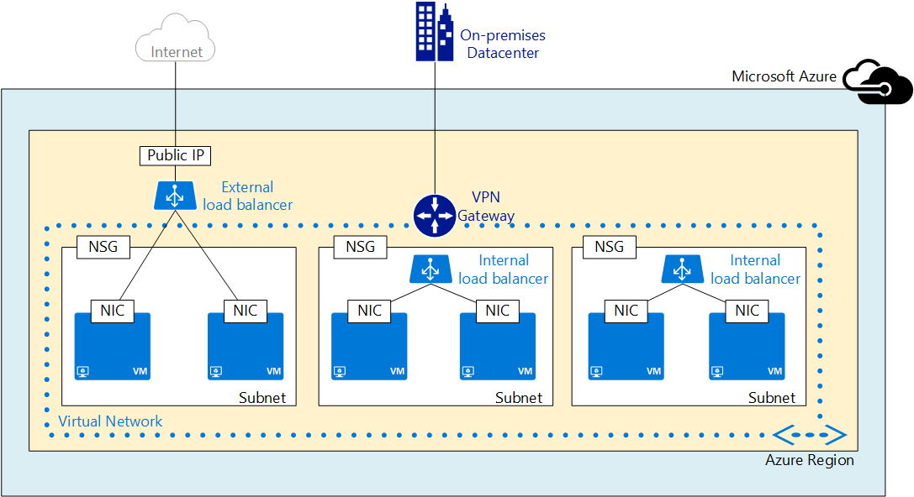
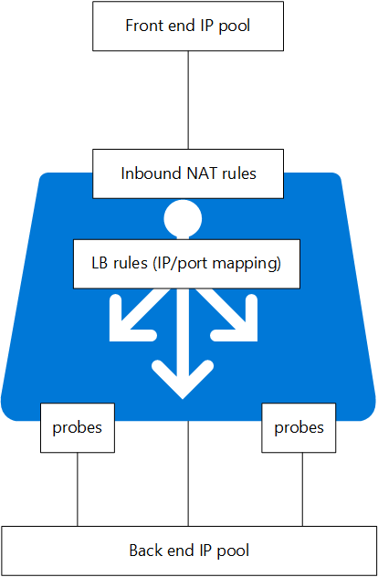

<properties
   pageTitle="网络资源提供程序"
   description="网络资源提供程序"
   services="azure-portal"
   documentationCenter="na"
   authors="telmosampaio"
   manager="adinah"
   editor="tysonn"/>
<tags
   ms.service="azure-portal"
   ms.date="04/22/2015"
   wacn.date="10/03/2015"/>

# 网络资源提供程序
在当今社会要想获得业务成功，需要满足的一个基本需求就是，能够以灵活、弹性、安全且可重复的方式构建和管理可识别大型网络的应用程序。使用 Azure 资源管理器 (ARM) 可以在资源组中部署单个资源集合，从而可以创建此类应用程序。此类资源将通过 ARM 下的各种资源提供程序进行管理。

使用 Azure 资源管理器 (ARM) 可以创建此类应用程序，并在资源组中创建单个资源集合形式的关联网络资源集合。应用程序和网络资源作为 ARM 资源组中的一个单元运行。

可以使用以下任何管理界面来管理网络资源：

- 基于 REST 的 API
- PowerShell
- .NET SDK
- Node.JS SDK
- Java SDK
- Azure CLI
- Azure 门户
- ARM 模板语言

随着网络资源提供程序的引入，你可以利用以下优势：

- **元数据** – 可以使用标记将信息添加到资源。这些标记可用于跟踪不同资源组和订阅中的资源利用率。
- **更好地控制网络** - 网络资源松散耦合，你可以更精细地控制它们。这意味着，你在管理网络资源方面拥有更大的弹性。
- **更快的配置** - 因为网络资源松散耦合，你可以并行创建和协调网络资源。这极大地减少了配置时间。
- **基于角色的访问控制** - RBAC 提供了具有特定安全作用域的默认角色，此外，还允许创建自定义角色进行安全管理。
- **简化管理和部署** - 由于你可以将整个应用程序堆栈创建为资源组中的单个资源集合，因此可以更轻松地部署和管理应用程序。此外，由于只需提供模板 JSON 负载就能部署，因此加快了部署速度。
- **快速自定义** - 你可以使用声明式模板为部署启用可重复的快速自定义。
- **可重复自定义** - 你可以使用声明式模板为部署启用可重复的快速自定义。

## 网络资源
现在，你可以单独管理网络资源，而不用通过单个计算资源（虚拟机）对其进行统一管理。这可确保在资源组中编写复杂的大规模基础结构时获得更高的弹性和灵活性。

下图演示了网络资源模型及其关联的高级视图。顶级资源带有蓝色边框。除了顶级资源外，你还可以看到带有灰色边框的子资源。你可以单独管理每个资源。

下面显示了涉及多层应用程序的示例部署的概念视图。所有网络资源带有蓝色边框。

## REST API
如前所述，你可以通过各种界面（包括 REST API、.NET SDK、Node.JS SDK、Java SDK、PowerShell、CLI、Azure 门户和模板）管理网络资源。

Rest API 符合 HTTP 1.1 协议规范。下面显示了该 API 的常规 URI 结构：

	https://management.chinacloudapi.cn/subscriptions/{subscription-id}/providers/{resource-provider-namespace}/locations/{region-location}/register?api-version={api-version}

大括号中的参数代表以下元素：

- **subscription-id** - 你的 Azure 订阅 ID。
- **resource-provider-namespace** - 正在使用的提供程序的命名空间。网络资源提供程序的值为 *Microsoft.Network*。
- **region-name** - Azure 区域名称

调用 REST API 时支持以下的 HTTP 方法：

- **PUT** - 用于创建给定类型的资源、修改资源属性或更改资源之间的关联。
- **GET** - 用于检索设置的资源的信息。
- **DELETE** - 用于删除现有资源。

请求和响应都符合 JSON 负载格式。有关详细信息，请参阅 [Azure 资源管理 API](https://msdn.microsoft.com/zh-cn/library/azure/dn948464.aspx)。

## ARM 模板语言
除了强制性管理资源（通过 API 或 SDK）以外，还可以使用 ARM 模板语言以声明性编程方式构建和管理网络资源。

下面提供了模板的示例表示形式 -

	{
	  "$schema": "http://schema.management.azure.com/schemas/2014-04-01-preview/deploymentTemplate.json",
	  "contentVersion": "<version-number-of-template>",
	  "parameters": { <parameter-definitions-of-template> },
	  "variables": { <variable-definitions-of-template> },
	  "resources": [ { <definition-of-resource-to-deploy> } ],
	  "outputs": { <output-of-template> }
	}

该模板主要是资源和通过参数注入的实例值的 JSON 说明。可以使用以下示例创建包含 2 个子网的虚拟网络。

	{
	    "$schema": "http://schema.management.azure.com/schemas/2014-04-01-preview/VNET.json",
	    "contentVersion": "1.0.0.0",
	    "parameters" : {
	      "location": {
	        "type": "String",
	        "allowedValues": ["China East", "China North"],
	        "metadata" : {
	          "Description" : "Deployment location"
	        }
	      },
	      "virtualNetworkName":{
	        "type" : "string",
	        "defaultValue":"myVNET",
	        "metadata" : {
	          "Description" : "VNET name"
	        }
	      },
	      "addressPrefix":{
	        "type" : "string",
	        "defaultValue" : "10.0.0.0/16",
	        "metadata" : {
	          "Description" : "Address prefix"
	        }

	      },
	      "subnet1Name": {
	        "type" : "string",
	        "defaultValue" : "Subnet-1",
	        "metadata" : {
	          "Description" : "Subnet 1 Name"
	        }
	      },
	      "subnet2Name": {
	        "type" : "string",
	        "defaultValue" : "Subnet-2",
	        "metadata" : {
	          "Description" : "Subnet 2 name"
	        }
	      },
	      "subnet1Prefix" : {
	        "type" : "string",
	        "defaultValue" : "10.0.0.0/24",
	        "metadata" : {
	          "Description" : "Subnet 1 Prefix"
	        }
	      },
	      "subnet2Prefix" : {
	        "type" : "string",
	        "defaultValue" : "10.0.1.0/24",
	        "metadata" : {
	          "Description" : "Subnet 2 Prefix"
	        }
	      }
	    },
	    "resources": [
	    {
	      "apiVersion": "2015-05-01-preview",
	      "type": "Microsoft.Network/virtualNetworks",
	      "name": "[parameters('virtualNetworkName')]",
	      "location": "[parameters('location')]",
	      "properties": {
	        "addressSpace": {
	          "addressPrefixes": [
	            "[parameters('addressPrefix')]"
	          ]
	        },
	        "subnets": [
	          {
	            "name": "[parameters('subnet1Name')]",
	            "properties" : {
	              "addressPrefix": "[parameters('subnet1Prefix')]"
	            }
	          },
	          {
	            "name": "[parameters('subnet2Name')]",
	            "properties" : {
	              "addressPrefix": "[parameters('subnet2Prefix')]"
	            }
	          }
	        ]
	      }
	    }
	    ]
	}

你可以选择在使用模板时手动提供参数值，或者使用参数文件。以下示例演示可与上述模板一起使用的参数值集：

	{
	  "location": {
	      "value": "China East"
	  },
	  "virtualNetworkName": {
	      "value": "VNET1"
	  },
	  "subnet1Name": {
	      "value": "Subnet1"
	  },
	  "subnet2Name": {
	      "value": "Subnet2"
	  },
	  "addressPrefix": {
	      "value": "192.168.0.0/16"
	  },
	  "subnet1Prefix": {
	      "value": "192.168.1.0/24"
	  },
	  "subnet2Prefix": {
	      "value": "192.168.2.0/24"
	  }
	}

使用模板的主要优势在于：

- 可以声明性方式在资源组中构建复杂的基础结构。创建资源的协调（包括依赖关系管理）由 ARM 处理。
- 可以在多个不同区域和一个区域中重复创建基础结构，只需更改参数即可。
- 声明性方式可以缩短构建模板和推出基础结构的周期时间。

有关示例模板，请参阅 [Azure 快速入门模板](https://github.com/Azure/azure-quickstart-templates)。

有关 ARM 模板语言的详细信息，请参阅 [Azure 资源管理器模板语言](https://msdn.microsoft.com/zh-cn/library/azure/dn835138.aspx)。

上面的示例模板使用虚拟网络和子网资源。下面列出了可以使用的其他一些网络资源：

## NIC
网络接口卡 (NIC) 表示可关联到虚拟机 (VM) 的网络接口。一个 VM 可以有一个或多个 NIC。

NIC 资源的关键属性包括：

- IP 设置

还可以将 NIC 关联到下列网络资源：

- 网络安全组 (NSG)
- 负载平衡器

## 虚拟网络和子网
虚拟网络 (VNET) 和子网可帮助定义 Azure 中运行的工作负载的安全边界。VNET 的特征包括一个地址空间，也称为 CIDR 块。

子网是 VNET 的子资源，可帮助定义使用 IP 地址前缀在 CIDR 块中定义地址空间的段。执行各种工作负载的 VM 实际上是在子网边界中运行的。

VNET 资源的关键属性包括：

- IP 地址空间（CIDR 块）
- VNET 名称
- 子网

还可以将 VNET 关联到下列网络资源：

- VPN 网关

子网的关键属性包括：

- IP 地址前缀
- 子网名称

还可以将子网关联到下列网络资源：

- NSG

## 负载平衡器
如果想要缩放应用程序，可以使用负载平衡器。典型的部署方案包括多个 VM 实例上运行的应用程序。VM 实例的前面是帮助将网络流量分配到各个实例的负载平衡器。

负载平衡器包含以下子资源：

- **前端 IP 配置** – 一个负载平衡器可以包含一个或多个前端 IP 地址，也称为虚拟 IP (VIP)。这些 IP 地址充当流量的入口。
- **后端地址池** – 这是与负载要分配到的 VM NIC 关联的 IP 地址。
- **负载平衡规则** – 规则属性将给定的前端 IP 和端口组合映射到一组后端 IP 地址和端口组合。只需定义一个负载平衡器资源，就能定义多个负载平衡规则，每个规则反映与 VM 关联的前端 IP 与端口以及后端 IP 与端口的组合。
- **探测** – 使用探测可以跟踪 VM 实例的运行状况。如果运行状况探测失败，VM 实例将自动从轮转列表中删除。
- **入站 NAT 规则** – NAT 规则定义流过前端 IP 并分配到后端 IP 的入站流量。

## 公共 IP
公共 IP 地址提供保留的或动态的公共 IP 地址资源。  
可将公共 IP 地址分配给负载平衡器、NAT，或将其与 VM 的 NIC 上的专用 IP 地址相关联。  

公共 IP 资源的关键属性包括：

- **IP 分配方法** – 保留或动态。

## 网络安全组 (NSG)
使用 NSG 资源可以通过实现允许和拒绝规则，为工作负载创建安全边界。可在 NIC 级别（VM 实例级别）或子网级别（VM 组）应用此类规则。

NSG 资源的关键属性包括：

- **安全规则** - 一个 NSG 可以有多个定义的安全规则。每个规则可以允许或拒绝不同类型的流量。

## 安全规则
安全规则是 NSG 的子资源。

安全规则的关键属性包括：

- **协议** – 此规则要应用到的网络协议。
- **源端口范围** - 源端口，或者从 0 到 65535 的范围。可以使用通配符来匹配所有端口。
- **目标端口范围** - 目标端口，或者从 0 到 65535 的范围。可以使用通配符来匹配所有端口。
- **源地址前缀** – 源 IP 地址范围。
- **目标地址前缀** – 目标 IP 地址范围。
- **访问** – *允许*或*拒绝*流量。
- **优先级** – 介于 100 和 4096 之间的值。对于安全规则集合中的每个规则，优先级编号必须唯一。优先级编号越低，规则的优先级越高。
- **方向** – 指定是要将规则应用到*入站*还是*出站*方向的流量。

## VPN 网关
使用 VPN 网关资源可以在本地数据中心和 Azure 之间创建安全连接。可通过三种不同的方式配置 VPN 网关资源：

- **点到站点** – 可以从任何计算机使用 VPN 客户端安全地访问 VNET 中托管的 Azure 资源。
- **多站点连接** – 可以从本地数据中心安全连接到 VNET 中运行的资源。
- **VNET 到 VNET** – 可以跨同一区域中的 Azure VNET 或者跨区域建立连接，以构建地域冗余的工作负载。

VPN 网关的关键属性包括：

- **网关类型** - 动态路由或静态路由的网关。
- **VPN 客户端地址池前缀** – 在点到站点配置中，要分配给连接的客户端的 IP 地址。

## 流量管理器配置文件
使用流量管理器及其子终结点资源可将流量分配到 Azure 内部和 Azure 外部的终结点。此类流量分配由策略控制。使用流量管理器还能监视终结点的运行状况，并根据终结点的运行状况重定向流量。

流量管理器配置文件的关键属性包括：

- **流量路由方法** - 可能的值包括“性能”、“加权”和“优先级”。
- **DNS 配置** - 配置文件的 FQDN。
- **协议** - 监视协议，可能的值为 *HTTP* 和 *HTTPS*。
- **端口** - 监视端口。
- **路径** - 监视路径。
- **终结点** - 终结点资源的容器。

## 终结点
终结点是流量管理器配置文件的子资源。它表示要根据流量管理器配置文件资源中配置的策略，将用户流量分配到的服务或 Web 终结点。

终结点的关键属性包括：

- **类型** - 终结点的类型，可能的值为“Azure 终结点”、“外部终结点”和“嵌套终结点”。
- **目标资源 ID** – 服务或 Web 终结点的公共 IP 地址。这可能是 Azure 或外部终结点。
- **权重** - 流量管理中使用的终结点权重。
- **优先级** - 用于定义故障转移操作的终结点优先级。

## 使用模板

你可以使用 PowerShell、AzureCLI 或通过在 GitHub 中执行单击部署，从模板向 Azure 部署服务。若要在 GitHub 中从模板部署服务，请执行以下步骤：

1. 从 GitHub 打开 template3 文件。例如，打开[包含两个子网的虚拟网络](https://github.com/Azure/azure-quickstart-templates/tree/master/101-virtual-network)。
2. 单击**部署到 Azure**，然后使用你的凭据登录到 Azure 门户。
3. 验证模板，然后单击**保存**。
4. 单击**编辑参数**并为 vnet 和子网选择一个位置，例如“美国西部”。
5. 根据需要更改 **ADDRESSPREFIX** 和 **SUBNETPREFIX** 参数，然后单击**确定**。
6. 单击**选择资源组**，然后单击要将 vnet 和子网添加到的资源组。或者，可以通过单击**或新建**创建新的资源组。
3. 单击**创建**。请注意磁贴显示了**正在设置模板部署**。完成部署后，你将看到一个类似于下面的屏幕。

## 另请参阅

[Azure 网络 API 参考](https://msdn.microsoft.com/zh-cn/library/azure/dn948464.aspx)

[用于联网的 Azure PowerShell 参考](https://msdn.microsoft.com/zh-cn/library/azure/mt163510.aspx)

[Azure 资源管理器模板语言](https://msdn.microsoft.com/zh-cn/library/azure/dn835138.aspx)

[Azure 网络 – 常用的模板](https://github.com/Azure/azure-quickstart-templates)

[Azure 资源管理器概述](/documentation/articles/resource-group-overview)

[Azure 资源管理器中基于角色的访问控制](https://msdn.microsoft.com/zh-cn/library/azure/dn906885.aspx)

[在 Azure 资源管理器中使用标记](https://msdn.microsoft.com/zh-cn/library/azure/dn848368.aspx)

[模板部署](https://msdn.microsoft.com/zh-cn/library/azure/dn790549.aspx)

<!---HONumber=71-->