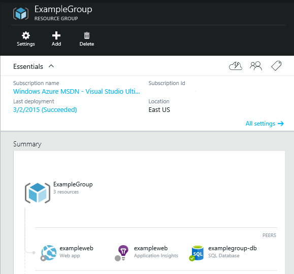
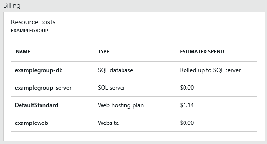

<properties
   pageTitle="Azure 资源管理器概述"
   description="介绍如何使用 Azure 资源管理器在 Azure 上部署和管理资源以及对其进行访问控制。"
   services="azure-resource-manager"
   documentationCenter="na"
   authors="tfitzmac"
   manager="wpickett"
   editor=""/>

<tags
   ms.service="azure-resource-manager"
   ms.date="08/20/2015"
   wacn.date="10/3/2015"/>

# Azure 资源管理器概述

应用程序通常由许多组件构成 – 其中包括 Web 应用程序、数据库、数据库服务器、存储和第三方服务。这些组件不会以独立的实体出现，而是以单个实体的相关部件和依赖部件出现。如果你希望以组的方式部署、管理和监视这些这些组件，那么，你可以使用 Azure 资源管理器以组的方式处理应用程序中的资源。你可以通过一个协调的操作为应用程序部署、更新或删除所有资源。你可以使用一个模板来完成部署，该模板适用于不同的环境，例如测试、过渡和生产。你可以通过查看整个组的累积费用，明确了解组织的帐单开支。

Azure 资源管理器原生地在管理平台中集成了访问控制，因此，你可以指定组织中某个用户可对资源组执行哪些操作。

资源管理器提供了一种新方法来部署和管理您的解决方案。若要了解有关此新的部署模型中的更改信息，请参阅[了解资源管理器部署和典型部署](/documentation/articles/resource-manager-deployment-model)。
> [AZURE.NOTE]本主题将介绍资源、组和模板，并使用预览版门户来演示相关的概念。不过，你也可以使用[适用于 Mac、Linux 和 Windows 的 Azure CLI](/documentation/articles/xplat-cli-azure-resource-manager) 以及 [PowerShell](/documentation/articles/powershell-azure-resource-manager) 来创建、管理和删除 Azure 资源。

## 资源组

资源组是一个容器，包含应用程序的相关资源。资源组可以包含应用程序的所有资源，也可以只包含逻辑分组在一起的资源。你可以根据对组织有利的原则，决定如何将资源分配到资源组。

定义资源组时，需要考虑以下几个重要因素：

1. 组中的所有资源必须共享相同的生命周期。一起部署、更新和删除这些资源。如果某个资源（例如数据库服务器）需要采用不同的部署周期，则它应在另一个资源组中。
2. 每个资源只能在一个资源组中。
3. 你随时可以在资源组添加或删除资源。
4. 资源组可以包含位于不同区域的资源。
5. 资源组可用于划分对管理操作的访问控制。

在 Azure 门户中，所有新资源均创建在资源组中。即使你只创建了一个资源（例如网站），也必须决定是要将该资源添加到现有组，还是为该资源创建新组。

下图显示了一个包含网站、数据库和 Application Insights 的资源组。

还可以将一个资源组链接到另一个资源组中的资源。当不同资源组中的资源之间存在部署依赖关系时，即认为已链接了某个资源。例如，如果一个资源组中的 Web 应用程序连接到了另一个资源组中的数据库，则表示这些资源相互链接。您可以显式定义其他资源组中的资源之间的链接。

有关链接资源的详细信息，请参阅 [Azure 资源管理器中的链接资源](/documentation/articles/resource-group-link-resources)

如果您需要将资源移到新的资源组，请参阅[将资源移到新的资源组或订阅](/documentation/articles/resource-group-move-resources)。

在门户中，你可以轻松查看费用、监视事件和管理警报。下图显示了某个组的合并帐户。

## 模板部署

使用 Azure 资源管理器可以创建一个简单的模板（采用 JSON 格式），用于定义应用程序的部署和配置。此模板称为 Azure 模板，让你以声明性方式定义部署。使用模板可以在整个应用程序生命周期内反复部署该应用程序，并确保以一致的状态部署资源。

在模板中，可以定义应用程序的基础结构、如何配置该基础结构，以及如何将应用程序代码发布到该基础结构。你无需担心部署的顺序，因为 Azure 资源管理器会分析依赖关系，以确保按正确的顺序创建资源。

还可以使用模板对基础结构进行更新。例如，可以将新的资源添加到应用程序，并为已部署的资源添加配置规则。如果模板指定要创建新的资源，但该资源已存在，则 Azure 资源管理器将执行更新而不是创建新资产。Azure 资源管理器会将现有资产更新到相同状态，就如同该资产是新建的一样。

你可以在模板中指定参数，以进行自定义并提高部署灵活性。例如，可以传递相应的参数值，以便根据测试环境定制部署。通过指定参数，可以使用同一个模板部署到应用程序的所有环境。

你可以通过模板对部署和配置执行所有必要的步骤，并排除所有剩余的手动步骤。如果你需要其他操作（例如，安装未包含在安装程序中的特定软件）时，Azure 资源管理器可提供所需的扩展。如果你已在使用配置管理服务（如 DSC、Chef 或 Puppet），则可以使用扩展来继续处理该服务。

从应用商店创建解决方案时，该解决方案将自动包含部署模板。你无需从头开始创建模板，因为你可以从解决方案的模板着手，并根据你的特定需求自定义该模板。

最后，该模板将成为应用程序源代码的一部分。你可以将它签入源代码存储库，并随着应用程序的发展更新该模板。你可以通过 Visual Studio 编辑模板。

有关定义模板的详细信息，请参阅[创作 Azure 资源管理器模板](/documentation/articles/resource-group-authoring-templates)。

有关模板的架构，请参阅 [Azure 资源管理器架构](https://github.com/Azure/azure-resource-manager-schemas)。
<!--
有关使用模板进行部署的信息，请参阅[使用 Azure 资源管理器模板部署应用程序](/documentation/articles/resource-group-template-deploy)和[通过可预测的方式在 Azure 中部署复杂应用程序](/documentation/articles/app-service-deploy-complex-application-predictably)。-->

有关如何构建您的模板的指南，请参阅[设计 Azure 资源管理器模板的最佳实践](/documentation/articles/best-practices-resource-manager-design-templates)。

## 标记

Azure 资源管理器提供了标记功能，让你根据管理或计费要求为资源分类。如果你有一系列复杂的资源组和资源，并想要以最有利的方式可视化这些资产，则你可能需要使用标记。例如，你可以标记组织中充当类似角色或者属于同一部门的资源。

在预览版门户中，通过单击标记图标即可开始使用标记。

资源不需要驻留在同一个资源组中就能共享一个标记。你可以创建自己的标记分类，以确保组织中的所有用户使用公用的标记，避免用户无意中应用稍有不同的标记（如“dept”而不是“department”）。

有关标记的详细信息，请参阅[使用标记来组织 Azure 资源](/documentation/articles/resource-group-using-tags)。

## Access Control

Azure 资源管理器可让你控制谁有权访问组织的特定操作。Azure 资源管理器原生地在管理平台中集成了 OAuth 和基于角色的访问控制 (RBAC)，并向资源组中的所有服务应用该访问控制。你可以将用户添加到预定义的平台和特定于资源的角色，并将这些角色应用到订阅、资源组或资源以限制访问。例如，你可以利用名为 SQL DB Contributor 的预定义角色，以允许用户管理数据库，但不允许管理数据库服务器或安全策略。为此，可将组织中需要此类访问权限的用户添加到 SQL DB Contributor 角色，并将该角色应用到订阅、资源组或资源。

在预览版门户中，可以通过单击访问按钮来定义访问控制。

Azure 资源管理器会自动记录用户操作以供审核。

你可以显式锁定关键资源，以防止用户删除或修改这些资源。有关详细信息，请参阅[使用 Azure 资源管理器锁定资源](/documentation/articles/resource-group-lock-resources)。

有关基于角色的访问控制的详细信息，请参阅 [Windows Azure 预览门户中基于角色的访问控制](/documentation/articles/role-based-access-control-configure)。

有关设置访问策略的示例，请参阅<!--[-->管理和审核对资源的访问权限<!--](/documentation/articles/resource-group-rbac)-->。

有关最佳实践，请参阅 [Azure 资源管理器的安全注意事项](/documentation/articles/best-practices-resource-manager-security)

## 一致的管理层

Azure 资源管理器通过 Azure PowerShell、适用于 Mac、Linux 和 Windows 的 Azure CLI、Azure 门户或 REST API 提供完全兼容的操作。你可以使用最适合自己的界面，并快速切换不同的界面，而不会造成任何混淆。门户甚至还会针对门户外部执行的操作显示通知。

有关 PowerShell 的信息，请参阅[将 Azure PowerShell 用于资源管理器](/documentation/articles/powershell-azure-resource-manager)和 [Azure 资源管理器 Cmdlet](https://msdn.microsoft.com/zh-cn/library/azure/dn757692.aspx)。

有关 Azure CLI 的信息，请参阅[将适用于 Mac、Linux 和 Windows 的 Azure CLI 与 Azure 资源管理配合使用](/documentation/articles/xplat-cli-azure-resource-manager)。

有关 REST API 的信息，请参阅 [Azure 资源管理器 REST API 参考](https://msdn.microsoft.com/zh-cn/library/azure/dn790568.aspx)。

<!--有关使用预览门户的信息，请参阅[使用 Azure 预览门户管理 Azure 资源](/documentation/articles/resource-group-portal.md)。-->

## 后续步骤

- 若要了解如何创建模板，请参阅[创作模板](/documentation/articles/resource-group-authoring-templates)
<!-- - 若要部署您创建的模板，请参阅[部署模板](/documentation/articles/resource-group-template-deploy)-->
- 若要了解可以在模板中使用的函数，请参阅[模板函数](/documentation/articles/resource-group-template-functions)
- 有关如何设计您的模板的指南，请参阅[设计 Azure 资源管理器模板的最佳实践](/documentation/articles/best-practices-resource-manager-design-templates)

<!---HONumber=71-->