<properties 
	pageTitle="使用 Azure 门户管理 Azure 资源 | Azure" 
	description="使用 Azure 门户和 Azure 资源管理来部署和管理资源。演示如何标记资源并查看审核日志。" 
	services="azure-resource-manager,azure-portal" 
	documentationCenter="" 
	authors="tfitzmac" 
	manager="timlt" 
	editor="tysonn"/>

<tags
	ms.service="azure-portal"
	ms.date="04/08/2016" 
	wacn.date="05/09/2016"/>

# 使用 Azure 门户部署和管理 Azure 资源

## 介绍

本主题演示了如何将 [Azure 门户预览](https://portal.azure.cn)与 [Azure 资源管理器](/documentation/articles/resource-group-overview)配合使用，以部署和管理 Azure 资源。

目前，并非每种服务都支持门户或资源管理器。对于这些服务，你需要使用[经典门户](https://manage.windowsazure.cn)。

也可以通过 Azure PowerShell 和 Azure CLI 来管理资源。有关使用这些接口的详细信息，请参阅[将 Azure PowerShell 与 Azure 资源管理器配合使用](/documentation/articles/powershell-azure-resource-manager)。

## 创建资源组

要创建空资源组，请依次选择**新建**、**管理**和**资源组**。

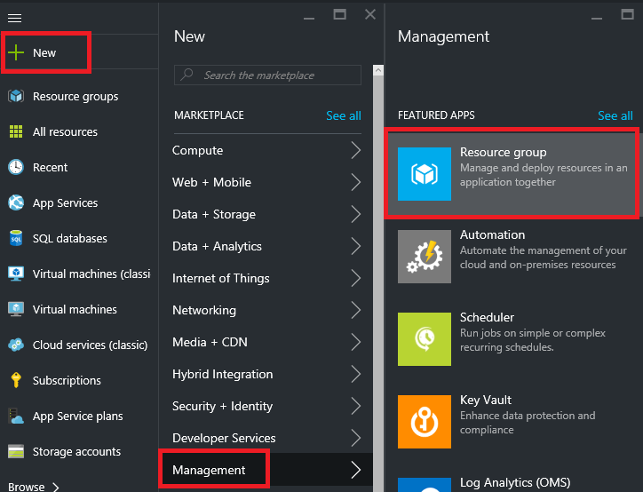

为其命名并指定位置，如有必要，选择一个订阅。

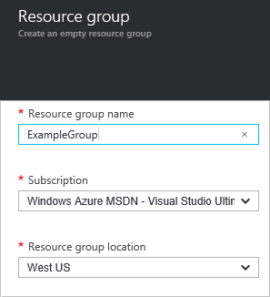

## 部署资源

创建资源组后，可以将资源部署到资源组。要开始部署，只需选择**新建**和想要部署的资源的类型。

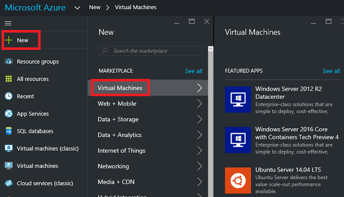

如果看不到想要部署的资源的类型，可以在应用商店中搜索。

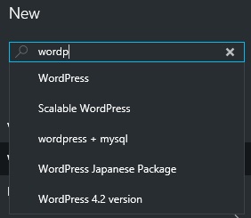

根据所选的资源类型，需要在部署之前设置相关属性的集合。此处不显示这些选项，因为它们因资源类型而异。
对于所有类型，必须选择目标资源组。下图演示了如何创建新的 Web 应用并将其部署到刚创建的资源组。

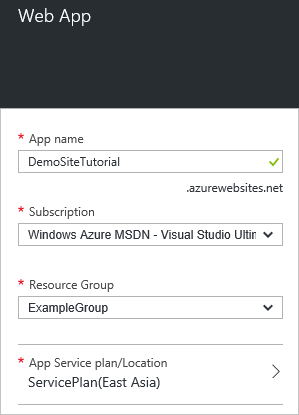

也可以在部署资源时创建新的资源组。不是在订阅中选择一个现有资源组，而是选择**新建**并为该资源组命名。

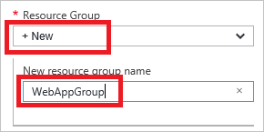

部署将开始。这可能需要几分钟的时间。完成部署后，你会看到一条通知。

部署资源后，可能要决定需要将更多资源添加到组。可以使用资源组边栏选项卡上的**添加**命令将资源添加到资源组。

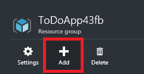

## 导出模板

设置资源组后，你可能想要查看资源组的 Resource Manager 模板。导出模板有两个好处：

1. 由于所有基础结构都已定义于模板中，因此可以轻松地自动进行解决方案的将来部署。

2. 可以查看代表解决方案的 JavaScript 对象表示法 (JSON)，以此熟悉模板语法。

通过门户，可以生成表示资源组当前状态的模板，或检索特定部署所用的模板。在本主题中说明了两个选项。

已更改资源组，并且需要检索其当前状态的 JSON 表示法时，导出资源组的模板很有用。但是，生成的模板只包含最少的参数数目，但不包含任何变量。模板中大部分的值为硬编码。在部署所生成的模板之前，你可能想要将更多的值转换成参数，以便针对不同的环境自定义部署。

当你需要查看用于部署资源的实际模板时，针对特定部署导出模板很有用。模板包含针对原始部署定义的所有参数和变量。但是，如果组织中有人已更改非此模板中定义的资源组，此模板并不代表资源组的当前状态。

> [AZURE.NOTE] 导出模板功能处于预览状态，并非所有的资源类型目前都支持导出模板。尝试导出模板时，你可能会看到一个错误，指出未导出某些资源。如果需要，你可以在下载模板之后，在模板中手动定义这些资源。

### 导出资源组的模板

从资源组边栏选项卡上，可以导出表示资源组当前状态的模板。

若要查看资源组模板，请选择**导出模板**。

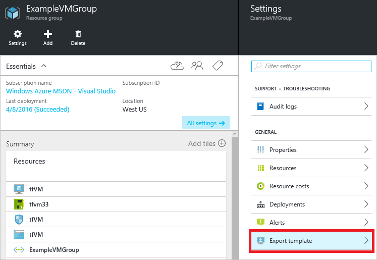

资源管理器将为你生成 4 个文件︰

1. 定义解决方案基础结构的模板

2. 可用于在部署过程中传入值的参数文件

3. 可以为部署模板而执行的 Azure PowerShell 脚本文件

4. 可以为部署模板而执行的 Azure CLI 脚本文件

首先，查看表示当前资源组的模板。

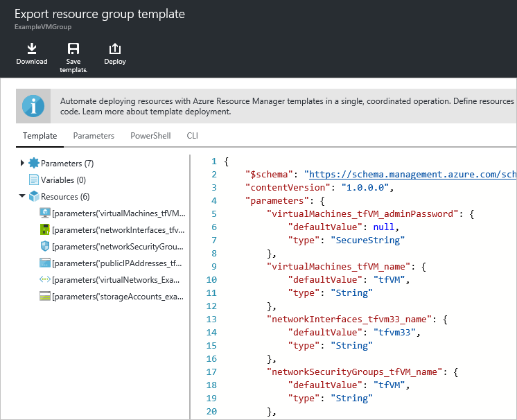

在**资源**部分中，可以看到要部署的资源的定义。

在参数文件中，可以保存要在部署过程中传入的参数值。

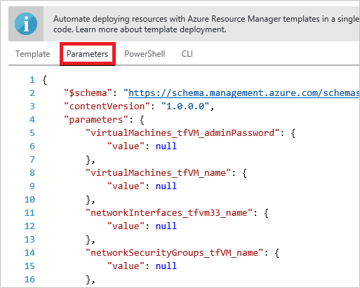

可以使用一个脚本文件来通过 Azure PowerShell 部署模板。

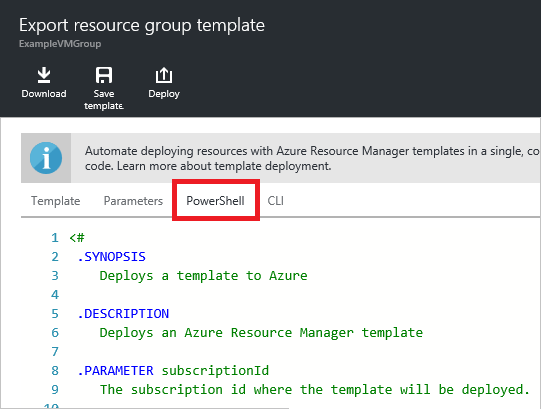

并且，可以使用一个脚本文件来通过 Azure CLI 部署模板。

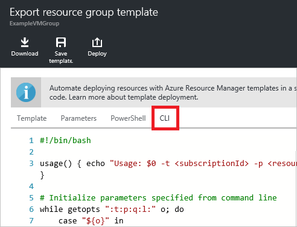

该门户提供了使用此模板的三个选项。若要立即重新部署该模板，请选择**部署**。若要本地下载所有文件，请选择**下载**。若要将文件保存到 Azure 帐户以供日后通过门户使用，请选择**保存模板**。

### 从部署下载模板

从资源组边栏选项卡中，可以看到此资源组上次部署的日期和状态。选择对应的链接，会显示组的部署历史记录。

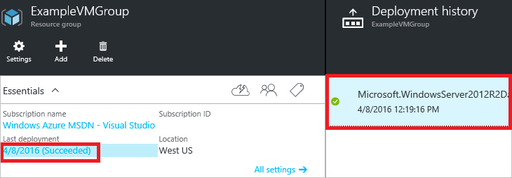

从历史记录中选择任何部署，就会显示有关该部署的详细信息。每次部署资源时，资源管理器都会保留使用的模板。可以通过选择**视图模板**来检索部署所用的实际模板。

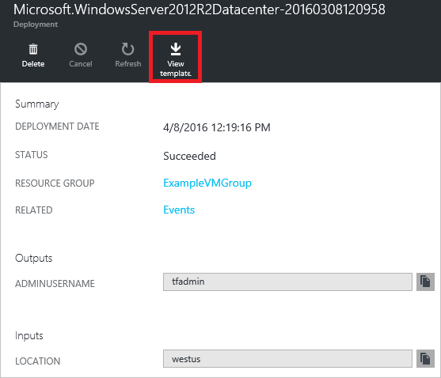

你会看到用于此部署的模板。它包含定义时的所有参数和变量。

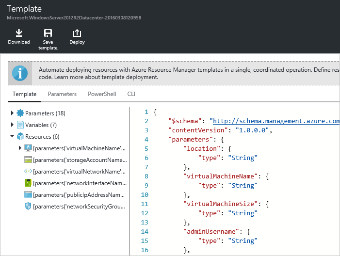

如前文所述，这可能未完整表示资源组。如果添加或删除此部署之外的资源，这些操作不会反映在模板中。如上一节中所示，可以查看模板、参数文件和脚本文件。如上一节中所示，还可以重新部署、下载或保存模板。

## 管理资源组

可以通过单击**资源组**来浏览所有资源组。

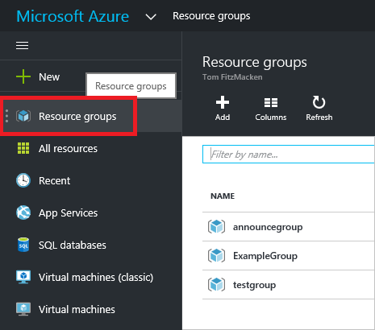

当选择特定资源组时，你会看到提供有关该资源组信息的资源组边栏选项卡，其中包括组中所有资源的列表。

可以通过选择摘要下方的**添加部分**将更多图表添加到资源组边栏选项卡。

系统会显示一个磁贴库，以便选择想要在边栏选项卡中包含的信息。所显示磁贴的类型按资源类型筛选。选择不同的资源会更改可用的磁贴。

将所需的磁贴拖到可用空间。

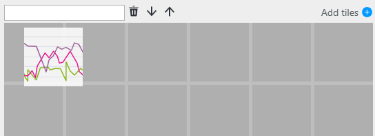

在门户顶部选择**完成**后，你的新视图就是边栏选项卡的一部分了。

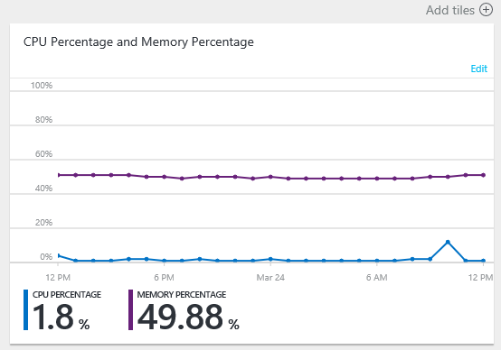

为了快速访问资源组，可以将边栏选项卡固定到仪表板上。

或者，可以通过选择该部分上方的省略号 (...) 将边栏选项卡的某一部分固定到仪表板上。还可以自定义边栏选项卡中该部分的大小，或完全删除它。下图显示如何固定、自定义或删除 CPU 和内存部分。

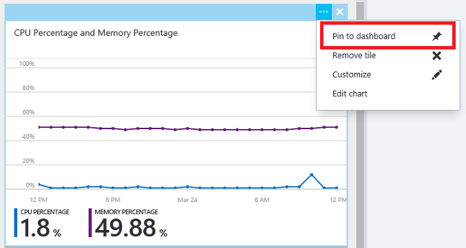

将该部分固定到仪表板后，将会在仪表板上看到摘要。

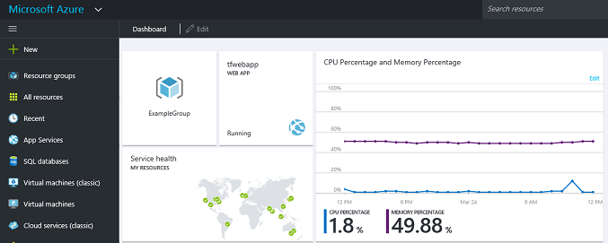

并且，选择它后可立即看到关于该数据的详细信息。

由于资源组可让你管理包含的所有资源的生命周期，因此，删除一个资源组会同时删除该组中包含的所有资源。你也可以删除资源组中的单个资源。在删除资源组时请多加小心，因为该资源组可能是与其链接的其他资源组中的资源。链接的资源不会被删除，但可能无法按预期工作。

## 标记资源

可以将标记应用到资源组和资源，以按照逻辑组织资产。有关通过门户使用标记的信息，请参阅[使用标记来组织 Azure 资源](/documentation/articles/resource-group-using-tags)。

## 部署已保存的模板

如果已在你的帐户中保存了一个模板，可以稍后通过选择**浏览**和**模板**来查看它。

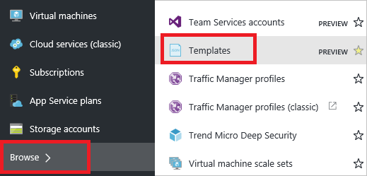

你会看到自己的模板集合。

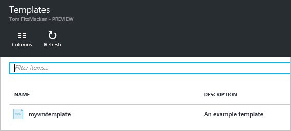

## 部署自定义模板

如果想要执行部署，但不使用应用商店中的任何模板，可以创建自定义模板来针对你的解决方案定义基础结构。有关模板的详细信息，请参阅[创作 Azure 资源管理器模板](/documentation/articles/resource-group-authoring-templates)。

若要通过门户部署自定义模板，请选择**新建**，并开始搜索**模板部署**，直至可以从选项中选择它。

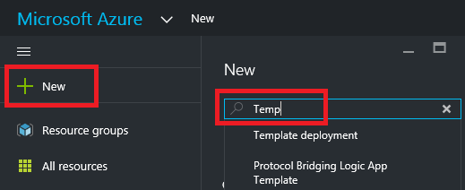

从可用资源中选择**模板部署**。

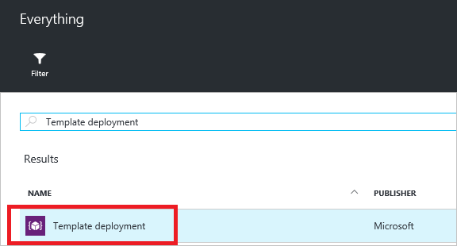

启动模板部署后，可以创建自定义模板并设置用于部署的值。

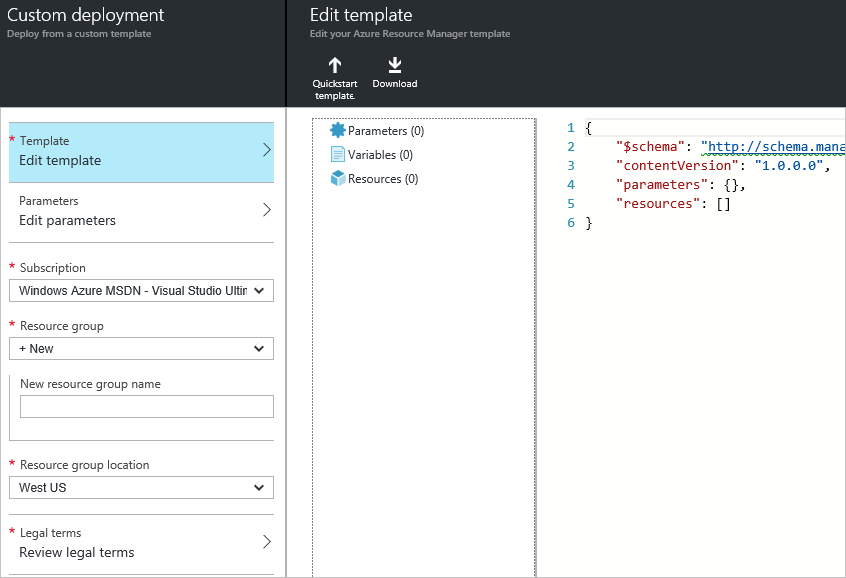

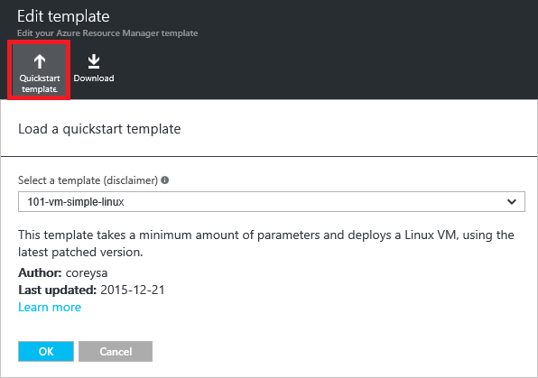

选择一个模板后，它会加载在编辑器中。

## 查看订阅和成本

可以查看有关订阅的信息以及所有资源的汇总成本。选择**订阅**以及要查看的订阅。可能只能选择一个订阅。

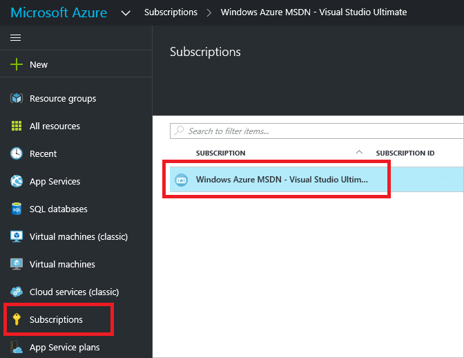

在订阅边栏选项卡中，可以看到消耗率。

以及按资源类型划分的成本明细。

## Azure 仪表板的访问控制

为了将仪表板无缝集成到生态系统中，所有已发布的仪表板均应以 Azure 资源的形式实现。从访问控制角度来看，仪表板与虚拟机或存储帐户没有什么不同。

下面是一个示例。我们假设你有 Azure 订阅，并且你团队中的各个成员都分配了订阅的**所有者**、**参与者**或**读者**角色。作为所有者或参与者的用户将能够列出、查看、创建、修改或删除订阅中的仪表板。作为读者的用户将能够列出并查看仪表板，但不能修改或删除它们。具有读者访问权限的用户将能够对已发布的仪表板进行本地编辑（例如排查问题时），但不能将这些更改发布回服务器。他们可以为自己制作仪表板的私有副本。

请注意，仪表板中的各个磁贴将依据显示其数据的资源强制执行自己的访问控制要求。这就意味着，你可以设计一个仪表板，该仪表板可供更广泛地共享，同时保护各个磁贴上的数据。

## 后续步骤

- 若要查看审核日志，请参阅[使用资源管理器执行审核操作](/documentation/articles/resource-group-audit)。

<!---HONumber=Mooncake_0503_2016-->