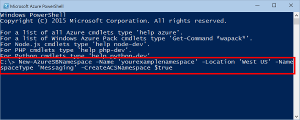

<properties
	pageTitle="如何使用服务总线主题 (Ruby) | Azure"
	description="了解如何在 Azure 中使用 Service Bus 主题和订阅。相关代码示例是针对 Ruby 应用程序编写的。"
	services="service-bus"
	documentationCenter="ruby"
	authors="sethmanheim"
	manager="timlt"
	editor=""/>

<tags
	ms.service="service-bus"
	ms.date="03/09/2016"
	wacn.date="05/23/2016"/>


# 如何使用 Service Bus 主题/订阅

[AZURE.INCLUDE [service-bus-selector-topics](../includes/service-bus-selector-topics.md)]

本指南介绍如何从 Ruby 应用程序使用服务总线主题和订阅。涉及的任务包括**创建主题和订阅、创建订阅筛选器、将消息发送到主题**、**从订阅接收消息**以**及删除主题和订阅**。有关主题和订阅的详细信息，请参阅[后续步骤](#next-steps)部分。

## 服务总线主题和订阅

服务总线主题和订阅支持**发布/订阅**消息通信模型。在使用主题和订阅时，分布式应用程序的组件不会直接相互通信，而是通过充当中介的主题交换消息。


与每条消息由单个使用方处理的服务总线队列相比，主题和订阅通过发布/订阅模式提供**一对多**通信方式。可向一个主题注册多个订阅。当消息发送到主题时，每个订阅会分别对该消息进行处理。

主题订阅类似于接收发送至该主题的消息副本的虚拟队列。您可以选择基于每个订阅注册主题的筛选规则，这样就可以筛选/限制哪些主题订阅接收发送至某个主题的哪些消息。

利用 Service Bus 主题和订阅，您可以进行扩展以处理跨大量用户和应用程序的许多消息。

## 创建服务命名空间

若要开始在 Azure 中使用服务总线队列，必须先创建一个服务命名空间。命名空间提供了用于对应用程序中的 Service Bus 资源进行寻址的范围容器。必须通过命令行界面创建命名空间，因为 [Azure 经典管理门户][] 不会使用 ACS 连接创建命名空间。

创建命名空间：

1. 打开 Azure PowerShell 控制台。

2. 键入以下命令以创建命名空间。提供你自己的命名空间值，并指定与应用程序相同的区域。

      New-AzureSBNamespace -Name 'yourexamplenamespace' -Location 'China East' -NamespaceType 'Messaging' -CreateACSNamespace $true

      

## 获取命名空间的默认管理凭据

若要在新命名空间上执行管理操作（如创建队列），则必须获取该命名空间的管理凭据。

你运行的用于创建服务总线命名空间的 PowerShell cmdlet 将显示可用于管理命名空间的密钥。复制 **DefaultKey** 值。你将本教程稍后的代码中使用此值。

       

> [AZURE.NOTE]
> 登录到 [Azure 经典管理门户][] 并导航到命名空间的连接信息后，也可以看到此密钥。

## 创建 Ruby 应用程序

有关说明，请参阅[在 Azure 上创建 Ruby 应用程序](/documentation/articles/virtual-machines-linux-classic-ruby-rails-web-app)。

## 配置应用程序以使用 Service Bus

要使用服务总线，请下载并使用 Ruby Azure 包，其中包括一组便于与存储 REST 服务通信的库。

### 使用 RubyGems 获取该程序包

1. 使用命令行接口，例如 **PowerShell** (Windows)、**Terminal** (Mac) 或 **Bash** (Unix)。

2. 在命令窗口中键入“gem install azure”以安装 gem 和依赖项。

### 导入包

使用常用的文本编辑器将以下内容添加到你要在其中使用存储的 Ruby 文件的顶部：

```
require "azure"
```

## 设置服务总线连接

Azure 模块将读取环境变量 **AZURE\_SERVICEBUS\_NAMESPACE** 和 **AZURE\_SERVICEBUS\_ACCESS\_KEY** 以获取连接到命名空间所需的信息。如果未设置这些环境变量，则在使用 **Azure::ServiceBusService** 之前必须通过以下代码指定命名空间信息：

```
Azure.config.sb_namespace = "<your azure service bus namespace>"
Azure.config.sb_access_key = "<your azure service bus access key>"
```

将命名空间值设置为你创建的值，而不是整个 URL 的值。例如，使用 **"yourexamplenamespace"**，而不是 "yourexamplenamespace.servicebus.chinacloudapi.cn"。

## 创建主题

可以通过 **Azure::ServiceBusService** 对象处理主题。以下代码将创建 **Azure::ServiceBusService** 对象。若要创建主题，请使用 **create\_topic()** 方法。以下示例将创建一个主题或输出错误（如果有）。

```
azure_service_bus_service = Azure::ServiceBusService.new
begin
  topic = azure_service_bus_service.create_queue("test-topic")
rescue
  puts $!
end
```

还可以通过其他选项传递 **Azure::ServiceBus::Topic** 对象，这些选项允许你重写默认主题设置，如消息保存时间或最大队列大小。下面的示例演示如何将最大队列大小设置为 5 GB，将保存时间设置为 1 分钟：

```
topic = Azure::ServiceBus::Topic.new("test-topic")
topic.max_size_in_megabytes = 5120
topic.default_message_time_to_live = "PT1M"

topic = azure_service_bus_service.create_topic(topic)
```

## 创建订阅

主题订阅也是使用 **Azure::ServiceBusService** 对象创建的。订阅已命名，并且具有一个限制传递到订阅的虚拟队列的消息集的可选筛选器。

订阅是永久性的，并且除非删除它或删除与之相关的主题，否则订阅将一直存在。如果你的应用程序包含创建订阅的逻辑，则它应首先使用 getSubscription 方法检查该订阅是否已经存在。

### 创建具有默认 (MatchAll) 筛选器的订阅

**MatchAll** 筛选器是默认筛选器，在创建新订阅时未指定筛选器的情况下使用。使用 **MatchAll** 筛选器时，发布到主题的所有消息都将置于订阅的虚拟队列中。以下示例创建了名为“all-messages”的订阅并使用了默认的 **MatchAll** 筛选器。

```
subscription = azure_service_bus_service.create_subscription("test-topic", "all-messages")
```


### <a id="how-to-create-subscriptions"></a>创建具有筛选器的订阅

还可以定义筛选器，以指定发送到主题的哪些消息应该在特定订阅中显示。

订阅支持的最灵活的筛选器类型是 **Azure::ServiceBus::SqlFilter**，它实现了部分 SQL92 功能。SQL 筛选器将对发布到主题的消息的属性进行操作。有关可用于 SQL 筛选器的表达式的更多详细信息，请参阅 [SqlFilter.SqlExpression](http://msdn.microsoft.com/zh-cn/library/windowsazure/microsoft.servicebus.messaging.sqlfilter.sqlexpression.aspx) 语法。

可以使用 **Azure::ServiceBusService** 对象的 **create\_rule()** 方法向订阅中添加筛选器。此方法允许你向现有订阅中添加新筛选器。

由于默认筛选器会自动应用到所有新订阅，因此，你必须首先删除默认筛选器，否则 **MatchAll** 会替代你可能指定的任何其他筛选器。可以对 **Azure::ServiceBusService** 对象使用 **delete\_rule()** 方法来删除默认规则。

以下示例将创建一个名为“high-messages”的订阅，该订阅包含一个 **Azure::ServiceBus::SqlFilter**，它仅选择自定义 **message\_number** 属性大于 3 的消息：

```
subscription = azure_service_bus_service.create_subscription("test-topic", "high-messages")
azure_service_bus_service.delete_rule("test-topic", "high-messages", "$Default")

rule = Azure::ServiceBus::Rule.new("high-messages-rule")
rule.topic = "test-topic"
rule.subscription = "high-messages"
rule.filter = Azure::ServiceBus::SqlFilter.new({
  :sql_expression => "message_number > 3" })
rule = azure_service_bus_service.create_rule(rule)
```

类似地，以下示例将创建一个名为“low-messages”的订阅，其中包含的 **Azure::ServiceBus::SqlFilter** 仅选择 **message\_number** 属性小于或等于 3 的消息：

```
subscription = azure_service_bus_service.create_subscription("test-topic", "low-messages")
azure_service_bus_service.delete_rule("test-topic", "low-messages", "$Default")

rule = Azure::ServiceBus::Rule.new("low-messages-rule")
rule.topic = "test-topic"
rule.subscription = "low-messages"
rule.filter = Azure::ServiceBus::SqlFilter.new({
  :sql_expression => "message_number <= 3" })
rule = azure_service_bus_service.create_rule(rule)
```

现在，将消息发送到“test-topic”时，它总是会传送给订阅了“all-messages”主题订阅的接收者，并选择性地传送给订阅了“high-messages”和“low-messages”主题订阅的接收者（具体取决于消息内容）。

## 将消息发送到主题

若要将消息发送到服务总线主题，你的应用程序必须对 **Azure::ServiceBusService** 对象使用 **send\_topic\_message()** 方法。发送到服务总线主题的消息是 **Azure::ServiceBus::BrokeredMessage** 对象的实例。**Azure::ServiceBus::BrokeredMessage** 对象具有一组标准属性（如 **label** 和 **time\_to\_live**）、一个用于保存自定义应用程序特定属性的字典以及一段字符串数据正文。应用程序可以通过将字符串值传递给 **send\_topic\_message()** 方法来设置消息正文，并且任何必需的标准属性将用默认值来填充。

下面的示例演示如何向“test-topic”发送五条测试消息。请注意，每条消息的 **message\_number** 自定义属性值因循环迭代而异（这将确定哪些订阅接收它）：

```
5.times do |i|
  message = Azure::ServiceBus::BrokeredMessage.new("test message " + i,
    { :message_number => i })
  azure_service_bus_service.send_topic_message("test-topic", message)
end
```

Service Bus 主题支持最大为 256 MB 的消息（标头最大为 64 MB，其中包括标准和自定义应用程序属性）。一个主题中包含的消息数量不受限制，但消息的总大小受限制。此主题大小是在创建时定义的，上限为 5 GB。

## 从订阅接收消息

对 **Azure::ServiceBusService** 对象使用 **receive\_subscription\_message()** 方法可从订阅接收消息。默认情况下，消息在被读取（查看）的同时会被锁定，从而无法从订阅中删除。但是，你可以通过将 **peek\_lock** 选项设置为 **false**，在读取消息时将其从订阅中删除。

默认行为使读取和删除变成一个两阶段操作，从而也有可能支持不允许遗漏消息的应用程序。当 Service Bus 收到请求时，它会查找下一条要使用的消息，锁定该消息以防其他使用者接收，然后将该消息返回到应用程序。应用程序处理完该消息（或将其可靠地存储起来留待将来处理）后，会通过调用 **delete\_subscription\_message()** 方法并提供要删除的消息作为参数来完成接收过程的第二阶段。**delete\_subscription\_message()** 方法将此消息标记为“已使用”并将其从订阅中删除。

如果 **:peek\_lock** 参数设置为 **false**，读取并删除消息将是最简单的模式，并且最适合在发生故障时应用程序允许不处理消息的情况。为了理解这一点，可以考虑这样一种情形：使用方发出接收请求，但在处理该请求前发生了崩溃。由于 Service Bus 会将消息标记为“将使用”，因此当应用程序重启并重新开始使用消息时，它会丢失在发生崩溃前使用的消息。

以下示例演示如何使用 **receive\_subscription\_message()** 接收和处理消息。该示例先通过将 **:peek\_lock** 设置为 **false** 从“low-messages”订阅接收并删除一条消息，然后再从“high-messages”接收另一条消息，最后使用 **delete\_subscription\_message()** 删除该消息：

```
message = azure_service_bus_service.receive_subscription_message(
  "test-topic", "low-messages", { :peek_lock => false })
message = azure_service_bus_service.receive_subscription_message(
  "test-topic", "high-messages")
azure_service_bus_service.delete_subscription_message(message)
```

## 处理应用程序崩溃和不可读消息

Service Bus 提供了相关功能来帮助你轻松地从应用程序错误或消息处理问题中恢复。如果接收方应用程序因某种原因无法处理消息，则它可以对 **Azure::ServiceBusService** 对象调用 **unlock\_subscription\_message()** 方法。这会导致服务总线解锁订阅中的消息并使其能够重新被同一个正在使用的应用程序或其他正在使用的应用程序接收。

还存在与订阅中的锁定消息关联的超时，如果应用程序未能在锁定超时过期前处理消息（例如，应用程序崩溃），服务总线将自动解锁该消息并使之重新可供接收。

如果应用程序在处理消息之后，但在调用 **delete\_subscription\_message()** 方法之前崩溃，则在应用程序重新启动时，该消息将重新传送给应用程序。此情况通常称作**至少处理一次**，即每条消息将至少被处理一次，但在某些情况下，同一消息可能会被重新传送。如果方案无法容忍重复处理，则应用程序开发人员应向其应用程序添加更多逻辑以处理重复消息传送。此逻辑通常可以通过使用消息的 **message\_id** 属性来实现，该属性在多次传送尝试中保持不变。

## 删除主题和订阅

主题和订阅具有持久性，必须通过 [Azure 经典管理门户](https://manage.windowsazure.cn)或以编程方式显式删除。下面的示例演示如何删除名为“test-topic”的主题：

```
azure_service_bus_service.delete_topic("test-topic")
```

删除某个主题也会删除向该主题注册的所有订阅。也可以单独删除订阅。下面的代码演示如何从“test-topic”主题中删除名为“high-messages”的订阅：

```
azure_service_bus_service.delete_subscription("test-topic", "high-messages")
```

## 后续步骤

现在，你已了解有关 Service Bus 主题的基础知识，单击下面的链接可了解更多信息。

-   请参阅[队列、主题和订阅](/documentation/articles/service-bus-queues-topics-subscriptions)。
-   [SqlFilter](http://msdn.microsoft.com/zh-cn/library/windowsazure/microsoft.servicebus.messaging.sqlfilter.aspx) 的 API 参考。
-	访问 GitHub 上的 [Azure SDK for Ruby](https://github.com/WindowsAzure/azure-sdk-for-ruby) 存储库
[Azure 经典管理门户]: http://manage.windowsazure.cn

<!---HONumber=Mooncake_0104_2016-->