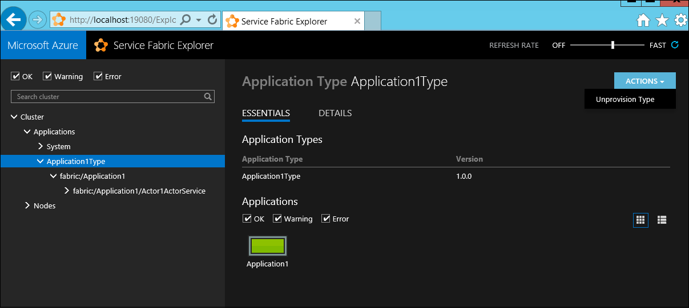

<properties
   pageTitle="在 Visual Studio | Microsoft Azure 中管理应用程序"
   description="使用 Visual Studio 来创建、开发、打包、部署和调试 Service Fabric 应用程序和服务。"
   services="service-fabric"
   documentationCenter=".net"
   authors="jessebenson"
   manager="timlt"
   editor=""/>

<tags
   ms.service="service-fabric"
   ms.date="02/02/2016"
   wacn.date="07/04/2016"/>

# 使用 Visual Studio 简化 Service Fabric 应用程序的编写和管理

你可以通过 Visual Studio 管理 Azure Service Fabric 应用程序和服务。[设置开发环境](/documentation/articles/service-fabric-get-started)之后，你可以使用 Visual Studio 创建 Service Fabric 应用程序、添加服务，或在本地开发群集中打包、注册和部署应用程序。

若要管理应用程序，请在解决方案资源管理器中右键单击你的应用程序项目。

![通过右键单击应用程序项目来管理你的 Service Fabric 应用程序][manageservicefabric]

## 部署 Service Fabric 应用程序

部署一个应用程序会将以下步骤合并为一个简单的操作。

1. 创建应用程序包
2. 将应用程序包上载到映像存储
3. 注册应用程序类型
4. 删除任何正在运行的应用程序实例
5. 创建新的应用程序实例

在 Visual Studio 中按 **F5** 还可以部署应用程序，并将调试器附加到所有应用程序实例。你可以使用 **Ctrl + F5** 部署应用程序而不进行调试，或者使用发布配置文件将应用程序发布到本地或远程群集。有关详细信息，请参阅[使用 Visual Studio 将应用程序发布到远程群集](/documentation/articles/service-fabric-publish-app-remote-cluster)。

### 保留测试运行之间的数据

通常在本地对服务进行测试，具体方法是添加测试数据输入，修改一些代码块，然后再在本地进行调试。Visual Studio Service Fabric 工具提供了一个称为**启动时保留数据**的便捷属性，用于保留你在上一个会话中输入的数据，以便于你再次使用。

#### 要启用“启动时保留数据”属性

1. 在应用程序项目的快捷菜单上，选择“属性”（或按 **F4** 键）。
1. 在“属性”窗口中，将“启动时保留数据”属性设置为“是”。

	![设置“启动时保留数据”属性][preservedata]

当你再次运行应用程序，部署脚本会将此部署视为一次升级，使用无监控的自动模式将此应用程序快速升级到附加了日期字符串的较新的版本。此升级过程会保留你在上一个调试会话中输入的任何数据。

![附加了日期的新应用程序版本的示例][preservedate]

通过在 Service Fabric 平台中使用升级功能保留了数据。有关升级应用程序的详细信息，请参阅 [Service Fabric 应用程序升级](/documentation/articles/service-fabric-application-upgrade)。

## 向 Service Fabric 应用程序添加服务

可以向你的应用程序中添加新的 Fabric 服务来扩展其功能。若要确保你的应用程序包中包含服务，请通过“新 Fabric 服务...”菜单项添加服务。

![将新的 Fabric 服务添加到你的应用程序中][newservice]

选择要添加到你的应用程序的 Service Fabric 项目类型，并指定服务的名称。请参阅[为你的服务选择框架](/documentation/articles/service-fabric-choose-framework)，以帮助你确定要使用的服务类型。

![选择要添加到你的应用程序的 Fabric 服务项目类型][addserviceproject]

新的服务会添加到你的解决方案和现有应用程序包中。服务引用和默认的服务实例会添加到应用程序清单中。将在下次部署应用程序时创建并启动服务。

![新的服务会添加到应用程序清单中][newserviceapplicationmanifest]

## 打包 Service Fabric 应用程序

要将应用程序及其服务部署到群集中，你需要创建应用程序包。该包会组织应用程序清单、服务清单和特定布局的其他必要文件。Visual Studio 设置和管理“pkg”目录中应用程序项目的文件夹中的包。从“应用程序”上下文菜单中单击“包”以创建或更新应用程序包。如果使用自定义 Powershell 脚本部署应用程序，你可能要执行此操作。

## 删除应用程序

你可以使用 Service Fabric 资源管理器从你的本地群集中撤销应用程序类型。可从群集的 HTTP 网关终结点（通常为 19080 或 19007）例如 http://localhost:19080/Explorer 访问群集资源管理器。此操作会还原上述部署步骤：

1. 删除任何正在运行的应用程序实例
2. 取消注册应用程序类型

<!--Every topic should have next steps and links to the next logical set of content to keep the customer engaged-->
## 后续步骤

- [Service Fabric 应用程序模型](/documentation/articles/service-fabric-application-model)
- [Service Fabric 应用程序部署](/documentation/articles/service-fabric-deploy-remove-applications)
- [管理多个环境的应用程序参数](/documentation/articles/service-fabric-manage-multiple-environment-app-configuration)
- [调试 Service Fabric 应用程序](/documentation/articles/service-fabric-debugging-your-application)
- [使用 Service Fabric 资源管理器可视化群集](/documentation/articles/service-fabric-visualizing-your-cluster)

<!--Image references-->
[addserviceproject]: ./media/service-fabric-manage-application-in-visual-studio/addserviceproject.png
[manageservicefabric]: ./media/service-fabric-manage-application-in-visual-studio/manageservicefabric.png
[newservice]: ./media/service-fabric-manage-application-in-visual-studio/newservice.png
[newserviceapplicationmanifest]: ./media/service-fabric-manage-application-in-visual-studio/newserviceapplicationmanifest.png
[preservedata]: ./media/service-fabric-manage-application-in-visual-studio/preservedata.png
[preservedate]: ./media/service-fabric-manage-application-in-visual-studio/preservedate.png

<!---HONumber=Mooncake_0307_2016-->