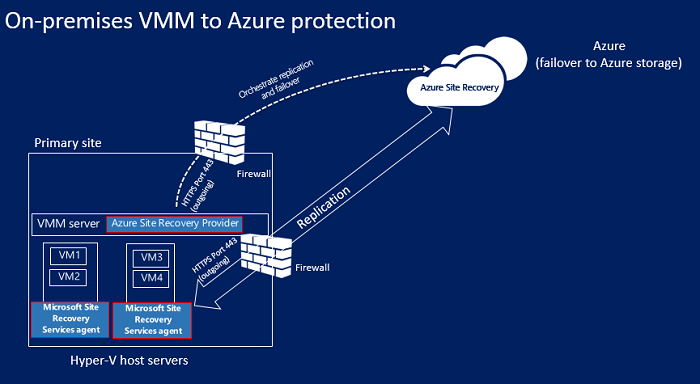
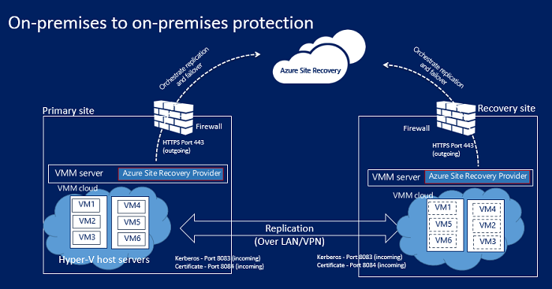
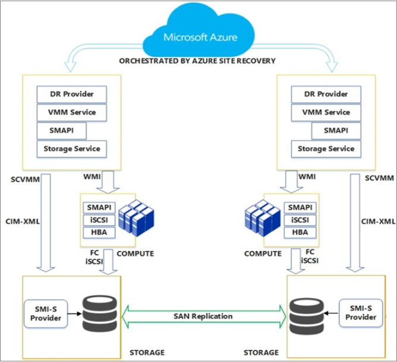

<properties
	pageTitle="Site Recovery 的工作原理是什么？ | Azure"
	description="本文提供站点恢复体系结构的概述"
	services="site-recovery"
	documentationCenter=""
	authors="rayne-wiselman"
	manager="jwhit"
	editor=""/>

<tags
	ms.service="site-recovery"
	ms.date="02/16/2016"
	wacn.date="04/05/2016"/>

# Azure Site Recovery 的工作原理

本文介绍站点恢复的基础架构以及它运行时使用的组件。阅读本文后，你可以在 [Azure 恢复服务论坛](https://social.msdn.microsoft.com/Forums/zh-cn/home?forum=hypervrecovmgr)上发布任何问题。

## 概述

组织需要制定业务连续性和灾难恢复 (BCDR) 策略来确定应用、工作负荷和数据如何在计划和非计划停机期间保持运行和可用，并尽快恢复正常运行情况。BCDR 策略的重点在于，发生灾难时提供确保业务数据的安全性和可恢复性以及工作负荷的持续可用性的解决方案。

站点恢复是一项 Azure 服务，可以通过协调从本地物理服务器和虚拟机到云 (Azure) 或辅助数据中心的的复制，来为 BCDR 策略提供辅助。当主要位置发生故障时，你可以故障转移到辅助站点，使应用和工作负荷保持可用。当主要位置恢复正常时，你可以故障转移回到主要位置。

站点恢复可用于许多方案，并可保护许多工作负荷。

- **保护 VMware 虚拟机**：可以通过将本地 VMware 虚拟机复制到 [Azure](/documentation/articles/site-recovery-vmware-to-azure-classic) 或[辅助数据中心](/documentation/articles/site-recovery-vmware-to-vmware)来为其提供保护。
- **保护 Hyper-V VM**：可以通过将 VMM 云中的本地 Hyper-V 虚拟机复制到 [Azure](/documentation/articles/site-recovery-vmm-to-azure) 或[辅助数据中心](/documentation/articles/site-recovery-vmm-to-vmm)来为其提供保护。你可以将不由 VMM 托管的 Hyper-V VM 复制到 [Azure](/documentation/articles/site-recovery-hyper-v-site-to-azure)。
- **通过 Azure 保护物理服务器**：可以通过将运行 Windows 或 Linux 的物理机复制到 [Azure](/documentation/articles/site-recovery-vmware-to-azure-classic) 或[辅助数据中心](/documentation/articles/site-recovery-vmware-to-vmware)来为其提供保护。
- **迁移 VM**：可以使用 Site Recovery 在区域之间[迁移 Azure IaaS VM](/documentation/articles/site-recovery-migrate-azure-to-azure)，或者[将 AWS Windows 实例迁移](/documentation/articles/site-recovery-migrate-aws-to-azure)到 Azure IaaS VM。

Site Recovery 可以复制这些 VM 和物理服务器上运行的大多数应用。可以在 [Azure Site Recovery 可以保护哪些工作负荷？](/documentation/articles/site-recovery-workload)中获取受支持应用的完整摘要

## 将本地 VMware 虚拟机或物理服务器复制到 Azure

如果你想要通过将 VMware VM 或 Windows/Linux 物理机复制到 Azure 来保护它们，以下是你需要做好的准备。

目前有两个不同的体系结构可用于此复制方案：

- **旧体系结构**：此体系结构不应该用于新部署。 
- **增强版体系结构**：这是最新的解决方案，并应该用于所有的新部署。还可以[将旧体系结构迁移](/documentation/articles/site-recovery-vmware-to-azure-classic-legacy#migrate-to-the-enhanced-deployment)到这个新的解决方案中。

下面是用于增强版部署的体系结构

- **本地**：部署增强版体系结构时，不需要在 Azure 中部署基础结构 VM。此外，所有流量都进行加密，且复制管理通信经 HTTPS 443 发送。下面是本地基础结构中需要的事项：

	- **管理服务器**：运行所有 Site Recovery 组件的单个管理服务器，包括：

		- **配置服务器**：在本地环境和 Azure 之间协调通信并管理数据复制和恢复过程。
		- **进程服务器**：充当复制网关。此服务器接收受保护源计算机提供的数据，通过缓存、压缩和加密对其进行优化，然后将复制数据发送到 Azure 存储空间。它还处理用于保护计算机的移动服务的推送安装，并执行 VMware VM 的自动发现。随着部署扩大，可以添加作为进程服务器运行的其他专用服务器，目的仅在于处理较大量的复制流量。
		- **主目标服务器**：处理从 Azure 进行故障回复期间产生的复制数据。 

	- **VMware ESX/ESXi 主机和 vCenter 服务器**：VMware VM 所在的一个或多个 ESX/ESXi 主机服务器。我们建议你使用 vCenter 服务器来托管这些主机。请注意，即使要保护物理服务器，也需要 VMware 环境，以便从 Azure 将故障回复到本地站点。
	
	- **受保护的计算机**：想要复制到 Azure 的每台计算机都需要安装移动服务组件。它可以捕获计算机上的数据写入，并将其转发到进程服务器。可以手动安装此组件，也可以在启用计算机保护后由进程服务器自动推送并安装。

- **Azure**：下面是 Azure 基础结构中需要的事项：
	- **Azure 帐户**：需要一个 Azure 帐户。
	- **Azure 存储空间**：需要使用 Azure 存储帐户来存储复制的数据。复制的数据存储在 Azure 空间，Azure VM 在发生故障转移时启动。 
	- **Azure 网络**：需要发生故障转移时 Azure VM 能够连接的 Azure 虚拟网络。还需要从 Azure 网络到本地站点的 VPN 连接（或 Azure ExpressRoute）设置。

	

了解有关确切的[部署要求](/documentation/articles/site-recovery-vmware-to-azure-classic#before-you-start-deployment)的详细信息。

### 故障回复体系结构

- 从 Azure 的故障必须回复到 VMware VM。当前无法将故障回复到物理服务器。
- 为了进行故障回复，你需要从 Azure 网络到本地网络的 VPN 连接（或 Azure ExpressRoute）。
- 需要在 Azure 中安装进程服务器进行故障回复。故障回复完成后，可以删除它。
- 需要在本地安装主目标服务器。在本地安装时，默认情况下会在管理服务器上安装主目标服务器。但对于较大量的流量，我们建议你在本地安装单独的主目标服务器进行故障回复。

了解有关[故障回复](/documentation/articles/site-recovery-failback-azure-to-vmware-classic)的详细信息。

### 旧体系结构

旧体系结构要求在想要保护的计算机上安装本地配置服务器和进程服务器、VMware ESX/ESXi 主机和 vCenter 服务器以及移动服务。在 Azure 中，为配置服务器和主目标服务器设置 Azure VM。还需要 Azure 订阅、存储帐户和虚拟网络。

## 将 VMM 云中的 Hyper-V VM 复制到 Azure

如果 VM 位于在 System Center VMM 云中管理的 Hyper-V 主机上，以下是将它们复制到 Azure 所要做好的准备。

- 本地： 
	- **VMM 服务器**：至少一个 VMM 服务器，其中至少设置了一个 VMM 私有云。服务器应在 System Center 2012 R2 上运行。VMM 服务器应已建立 Internet 连接。如果想要确保 Azure VM 在故障转移后连接到网络，则需要设置网络映射。为此，需要将源 VM 连接到 VMM VM 网络。该网络应当该链接到与该云相关联的逻辑网络。
	- **Hyper-V 服务器**：至少一个 Hyper-V 主机服务器位于 VMM 云中。Hyper-V 主机应运行 Windows Server 2012 R2。
	- **受保护的计算机**：源 Hyper-V 主机服务器应具有至少一个想要保护的 VM。
	
- Azure：
	- **Azure 帐户**：需要一个 Azure 帐户。
	- **Azure 存储空间**：需要使用 Azure 存储帐户来存储复制的数据。复制的数据存储在 Azure 空间，Azure VM 在发生故障转移时启动。
	- **Azure 网络**：如果想要确保 Azure VM 在故障转移后连接到网络，则需要设置网络映射。为此，需要设置 Azure 网络。

	

在此方案中，Site Recovery 部署期间在 VMM 服务器上安装了 Azure Site Recovery 提供程序。它通过 Internet 使用 Site Recovery 服务协调和安排复制。Site Recovery 部署期间在 Hyper-V 主机服务器上安装了 Azure 恢复服务代理，并且通过 HTTPS 443 在该代理与 Azure 存储空间之间复制数据。来自提供程序和代理的通信都是安全且经过加密的。Azure 存储空间中的复制数据也已加密。

了解有关确切的[部署要求](/documentation/articles/site-recovery-vmm-to-azure#before-you-start)的详细信息。

## 将 Hyper-V VM 复制到 Azure（不使用 VMM）

如果你的 VM 不受 System Center VMM 服务器的管理，以下是将它们复制到 Azure 所要做好的准备

- 本地： 
	- **Hyper-V 服务器**：至少一个 Hyper-V 主机服务器。Hyper-V 主机应运行 Windows Server 2012 R2。
	- **受保护的计算机**：源 Hyper-V 主机服务器应具有至少一个想要保护的 VM。
	
- Azure：
	- **Azure 帐户**：需要一个 Azure 帐户。
	- **Azure 存储空间**：需要使用 Azure 存储帐户来存储复制的数据。复制的数据存储在 Azure 空间，Azure VM 在发生故障转移时启动。

	

在此方案中，Site Recovery 部署期间在 VMM 服务器上安装了 Azure Site Recovery 提供程序和 Azure 恢复服务代理。提供程序通过 Internet 使用 Site Recovery 服务协调和安排复制。代理通过 HTTPS 443 处理数据复制。来自提供程序和代理的通信都是安全且经过加密的。Azure 存储空间中的复制数据也已加密。

了解有关确切的[部署要求](/documentation/articles/site-recovery-hyper-v-site-to-azure#before-you-start)的详细信息

## 将 Hyper-V VM 复制到辅助数据中心

如果你想要通过将 Hyper-V VM 复制到辅助数据中心来为其提供保护，以下是需要做好的准备。请注意，仅当 Hyper-V 主机服务器在 System Center VMM 云中管理时，才可以这样做。

- **本地**： 
	- **VMM 服务器**：我们建议在主站点和辅助站点中分别安装一个 VMM 服务器，每个服务器都至少包含一个 VMM 私有云。服务器至少应运行安装了最新更新的 System Center 2012 SP1，并已连接到 Internet。云应该设置了 Hyper-V 容量配置文件。
	- **Hyper-V 服务器**：Hyper-V 主机服务器位于主要和辅助 VMM 云中。主机服务器至少应运行已安装最新更新的 Windows Server 2012，并已连接到 Internet。
	- **受保护的计算机**：源 Hyper-V 主机服务器应具有至少一个想要保护的 VM。
	
- **Azure**：你将需要 Azure 订阅。

	

在此方案中，Site Recovery 部署期间在 VMM 服务器上安装了 Azure Site Recovery 提供程序。它通过 Internet 使用 Site Recovery 服务协调和安排复制。使用 Kerberos 或证书身份验证通过 LAN 或 VPN 在主要和辅助 Hyper-V 主机服务器之间复制数据。来自提供程序的通信以及 Hyper-V 主机服务器之间的通信都是安全且经过加密的。

了解有关确切的[部署要求](/documentation/articles/site-recovery-vmm-to-vmm#before-you-start)的详细信息

## 使用 SAN 复制将 Hyper-V VM 复制到辅助数据中心

如果 VM 位于在 System Center VMM 云中管理的 Hyper-V 主机上并且你使用 SAN 存储，以下是在两个数据中心之间复制时所要做好的准备。

- **本地**： 
	- **SAN 阵列**：主 VMM 服务器托管的[受支持 SAN 阵列](http://social.technet.microsoft.com/wiki/contents/articles/28317.deploying-azure-site-recovery-with-vmm-and-san-supported-storage-arrays.aspx)。SAN 与辅助站点中的另一个 SAN 阵列共享网络基础结构。
	- **VMM 服务器**：我们建议在主站点和辅助站点中分别安装一个 VMM 服务器，每个服务器都至少包含一个 VMM 私有云。服务器至少应运行安装了最新更新的 System Center 2012 SP1，并已连接到 Internet。云应该设置了 Hyper-V 容量配置文件。
	- **Hyper-V 服务器**：Hyper-V 主机服务器位于主要和辅助 VMM 云中。主机服务器至少应运行已安装最新更新的 Windows Server 2012，并已连接到 Internet。
	- **受保护的计算机**：源 Hyper-V 主机服务器应具有至少一个想要保护的 VM。
	
- **Azure**：你将需要 Azure 订阅。

	

在此方案中，Site Recovery 部署期间在 VMM 服务器上安装了 Azure Site Recovery 提供程序。它通过 Internet 使用 Site Recovery 服务协调和安排复制。使用同步的 SAN 复制在主要和辅助存储阵列之间复制数据。

了解有关确切的[部署要求](/documentation/articles/site-recovery-vmm-san#before-you-start)的详细信息

## 将 VMware 虚拟机或物理服务器复制到辅助站点

如果你想要通过在两个本地数据中心之间复制 VMware VM 或 Windows/Linux 物理机来保护它们，以下是你需要做好的准备。

- **本地主服务器**： 
	- **进程服务器**：设置主站点中的进程服务器组件，以处理缓存、压缩和数据优化。它还可以将安装的统一代理推送到你要保护的计算机。
	- **VMware ESX/ESXi 和 vCenter 服务器**：如果要保护 VMware VM，则需要 VMware EXS/ESXi 虚拟机监控程序或托管多个虚拟机监控程序的 VMware vCenter 服务器
	- 受保护的计算机：想要保护的 VMware VM 或 Windows/Linux 物理服务器需要安装统一代理。充当主目标服务器的计算机上也安装了统一代理。它充当所有 InMage 组件之间的通信提供程序。
	
- **本地辅助服务器**：
	- **配置服务器**：配置服务器是安装的第一个组件，需将它安装在辅助站点上，以便使用管理网站或 vContinuum 控制台来管理、配置和监视部署。配置服务器还包含远程部署统一代理的推送机制。部署中仅有一个配置服务器，并且它必须安装在运行 Windows Server 2012 R2 的计算机上。
	- **vContinuum 服务器**：它的安装位置与配置服务器相同（辅助站点）。它提供一个控制台用于管理和监视受保护的环境。在默认安装中，vContinuum 服务器是第一个主目标服务器，并且已安装统一代理。
	- **主目标服务器**：主目标服务器保存复制的数据。它从进程服务器接收数据，在辅助站点中创建副本地器，并保存数据保留点。需要的主目标服务器数目取决于要保护的计算机数目。如果你想要故障转移到主站点，则也需要一个主目标服务器。 

- **Azure**：你将需要 Azure 订阅。下载 InMage Scout 以在创建 Site Recovery 保管库之后设置部署。你还要安装所有 InMage 组件服务器的最新更新。

	

在此方案中，差异复制更改将从受保护计算机上运行的统一代理发送到进程服务器。进程服务器将优化这些数据，并将其传输到辅助站点上的主目标服务器。配置服务器将管理复制进程。

## Hyper-V 保护生命周期

此工作流显示保护、复制和故障转移 Hyper-V 虚拟机的过程。

1. **启用保护**：设置 Site Recovery 保管库、配置 VMM 云或 Hyper-V 站点的复制设置，并启用 VM 的保护。名为“启用保护”的作业将会启动，并可以在“作业”选项卡中监视。该作业将检查计算机是否符合先决条件，然后调用 [CreateReplicationRelationship](https://msdn.microsoft.com/zh-cn/library/hh850036.aspx) 方法，以使用配置的设置来设置到 Azure 的复制。“启用保护”作业还调用 [StartReplication](https://msdn.microsoft.com/zh-cn/library/hh850303.aspx) 方法来初始化完整的 VM 复制。
2. **初始复制**：生成虚拟机快照，并逐个复制虚拟硬盘，直到它们已全部复制到 Azure 或辅助数据中心。完成时间取决于数据大小和网络带宽以及所选的初始复制方法。如果在初始复制期间发生磁盘更改，Hyper-V 副本复制跟踪器将跟踪这些更改，并将其记录在 Hyper-V 复制日志 (.hrl) 中，该文件位于与磁盘相同的文件夹中。每个磁盘都有一个关联的 .hrl 文件，该文件将发送到辅助存储。请注意，当初始复制正在进行时，快照和日志将占用磁盘资源。初始复制完成后，将删除 VM 快照，并同步和合并日志中的差异磁盘更改。
3. **完成保护**：初始复制完成后，“完成保护”作业将配置网络和其他复制后设置，然后虚拟机将受到保护。如果要复制到 Azure，你可能需要调整虚拟机的设置，使其随时可进行故障转移。此时，你可以运行测试故障转移以检查一切是否按预期工作。
4. **复制**：在初始复制之后，根据复制设置和方法进行增量同步。 
	- **复制失败**：如果增量复制失败且完整复制因为带宽或时间限制而需要大量开销，将会发生重新同步。例如，如果 .hrl 文件达到磁盘大小的 50%，系统会将虚拟机标记为重新同步。重新同步通过计算源虚拟机磁盘和目标虚拟机的校验和并只发送差异来最大程度地减小发送的数据量。重新同步完成后，应会恢复差异复制。默认情况下，重新同步安排为在非工作时间自动运行，但你可以手动重新同步虚拟机。
	- **复制错误**：如果发生复制错误，将会进行内置重试。如果是无法恢复的错误，例如身份验证或授权错误，或者副本计算机处于无效状态，则不会重试。如果是可恢复的错误，例如网络错误，或磁盘空间/内存不足，则会发生重试。重试的间隔将会递增（依次为 1、2、4、8、10、30 分钟）。
4. **计划/非计划故障转移**：必要时，你可以运行计划/非计划故障转移。如果运行计划的故障转移，源 VM 将关闭以确保不会丢失数据。副本 VM 在创建后处于待提交状态。你需要提交它们以完成故障转移，除非使用 SAN 复制，在此情况下提交是自动的。主站点已启动并运行之后，可以发生故障转移。如果已复制到 Azure，则反向复制是自动的。否则你应该开始反向复制。
 

## 后续步骤

[为部署做好准备](/documentation/articles/site-recovery-best-practices)。

<!---HONumber=Mooncake_0328_2016-->