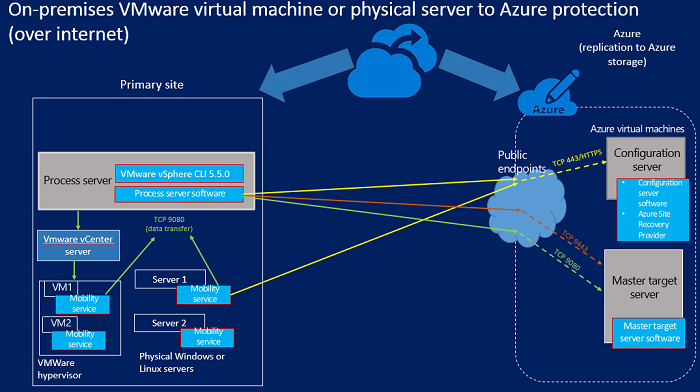

<properties
	pageTitle="站点恢复的工作原理 | Windows Azure"
	description="本文提供站点恢复体系结构的概述"
	services="site-recovery"
	documentationCenter=""
	authors="rayne-wiselman"
	manager="jwhit"
	editor=""/>

<tags
	ms.service="site-recovery"
	ms.date="12/07/2015"
	wacn.date="01/29/2016"/>

# Azure Site Recovery 的工作原理

## 关于本文

本文介绍站点恢复的基础架构以及它运行时使用的组件。阅读本文后，你可以在 [Azure 恢复服务论坛](https://social.msdn.microsoft.com/Forums/zh-cn/home?forum=hypervrecovmgr)上发布任何问题。

## 概述

组织需要制定业务连续性和灾难恢复 (BCDR) 策略来确定应用、工作负荷和数据如何在计划内和计划外停机期间保持可用，并尽快恢复正常运行。BCDR 策略重点在于维护可确保业务数据的安全且可恢复，以及在发生灾难时工作负荷持续可用的解决方案。

站点恢复是一项 Azure 服务，可以通过协调从本地物理服务器和虚拟机到云 (Azure) 或辅助数据中心的的复制，来为 BCDR 策略提供辅助。当主要位置发生故障时，你可以故障转移到辅助站点，使应用和工作负荷保持可用。当主要位置恢复正常时，你可以故障转移回到主要位置。

站点恢复可用于许多方案，并可保护许多工作负荷。

- **保护 VMware 虚拟机**：可以通过将本地 VMware 虚拟机复制到 Azure 或辅助数据中心来为其提供保护。- **保护 Hyper-V VM**：可以通过将本地 Hyper-V 虚拟机复制到云 (Azure) 或辅助数据中心来为其提供保护。  
- **保护物理服务器**：可以通过将运行 Windows 或 Linux 的物理机复制到 Azure 或辅助数据中心来为其提供保护。
- **迁移 VM**：可以使用站点恢复在区域之间迁移 Azure IaaS VM，或者将 AWS Windows 实例迁移到 Azure IaaS VM。

你可以在[什么是 Azure Site Recovery？](/documentation/articles/site-recovery-overview)和 [Azure Site Recovery 可以保护哪些工作负荷？](/documentation/articles/site-recovery-workload)中获取受支持部署的完整摘要

## 在本地物理服务器或 VMware 虚拟机与 Azure 之间复制

如果你想要通过将 VMware VM 或 Windows/Linux 物理机复制到 Azure 来保护它们，以下是你需要做好的准备。

**位置** | **需要什么** 
--- | --- 
 本地 | **进程服务器**：此服务器在将受保护 VMware 虚拟机或 Windows/Linux 物理机中的数据发送到 Azure 之前优化这些数据。它还处理用于保护计算机的移动服务组件的推送安装，并执行 VMware 虚拟机的自动发现。  **VMware vCenter 服务器**：如果你要保护 VMware VM，则需要使用 VMwave vCenter 服务器管理 vSphere 虚拟机监控程序  **ESX 服务器**：如果你要保护 VMware VM，则需要一台运行具有最新更新的 ESX/ESXi 版本 5.1 或 5.5 的服务器。   **计算机**：如果你要保护 VMware，应该安装并运行具有 VMware 工具的 VMware VM。如果你要保护物理机，它们应该运行支持的 Windows 或 Linux 操作系统。请参阅[支持的系统](/documentation/articles/site-recovery-vmware-to-azure#before-you-start)。  **移动服务**：在要保护的计算机上安装以捕获更改并将其发送到进程服务器。  第三方组件：此部署依赖于一些[第三方组件](http://download.microsoft.com/download/C/D/7/CD79E327-BF5A-4026-8FF4-9EB990F9CEE2/Third-Party_Notices.txt)。
Azure | **配置服务器**：标准 A3 Azure VM，用于协调受保护的计算机、处理服务器和主目标服务器之间的通信。它设置故障转移发生时的复制和协调恢复。  **主目标服务器**：Azure VM 使用在 Azure 存储帐户的 Blob 存储中创建的附加 VHD 来保存从受保护计算机复制的数据。故障转移主目标服务器在本地运行，使你可以将 Azure VM 故障转移到 VMware VM。  **站点恢复保管库**：至少一个 Azure Site Recovery 保管库（其中设置了站点恢复服务的订阅）  **虚拟网络**：配置服务器与主目标服务器所在的 Azure 网络，与站点恢复服务位于相同的订阅和区域中。  **Azure 存储空间**：用于存储复制的数据的 Azure 存储帐户。应该采用标准异地冗余配置，或者位于与站点恢复订阅相同的区域中的高级帐户。

在此方案中，通信可以通过 VPN 连接发送到 Azure 网络上的内部端口（使用 Azure ExpressRoute 或站点到站点 VPN），或通过安全 Internet 连接发送到配置 VM 和主目标服务器 VM 的 Azure 云服务上的映射公共终结点。

受保护计算机上的移动服务将复制数据发送到进程服务器，并将复制元数据发送到配置服务器。进程服务器与配置服务器通信以接收管理和控制信息。它将复制信息发送到主目标服务器，优化复制的数据并将其发送到主目标服务器。

## 将 Hyper-V VM 复制到 Azure（使用 VMM）

如果 VM 位于在 System Center VMM 云中管理的 Hyper-V 主机上，以下是将它们复制到 Azure 所要做好的准备。

**位置** | **需要什么** 
--- | --- 
本地 | **VMM 服务器**：至少一个 VMM 服务器，其中至少设置了一个 VMM 私有云。将在 VMM 服务器上安装 Azure Site Recovery 提供程序 <br/**Hyper-V 服务器**：VMM 云中至少有一个 Hyper-V 主机服务器。Microsoft 恢复服务代理将安装在每个 Hyper-V 服务器上。  **虚拟机**：Hyper-V 服务器上至少运行一个虚拟机。不会在该虚拟机上安装任何软件。
Azure | **站点恢复保管库**：至少一个 Azure Site Recovery 保管库（其中设置了站点恢复服务的订阅）  **存储帐户**：一个 Azure 存储帐户，与站点恢复服务位于同一个订阅下。复制的计算机将存储在 Azure 存储空间中。 

在此方案中，在 VMM 服务器上运行的提供程序通过 Internet 协调使用站点恢复服务的复制。通过 HTTPS 443 在本地 Hyper-V 服务器上运行的恢复服务代理与 Azure 存储空间之间复制数据。来自提供程序和代理的通信都是安全且经过加密的。Azure 存储空间中的复制数据也已加密。

## 将 Hyper-V VM 复制到 Azure（不使用 VMM）

如果你的 VM 不受 System Center VMM 服务器的管理，以下是将它们复制到 Azure 所要做好的准备

**位置** | **需要什么**
--- | --- 
 本地 | **Hyper-V 服务器**：至少一个 Hyper-V 主机服务器。Azure Site Recovery 提供程序和 Microsoft 恢复服务代理将安装在每个 Hyper-V 服务器上。  **虚拟机**：Hyper-V 服务器上至少运行一个虚拟机。不会在该虚拟机上安装任何软件。
Azure | **站点恢复保管库**：至少一个 Azure Site Recovery 保管库（其中设置了站点恢复服务的订阅）  **存储帐户**：一个 Azure 存储帐户，与站点恢复服务位于同一个订阅下。复制的计算机将存储在 Azure 存储空间中。

在此方案中，在 Hyper-V 服务器上运行的提供程序通过 Internet 协调使用站点恢复服务的复制。通过 HTTPS 443 在本地 Hyper-V 服务器上运行的恢复服务代理与 Azure 存储空间之间复制数据。来自提供程序和代理的通信都是安全且经过加密的。Azure 存储空间中的复制数据也已加密。

## 将 Hyper-V VM 复制到辅助数据中心

如果你想要通过将 Hyper-V VM 复制到辅助数据中心来为其提供保护，以下是需要做好的准备。请注意，仅当 Hyper-V 主机服务器在 System Center VMM 云中管理时，才可以这样做。

**位置** | **需要什么** 
--- | --- 
 本地 | **VMM 服务器**：主站点和辅助站点中各有一个 VMM 服务器。Azure Site Recovery 提供程序将安装在每个 VMM 服务器上。  **Hyper-V 服务器**：主站点和辅助站点的 VMM 云中至少有一个 Hyper-V 主机服务器。不会在 Hyper-V 服务器上安装任何软件  **虚拟机**：Hyper-V 服务器上至少运行一个虚拟机。不会在该虚拟机上安装任何软件。
Azure | **站点恢复保管库**：至少一个 Azure Site Recovery 保管库（其中设置了站点恢复服务的订阅）。 

在此方案中，VMM 服务器上的提供程序通过 Internet 协调使用站点恢复服务的复制。使用 Kerberos 或证书身份验证通过 Internet 在主要和辅助 Hyper-V 主机服务器之间复制数据。来自提供程序的通信以及 Hyper-V 主机服务器之间的通信都是安全且经过加密的。

## 使用 SAN 复制将 Hyper-V VM 复制到辅助数据中心

如果 VM 位于在 System Center VMM 云中管理的 Hyper-V 主机上并且你使用 SAN 存储，以下是在两个数据中心之间复制时所要做好的准备。

**位置** | **需要什么** 
--- | --- 
 主数据中心 | **SAN 阵列**：主 VMM 服务器管理的[受支持 SAN 阵列](http://social.technet.microsoft.com/wiki/contents/articles/28317.deploying-azure-site-recovery-with-vmm-and-san-supported-storage-arrays.aspx)。SAN 与辅助站点中的另一个 SAN 阵列共享网络基础结构  **VMM 服务器**：至少一个 VMM 服务器，其中已设置一个或多个 VMM 云和复制组。将在每个 VMM 服务器上安装 Azure Site Recovery 提供程序。  **Hyper-V 服务器**：复制组中至少有一个包含虚拟机的 Hyper-V 主机服务器。不会在 Hyper-V 主机服务器上安装任何软件。   **虚拟机**：Hyper-V 主机服务器上至少运行一个虚拟机。不会在该虚拟机上安装任何软件。 
辅助数据中心 | **SAN 阵列**：辅助 VMM 服务器管理的[受支持 SAN 阵列](http://social.technet.microsoft.com/wiki/contents/articles/28317.deploying-azure-site-recovery-with-vmm-and-san-supported-storage-arrays.aspx)。  **VMM 服务器**：至少一个 VMM 服务器，其中包含一个或多个 VMM 云。   **Hyper-V 服务器**：至少一个 Hyper-V 主机服务器。 
Azure | **站点恢复保管库**：至少一个 Azure Site Recovery 保管库（其中设置了站点恢复服务的订阅）

在此方案中，VMM 服务器上的提供程序通过 Internet 协调使用站点恢复服务的复制。使用同步的 SAN 复制在主要和辅助存储阵列之间复制数据。

## Hyper-V 保护生命周期

此工作流显示保护、复制和故障转移 Hyper-V 虚拟机的过程。

1. **启用保护**：设置站点恢复保管库、配置 VMM 云或 Hyper-V 网站的复制设置，并启用 VM 的保护。名为“启用保护”的作业将会启动，并可以在“作业”选项卡中监视。该作业将检查计算机是否符合先决条件，然后调用 [CreateReplicationRelationship](https://msdn.microsoft.com/zh-cn/library/hh850036.aspx) 方法，以使用配置的设置来设置到 Azure 的复制。“启用保护”作业还调用 [StartReplication](https://msdn.microsoft.com/zh-cn/library/hh850303.aspx) 方法来初始化完整 VM 复制。
2. **初始复制**：生成虚拟机快照，并逐个复制虚拟硬盘，直到它们已全部复制到 Azure 或辅助数据中心。完成时间取决于数据大小和网络带宽以及所选的初始复制方法。如果在初始复制期间发生磁盘更改，Hyper-V 副本复制跟踪器将跟踪这些更改，并将其记录在 Hyper-V 复制日志 (.hrl) 中，该文件位于与磁盘相同的文件夹中。每个磁盘都有一个关联的 .hrl 文件，该文件将发送到辅助存储。请注意，当初始复制正在进行时，快照和日志将占用磁盘资源。初始复制完成后，将删除 VM 快照，并同步和合并日志中的差异磁盘更改。
3. **完成保护**：初始复制完成后，“完成保护”作业将配置网络和其他复制后设置，然后虚拟机将受到保护。如果要复制到 Azure，你可能需要调整虚拟机的设置，使其随时可进行故障转移。此时，你可以运行测试故障转移以检查一切是否按预期工作。
4. **复制**：在初始复制之后，根据复制设置和方法进行差异同步。 
	- **复制失败**：如果差异复制失败且完整复制因为带宽或时间限制而需要大量开销，将会发生重新同步。例如，如果 .hrl 文件达到磁盘大小的 50%，系统会将虚拟机标记为重新同步。重新同步通过计算源虚拟机磁盘和目标虚拟机的校验和并只发送差异来最大程度地减小发送的数据量。重新同步完成后，应会恢复差异复制。默认情况下，重新同步安排为在非工作时间自动运行，但你可以手动重新同步虚拟机。
	- **复制错误**：如果发生复制错误，将会进行内置重试。如果是无法恢复的错误，例如身份验证或授权错误，或者副本计算机处于无效状态，则不会重试。如果是可恢复的错误，例如网络错误，或磁盘空间/内存不足，则会发生重试。重试的间隔将会递增（依次为 1、2、4、8、10、30 分钟）。
4. **计划/非计划的故障转移**：必要时，你可以运行计划/非计划的故障转移。如果运行计划的故障转移，源 VM 将关闭以确保不会丢失数据。副本 VM 在创建后处于待提交状态。你需要提交它们以完成故障转移，除非使用 SAN 复制，在此情况下提交是自动的。主站点已启动并运行之后，可以发生故障转移。如果已复制到 Azure，则反向复制是自动的。否则你应该开始反向复制。
 

## 将 VMware 虚拟机和物理服务器复制到 Azure

可以通过 VPN 站点到站点连接或 Internet 将 VMware 虚拟机和物理服务器 (Windows/Linux) 复制到 Azure。

### 通过 VPN 站点到站点连接（或 ExpressRoute）复制到 Azure

#### 通过 Internet 复制

## 在主要和辅助数据中心的本地物理服务器或 VMware 虚拟机之间复制

如果你想要通过在两个本地数据中心之间复制 VMware VM 或 Windows/Linux 物理机来保护它们，以下是你需要做好的准备。

**位置** | **需要什么** 
--- | --- 
 本地主服务器 | **进程服务器**：设置主站点中的进程服务器组件，以处理缓存、压缩和数据优化。它还可以将安装的统一代理推送到你要保护的计算机。  **VMware 保护**：如果你要保护 VMware VM，则需要一个 VMware EXS/ESXi 虚拟监控程序，或者用于管理多个虚拟机监控程序的 VMware vCenter 服务器  **物理服务器保护**：如果你要保护物理机，它们应该运行 Windows 或 Linux。  **统一代理**：安装在要保护的计算机上和用作主目标服务器的计算机上。它充当所有 InMage 组件之间的通信提供程序。
本地辅助服务器 | **配置服务器**：配置服务器是安装的第一个组件，需将它安装在辅助站点上，以便使用管理网站或 vContinuum 控制台来管理、配置和监视部署。配置服务器还包含远程部署统一代理的推送机制。一个部署中只有一个配置服务器，该服务器必须安装在运行 Windows Server 2012 R2 的计算机上。  **vContinuum 服务器**：安装在与配置服务器相同的位置（辅助站点）。它提供一个控制台用于管理和监视受保护的环境。在默认安装中，vContinuum 服务器是第一个主目标服务器，并且已安装统一代理。  **主目标服务器**：主目标服务器保存复制的数据。它从进程服务器接收数据，在辅助站点中创建副本地器，并保存数据保留点。需要的主目标服务器数目取决于要保护的计算机数目。如果你想要故障转移到主站点，则也需要一个主目标服务器。 
Azure | **站点恢复保管库**：至少一个 Azure Site Recovery 保管库（其中设置了站点恢复服务的订阅）。下载 InMage Scout 以在创建保管库之后设置部署。你还要安装所有 InMage 组件服务器的最新更新。

在此方案中，差异复制更改将从受保护计算机上运行的统一代理发送到进程服务器。进程服务器将优化这些数据，并将其传输到辅助站点上的主目标服务器。配置服务器将管理复制进程。

## 后续步骤

[为部署做好准备](/documentation/articles/site-recovery-best-practices)。

<!---HONumber=Mooncake_0118_2016-->