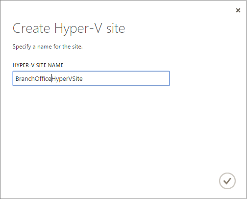
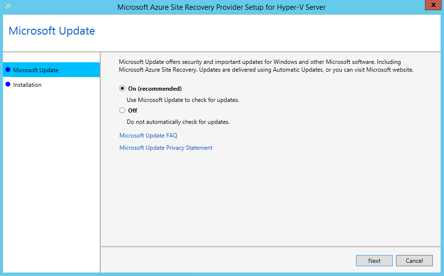
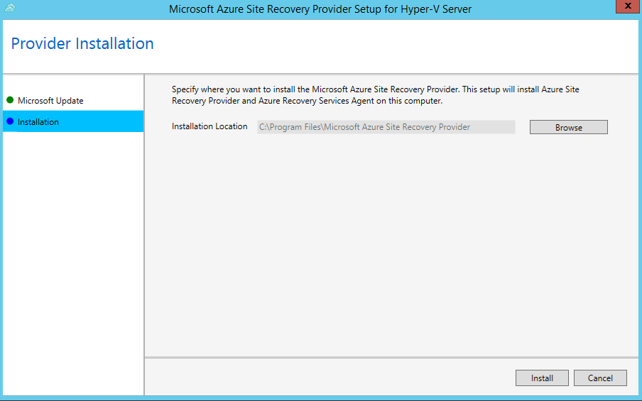
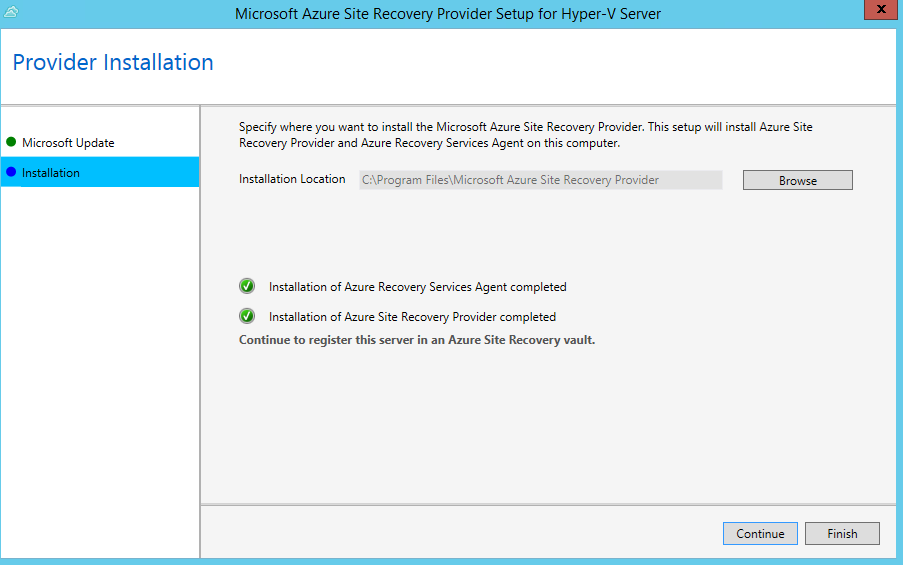
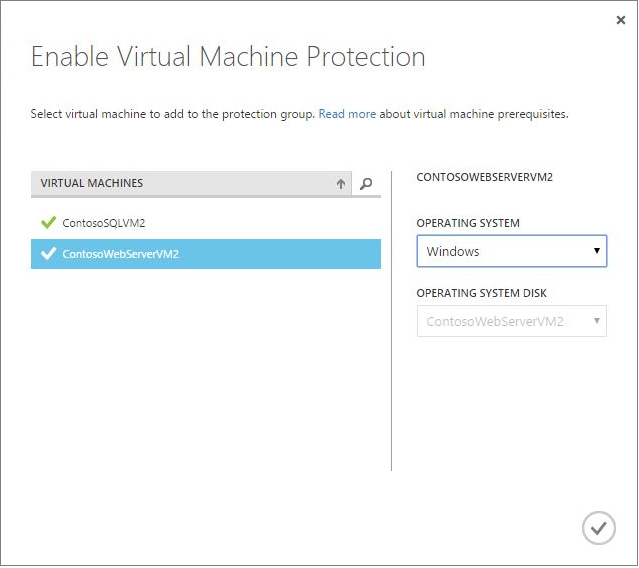
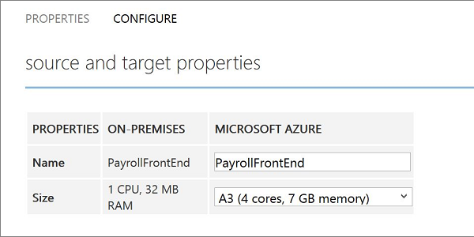

<properties
	pageTitle="在本地 Hyper-V 站点与 Azure 之间设置保护"
	description="Azure Site Recovery 可以协调位于本地 Hyper-V 服务器中的虚拟机到 Azure 的复制、故障转移和恢复"
	services="site-recovery"
	documentationCenter=""
	authors="rayne-wiselman"
	manager="jwhit"
	editor=""/>

<tags
	ms.service="site-recovery"
	ms.date="10/12/2015"
	wacn.date="12/15/2015"/>

# 在本地 Hyper-V 站点与 Azure 之间设置保护

## 概述

Azure Site Recovery 有助于业务连续性和灾难恢复 (BCDR) 策略，因为它可以安排复制、故障转移和恢复虚拟机和物理服务器。在 [Site Recovery 概述](/documentation/articles/site-recovery-overview)中了解可能的部署方案。

本文介绍如何部署 Site Recovery 来复制本地站点上运行 Windows Server 2012 R2 的 Hyper-V 服务器上的虚拟机。到 Azure 存储空间的复制由 Site Recovery 来协调。如果你在运行 Hyper-V 服务器但未部署 System Center Virtual Machine Manager (VMM)，则此部署将特别有用。

## 关于本文

本文汇总了部署先决条件，并帮助你配置复制设置，以及为虚拟机启用保护。本文最后指导你测试故障转移，以确保一切都按预期进行。

如果你遇到问题，则可以将其发布在 [Azure Recovery Services 论坛](https://social.msdn.microsoft.com/Forums/zh-CN/home?forum=hypervrecovmgr)上。

## 开始之前

在开始之前，请确保做好了一切准备工作。

### Azure 先决条件

- 需要一个 [Windows Azure](http://www.windowsazure.cn/) 帐户。你可以从[试用版](/pricing/1rmb-trial/)开始。
- - 你将需要使用 Azure 存储帐户来存储复制的数据。需要为帐户启用地域复制。它应该位于 Azure Site Recovery 保管库所在的区域中，并与相同订阅关联。若要了解详细信息，请阅读 [Windows Azure 存储空间简介](/documentation/articles/storage-introduction)。
- - 需要一个 Azure 虚拟网络，以便在故障转移后可将复制的虚拟机连接到网络。

### Hyper-V 先决条件

- 源本地站点中至少有一台运行 Windows Server 2012 R2 的服务器，并且源站点中存在 Hyper-V 角色。
- Hyper-V 服务器应包含一个或多个虚拟机。
- Hyper-V 服务器应直接或通过代理连接到 Internet。
- Hyper-V 服务器应该安装 [KB2961977](https://support.microsoft.com/zh-cn/kb/2961977 "KB2961977") 中提到的修补程序。

### 虚拟机先决条件

要保护的虚拟机应符合[虚拟机先决条件](/documentation/articles/site-recovery-best-practices#virtual-machines)。

### 提供程序和代理先决条件

在部署 Azure Site Recovery 的过程中，你将在包含要保护的虚拟机的每个 Hyper-V 服务器上安装 Azure Site Recovery 提供程序和 Azure 恢复服务代理。请注意：

- 你应该运行最新版本的提供程序和代理。
- 保管库中的所有 Hyper-V 服务器应具有相同的版本。
- 提供程序将需要通过 Internet 连接到 Azure Site Recovery。你可以使用 VMM 服务器上当前配置的代理设置或者使用你在安装提供程序期间配置的自定义代理设置，来实现不带代理的部署。若要使用现有的代理服务器，请确保用于连接 Azure 的 URL 可以通过防火墙：
	- **.hypervrecoverymanager.windowsazure.cn
	- **.accesscontrol.chinacloudapi.cn
	- **.backup.windowsazure.cn
	- **.blob.core.chinacloudapi.cn
	- **.store.core.chinacloudapi.cn
- 若要使用自定义代理，请在安装提供程序之前设置代理服务器。在设置提供程序期间，你需要指定代理服务器地址和端口，以及用于访问的凭据。请注意，不支持基于 HTTPS 的代理。

以下图片显示了Azure Site Recovery 用来完成业务流程和复制的不同通信通道和端口

 
## 步骤 1：创建保管库

1. 登录到[管理门户](https://manage.windowsazure.cn)。

2. 展开“数据服务”>“恢复服务”，并单击“Site Recovery 保管库”。

3. 单击“新建”>“快速创建”。

4. 在“名称”中，输入一个友好名称以标识此保管库。

5. 在“区域”中，为保管库选择地理区域。若要查看受支持的区域，请参阅 [Azure Site Recovery 价格详细信息](/home/features/site-recovery/#price)中的“地域可用性”。

6. 单击“创建保管库”。

	

检查状态栏以确认保管库已成功创建。保管库将以“活动”形式列在主要的“恢复服务”页上。

## 步骤 2：创建 Hyper-V 站点

1. 在“恢复服务”页中，单击保管库以打开“快速启动”页。也可随时使用该图标打开“快速启动”。

	

2. 在下拉列表中，选择“本地 Hyper-V 站点与 Azure 之间”。

	

3. 在“创建 Hyper-V 站点”中，单击“创建 Hyper-V 站点”。指定站点名称并保存。

	

## 步骤 3：安装提供程序和代理
安装提供程序和代理如果要在 Hyper-V 群集上进行安装，请在故障转移群集中的每个节点上执行步骤 5-11。在注册所有节点并启用保护后，即使跨故障转移群集中的节点迁移虚拟机，这些虚拟机也会受到保护。

1. 在“准备 Hyper-V 服务器”中，单击“下载注册密钥”文件。
2. 在“下载注册密钥”页上，单击站点旁边的“下载”。将密钥下载到可由 Hyper-V 服务器方便访问的安全位置。该密钥生成后，有效期为 5 天。

	

4. 单击“下载该提供程序”以获取最新版本。
5. 在想要注册到保管库中的每个 Hyper-V 服务器上运行该文件。该文件将安装两个组件：
	- **Azure Site Recovery 提供程序** - 处理 Hyper-V 服务器与 Azure Site Recovery 门户之间的通信和协调。
	- **Azure 恢复服务代理** - 处理源 Hyper-V 服务器上运行的虚拟机与 Azure 存储空间之间的数据传输。
6. 在“Microsoft 更新”中，你可以选择获取更新。启用此设置后，将会根据你的 Microsoft Update 策略安装提供程序和代理更新。

	

7. 在“安装”中，指定要将提供程序和代理安装在 Hyper-V 服务器上的哪个位置。

	

8. 完成安装后，请继续设置以在保管库中注册服务器。

	

9. 在“Internet 连接”页，指定提供程序如何连接到 Azure Site Recovery。选择“使用默认系统代理设置”以使用服务器上配置的默认 Internet 连接设置。如果你未指定值，系统将使用默认设置。

	

	请注意：

	- 如果 Hyper-V 服务器上的默认代理需要身份验证，则你应该选择使用自定义代理服务器。键入默认代理详细信息，然后指定凭据。
	- 如果要使用自定义代理服务器，请在安装提供程序之前设置它。
	- 以下 URL 应可从 Hyper-v 主机访问
		- **.hypervrecoverymanager.windowsazure.cn
		- **.accesscontrol.chinacloudapi.cn
		- **.backup.windowsazure.cn
		- **.blob.core.chinacloudapi.cn
		- **.store.core.chinacloudapi.cn

	- 允许 [Azure 数据中心 IP 范围](https://msdn.microsoft.com/zh-cn/library/azure/dn175718.aspx)中所述的 IP 地址，以及 HTTPS (443) 协议。必须将你打算使用的 Azure 区域以及中国东部的 IP 范围加入允许列表。

9. 在“保管库设置”页上，单击“浏览”以选择密钥文件。指定 Azure Site Recovery 订阅、保管库名称和 Hyper-V 服务器所属的 Hyper-V 站点。

	

11. 注册过程将开始在保管库中注册服务器。

	

11. 完成注册后，Azure Site Recovery 将检索 Hyper-V 服务器中的元数据，该服务器将显示在保管库中“服务器”页上的“Hyper-V 站点”选项卡上。

	

	> [AZURE.NOTE]也可使用以下命令行来安装 Azure Site Recovery 提供程序。此命令可用来将提供程序安装在 Server CORE for Windows Server 2012 R2 上
	>
	>1. 将提供程序安装文件和注册密钥下载到某个文件夹（例如 C:\ASR）中
	>2. 使用 **Administrator** 权限从命令提示符处执行以下命令，以便提取提供程序安装程序
	>
	    C:\Windows\System32> CD C:\ASR
	    C:\ASR>AzureSiteRecoveryProvider.exe /x:. /q
	>4. 执行以下命令以安装提供程序
	>
	    C:\ASR> setupdr.exe /i
	>5. 运行以下命令以注册提供程序
	>
	    	CD C:\Program Files\Azure Site Recovery Provider\
	    	C:\Program Files\Azure Site Recovery Provider> DRConfigurator.exe /r  /Friendlyname <friendly name of the server> /Credentials <path of the credentials file>

	>----------
	>####命令行安装参数列表####
	>- **/Credentials**：用于指定注册密钥文件所在位置的必需参数  
	> - **/FriendlyName**：在 Azure Site Recovery 门户中显示的 Hyper-V 主机服务器名称的必需参数。
	> - **/proxyAddress**：可选参数，用于指定代理服务器的地址。
	> - **/proxyport**：可选参数，用于指定代理服务器的端口。
	> - **/proxyUsername**：可选参数，用于指定代理服务器用户名（如果代理服务器要求身份验证）。
	> - **/proxyPassword**：可选参数，用于指定密码，以便通过代理服务器进行身份验证（如果代理服务器要求身份验证）。

>[AZURE.NOTE]你可以配置各个 Hyper-V 主机，以便使用不同的网络带宽设置将虚拟机复制到 Azure。详细了解[如何管理本地到 Azure 保护网络带宽使用](https://support.microsoft.com/zh-cn/kb/3056159)

## 步骤 4：创建 Azure 资源

1. 在“准备资源”中，选择“创建存储帐户”以创建一个 Azure 存储帐户（如果你没有的话）。该帐户应已启用地域复制。它应该位于 Azure Site Recovery 保管库所在的区域中，并与相同订阅关联。

	

## 步骤 5：创建并配置保护组

保护组是你想要使用相同的保护设置保护的虚拟机的逻辑分组。可以将保护设置应用到保护组，这些设置将应用到你在组添加的所有虚拟机。
1.在“创建和配置保护组”中，单击“创建保护组”。如果缺少任何必备组件，系统将发出一条消息，你可以单击“查看详细信息”来了解详细信息。

2. 在“保护组”选项卡中，添加一个保护组。指定名称、源 Hyper-V 站点、目标 **Azure**、你的 Azure Site Recovery 订阅名称和 Azure 存储帐户。

	

2. 在“复制设置”中设置“复制频率”，以指定在源和目标之间同步数据差异的频率。可以设置为 30 秒、5 分钟或 15 分钟。
3. 在“保留恢复点”中，指定应存储恢复历史记录的小时数。
4. 在“与应用程序一致的快照的频率”中，可以指定是否拍摄使用卷影复制服务 (VSS) 的快照来确保在拍摄快照时应用程序处于一致状态。默认情况下不拍摄这些快照。请确保将此值设置为小于配置的附加恢复点数。仅当虚拟机运行 Windows 操作系统时，才支持此操作。
5. 在“初始复制开始时间”中，指定何时应将保护组中虚拟机的初始复制发送到 Azure。

	

## 步骤 6：启用虚拟机保护

将虚拟机添加到保护组以启用虚拟机保护。

1. 在保护组的“计算机”选项卡上，单击“将虚拟机添加到保护组以启用保护”。
2. 在“启用虚拟机保护”页上，选择你要保护的虚拟机。

	

	随后将开始运行“启用保护”作业。你可以在“作业”选项卡上跟踪进度。在“完成保护”作业运行之后，虚拟机就可以进行故障转移了。
3. 在设置保护后，你可以：

	- 在“受保护的项”>“保护组”>“protectiongroup_name”>“虚拟机”中查看虚拟机。可以在“属性”选项卡中深入查看虚拟机详细信息。
	- 在“受保护的项”>“保护组”>“protectiongroup_name”>“虚拟机”>“virtual_machine_name”>“配置”中配置虚拟机的故障转移属性。你可以配置：
		- **名称**：虚拟机在 Azure 中的名称。
		- **大小**：故障转移的虚拟机的目标大小。

		
	- 在“受保护的项”>“保护组”>“protectiongroup_name”>“虚拟机”>“virtual_machine_name”>“配置”中配置其他虚拟机设置，包括：

		- **网络适配器**：网络适配器数目根据你为目标虚拟机指定的大小来确定。
			- 大型 (A3) 和 A6：2
			- 超大型 (A4) 和 A7：
			- A9：2
			- D3：2
			- D4：4
			- D13：4

			在修改虚拟机大小并保存设置后，下一次当你打开“配置”页时，将显示网络适配器。虚拟机的适配器数目根据以下因素确定：

			- 如果源计算机上的网络适配器数小于或等于目标计算机大小允许的适配器数，则目标的适配器数将与源相同。
			- 如果源虚拟机的适配器数大于目标大小允许的数目，则使用目标大小允许的最大数目。
			- 例如，如果源计算机有两个网络适配器，而目标计算机大小支持四个，则目标计算机将有两个适配器。如果源计算机有两个适配器，但支持的目标大小只支持一个，则目标计算机只有一个适配器。
		- **Azure 网络**：指定虚拟机应故障转移到的网络。如果虚拟机有多个网络适配器，所有适配器应连接到同一个 Azure 网络。
		- **子网**：对于虚拟机上的每个网络适配器，请在 Azure 网络中选择故障转移后计算机应连接到的子网。
		- **目标 IP 地址**：如果源虚拟机的网络适配器配置为使用静态 IP 地址，则你可以指定目标虚拟机的 IP 地址，以确保计算机在故障转移后具有相同的 IP 地址。如果不指定 IP 地址，将在故障转移时分配任何可用的地址。如果指定了正在使用的地址，故障转移将会失败。

		

## 步骤 7：创建恢复计划

为了对部署进行测试，你可以针对单个虚拟机或单个恢复计划（其中包含一个或多个虚拟机）运行测试性故障转移。若要创建恢复计划，请[遵循这些说明](/documentation/articles/site-recovery-create-recovery-plans)

## 步骤 8：测试部署

可通过两种方式运行到 Azure 的测试故障转移。

- 没有 Azure 网络的测试故障转移—此类型的测试故障转移检查虚拟机是否可以正常在 Azure 中运行。在故障转移后，虚拟机不会连接到任何 Azure 网络。
- 具有 Azure 网络的测试故障转移—此类型的故障转移检查整个复制环境是否可以按预期运行，并且在故障转移后，虚拟机将连接到指定的目标 Azure 网络。对于测试故障转移的子网处理，将根据副本虚拟机的子网确定测试虚拟机的子网。这不同于常规复制，在常规复制中，副本虚拟机的子网是根据源虚拟机的子网确定的。

如果你希望在不指定 Azure 目标网络的情况下为启用了保护的虚拟机运行到 Azure 的测试故障转移，则不需要做任何准备。若要运行具有目标 Azure 网络的测试故障转移，你将需要创建一个与你的 Azure 生产网络相隔离的新 Azure 网络（你在 Azure 中新建网络时的默认行为），并设置基础结构以便复制的虚拟机可以按预期方式工作。使用，可以使用 Azure Site Recovery 将包含域控制器和 DNS 的虚拟机复制到 Azure，并可以使用测试故障故障转移在测试网络中创建此类虚拟机。若要运行测试故障转移，请执行以下步骤：

你还需要设置已复制虚拟机的基础结构，使之能够正常工作。使用，可以使用 Azure Site Recovery 将包含域控制器和 DNS 的虚拟机复制到 Azure，并可以使用测试故障故障转移在测试网络中创建此类虚拟机。如需更多详细信息，请参阅 [Active Directory 的测试性故障转移注意事项](/documentation/articles/site-recovery-active-directory#considerations-for-test-failover)部分。

若要运行测试故障转移，请执行以下操作：

1. 在“恢复计划”选项卡上，选择该计划并单击“测试故障转移”。
2. 在“确认测试故障转移”页上，选择“无”或选择一个特定的 Azure 网络。请注意，如果你选择了“无”，则测试故障转移将检查虚拟机是否可以正确复制到 Azure，但不会检查你的复制网络配置。

	

3. 在“作业”选项卡上，你可以跟踪故障转移进度。在 Azure 门户中，你应当也能够看到虚拟机测试副本。如果你已设置为从本地网络访问虚拟机，则可以启动与虚拟机的远程桌面连接。
4. 在故障转移到达“完成测试”阶段时，单击“完成测试”以结束测试故障转移。你可以向下钻取到“作业”选项卡来跟踪故障转移进度和状态以及执行所需的任何操作。
5. 在故障转移后，你将能够在 Azure 门户中看到虚拟机测试副本。如果你已设置为从本地网络访问虚拟机，则可以启动与虚拟机的远程桌面连接。

	1. 验证虚拟机成功启动。
    2. 如果想要在故障转移之后使用远程桌面连接到 Azure 中的虚拟机，请在虚拟机上启用远程桌面连接，然后运行测试故障转移。还需要在虚拟机上添加 RDP 终结点。你可以利用 [Azure 自动化 Runbook](/documentation/articles/site-recovery-runbook-automation) 来执行此操作。
    3. 故障转移后，如果想要在远程桌面中使用公共 IP 地址连接到 Azure 中的虚拟机，请确保没有任何域策略阻止你使用公共地址连接到虚拟机。

6. 完成测试后，执行以下操作：

	- 单击“测试故障转移已完成”。清理测试环境以自动关闭电源，并删除测试虚拟机。
	- 单击“说明”以记录并保存与测试故障转移相关联的任何观测结果。
7. 当故障转移达到“完成测试”阶段时，请按如下所述完成验证：
	1. 在 Azure 门户中查看副本虚拟机。验证虚拟机是否启动成功。
	2. 如果你已设置为从本地网络访问虚拟机，则可以启动与虚拟机的远程桌面连接。
	3. 单击“完成测试”以完成测试。
	4. 单击“说明”以记录并保存与测试故障转移相关联的任何观测结果。
	5.  单击“测试故障转移已完成”。清理测试环境以自动关闭电源，并删除测试虚拟机。

## 后续步骤

设置并运行部署以后，请[详细了解](/documentation/articles/site-recovery-failover)故障转移。

<!---HONumber=79-->