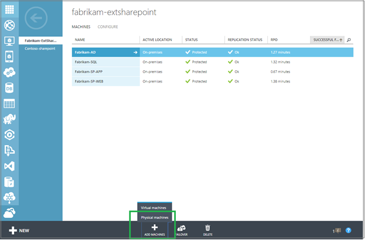

<properties
	pageTitle="使用 Site Recovery 将 Windows 虚拟机从 Amazon Web Services 迁移到 Azure | Azure"
	description="本文介绍如何使用 Azure Site Recovery 将 Amazon Web Services (AWA) 中运行的 Windows 虚拟机迁移到 Azure。"
	services="site-recovery"
	documentationCenter=""
	authors="rayne-wiselman"
	manager="jwhit"
	editor=""/>

<tags
	ms.service="site-recovery"
	ms.date="03/16/2016"
	wacn.date="04/05/2016"/>

#  使用 Azure Site Recovery 将 Amazon Web Services (AWS) 中的 Windows 虚拟机迁移到 Azure

## 概述

本文介绍如何使用 Site Recovery 将在 AWS 中运行的 Windows 实例迁移到 Azure。开始之前，请注意：

- 目前只能迁移。这意味着可以从 AWS 故障转移到 Azure，但不能重新对其进行故障回复。

请将任何评论或问题发布到本文底部，或者发布到 [Azure 恢复服务论坛](https://social.msdn.microsoft.com/Forums/zh-cn/home?forum=hypervrecovmgr)

## 先决条件

以下是开始之前需要满足的条件：

- **管理服务器**：运行 Windows Server 2012 R2 作为管理服务器的本地 VM。在此服务器上安装 Site Recovery 组件（包括配置服务器和进程服务器）。
- **EC2 VM 实例**：你想要迁移然后再保护的实例。

## 部署步骤

1. 创建保管库
2. 部署管理服务器
3. 部署管理服务器之后，验证该服务器是否能够与要迁移的 EC2 实例通信。
4. 创建保护组。保护组包含共享相同复制设置的受保护计算机。指定组的复制设置，这些设置将被应用到添加到该组的所有计算机。 
5. 安装移动服务。你要保护的每个虚拟机需要安装移动服务。此服务将数据发送到进程服务器。可以手动安装移动服务，也可以在启用了虚拟机保护后由进程服务器自动推送并安装。要迁移的 EC2 实例上的防火墙规则应配置为允许此服务的推送安装。EC2 实例的安全组应具有以下规则：

	

6. 为计算机启用保护。将想要保护的计算机添加到复制组中。

	

7. 可以使用实例的专用 IP 地址发现你要迁移到 Azure 的 EC2 实例，该地址可以在 EC2 控制台中获取。在保护组中，可以添加每个实例的专用 IP 地址。

	

	向组添加计算机之后，系统将启用保护，并且依据保护组设置运行初始复制。

9. [运行非计划的故障转移](/documentation/articles/site-recovery-failover#run-an-unplanned-failover)。初始复制完成后，可以为每个 VM 运行从 AWS 到 Azure 的非计划故障转移。（可选）你可以创建一个恢复计划并运行非计划的故障转移，从 AWS 向 Azure 迁移多个虚拟机。[详细了解](/documentation/articles/site-recovery-create-recovery-plans)恢复计划。
		
## 后续步骤

若要详细了解其他复制方案，请参阅[什么是 Azure Site Recovery？](/documentation/articles/site-recovery-overview)

<!---HONumber=Mooncake_0328_2016-->