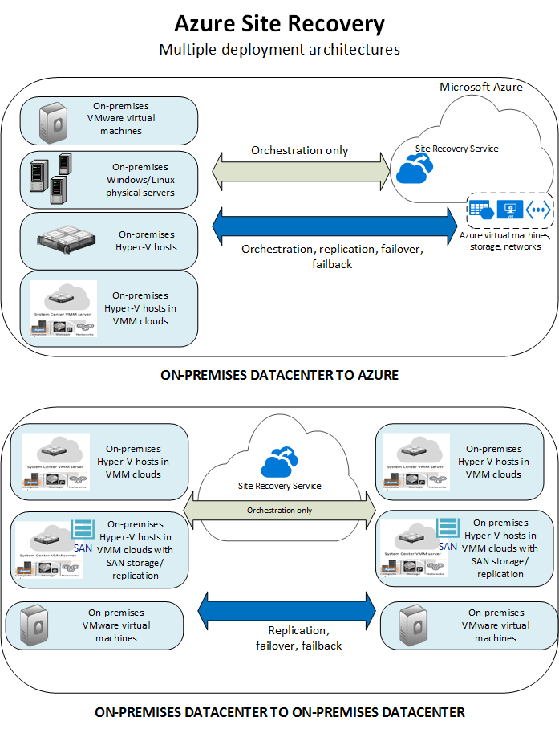

<properties
	pageTitle="什么是 Site Recovery？| Azure" 
	description="概述 Azure Site Recovery 服务，并说明如何部署该服务。" 
	services="site-recovery" 
	documentationCenter="" 
	authors="rayne-wiselman" 
	manager="jwhit" 
	editor=""/>

<tags
	ms.service="site-recovery"
	ms.date="02/22/2016" 
	wacn.date="04/05/2016"/>

#  什么是 Site Recovery？

欢迎使用 Azure Site Recovery！ 请以此文章作为开端，快速了解 Site Recovery 服务以及它如何有助于业务连续性和灾难恢复 (BCDR) 策略。

Azure 具有用于创建和处理资源的两个不同的部署模型：[资源管理器和经典](/documentation/articles/resource-manager-deployment-model)。本文同时适用于这两种模型。Azure 建议大多数新部署使用资源管理器模型。

## 概述

组织的 BCDR 策略的其中一个重要部分是，找出在发生计划的和非计划的中断时让企业工作负荷和应用保持启动并运行的方法。

Site Recovery 可帮助做到这一点，因为它能协调工作负荷和应用的复制、故障转移及恢复，因此能够在主要位置发生故障时通过辅助位置来提供工作负荷和应用。

## 为何使用 Site Recovery？ 

以下是 Site Recovery 可以为企业提供的帮助：

- **简化 BCDR 策略** — Site Recovery 可让你从单个位置轻松处理多个企业工作负荷和应用的复制、故障转移及恢复。Site Recovery 会协调复制和故障转移，但不会拦截应用程序数据或拥有任何相关信息。
- **提供灵活的复制** — 借助 Site Recovery，你可以复制 Hyper-V 虚拟机、VMware 虚拟机和 Windows/Linux 物理服务器上运行的工作负荷。 
- **简单故障转移和恢复** — Site Recovery 提供测试故障转移，既能支持灾难恢复练习，又不会影响生产环境。你也可以运行计划的故障转移，因为是预期中的中断，所以不会丢失任何数据；或是运行非计划的故障转移，以在发生非预期的灾难时将数据损失减到最少（取决于复制频率）。在故障转移之后，你可以故障回复到主站点。Site Recovery 提供包含脚本和 Azure 自动化工作簿的恢复计划，以供你自定义多层应用程序的故障转移和恢复。 
- **消除辅助数据中心** — 你可以复制到辅助本地站点或 Azure。使用 Azure 作为灾难恢复目的地可免除辅助站点的维护成本与复杂度，而且复制的数据会存储在 Azure 存储空间，能够具备其提供的所有复原能力。
- **与现有 BCDR 技术集成** — Site Recovery 能够与其他应用程序的 BCDR 功能搭配使用。例如，你可以使用 Site Recovery 保护企业工作负荷的 SQL Server 后端，包括本机支持 SQL Server AlwaysOn 以便管理可用性组的故障转移。 

## 我可以复制哪些内容？

以下是 Site Recovery 可以复制的内容摘要。

**REPLICATE** | **REPLICATE FROM** | **REPLICATE TO** | **ARTICLE**
---|---|---|---
VMware VM 上运行的工作负荷 | 本地 VMware 服务器 | Azure 存储空间 | 部署
VMware VM 上运行的工作负荷 | 本地 VMware 服务器 | 辅助 VMware 站点 | [部署](/documentation/articles/site-recovery-vmware-to-vmware) 
Hyper-V VM 上运行的工作负荷 | VMM 云中的本地 Hyper-V 主机服务器 | Azure 存储空间 | [部署](/documentation/articles/site-recovery-vmm-to-azure)
Hyper-V VM 上运行的工作负荷 | VMM 云中的本地 Hyper-V 主机服务器 | 辅助 VMM 站点 | [部署](/documentation/articles/site-recovery-vmm-to-vmm)
Hyper-V VM 上运行的工作负荷 | 使用 SAN 存储的 VMM 云中的本地 Hyper-V 主机服务器| 具有 SAN 存储的辅助 VMM 站点 | [部署](/documentation/articles/site-recovery-vmm-san)
Hyper-V VM 上运行的工作负荷 | 本地 Hyper-V 站点（无 VMM） | Azure 存储空间 | [部署](/documentation/articles/site-recovery-hyper-v-site-to-azure)
物理 Windows/Linux 服务器上运行的工作负荷 | 本地物理服务器 | Azure 存储空间 | 部署
物理 Windows/Linux 服务器上运行的工作负荷 | 本地物理服务器 | 辅助数据中心 | [部署](/documentation/articles/site-recovery-vmware-to-vmware) 

## 我可以保护哪些工作负荷？

Site Recovery 有助于应用程序感知 BCDR，让工作负荷和应用在发生中断时继续以一致的方式运行。Site Recovery 提供：

- **应用程序一致的快照** — 使用单个或多层应用的应用程序一致快照进行复制。
- **近乎同步的复制** — Hyper-V 的复制频率最低可为 30 秒，VMware 则可连续复制。
- **与 SQL Server AlwaysOn 集成** — 你可以在 Site Recovery 恢复计划中管理可用性组的故障转移。 
- **灵活的恢复计划** — 你可以使用外部脚本、手动操作和 Azure 自动化 Runbook 创建并自定义恢复计划，让你只要单击就能恢复整个应用程序堆栈。
- **自动化库** — 丰富的 Azure 自动化库提供已可供生产环境使用的应用程序特定脚本供你下载，并可集成到 Site Recovery。
- **简单的网络管理**— Site Recovery 和 Azure 中的高级网络管理简化了应用程序网络需求，包括保留 IP 地址、配置负载平衡器，以及集成 Azure 流量管理器以进行有效的网络交换操作。

## 后续步骤

- 详细信息请参阅 [Site Recovery 可以保护哪些工作负荷？](/documentation/articles/site-recovery-workload)
- 若要详细了解 Site Recovery 体系结构，请参阅 [Site Recovery 的工作原理](/documentation/articles/site-recovery-components)

<!---HONumber=Mooncake_0328_2016-->