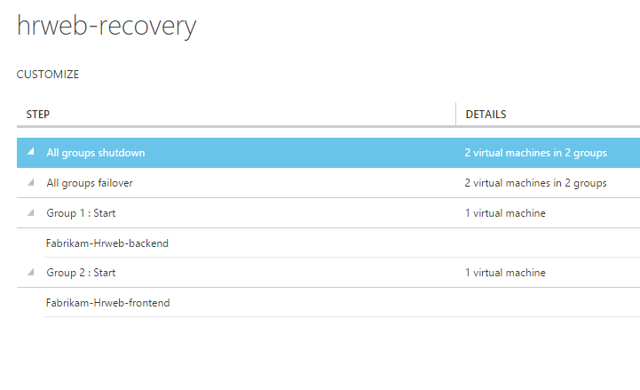
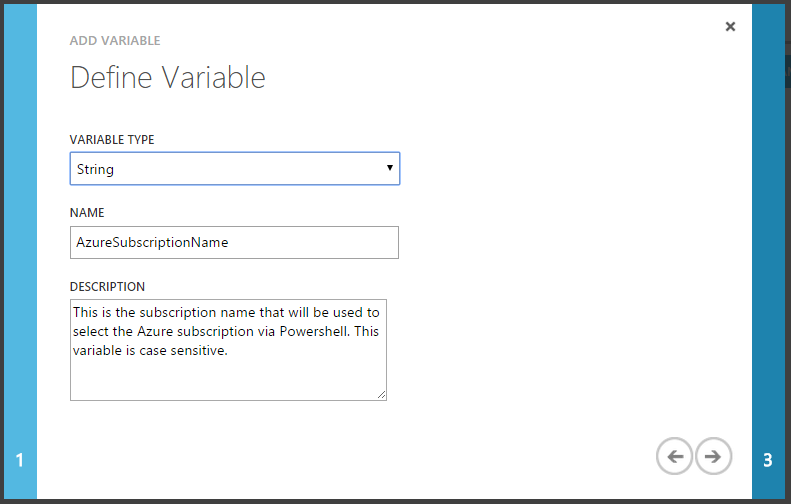
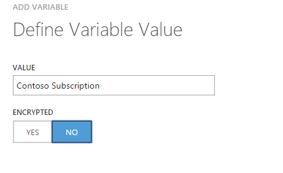
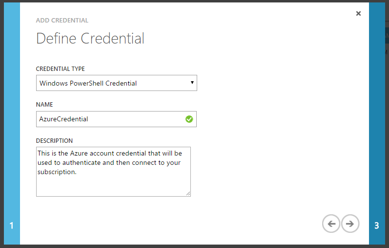
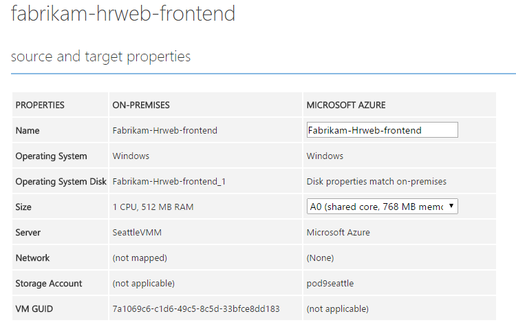
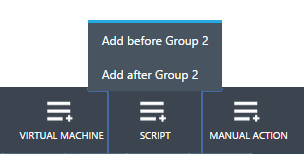
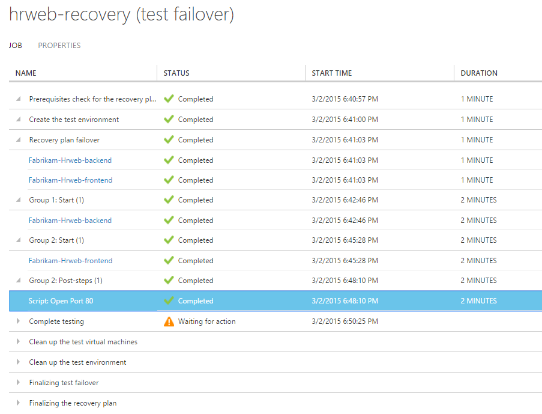

<properties 
   pageTitle="将 Azure 自动化 Runbook 添加到恢复计划 | Windows Azure" 
   description="本指南介绍了如何借助 Azure Site Recovery，在恢复到 Azure 期间使用 Azure 自动化完成复杂任务，从而扩展恢复计划" 
   services="site-recovery" 
   documentationCenter="" 
   authors="ruturaj" 
   manager="mkjain" 
   editor=""/>

<tags
   ms.service="site-recovery"
   ms.date="12/14/2015"
   wacn.date="01/21/2016"/>

  
   

# 将 Azure 自动化 Runbook 添加到恢复计划


本教程介绍 Azure Site Recovery 如何与 Azure 自动化集成以便为恢复计划提供可扩展性。恢复计划可以协调使用 Azure Site Recovery 保护的虚拟机的恢复，以便复制到辅助云和 Azure 方案。它们还可帮助实现恢复的**一致准确性**、**可重复性**和**自动化**。如果你要将虚拟机故障转移到 Azure，则与 Azure 自动化集成可扩展恢复计划，并使你能够执行 Runbook，从而可以执行强大的自动化任务。

如果你从未听说过 Azure 自动化，请在[此处](/home/features/automation)注册。阅读有关 [Azure 站点恢复](/home/features/site-recovery) 的详细信息，并在[此处](/zh-cn/blog/?p=166264)了解如何使用恢复计划来协调到 Azure 的恢复。

在本教程中，我们将了解如何将 Azure 自动化 Runbook 集成到恢复计划。我们将自动执行以前需要手动干预的简单任务，并了解如何将多步骤恢复转换成单击恢复操作。我们还将了解如何解决已出错的简单脚本。

## 在 Azure 中保护应用程序

让我们先从一个包括两个虚拟机的简单应用程序开始。在这里，我们已有一个 HR 网站Fabrikam。Fabrikam-HRweb-frontend 和 Fabrikam-Hrweb-backend 是使用 Azure Site Recovery 在 Azure 中保护的两个虚拟机。若要使用 Azure Site Recovery 保护虚拟机，请遵循以下步骤。 

1.  为虚拟机启用保护。

2.  确保虚拟机已完成初始复制，并且正在复制。

3.  等到初始复制完成，并且复制状态显示为“受保护”。


---------------------

在本教程中，我们将为 Fabrikam HR 网站创建一个恢复计划，以将应用程序故障转移到 Azure。然后，我们会将它与某个 Runbook 集成，该 Runbook 将在故障转移的 Azure 虚拟机上创建一个终结点，以便为端口 80 上的网页提供服务。

首先，让我们为应用程序创建恢复计划。

## 创建恢复计划

若要将应用程序恢复到 Azure，你需要创建一个恢复计划。使用恢复计划可以指定虚拟机的恢复顺序。首先会恢复并启动组 1 中的虚拟机，接着是组 2 中的虚拟机。

创建类似于下面的恢复计划。



若要了解有关恢复计划的详细信息，请阅读[此处](https://msdn.microsoft.com/zh-CN/library/azure/dn788799.aspx "此处")的文档。

接下来，让我们在 Azure 自动化中创建必要的项目。

## 创建自动化帐户及其资产

你需要使用一个 Azure 自动化帐户来创建 Runbook。如果你还没有帐户，请导航到  指示的“Azure 自动化”选项卡，并创建一个新帐户。

1.  为该帐户指定一个标识名称。

2.  指定要将该帐户放置到的地理区域。

建议将该帐户放在与 ASR 保管库所在的同一个区域。


接下来，在该帐户中创建以下资产。

### 添加订阅名称作为资产

1.  在 Azure 自动化“资产”中添加新设置  并选择 

2.  选择“字符串”作为变量类型

3.  指定 **AzureSubscriptionName** 作为变量名称

    

4.  指定你的实际 Azure 订阅名称作为变量值。

	

你可以从 Azure 门户上的帐户设置页中找到你的订阅名称。

### 添加 Azure 登录凭据作为资产

Azure 自动化使用 Azure PowerShell 连接到订阅以及对那里的项目进行操作。为此，你需要使用自己的 Microsoft 帐户、工作帐户或学校帐户进行身份验证。可以将帐户凭据存储在资产中，以供 Runbook 安全使用。

1.  在 Azure 自动化“资产”中添加新设置  并选择 

2.  选择“Windows PowerShell 凭据”作为凭据类型

3.  指定 **AzureCredential** 作为名称

    

4.  指定用于登录的用户名和密码。

现在，你的资产中会出现这两项设置。


[此处](/documentation/articles/powershell-install-configure)提供了有关如何通过 PowerShell 连接到订阅的详细信息。

接下来，你将要在 Azure 自动化中创建一个 Runbook，用于在故障转移后为前端虚拟机添加终结点。

## Azure 自动化上下文

ASR 会将上下文变量传递给 Runbook，以帮助你编写确定性的脚本。有人可能会认为云服务和虚拟机的名称是可预测的，但在某些情况下并不总是这样，例如，可能会由于 Azure 中不支持的字符而导致虚拟机名称发生变化。因此，此信息将作为 *context*的一部分传递到 ASR 恢复计划。

下面是上下文变量形式的示例。

        {"RecoveryPlanName":"hrweb-recovery",

        "FailoverType":"Test",

        "FailoverDirection":"PrimaryToSecondary",

        "GroupId":"1",

        "VmMap":{"7a1069c6-c1d6-49c5-8c5d-33bfce8dd183":

                {"CloudServiceName":"pod02hrweb-Shanghai-test",

                "RoleName":"Fabrikam-Hrweb-frontend-test"}

                }

        }


下表包含上下文中每个变量的名称和说明。

**变量名称** | **说明**
---|---
RecoveryPlanName | 正在运行的计划的名称。帮助你根据名称使用相同的脚本执行操作
FailoverType | 指定故障转移是测试、计划内还是计划外。 
FailoverDirection | 指定恢复是恢复到主要站点还是辅助站点
GroupID | 标识计划运行时恢复计划内的组编号
VmMap | 组中所有虚拟机的阵列
VMMap 键 | 每个 VM 的唯一键 (GUID)。与虚拟机的适用 VMM ID 相同。 
RoleName | 正在恢复的 Azure VM 的名称
CloudServiceName | 要在其下创建虚拟机的 Azure 云服务名称。


若要在上下文中标识 VmMap 键，你也可以转到 ASR 中的 VM 属性页，并查看 VM GUID 属性。



## 创作 自动化 Runbook

现在，请创建用于在前端虚拟机上打开端口 80 的 Runbook。

1.  在 Azure 自动化帐户中使用名称 **OpenPort80** 创建一个新的 Runbook


2.  导航到 Runbook 的“创作”视图，并进入草稿模式。

3.  首先指定要用作恢复计划上下文的变量
  
	```
		param (
			[Object]$RecoveryPlanContext
		)

	```

4.  接下来，使用凭据和订阅名称连接到订阅

	```
		$Cred = Get-AutomationPSCredential -Name 'AzureCredential'
	
		# Connect to Azure
		$AzureAccount = Add-AzureAccount -Environment AzureChinaCloud -Credential $Cred
		$AzureSubscriptionName = Get-AutomationVariable –Name ‘AzureSubscriptionName’
		Select-AzureSubscription -SubscriptionName $AzureSubscriptionName
	```

	请注意，此处使用了 Azure 资产 – **AzureCredential** 和 **AzureSubscriptionName**。

5.  现在，请指定终结点详细信息和你要公开其终结点的虚拟机的 GUID。在本例中为前端虚拟机。

	```
		# Specify the parameters to be used by the script
		$AEProtocol = "TCP"
		$AELocalPort = 80
		$AEPublicPort = 80
		$AEName = "Port 80 for HTTP"
		$VMGUID = "7a1069c6-c1d6-49c5-8c5d-33bfce8dd183"
	```

	这将指定 Azure 终结点协议、VM 上的本地端口及其映射的公共端口。这些变量是向 VM 添加终结点的 Azure 命令所需的参数。VMGUID 包含你要对其执行操作的虚拟机的 GUID。

6.  现在，脚本提取给定 VM GUID 的上下文，并在它引用的虚拟机上创建终结点。

	```
		#Read the VM GUID from the context
		$VM = $RecoveryPlanContext.VmMap.$VMGUID

		if ($VM -ne $null)
		{
			# Invoke pipeline commands within an InlineScript

			$EndpointStatus = InlineScript {
				# Invoke the necessary pipeline commands to add a Azure Endpoint to a specified Virtual Machine
				# Commands include: Get-AzureVM | Add-AzureEndpoint | Update-AzureVM (including parameters)

				$Status = Get-AzureVM -ServiceName $Using:VM.CloudServiceName -Name $Using:VM.RoleName | `
					Add-AzureEndpoint -Name $Using:AEName -Protocol $Using:AEProtocol -PublicPort $Using:AEPublicPort -LocalPort $Using:AELocalPort | `
					Update-AzureVM
				Write-Output $Status
			}
		}
	```

7. 完成此操作后，点击“发布 ”使脚本可执行。

下面提供了完整脚本供你参考

```
  workflow OpenPort80
  {
	param (
		[Object]$RecoveryPlanContext
	)

	$Cred = Get-AutomationPSCredential -Name 'AzureCredential'
	
	# Connect to Azure
	$AzureAccount = Add-AzureAccount -Environment AzureChinaCloud -Credential $Cred
	$AzureSubscriptionName = Get-AutomationVariable –Name ‘AzureSubscriptionName’
	Select-AzureSubscription -SubscriptionName $AzureSubscriptionName

	# Specify the parameters to be used by the script
	$AEProtocol = "TCP"
	$AELocalPort = 80
	$AEPublicPort = 80
	$AEName = "Port 80 for HTTP"
	$VMGUID = "7a1069c6-c1d6-49c5-8c5d-33bfce8dd183"
	
	#Read the VM GUID from the context
	$VM = $RecoveryPlanContext.VmMap.$VMGUID

	if ($VM -ne $null)
	{
		# Invoke pipeline commands within an InlineScript

		$EndpointStatus = InlineScript {
			# Invoke the necessary pipeline commands to add an Azure Endpoint to a specified Virtual Machine
			# This set of commands includes: Get-AzureVM | Add-AzureEndpoint | Update-AzureVM (including necessary parameters)

			$Status = Get-AzureVM -ServiceName $Using:VM.CloudServiceName -Name $Using:VM.RoleName | `
				Add-AzureEndpoint -Name $Using:AEName -Protocol $Using:AEProtocol -PublicPort $Using:AEPublicPort -LocalPort $Using:AELocalPort | `
				Update-AzureVM
			Write-Output $Status
		}
	}
  }
```

## 将脚本添加到恢复计划

脚本准备就绪后，你可以将它添加到先前创建的恢复计划。

1.  在创建的恢复计划中，选择在组 2 后面添加脚本。

2.  指定脚本名称。这只是此恢复计划的友好名称，将在恢复计划中显示。

3.  在故障转移到 Azure 脚本中，选择 Azure 自动化帐户名。

4.  在 Azure Runbook 中，选择你创作的 Runbook。


## 主端脚本

执行到 Azure 的故障转移时，你还可以选择运行主端脚本。这些脚本将在故障转移期间在 VMM 服务器上运行。
主端脚本仅适用于关机前及关机后的阶段。这是因为我们预期在发生灾难时通常无法使用主站点。
在执行非计划的故障转移期间，仅当你选择主站点操作时，才会尝试运行主端脚本。如果这些脚本不可访问或超时，故障转移将继续恢复虚拟机。
故障转移到 Azure 时，如果未在 Azure 中保护 VMM，则无法为 VMware/物理/Hyper-V 站点使用主端脚本。
但是，在从 Azure 故障回复到本地时，主端脚本 (Runbook) 可用于除 VMware 以外的其他所有目标。

## 测试恢复计划

将 Runbook 添加到计划后，你可以启动测试故障转移并查看其运行情况。我们始终建议运行测试故障转移来测试你的应用程序和恢复计划，以确保不会出现任何错误。

1.  选择恢复计划并启动测试故障转移。

2.  在执行计划期间，你可以通过状态了解 Runbook 是否已执行。

    

3.  你也可以在 Runbook 的 Azure 自动化作业页上查看详细的 Runbook 执行状态。

    

4.  在故障转移完成后，除了 Runbook 执行结果以外，你还可以通过访问 Azure 虚拟机页并查看终结点，来了解执行是否成功。


## 示例脚本

尽管我们在本教程中演练的是一个常见任务，那就是向 Azure 虚拟机添加终结点，但是，你可以使用 Azure 自动化完成其他许多功能强大的自动化任务。Microsoft 和 Azure 自动化社区提供了示例 Runbook，可帮助你开始创建自己的解决方案和实用 Runbook，可用作更大自动化任务的构建基块。你可以从库中使用这些 Runbook，通过 Azure 站点恢复为应用程序生成强大的单击式恢复计划。

## 其他资源

[Azure 自动化概述](https://msdn.microsoft.com/zh-CN/library/azure/dn643629.aspx "Azure Automation 概述")

[Azure 自动化示例脚本](http://gallery.technet.microsoft.com/scriptcenter/site/search?f[0].Type=User&f[0].Value=SC%20Automation%20Product%20Team&f[0].Text=SC%20Automation%20Product%20Team "Azure Automation 示例脚本")

<!---HONumber=Mooncake_0104_2016-->