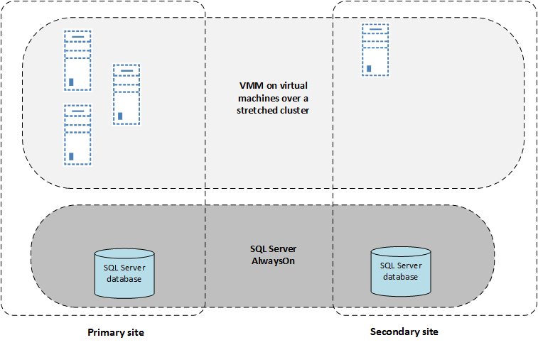

<properties
	pageTitle="使用单个 VMM 服务器设置保护"
	description="Azure Site Recovery 可以协调位于本地 VMM 云中的虚拟机到 Azure 或辅助 VMM 云的复制、故障转移和恢复。"
	services="site-recovery"
	documentationCenter=""
	authors="rayne-wiselman"
	manager="jwhit"
	editor=""/>

<tags
	ms.service="site-recovery"
	ms.date="05/04/2015"
	wacn.date="10/03/2015"/>

#  使用单个 VMM 服务器设置保护

## 概述

Azure Site Recovery 可在许多部署方案中安排虚拟机的复制、故障转移和恢复，为业务连续性和灾难恢复 (BCDR) 策略发挥作用。有关部署方案的完整列表，请[参阅 Azure Site Recovery 概述](hyper-v-recovery-manager-overview)。

如果基础结构中只有一个 VMM 服务器，你可以部署 Site Recovery 将 VMM 云中的虚拟机云复制到 Azure，或者可以在单个 VMM 服务器上的云之间复制。我们建议，仅当你无法部署两个 VMM 服务器（每个站点一个）时，才执行此操作，因为故障转移和恢复不能在这种部署中顺利进行。若要恢复，你需要从 Azure Site Recovery 控制台外部手动故障转移 VMM 服务器（在 Hyper-V 管理器控制台中使用 Hyper-V 副本）。

可以通过多种方法，使用单个 VMM 服务器设置复制：

### 独立部署

在主站点中部署一个独立的 VMM 服务器作为虚拟机，然后使用 Site Recovery 和 Hyper-V 副本将此虚拟机复制到辅助站点。为了减少停机时间，可以在 VMM 虚拟机上安装 SQL Server。如果 VMM 正在使用远程 SQL Server，则需要先恢复 SQL Server，然后再恢复 VMM 服务器。

### 群集部署

为了使 VMM 高度可用，可将它部署为 Windows 故障转移群集中的虚拟机。如果关键的工作负载正在由 VMM 管理，则这种做法非常有用，因为这可以确保工作负载的可用性，并防止运行 VMM 的主机上发生硬件故障转移。若要使用 Site Recovery 部署单个 VMM 服务器，应该通过延伸群集跨地理位置分散的站点部署 VMM 虚拟机。应该使用包含辅助站点上的副本的 SQL Server AlwaysOn 可用性组来保护 VMM 所用的 SQL Server 数据库。发生灾难时，VMM 服务器及其相应的 SQL Server 数据库将故障转移，并可从辅助站点访问。

## 开始之前

- 演练步骤解释了如何使用单个独立 VMM 服务器部署 Site Recovery。
- 在开始部署之前，请确保符合[先决条件](site-recovery-vmm-to-vmm#before-you-start)。
- 这单个 VMM 服务器必须至少配置了两个云。一个云充当受保护的云，另一个云执行保护。
- 你要保护的云必须包含以下项：
	- 一个或多个 VMM 主机组
	- 每个主机组中有一个或多个 Hyper-V 主机服务器。
	- 每个主机服务器上有一个或多个 Hyper-V 虚拟机

如果在设置本方案时遇到问题，请将你的问题发布到 [Azure 恢复服务论坛](https://social.msdn.microsoft.com/Forums/zh-CN/home?forum=hypervrecovmgr)。

## 配置单服务器部署

1. 如果尚未部署 VMM，请在装有 SQL Server 数据库的虚拟机上设置 VMM。阅读[系统要求](https://technet.microsoft.com/zh-cn/library/dn771747.aspx)
2. 在 VMM 服务器上至少设置两个云。了解详细信息：

	- [VMM 2012 和云](http://www.server-log.com/blog/2011/8/26/vmm-2012-and-the-clouds.html)。
	- [配置 VMM 云结构](/documentation/articles/site-recovery-best-practices)
	- [在 VMM 中创建私有云](https://technet.microsoft.com/zh-cn/library/jj860425.aspx)和[演练：使用 System Center 2012 SP1 VMM 创建私有云](http://blogs.technet.com/b/keithmayer/archive/2013/04/18/walkthrough-creating-private-clouds-with-system-center-2012-sp1-virtual-machine-manager-build-your-private-cloud-in-a-month.aspx)
3. 将你要在其上保护虚拟机的源 Hyper-V 主机服务器添加你要保护的云（源云）。将目标 Hyper-V 主机服务器添加到 VMM 服务器上用于提供保护的云中。
4. [创建](site-recovery-vmm-to-vmm#step-1-create-a-site-recovery-vault) Azure Site Recovery 保管库并生成保管库注册密钥。
4. 在 VMM 服务器上[安装](site-recovery-vmm-to-vmm#step-3-install-the-azure-site-recovery-provider) Azure Site Recovery 提供程序，并在保管库中注册该服务器。
5. 确保云出现在 Site Recovery 门户中，然后[配置云保护设置](site-recovery-vmm-to-vmm#step-4-configure-cloud-protection-settings)。
	- 在“源位置”和“目标位置”中，指定单个 VMM 服务器的名称。
	- 在“复制方法”中，选择“通过网络”用于初始复制，因为云位于同一个服务器上。

6. （可选）[配置网络映射](site-recovery-vmm-to-vmm#step-5-configure-network-mapping)：

	- 在“源”和“目标”中，指定单个 VMM 服务器的名称。
	- 在“源的网络”中，选择为你要保护的云配置的 VM 网络。
	- 在“目标的网络”中，选择为你要用于保护的云配置的 VM 网络。
	- 可以在同一个 VMM 服务器上的两个虚拟机 (VM) 网络之间配置网络映射。如果同一个 VMM 网络存在于两个站点上，则可以在相同网络之间映射。
7. 为你要保护的 VMM 云中的虚拟机[启用保护](site-recovery-vmm-to-vmm#step-7-enable-virtual-machine-protection)。
7. 在 Hyper-V 管理器控制台中，使用 Hyper-V 副本为 VMM 虚拟机设置复制。不应将 VMM 虚拟机添加到任何 VMM 云。

## 故障转移和恢复

### 创建恢复计划

恢复计划会将应该一起故障转移和恢复的虚拟机分组到一起。

1. 创建恢复计划时，请在“源”和“目标”中指定单个 VMM 服务器的名称。在“选择虚拟机”中，将显示与主云关联的虚拟机。
2. 然后，[创建并自定义恢复计划](/documentation/articles/site-recovery-vmm-to-vmm)。

### 恢复

发生灾难时，可以使用以下步骤恢复工作负载：

1. 从 Hyper-V 管理器控制台手动将副本 VMM 虚拟机故障转移到恢复站点。
2. 恢复 VMM 虚拟机后，可以从门户登录到 Hyper-V 恢复管理器控制台，并对虚拟机执行从主站点到恢复站点的非计划故障转移。
3.  完成非计划的故障转移后，用户可以在主站点上访问所有资源。

<!---HONumber=71-->