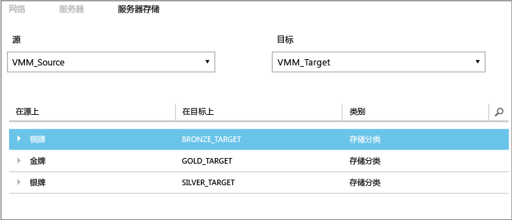
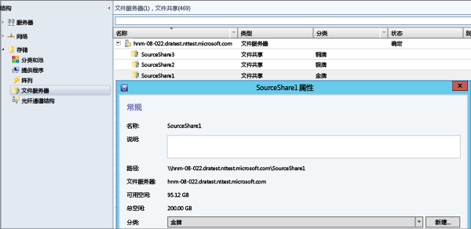

<properties
	pageTitle="站点恢复存储映射 | Windows Azure"
	description="Azure Site Recovery 可以协调位于本地的虚拟机和物理服务器到 Azure 或辅助本地站点的复制、故障转移和恢复。"
	services="site-recovery"
	documentationCenter=""
	authors="rayne-wiselman"
	manager="jwhit"
	editor=""/>

<tags
	ms.service="site-recovery"  
	ms.date="10/07/2015"
	wacn.date="11/27/2015"/>

# 站点恢复存储映射

Azure Site Recovery 有助于业务连续性和灾难恢复 (BCDR) 策略，因为它可以安排复制、故障转移和恢复虚拟机和物理服务器。在 [Site Recovery 概述](/documentation/articles/site-recovery-overview)中了解可能的部署方案。

## 关于本文

存储映射是部署 Site Recovery 时的要素。它确保以最佳方式使用存储。本文介绍存储映射，并提供几个示例来帮助你了解存储映射的工作原理。

请在 [Azure 恢复服务论坛](https://social.msdn.microsoft.com/Forums/zh-CN/home?forum=hypervrecovmgr)上发布你的任何问题。

## 概述

设置存储映射的方式取决于 Site Recovery 的部署方案。

- **本地到本地（使用 Hyper-V 副本复制）**- 在源和目标 VMM 服务器上映射存储分类，以实现以下功能：

	- **标识副本虚拟机的目标存储** - 虚拟机将复制到选择的存储目标（SMB 共享或群集共享卷 (CSV)）。
	- **放置副本虚拟机** - 使用存储映射能以最佳方式在 Hyper-V 主机服务器上放置副本虚拟机。副本虚拟机将放置在可访问映射存储分类的主机上。
	- **无存储映射** - 如果未配置存储映射，虚拟机将复制到与副本虚拟机关联的 Hyper-V 主机服务器上指定默认存储位置。

- **本地到本地（使用 SAN 复制）**- 在源和目标 VMM 服务器上映射存储阵列池，以实现以下功能：
	- **标识目标存储池** - 存储映射可确保将复制组中的 LUN 复制映射的目标存储池。

## 存储分类

可以在源和目标 VMM 服务器上的存储分类之间映射；如果两个站点由同一个 VMM 服务器管理，则可以在单个 VMM 服务器上映射。在正确配置映射并启用复制后，位于主位置的虚拟机的虚拟硬盘将复制到位于映射目标位置的存储。请注意：

- 存储分类必须可供源和目标云中的主机组使用。
- - 分类不需要具有相同类型的存储。例如，你可以将包含 SMB 共享的源分类映射到包含 CSV 的目标分类
- 有关详细信息，请阅读[如何在 VMM 中创建存储分类](https://technet.microsoft.com/zh-cn/library/gg610685.aspx)。

## 示例

如果已在 VMM 中正确配置分类，则当你在执行存储映射期间选择源和目标 VMM 服务器时，将显示源和目标分类。下面是在北京和上海具有两个位置的组织的存储文件共享与分类示例。

**位置** | **VMM 服务器** | **文件共享（源）** | **分类（源）** | **映射到** | **文件共享（目标）**
---|---|--- |---|---|---
北京 | VMM_Source| SourceShare1 | GOLD | GOLD_TARGET | TargetShare1
 | | SourceShare2 | SILVER | SILVER_TARGET | TargetShare2
 | | SourceShare3 | BRONZE | BRONZE_TARGET | TargetShare3
上海 | VMM_Target | | GOLD_TARGET | 未映射 |
| | | SILVER_TARGET | 未映射 |
 | | | BRONZE_TARGET | 未映射

可以在 Site Recovery 门户的“资源”页中的“服务器存储”选项卡上配置这些设置。

对于此示例：
- 在为 GOLD 存储 (SourceShare1) 上的任一虚拟机创建副本虚拟机后，该副本虚拟机将复制到 GOLD_TARGET 存储 (TargetShare1)。
- 在为 SILVER 存储 (SourceShare2) 上的任一虚拟机创建副本虚拟机后，该副本虚拟机将复制到 SILVER_TARGET 存储 (TargetShare2) 存储。依此类推。

下一屏幕截图显示了 VMM 中的实际文件共享及其分配的分类。

## 多个存储位置

如果将目标分类分配到了多个 SMB 共享或 CSV，则在保护虚拟机时，将自动选择最佳存储位置。如果指定的分类没有合适的目标存储，则使用 Hyper-V 主机上指定的默认存储来放置副本虚拟硬盘。

下表显示了本示例中的存储分类和群集共享卷是如何设置的。

**位置** | **分类** | **关联的存储**
---|---|---
北京 | GOLD | 
C:\ClusterStorage\\SourceVolume1

\\FileServer\\SourceShare1

 | SILVER | 
C:\ClusterStorage\\SourceVolume2

\\FileServer\\SourceShare2

上海 | GOLD_TARGET | 
C:\ClusterStorage\\TargetVolume1

\\FileServer\\TargetShare1

 | SILVER_TARGET| 
C:\ClusterStorage\\TargetVolume2

\\FileServer\\TargetShare2

下表汇总了当你在此示例环境中为虚拟机 (VM1 - VM5) 启用保护时的行为。

**虚拟机** | **源存储** | **源分类** | **映射的目标存储**
---|---|---|---
VM1 | C:\ClusterStorage\\SourceVolume1 | GOLD | 
C:\ClusterStorage\\SourceVolume1

\\\\FileServer\\SourceShare1

两个 GOLD_TARGET

VM2 | \\FileServer\\SourceShare1 | GOLD | 
C:\ClusterStorage\\SourceVolume1

\\FileServer\\SourceShare1
 
两个 GOLD_TARGET

VM3 | C:\ClusterStorage\\SourceVolume2 | SILVER | 
C:\ClusterStorage\\SourceVolume2

\\FileServer\\SourceShare2

VM4 | \\FileServer\\SourceShare2 | SILVER |
C:\ClusterStorage\\SourceVolume2

\\FileServer\\SourceShare2

两个 SILVER_TARGET

VM5 | C:\ClusterStorage\\SourceVolume3 | 不适用 | 无映射，因此将使用 Hyper-V 主机的默认存储位置

## 后续步骤

对存储映射有了更好的理解后，请开始阅读[最佳实践](/documentation/articles/site-recovery-best-practices)以做好部署准备。

<!---HONumber=82-->