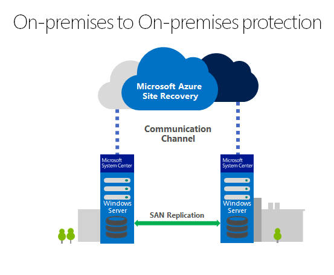
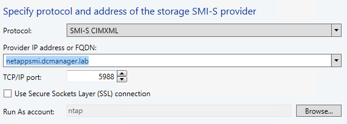
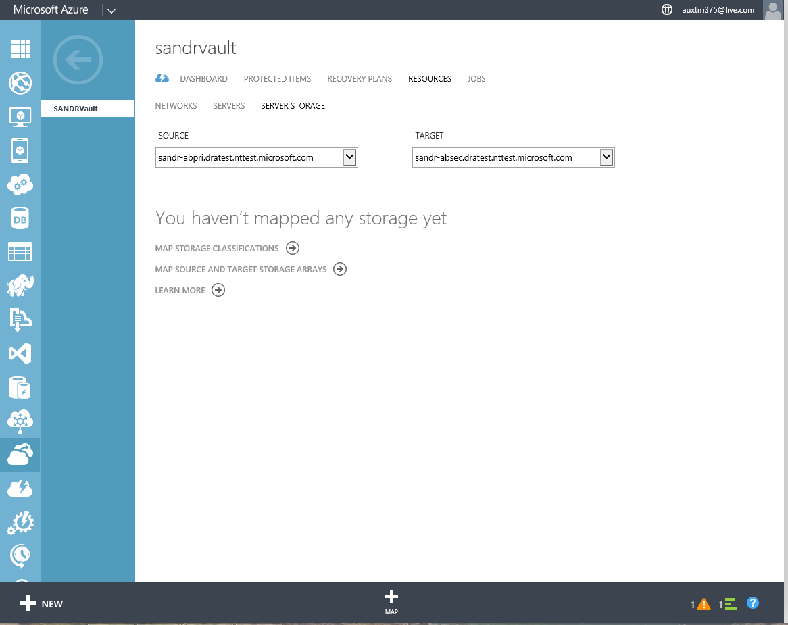
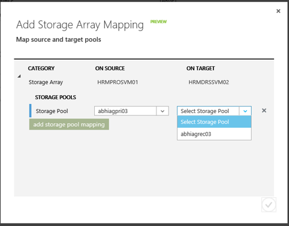
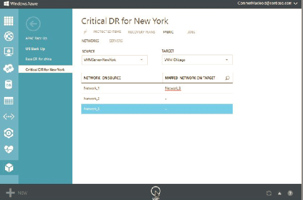
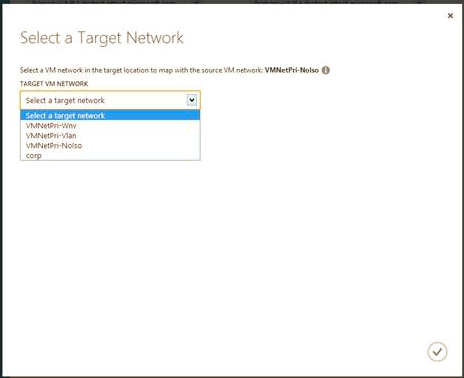
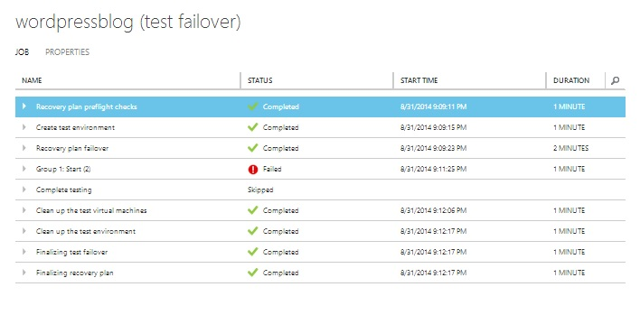

<properties 
	pageTitle="使用 SAN 在本地 VMM 站点之间设置保护" 
	description="Azure Site Recovery 可以使用 SAN 复制在本地 VMM 站点之间协调 Hyper-V 虚拟机的复制、故障转移和恢复。" 
	services="site-recovery" 
	documentationCenter="" 
	authors="rayne-wiselman" 
	manager="jwhit" 
	editor="tysonn"/>

<tags 
wacn.date="05/15/2015"
	ms.service="site-recovery" 
	ms.workload="backup-recovery" 
	ms.tgt_pltfrm="na" 
	ms.devlang="na" 
	ms.topic="article" 
	ms.date="04/23/2015" 
	ms.author="raynew"/>

# 使用 SAN 在本地 VMM 站点之间设置保护

Azure Site Recovery 可以协调虚拟机和物理服务器的复制、故障转移和恢复，为业务连续性和灾难恢复 (BCDR) 策略发挥作用。[Azure Site Recovery 概述](/documentation/articles/hyper-v-recovery-manager-overview)中提供了有关可行部署方案的信息。

本演练介绍如何部署 Site Recovery，以协调和自动化本地 Hyper-V 服务器上另一个 VMM 在本地站点，使用存储基于数组的 (SAN) 复制由 System Center VMM 管理的运行的虚拟机工作负载的保护。

业务优势包括：

- 提供可由 Site Recovery 自动实现的企业可缩放复制解决方案。
- 利用企业存储合作伙伴通过光纤通道和 iSCSI 存储提供的 SAN 复制功能。请查看我们的 [SAN 存储合作伙伴](http://go.microsoft.com/fwlink/?LinkId=518669)。
- 利用现有的 SAN 基础结构来保护 Hyper-V 群集中部署的任务关键型应用程序。 
- 为来宾群集提供支持。
- 确保使用 RTO 和 RPO 较低的同步复制以及灵活性较高的异步复制（取决于存储阵列功能），在不同的应用层实现复制一致性。  
- 与 VMM 的集成可以在 VMM 控制台中提供 SAN 管理，VMM 中的 SMI-S 可发现现有的存储。  

## 关于本文

本文包括概述和部署先决条件。它将引导你在 VMM 和 Site Recovery 保管库中配置和启用复制。你可以发现和分类 VMM 中的 SAN 存储，设置 LUN，以及向 Hyper-V 群集分配存储。最后将测试故障转移以确保一切都正常工作。

如果遇到问题，请将你的问题发布到 [Azure 恢复服务论坛](https://social.msdn.microsoft.com/Forums/azure/zh-CN/home?forum=windowsazurezhchs)。

## 概述
此方案会通过使用 SAN 复制将 Hyper-V 虚拟机从一个本地 VMM 站点备份到另一个站点，保护你的工作负载。

### 方案组成部分

- **本地虚拟机** - 在 VMM 私有云中管理的本地 Hyper-V 服务器包含你要保护的虚拟机。
- **本地 VMM 服务器** - 在想要保护的主站点以及辅助站点上需要运行一个或多个 VMM 服务器。
- **SAN 存储** - 主站点和辅助站点中各有一个 SAN 阵列
-  **Azure Site Recovery 保管库** - 保管库协调和安排本地站点之间的数据副本、故障转移和恢复。
- **Azure Site Recovery 提供程序** - 在每个 VMM 服务器上安装提供程序。

## 准备工作

### Azure 先决条件

- 你需要一个 [Azure](http://www.windowsazure.cn/) 帐户。你可以从[试用](/pricing/1rmb-trial)帐户开始。可在 [Azure Site Recovery Manager 定价详细信息](/home/features/site-recovery/#price)中获取定价信息。

### VMM 先决条件

- 尽管你可以为两个站点使用单个 VMM，但我们建议你在部署为物理或虚拟独立服务器或虚拟群集的、运行 System Center 2012 R2 [VMM Update Rollup 5.0](https://support.microsoft.com/zh-cn/kb/3023195) 的每个本地站点中使用一个 VMM 服务器。
- 要保护的主 VMM 服务器上和辅助 VMM 服务器上都至少有一个云。你要保护的主要云必须包含以下内容：
	- 一个或多个 VMM 主机组
	- 每个主机组中有一个或多个 Hyper-V 群集。
	- 一个或多个位于云中源 Hyper-V 服务器上的虚拟机。

辅助云必须包含以下信息： 
    - 一个或多个 VMM 主机组 
    - 每个主机组中有一个或多个 Hyper-V 群集。 

		
### Hyper-V 要求

- 需要在主站点和辅助站点上部署一个 Hyper-V 主机群集，该群集至少需要运行装有最新更新的 Windows Server 2012。

### SAN 先决条件

- 借助 SAN 复制，你可以使用 iSCSI 或光纤通道存储或使用共享虚拟硬盘 (vhdx) 复制来宾群集虚拟机。SAN 先决条件如下所述：
	- 需要设置两个 SAN 阵列，一个主站点中，一个辅助站点中。
	- 应该在阵列之间设置网络基础结构。应该配置对等互连和复制。应该根据存储阵列要求设置复制许可证。
	- 应该在 Hyper-V 主机服务器与存储阵列之间设置网络，使主机能够使用 ISCSI 或光纤通道与存储 LUN 通信。
	- 请参阅[支持的存储阵列](http://go.microsoft.com/fwlink/?LinkId=518669)列表。
	- 应安装存储阵列制造商提供的 SMI-S 提供程序，并且 SAN 阵列应由提供程序管理。根据提供程序的文档设置提供程序。
	- 确保阵列的 SMI-S 提供程序在 VMM 服务器可以使用 IP 地址或 FQDN 通过网络访问的服务器上。
	- 每个 SAN 阵列应该包含一个或多个可在此部署中使用的存储池。主站点上的 VMM 服务器需要管理主阵列，辅助 VMM 服务器需要管理辅助阵列。
	- 主站点上的 VMM 服务器应该管理主阵列，辅助 VMM 服务器应该管理辅助阵列。

### 网络先决条件

你可以选择配置网络映射，以确保在故障转移后以最佳方式将副本虚拟机放置在 Hyper-V 主机服务器上，并确保它们连接到适当的网络。注意：

- 启用网络映射后，位于主位置的虚拟机将连接到网络，其位于目标位置的副本将连接到其映射网络。
- 如果未配置网络映射，虚拟机在故障转移后将不会连接到 VM 网络。
- 必须在 VMM 中设置 VM 网络。有关详细信息，请阅读"在 VMM 中配置 VM 网络和网关"
- 应该已将源 VMM 服务器上的虚拟机连接到 VM 网络。该源 VM 网络应链接到与云关联的逻辑网络。

## 步骤 1：准备 VMM 基础结构

若要准备 VMM 基础结构，你需要：

1. 确保已设置 VMM 云
2. 集成并分类 VMM 中的 SAN 存储
3. 创建 LUN 并分配存储
4. 创建复制组
5. 设置 VM 网络

### 确保已设置 VMM 云

Site Recovery 将协调 VMM 云中 Hyper-V 主机服务器上的虚拟机的保护。在开始部署 Site Recovery 之前，需要确保已正确设置这些云。下面几篇不错的文章：

<!--- [What's New in Private Cloud](http://go.microsoft.com/fwlink/?LinkId=324952)-->
- Gunter Danzeisen 博客中的 [VMM 2012 和云](http://go.microsoft.com/fwlink/?LinkId=324956)。
- [配置 VMM 云结构](https://msdn.microsoft.com/zh-CN/library/azure/dn883636.aspx#BKMK_Fabric)
- [在 VMM 中创建私有云](https://technet.microsoft.com/zh-cn/library/jj860425.aspx)
- [演练：创建私有云](http://go.microsoft.com/fwlink/?LinkId=324954)（Keith Mayer 博客文章）。

### 集成并分类 VMM 中的 SAN 存储

在 VMM 控制台中添加并分类 SAN：

1. 在"结构"工作区中，单击"存储"。单击"主页">"添加资源">"存储设备"以启动"添加存储设备向导"。
2. 在"选择存储提供程序类型"页上，选择"SMI-S 提供程序发现和管理的 SAN 与 NAS 设备"。

	

3. 在"指定存储 SMI-S 提供程序的协议和地址"页上，选择"SMI-S CIMXML"并指定用于连接提供程序的设置。
4. 在"提供程序 IP 地址或 FQDN"和"TCP/IP 端口"中，指定用于连接提供程序的设置。只能对 SMI-S CIMXML 使用 SSL 连接。

	

5. 在"运行方式帐户"中，指定可以访问该提供程序的 VMM 运行方式帐户，或创建新的帐户。
6. 在"收集信息"页上，VMM 会自动尝试发现并导入存储设备信息。若要重试发现，请单击"扫描提供程序"。如果发现过程成功，发现的存储阵列、存储池、制造商、型号和容量将列在页中。

	

7. 在"选择要被管理的存储池并分配分类"中，选择 VMM 将要管理的存储池，并为其分配一个分类。将从存储池导入 LUN 信息。根据需要保护的应用程序、其容量要求以及你需要同时复制的内容创建 LUN。

	

### 创建 LUN 并分配存储

1. 将 SAN 存储集成到 VMM 后，需要创建（设置）逻辑单元 (LUN)。

- [如何选择用于在 VMM 中创建逻辑单元的方法](https://technet.microsoft.com/zh-cn/library/gg610624.aspx)
- [如何在 VMM 中设置存储逻辑单元](https://technet.microsoft.com/zh-cn/library/gg696973.aspx)

2. 然后，向 Hyper-V 主机群集分配存储容量，使 VMM 能够将虚拟机数据部署到设置的存储中： 

	- 在向群集分配存储之前，需要向群集所在的 VMM 主机组分配存储。请参阅[如何向主机组分配存储逻辑单元](https://technet.microsoft.com/zh-cn/library/gg610686.aspx)和[如何向主机组分配存储池](https://technet.microsoft.com/zh-cn/library/gg610635.aspx)。</a>
	- 然后，根据[如何在 VMM 中的 Hyper-V 主机群集上配置存储](https://technet.microsoft.com/zh-cn/library/gg610692.aspx)中所述，向群集分配存储容量。</a>

### 创建复制组

创建一个复制组，其中包含需要一起复制的所有 LUN。

1. 在 VMM 控制台中，打开存储阵列属性的"复制组"选项卡，然后单击"新建"。
2. 然后创建复制组。

	

### 设置网络

如果你要配置网络映射，请执行以下操作：

1. 阅读有关[网络映射](https://msdn.microsoft.com/zh-CN/library/azure/dn801052.aspx)的信息。
2. 在 VMM 中准备 VM 网络：
 
	- 了解有关[设置逻辑网络](https://technet.microsoft.com/zh-cn/library/jj721568.aspx)的信息。设置逻辑网络 - 阅读"在 VMM 中配置逻辑网络概述"。
	- [设置 VM 网络](https://technet.microsoft.com/zh-cn/library/jj721575.aspx)。

## 步骤 2：创建保管库

1. 登录到[管理门户](https://portal.azure.com)。

2. 展开"数据服务">"恢复服务"并单击"Site Recovery 保管库"。

3. 单击"新建">"快速创建"。
	
4. 在"名称"中，输入一个友好名称以标识此保管库。

5. 在"区域"中，为保管库选择地理区域。若要查看支持的区域，请参阅 [Azure Site Recovery 定价详细信息](/home/features/site-recovery/#price)中的"区域可用性"

6. 单击"创建保管库"。 

	

检查状态栏以确认保管库已成功创建。该保管库将在主"恢复服务"页上列为"活动"。

### 注册 VMM 服务器

1. 在"恢复服务"页面中<b></b>，单击保管库以打开"快速启动"页面。也可随时使用该图标打开"快速启动"。

	

2. 在下拉列表中，选择"使用阵列复制在 Hyper-V 本地站点之间进行"。

	

3. 在"准备 VMM 服务器"中，单击"生成注册密钥文件"。该密钥生成后，有效期为 5 天。如果你不用在要保护的 VMM 服务器上运行控制台，请将文件下载到 VMM 服务器可以访问的安全位置。例如，下载到某个共享中。注意：

- 如果你是第一次安装提供程序，请将它安装在群集中的活动节点上并完成安装，以在 Azure Site Recovery 保管库中注册 VMM 服务器。然后，在群集中的其他节点上安装提供程序。
- 如果要升级提供程序版本，请在群集中的所有节点上运行提供程序安装。

4. 单击"下载用于在 VMM 服务器上安装的 Microsoft Azure Site Recovery 提供程序"来获取最新版本的提供程序安装文件。
5. 在源和目标 VMM 服务器上运行此文件，以打开"Azure Site Recovery 提供程序安装程序"向导。
6. 在"先决条件检查"页上，选择停止 VMM 服务以开始安装提供程序。该服务将停止，并将在安装程序完成时自动重新启动。如果要在 VMM 群集上安装，则需要停止"群集"角色。

	

5. 在"Microsoft 更新"中，你可以选择获取更新。当启用了此设置时，将根据你的 Microsoft 更新策略自动安装提供程序更新。

安装提供程序后，继续设置以在保管库中注册服务器。

6. 在"Internet 连接"页上，指定在 VMM 服务器上运行的提供程序如何连接到 Internet。你可以选择不使用代理、使用在 VMM 服务器上配置的默认代理，或使用自定义代理服务器。注意：

	- 如果要使用自定义代理服务器，请在安装提供程序之前设置它。
	- 豁免以下地址通过代理进行路由：
		- 用于连接到 Azure Site Recovery 的 URL：*.hypervrecoverymanager.windowsazure.cn
		- *.accesscontrol.chinacloudapi.cn
		- *.backup.windowsazure.cn
		- *.blob.core.chinacloudapi.cn 
		- *.store.core.chinacloudapi.cn 
	- 允许 [Azure 数据中心 IP 范围](https://msdn.microsoft.com/zh-cn/library/azure/dn175718.aspx)中所述的 IP 地址，并允许 HTTP (80) 和 HTTPS (443) 协议。 
	- 如果你选择使用自定义代理，将使用指定的代理凭据自动创建一个 VMM 运行方式帐户 (DRAProxyAccount)。对代理服务器进行配置以便该帐户可以成功通过身份验证。
	- 可以在 VMM 控制台中修改 VMM 运行身份帐户设置。若要执行此操作，请打开"设置"工作区，展开"安全性"，单击"运行身份帐户"，然后修改 DRAProxyAccount 的密码。你将需要重新启动 VMM 服务以使此设置生效。
	- 将运行测试以验证 Internet 连接。任何代理错误都显示在 VMM 控制台中。

	

7. 在"注册密钥"中，选择你从 Azure Site Recovery 下载并复制到 VMM 服务器的密钥。
8. 在"服务器名称"中，指定一个友好名称以在保管库中标识该 VMM 服务器。

	

9. 在"初始云元数据同步"中，选择是否要将 VMM 服务器上所有云的元数据与保管库进行同步。此操作在每个服务器上只需执行一次。如果你不希望同步所有云，可以将此设置保留为未选中状态并在 VMM 控制台中的云属性中分别同步各个云。"数据加密"选项不适用于此方案。 

	

11. 在下一页上，单击"注册"以完成安装过程。注册后，Azure Site Recovery 将检索 VMM 服务器中的元数据。服务器显示在保管库中"服务器"<b></b>页上的"资源"选项卡中。安装提供程序后，在 VMM 控制台中修改提供程序设置。	

## 步骤 4：映射存储阵列和池

映射阵列，以指定哪个辅助存储池要从主池接收复制数据。之所以要在配置云保护之前映射存储，是因为当你为复制组启用保护时要使用映射信息。

在开始操作之前，请检查云是否已显示在保管库中。若要检测云，你可以在安装提供程序时选择同步所有云，也可以在 VMM 控制台中云属性的"常规"选项卡上选择同步特定的云。然后按如下所述映射存储阵列：

1. 单击"资源">"服务器存储">"映射源和目标阵列"。
	
2. 选择主站点上的存储阵列，并将其映射到辅助站点上的存储阵列。
3.  映射阵列中的源和目标存储池。为此，请在"存储池"中选择要映射的源和目标存储池。

	

## 步骤 5：配置云保护设置

在注册 VMM 服务器后，你可以配置云保护设置。因为你在安装提供程序时启用了选项"与保管库同步云数据"，所以，VMM 服务器上的所有云都将显示在保管库中的"受保护的项"选项卡上<b></b>。

1. 在"快速启动"页上，单击"为 VMM 云设置保护"。
2. 在"受保护的项"选项卡上，选择要配置的云并转到"配置"选项卡。注意：
3. 在"目标"中<b></b>，选择"VMM"<b></b>。
4. 在"目标位置"中<b></b>，选择管理着你要用于恢复的云的现场 VMM 服务器。
5. 在"目标云"中<b></b>，选择你要用于对源云中的虚拟机进行故障转移的目标云。注意：
	- 我们建议你选择可满足你要保护的虚拟机的恢复要求的目标云。
	- 一个云只能属于一个云对 - 作为主云或目标云。
6. Azure Site Recovery 将验证云是否有权访问支持 SAN 复制的存储，并且是否为存储阵列建立了对等互连。将显示参与的阵列对等方。
7. 如果验证成功，请在"复制类型"中选择"SAN"。

在保存设置后，将创建一个作业，可以在"作业"选项卡上监视该作业<b></b>。可以在"配置"选项卡上修改云设置<b></b>。如果希望修改目标位置或目标云，必须删除云配置，然后重新配置该云。

## 步骤 6：启用网络映射

1. 在"快速启动"页面上，单击"映射网络"。
2. 选择你要映射其中的网络的源 VMM 服务器，然后选择要将网络映射到的目标 VMM 服务器。此时将显示源网络及其关联的目标网络的列表。对于当前未映射的网络将显示空值。单击源和目标网络名称旁的信息图标以查看每个网络的子网。
3. 在"源的网络"中选择一个网络，然后单击"映射"。服务将检测目标服务器上的 VM 网络并显示它们。

	

4. 在显示的对话框中，从目标 VMM 服务器选择其中一个 VM 网络。 

	

5. 当选择某个目标网络时，会显示使用源网络的受保护云。此时也会显示与用于保护的云关联的可用目标网络。建议你选择可供你用于保护的所有云使用的一个目标网络。
6.  单击复选标记以完成映射过程。将会启动一个作业来跟踪映射进度。你可以在"作业"选项卡上查看该作业。

## 步骤 7：为复制组启用复制</h3>

在为虚拟机启用保护之前，需要为存储复制组启用复制。 

1. 在 Azure Site Recovery 门户中，在主云的属性页上打开"虚拟机"选项卡。单击"添加复制组"。
2. 选择与云关联的一个或多个 VMM 复制组，验证源和目标阵列，然后指定复制频率。

完成此操作后，Azure Site Recovery 以及 VMM 和 SMI-S 提供程序将设置目标站点存储 LUN，并启用存储复制。如果复制组已复制，Azure Site Recovery 将重用现有的复制关系并更新 Azure Site Recovery 中的信息。

## 为虚拟机启用保护

存储组开始复制后，请在 VMM 控制台中使用以下方法之一为虚拟机启用保护：

- **新的虚拟机** - 在创建新的虚拟机时，可以在 VMM 控制台中启用 Azure Site Recovery 保护，并将虚拟机与复制组相关联。
如果选择此选项，VMM 将使用智能定位以最佳方式将虚拟机存储放置在复制组的 LUN 上。Azure Site Recovery 将协调辅助站点上的阴影虚拟机的创建并分配容量，以便在故障转移后可以启动副本虚拟机。
- **现有虚拟机** - 如果已在 VMM 中部署虚拟机，你可以启用 Azure Site Recovery 保护，并执行到复制组的存储迁移。完成此操作后，VMM 和 Azure Site Recovery 将检测新虚拟机，并开始在 Azure Site Recovery 中对它进行管理，以提供保护。将在辅助站点上创建阴影虚拟机并为其分配容量，以便在故障转移后可以启动副本虚拟机。

	
	

为虚拟机启用保护后，它们将显示在 Azure Site Recovery 控制台中。你可以查看虚拟机属性，跟踪状态，以及故障转移包含多个虚拟机的复制组。请注意，在 SAN 复制中，与复制组关联的所有虚拟机必须一起故障转移。这是因为，故障转移会先在存储层发生。必须正确组合复制组，并只将关联的虚拟机放置在一起。

在"作业"选项卡中跟踪"启用保护"操作的进度，包括初始复制。在"完成保护"作业运行之后，虚拟机就可以进行故障转移了。 
	

## 步骤 8：测试部署</h3>

测试你的部署，以确保虚拟机和数据可按预期方式故障转移。为此，你将要通过选择复制组创建恢复计划。然后，对该计划运行测试故障转移。

1. 在"恢复计划"选项卡上，单击"创建恢复计划"。
1. 为恢复计划指定一个名称，并指定源和目标 VMM 服务器。源服务器必须具有启用了故障转移和恢复的虚拟机。选择"SAN"，以仅查看为 SAN 复制配置的云。

	

1. 在"选择虚拟机"中，选择复制组。将选择与复制组关联的所有虚拟机，并将其添加到恢复计划。这些虚拟机将添加到恢复计划的默认组（组 1）中。如果需要，你可以添加更多的组。请注意，在复制后，各个虚拟机将根据恢复计划组的顺序启动。

		
1. 在创建恢复计划后，它将出现在"恢复计划"选项卡上的列表中。 
1. 在"恢复计划"选项卡上，选择该计划并单击"测试故障转移"。
1. 在"确认测试故障转移"页面上，选择"无"。请注意，当启用了此选项时，故障转移后的副本虚拟机不会连接到任何网络。这将测试虚拟机是否按预期进行故障转移，但是不会测试你的复制网络环境。如果你希望运行更全面的测试故障转移，请参阅 MSDN 上的<a href="https://msdn.microsoft.com/zh-cn/library/azure/dn788912.aspx">测试本地到本地部署</a>。

	

1. 将在副本虚拟机所在的同一主机上创建测试虚拟机。它将被添加到副本虚拟机所在的云中。
1. 在故障转移之后，副本虚拟机的 IP 地址可能与主虚拟机的 IP 地址不同。虚拟机在启动后将更新它们使用的 DNS 服务器。你也可以添加一个脚本来更新 DNS 服务器，以确保及时更新。 

#### 用于检索 IP 地址的脚本
运行此示例脚本来检索 IP 地址。

    $vm = Get-SCVirtualMachine -Name <VM_NAME>
	$na = $vm[0].VirtualNetworkAdapters>
	$ip = Get-SCIPAddress -GrantToObjectID $na[0].id
	$ip.address 
  
#### 用于更新 DNS 的脚本
运行此示例脚本来更新 DNS 并指定你通过前一个示例脚本检索到的 IP 地址。

	[string]$Zone,
	[string]$name,
	[string]$IP
	)
	$Record = Get-DnsServerResourceRecord -ZoneName $zone -Name $name
	$newrecord = $record.clone()
	$newrecord.RecordData[0].IPv4Address  =  $IP
	Set-DnsServerResourceRecord -zonename $zone -OldInputObject $record -NewInputObject $Newrecord

## 监视活动

你可以使用"作业"选项卡和"仪表板"来查看和监视由 Azure Site Recovery 保管库执行的主作业，包括为云配置保护、为虚拟机启用和禁用保护、运行故障转移（计划内的、计划外的或测试），以及提交计划外故障转移。

从"作业"选项卡中，你可以查看作业，深入了解作业详细信息和错误，运行作业查询以检索符合特定条件的作业，将作业导出到 Excel，以及重新启动失败的作业。

从"仪表板"中，你可以下载提供程序和代理安装文件的最新版本，获取保管库的配置信息，查看其保护是由保管库管理的虚拟机的数量，查看最近的作业，管理保管库证书，以及重新同步虚拟机。

有关与作业和仪表板交互的详细信息，请参阅[操作和监视](https://msdn.microsoft.com/zh-cn/library/dn788906.aspx)。
	

<!--HONumber=53-->