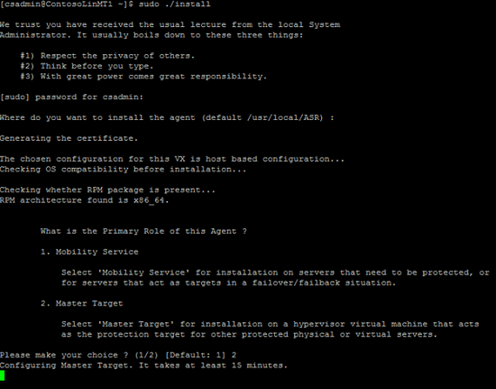
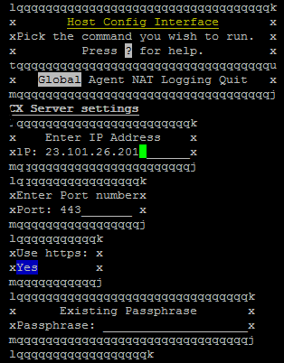
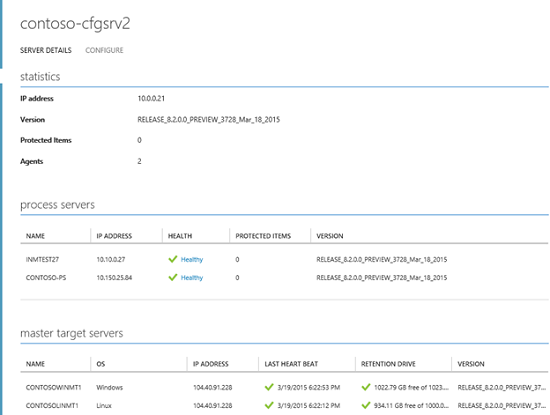
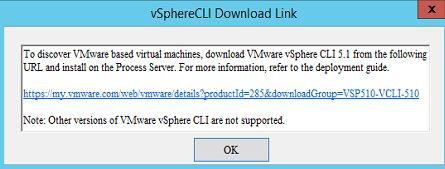

<properties
	pageTitle="在本地 VMware 虚拟机或物理服务器与 Azure 之间设置保护"
	description="Azure Site Recovery 可协调本地 VMware 服务器上的虚拟机到 Azure 以及本地物理服务器与 Azure 之间的复制、故障转移和恢复。"
	services="site-recovery"
	documentationCenter=""
	authors="rayne-wiselman"
	manager="jwhit"
	editor="tysonn"/>

<tags
	ms.service="site-recovery"
	ms.workload="backup-recovery"
	ms.tgt_pltfrm="na"
	ms.devlang="na"
	ms.topic="article"
	ms.date="04/01/2015"
	wacn.date="05/15/2015"
	ms.author="raynew"/>

# 在本地 VMware 虚拟机或物理服务器与 Azure 之间设置保护

Azure Site Recovery 有助于业务连续性和灾难恢复 (BCDR) 策略，因为它可以安排复制、故障转移和恢复虚拟机和物理服务器。了解 [Azure Site Recovery 概述](/documentation/articles/hyper-v-recovery-manager-overview)中的可能部署方案。

本演练描述如何部署 Site Recovery 以执行以下操作：

- **保护本地 VMware 虚拟机到 Azure**
- **保护本地物理 Windows 和 Linux 服务器到 Azure**

业务优势包括：

- 保护物理 Windows 或 Linux 服务器。
- 使用 Azure Site Recovery 门户简化复制、故障转移和恢复。
- 通过 Internet、站点到站点 VPN 连接或 Azure ExpressRoute 复制数据。
- 从 Azure 故障回复（还原）到本地 VMware 基础结构。
- 简化发现 VMware 虚拟机的过程。
- 实现多 VM 一致性，以便运行特定工作负荷的虚拟机和物理服务器可以一起恢复到一致数据点。
- 提供简化通过多个虚拟机分层的工作负荷的故障转移和恢复的恢复计划。

此功能目前处于预览状态。阅读[补充使用条款预览版](preview-supplemental-terms)。

## 关于本文

本文包括概述和部署先决条件。本文指导你设置所有部署组件并对虚拟机和服务器启用保护。本文最后指导你测试故障转移，以确保一切都按预期进行。

如果你遇到问题，则可以将其发布在 [Azure Recovery Services 论坛](https://social.msdn.microsoft.com/Forums/azure/zh-CN/home?forum=windowsazurezhchs)上。

## 概述

此图表说明部署组件。

### 部署组件

- **本地计算机** - 你的本地站点拥有你要保护的计算机。这些是在 VMware 虚拟机监控程序上运行的虚拟机，或是运行 Windows 或 Linux 的物理服务器。

- **本地处理服务器** - 受保护的虚拟机将复制数据发送到本地处理服务器。该处理服务器对这些数据执行大量操作。它先对数据进行优化，然后将其发送到 Azure 中的主目标服务器。它具有基于磁盘的缓存，用于缓存所收到的复制数据。它还可以推式安装必须安装在每个要保护的虚拟机或物理服务器上的移动服务，并自动发现 VMware vCenter 服务器。处理服务器是运行 Windows Server 2012 R2 的虚拟或物理服务器。我们建议将处理服务器放置在与要保护的计算机相同的网络和 LAN 网段中，但是，它可以运行在不同网络上，只要受保护的计算机对其拥有 L3 网络可见性即可。部署期间，你将设置处理服务器，并将其注册到配置服务器。

- **Azure Site Recovery 保管库** - 保管库可协调和安排本地站点与 Azure 之间的数据复制、故障转移和恢复。

- **Azure 配置服务器** - 配置服务器可在 Azure 中协调受保护的计算机、处理服务器和主目标服务器之间的通信。在执行故障转移时，它可在 Azure 中设置复制并协调恢复。配置服务器运行在 Azure 订阅中的 Azure 标准 A3 虚拟机上运行。部署期间，你将设置该服务器，并将其注册到 Azure Site Recovery 保管库。

- **主目标服务器** - Azure 中的主目标服务器使用在 Azure 存储帐户中的 blob 存储上创建的附加 VHD 保留从受保护的计算机复制的数据。你可以将其部署为基于 Windows Server 2012 R2 库映像（用于保护 Windows 计算机）的 Azure 虚拟机或 Windows 服务器，或将其部署为基于 OpenLogic CentOS 6.6 库映像（用于保护 Linux 计算机）的 Linux 服务器。两个大小调整选项可用 - 标准 A3 和标准 D14。该服务器连接到配置服务器所在的 Azure 网络。部署期间，你将创建该服务器，并将其注册到配置服务器。

- **移动服务** - 你将在每个要保护的 VMware 虚拟机或 Windows/Linux 物理服务器上安装移动服务。该服务将复制数据发送到处理服务器，再由处理服务器将其发送到 Azure 中的主目标服务器。处理服务器可以在受保护的计算机上自动安装移动服务，你也可以使用内部软件部署过程手动部署该服务。

- **数据通信和复制通道**  - 有多个选项。请注意，无论是哪个选项，都不需要你在受保护的计算机上打开任何入站网络端口。所有网络通信都从本地站点启动。
	- **通过 Internet** - 通过安全的公用 Internet 连接通信并从受保护的本地服务器和 Azure 复制数据。这是默认选项。
	- **VPN/ExpressRoute** - 通过 VPN 连接通信并在本地服务器与 Azure 之间复制数据。你将需要在本地站点与 Azure 网络之间设置站点到站点 VPN <!--或 [ExpressRoute](expressroute) 连接-->。

## 容量规划

- 为了实现最佳性能，并利用将多个受保护的计算机恢复到一致数据点的多 VM 一致性功能，我们建议你按工作负荷将虚拟机收集到保护组中。
- 你不能通过多个主目标服务器保护单个计算机，因为在磁盘复制时，镜像磁盘大小的 VHD 在 Azure blob 存储上创建，并作为数据磁盘附加到主目标服务器。很显然，你可以使用单个主目标服务器保护多个计算机。
- 主目标服务器虚拟机可以是 Azure 标准 A4 或 D14：
	- 使用标准 A4 磁盘，你可以将 16 个数据磁盘（每个数据磁盘最多有 1023 GB）添加到每个虚拟机。
	- 使用标准 D14 磁盘，你可以将 32 个数据磁盘（每个数据磁盘最多有 1023 GB）添加到每个虚拟机。
- 请注意，附加到主目标服务器的一个磁盘作为保留驱动器保留。Azure Site Recovery 让你可以定义保留时段，并在该时段内随时恢复受保护的计算机。保留驱动器可保存特定时段内的磁盘更改的日志。这可以将最大磁盘数减少到 15（对于 A4）或 31（对于 D14）。
- 若要伸缩部署，你可以添加多个处理服务器和主目标服务器。如果现有的主目标服务器上没有足够的可用磁盘，则你应该部署第二个主目标服务器。如果受保护的计算机的数据更改率超过现有处理服务器的能力，则你应该部署其他处理服务器。请注意，处理服务器和主目标服务器不需要一对一映射。你可以使用第二个主目标服务器部署第一个处理服务器，依此类推。
处理服务器使用基于磁盘的缓存。确保有足够的可用空间 C:/ 用于缓存。缓存大小调整将受你要保护的计算机的数据更改率的影响。通常，我们建议对中型部署使用 600 GB 的缓存目录大小，但是，你可以运用以下指南。

	

## 开始之前

### Azure 先决条件

- 你将需要 [Azure](http://www.windowsazure.cn/) 帐户。你可以开始[试用](/pricing/1rmb-trial)。
- 你将需要使用 Azure 存储帐户来存储复制的数据。需要为帐户启用地域复制。它应该位于 Azure Site Recovery 保管库所在的区域中，并与相同订阅关联。若要了解详细信息，请阅读 [Microsoft Azure 存储简介](/documentation/articles/storage-introduction/)。
- 你将需要 Azure 虚拟网络，配置服务器和主目标服务器将部署在该网络上。它应该位于 Azure Site Recovery 保管库所在的订阅和区域中。
- 确保你有足够的 Azure 资源用于部署所有组件。在 [Azure 订阅限制](/documentation/articles/azure-subscription-service-limits)中阅读更多内容。
- 检查你要保护的计算机是否符合 Azure 虚拟机要求。

	- **磁盘计数** - 单个受保护的服务器最多可以支持 31 个磁盘。
	- **磁盘大小** - 单个磁盘的容量不能超过 1023 GB
	- **群集** - 不支持群集服务器
	- **启动** - 不支持统一可扩展固件接口 (UEFI)/可扩展固件接口 (EFI)
	- **卷** - 不支持 Bitlocker 加密卷
	- **服务器名称** - 名称应包含 1 到 63 个字符（字母、数字和连字符）。名称必须以字母或数字开头，并以字母或数字结尾。在计算机受到保护后，你可以修改 Azure 名称。

	在[虚拟机支持](https://msdn.microsoft.com/zh-CN/library/azure/dn469078.aspx#BKMK_E2A)中阅读有关 Azure 要求的更多内容。

### 方案组件先决条件

- 处理服务器：
	- 你可以在运行带有最新更新的 Windows Server 2012 R2 的物理或虚拟机上部署处理服务器。在 C:/ 上安装。
	- 我们建议你将该服务器放置在你要保护的计算机所在的网络和子网上。
	- 在该服务器上安装 VMware vSphere CLI 5.1，以便它可以自动发现 VMware vCenter 服务器。
- 配置服务器、主目标服务器、处理服务器和故障回复服务器的安装路径只能使用英文字符。例如，对于运行 Linux 的主目标服务器，路径应为 **/usr/local/ASR**。

### VMware 先决条件

- 用于管理 VMware vSphere 虚拟机监控程序的 VMware vCenter 服务器。它应该运行的是带有最新更新的 vCenter 5.1 或 5.5 版。
- 一个或多个包含要保护的 VMware 虚拟机的 vSphere 虚拟机监控程序。虚拟机监控程序应该运行的是带有最新更新的版本 ESX/ESXi 版本 5.1 或 5.5。
- 通过 vCenter 服务器发现的 VMware 虚拟机应安装 VMware 工具并使其正在运行。

### 受保护的 Windows 计算机先决条件

运行 Windows 的受保护的物理服务器或 VMware 虚拟机应具备以下条件：

- 支持的 64 位操作系统：Windows Server 2012 R2、Windows Server 2012 或 Windows Server 2008 R2 SP1 及其更高版本。
- 主机名、装载点、设备名称、Windows 系统路径（例如：C:\Windows）只能采用英文形式。
- 操作系统应安装在 C:\ 驱动器上。
- 支持 Windows 服务器的日常存储选项。
- 受保护的计算机上的防火墙规则应允许其访问 Azure 中的配置服务器和主目标服务器。
- 在故障转移后，如果你要通过远程桌面连接到 Azure 中的 Windows 虚拟机，请确保对本地计算机启用远程桌面。如果你没有通过 VPN 连接，则防火墙规则应允许通过 Internet 的远程桌面连接。

### 受保护的 Linux 计算机先决条件

运行 Linux 的受保护的物理服务器或 VMware 虚拟机应具备以下条件：

- 支持的操作系统：Centos 6.4、6.5、6.6；Oracle Enterprise Linux 6.4、6.5（运行 Red Hat 兼容内核或 Unbreakable Enterprise Kern Release 3 (UEK3)）、SUSE Linux Enterprise Server 11 SP3
- 主机名、装载点、设备名称，以及 Linux 系统路径和文件名（例如 /etc/；/usr）只能采用英文形式。
- 可以对使用以下存储的本地计算机启用保护：
	- 文件系统：EXT3、ETX4、ReiserFS、XFS
	- 多路径软件：设备映射器 - 多路径
	- 卷管理器：LVM2
	- 不支持使用 HP CCISS 控制器存储的物理服务器。
- 受保护的计算机上的防火墙规则应允许其访问 Azure 中的配置服务器和主目标服务器。
- 如果要在故障转移后使用 Secure Shell 客户端 (ssh) 连接到运行 Linux 的 Azure 虚拟机，请确保将受保护的计算机上的 Secure Shell 服务设置为在系统启动时自动启动，并且防火墙规则允许建立到它的 ssh 连接。  

### 第三方先决条件

在这种情况下，一些部署组件依赖第三方软件才能正常工作。有关完整列表，请参阅[第三方软件通知和信息](#third-party)  

## 步骤 1：创建保管库

1. 登录到[管理门户](https://manage.windowsazure.cn)。

2. 展开"数据服务">"恢复服务"，并单击"Site Recovery 保管库"。

3. 单击"新建">"快速创建"。

4. 在"名称"中，输入一个友好名称以标识此保管库。

5. 在"区域"中，为保管库选择地理区域。若要查看受支持的区域，请参阅 [Azure Site Recovery 价格详细信息](/home/features/site-recovery/#price)中的"地域可用性"

6. 单击"创建保管库"。

	

检查状态栏以确认保管库已成功创建。保管库将以**"活动"**形式列在主要的**"恢复服务"**页上。

## 步骤 2：部署配置服务器

1. 在"恢复服务"页中，单击保管库以打开"快速启动"页。也可随时使用该图标打开"快速启动"。

	

2. 在下拉列表中，选择**"在使用 VMware/物理服务器的本地站点与 Azure 之间"**。
3. 在**"准备目标(Azure)资源"**中，单击**"部署配置服务器"**。

	

4. 指定连接到该服务器所需的配置服务器详细信息和凭据。选择该服务器所在的 Azure 网络。指定要分配到该服务器的内部 IP 地址和子网。在单击**"确定"**时，将在你的订阅中针对配置服务器创建基于 Azure Site Recovery Windows Server 2012 R2 库映像的标准 A3 虚拟机。它将使用保留的公用 IP 地址作为第一个实例在新的云服务中创建。

    **注意：**任何子网中的前四个 IP 地址保留供内部 Azure 使用。指定其他任何可用的 IP 地址。

	

5. 你可以在**"作业"**选项卡中监视进度。

	

6.  在部署配置服务器后，请在 Azure 门户中的**"虚拟机"**页上记下分配给它的公用 IP 地址。然后，在**"终结点"**选项卡中，记下映射到专用端口 443 的公用 HTTPS 端口。稍后将主目标服务器和处理服务器注册到配置服务器时，你将需要用到这些信息。配置服务器使用以下终结点部署：

	- HTTPS：公用端口用于协调通过 Internet 在组件服务器与 Azure 之间进行的通信。专用端口 443 用于协调通过 VPN 在组件服务器与 Azure 之间进行的通信。
	- 自定义：公用端口用于通过 Internet 进行的故障回复工具通信。专用端口 9443 用于通过 VPN 进行的故障回复工具通信。
	- PowerShell：专用端口 5986
	- 远程桌面：专用端口 3389

    **注意：**请勿删除在配置服务器部署期间创建的任何终结点的公用或专用端口号。

## 步骤 3：在保管库中注册配置服务器

1. 在**"准备目标资源"**中，单击**"下载注册密钥"**。此时将自动生成密钥文件。该文件在生成后的 5 天内有效。将该文件复制到配置服务器。
2. 在虚拟机的**"仪表板"**页上，单击**"连接"**。使用下载的 RDP 文件通过远程桌面登录到配置服务器。在首次登录时，Azure Site Recovery 安装和注册向导将自动运行。

	

3. 按照该向导的说明操作。你将需要下载并安装 MySQL Server 并指定其凭据。在**"Azure Site Recovery 注册"**页上，浏览到已复制到该服务器的密钥文件。

	

4. 在注册完成后，将生成密码。将其复制到安全位置。你将需要它进行身份验证，并将处理服务器和主目标服务器注册到配置服务器。它还可用于确保配置服务器通信中的通道完整性。你可以重新生成该密码，但是此后，你将需要使用新密码重新注册主目标服务器和处理服务器。

	

在注册后，保管库中的**"配置服务器"**页上将列出该配置服务器。若要通过代理服务器路由配置服务器 Internet 通信，请运行 C:\Program Files\Microsoft Azure Site Recovery Provider\DRConfigurator.exe，然后指定要使用的代理服务器。你将需要使用已下载并复制到配置服务器的注册密钥重新注册到 Azure Site Recovery。  

## 步骤 4：设置 VPN 连接

你可以通过 Internet 或使用 VPN 或 ExpressRoute 连接来连接到配置服务器。Internet 连接将虚拟机的终结点与服务器的公用虚拟 IP 地址结合使用。VPN 将服务器的内部 IP 地址与终结点的专用端口结合使用。

你可以按以下方式配置到该服务器的 VPN 连接：

1. 如果你未设置站点到站点<!--或 Azure ExpressRoute--> 连接，则可以在此处了解详细信息：

	- [配置到 Azure 虚拟机的站点到站点连接](https://msdn.microsoft.com/zh-CN/library/azure/dn133795.aspx)
	<!--- [配置 ExpressRoute](https://msdn.microsoft.com/zh-CN/library/azure/dn606306.aspx)-->

2. 在保管库中，单击**"服务器"**>**"配置服务器"**>"配置服务器">**"配置"**。
3. 在**"连接设置"**中，将**"连接类型"**设置为**"VPN"**。请注意，如果已设置 VPN，但没有来自本地站点的 Internet 访问，请确保选择"VPN"选项。否则，处理服务器无法将复制数据发送到其公用终结点上的主目标服务器。

	

## 步骤 5：部署主目标服务器

1. 在**"准备目标(Azure)资源"**中，单击**"部署主目标服务器"**。
2. 指定主目标服务器的详细信息和凭据。该服务器将部署在注册到的配置服务器所在的 Azure 网络中。在单击完成时，将使用 Windows 或 Linux 库映像创建 Azure 虚拟机。

	

    **注意：**任何子网中的前四个 IP 地址保留供内部 Azure 使用。指定其他任何可用的 IP 地址。

3. Windows 主目标服务器虚拟机使用以下终结点创建：

	- 自定义：处理服务器使用公用端口来通过 Internet 发送复制数据。处理服务器使用专用端口 9443 来通过 VPN 将复制数据发送到主目标服务器。
	- Custom1：处理服务器使用公用端口来通过 Internet 发送控制元数据。处理服务器使用专用端口 9080 来通过 VPN 将控制元数据发送到主目标服务器。
	- PowerShell：专用端口 5986
	- 远程桌面：专用端口 3389

    **注意：**请勿删除或更改在主目标服务器部署期间创建的任何终结点的公用或专用端口号。

4. Linux 主目标服务器虚拟机使用以下终结点创建：

	- 自定义：处理服务器使用公用端口来通过 Internet 发送复制数据。处理服务器使用专用端口 9443 来通过 VPN 将复制数据发送到主目标服务器。
	- Custom1：处理服务器使用公用端口来通过 Internet 发送控制元数据。处理服务器使用专用端口 9080 来通过 VPN 将控制数据发送到主目标服务器
	- SSH：专用端口 22

    **注意：**请勿删除或更改在主目标服务器部署期间创建的任何终结点的公用或专用端口号。

5. 在**"虚拟机"**中，等待虚拟机启动。

	- 如果该服务器已配置有 Windows，请记下远程桌面详细信息。
	- 如果已配置有 Linux，并且要通过 VPN 连接，请记下虚拟机的内部 IP 地址。如果要通过 Internet 连接，请记下公用 IP 地址。

6.  登录到该服务器以完成安装，并将其注册到配置服务器。如果你运行的是 Windows，请执行以下操作：

	1. 启动到虚拟机的远程桌面连接。在首次登录时，将在 PowerShell 窗口中运行一个脚本。请勿将其关闭。在它完成之后，主机代理配置工具将自动打开以注册服务器。
	2. 在**"主机代理配置"**中，指定配置服务器的内部 IP 地址和端口 443。你可以使用内部地址和专用端口 443，即使你没有通过 VPN 模式连接，因为虚拟机附加到配置服务器所在的 Azure 网络。保持**"使用 HTTPS"**处于启用状态。输入以前记下的配置服务器的密码。单击**"确定"**以注册服务器。请注意，你可以忽略该页上的 NAT 选项。这些选项不会用到。

	

6. 如果你运行的是 Linux，请执行以下操作：
	1. 使用 sftp 客户端将[服务器安装程序 tar 文件](http://go.microsoft.com/fwlink/?LinkID=529757&clcid=0x409)复制到虚拟机。或者，你可以登录，并使用 wget 从"快速启动"页中的链接下载该文件。
	2. 使用 Secure Shell 客户端登录到服务器。请注意，如果你已通过 VPN 连接到 Azure 网络，请使用内部 IP 地址。否则，请使用外部 IP 地址和 SSH 公用终结点。
	3. 从 gzip 压缩过的安装程序中提取文件，方法是运行以下程序：**tar -xvzf Microsoft-ASR_UA_8.2.0.0_RHEL6-64***."

		

	4. 确保你位于 tar 文件内容提取到的目录中，然后运行命令"**sudo ./install.sh**"。选择选项 **2。主目标**。使其他选项使用默认设置。

		

	5. 在安装完成后，将显示命令行**"主机配置接口"**。请勿调整窗口大小。
	6. 使用箭头键来选择**"全局"**，然后按 Enter。
	7. 在**"输入 IP 地址"**中，输入配置服务器的内部地址和端口 22。
	8.  指定以前记下的配置服务器的密码，然后按 Enter。选择**"退出"**以完成安装。请注意，如果要使用 PuTTY 客户端通过 ssh 连接到虚拟机，则可以使用 Shift+Insert 来粘贴。
	9.  使用右箭头键退出，然后按 Enter。

		

7. 等待几分钟 (5-10)，然后在**"服务器"**>**"配置服务器"**页上，检查主目标服务器是否作为注册服务器列在**"服务器详细信息"**选项卡中。如果运行的是 Linux，并且它未注册，请从 /usr/local/ASR/Vx/bin/hostconfigcli 再次运行主机配置工具。你将需要设置访问权限，方法是以超级用户的身份运行 chmod。

	

## 步骤 6：部署本地处理服务器

1. 单击"快速启动">**"在本地安装处理服务器"**>**"下载并安装处理服务器"**。

	

2. 将下载的 zip 文件复制到要将处理服务器安装到的服务器。该 zip 文件包含两个安装文件：

	- Microsoft-ASR_CX_TP_8.2.0.0_Windows*
	- Microsoft-ASR_CX_8.2.0.0_Windows*

3. 解压缩存档，然后将安装文件复制到该服务器上的某个位置。
4. 运行 **Microsoft-ASR_CX_TP_8.2.0.0_Windows*** 安装文件，然后按相关说明操作。此时将安装部署所需的第三方组件。
5. 然后，运行 **Microsoft-ASR_CX_8.2.0.0_Windows***。
6. 在**"服务器模式"**页上，选择**"处理服务器"**。
7.	在**"配置服务器详细信息"**中，如果要通过 VPN 连接，请指定配置服务器的内部 IP 地址和端口 443。否则，请指定公用虚拟 IP 地址和映射的公用 HTTP 终结点。
8.	如果要在使用自动推送安装服务时禁用验证，请清除**"验证移动服务软件签名"**。签名验证需要来自处理器的 Internet 连接。
9.	键入配置服务器的密码。

	

8. 完成该服务器的安装。请记住，你将需要在该服务器上安装 VMware vSphere CLI 5.1，才能发现 vCenter 服务器。如果你在处理服务器安装完成后安装 VMware vSphere CLI 5.1，请记得重新启动处理服务器。

	

验证处理服务器是否已在保管库 >**"配置服务器"**>**"服务器详细信息"**中成功注册。

请注意，如果在注册处理服务器时未对移动服务禁用签名验证，则稍后可以按以下方式执行该操作：

1. 以管理员身份登录到处理服务器，然后打开文件 C:\pushinstallsvc\pushinstaller.conf 以进行编辑。在 **[PushInstaller.transport]** 部分下，添加下面一行：**SignatureVerificationChecks="0"**。保存并关闭该文件。
2. 重新启动 InMage PushInstall 服务。

## 步骤 7：安装最新更新

继续之前，请确保你已安装最新更新。请记得按以下顺序安装更新：
1. 在 Azure 中使用**"虚拟机"**页登录到配置服务器，然后从以下链接下载最新更新：[http://go.microsoft.com/fwlink/?LinkID=533809](http://go.microsoft.com/fwlink/?LinkID=533809)。按照安装程序说明安装更新
2. 在已安装处理服务器的服务器上，从 [http://go.microsoft.com/fwlink/?LinkID=533810](http://go.microsoft.com/fwlink/?LinkID=533810) 下载最新更新，并按照安装程序说明对其进行安装
3.	在已安装主目标服务器的服务器上安装最新更新
	1. 对于 Windows 主目标服务器，在 Azure 中使用**"虚拟机"**页登录到 Windows 主目标服务器，然后从 [http://go.microsoft.com/fwlink/?LinkID=533811](http://go.microsoft.com/fwlink/?LinkID=533811) 下载最新更新。按照安装程序说明安装更新
	2. 对于 Linux 主目标服务器，使用 sftp 客户端复制位于 [http://go.microsoft.com/fwlink/?LinkID=533812](http://go.microsoft.com/fwlink/?LinkID=533812) 的安装程序 tar 文件。你也可以在 Azure 中使用**"虚拟机"**页登录到 Linux 主目标服务器，然后使用 wget 来下载该文件。从 gzip 压缩过的安装程序中提取文件，然后运行命令"sudo ./install.sh"以安装更新

## 步骤 8：添加 vCenter 服务器

1. 在**"服务器"**>**"配置服务器"**选项卡上，选择配置服务器，然后单击添加 vCenter 服务器。

	

2. 指定 vCenter 服务器的详细信息，并选择要用于发现它的处理服务器。处理服务器必须位于 vCenter 服务器所在的网络上，并且应安装有 VMware vSphere CLI 5.1。
3. 发现完成之后，vCenter 服务器将在"配置服务器详细信息"下方列出。

	

## 步骤 9：创建保护组

1. 打开**"受保护的项"**>**"保护组"**，然后单击添加一个保护组。

	

2. 在**"指定保护组设置"**页上，指定保护组的名称，并选择要在其上创建该组的配置服务器。

	

3. 在**"指定复制设置"**页上，配置要用于该组中的所有计算机的复制设置。

	

4. 设置：
	- **多 VM 一致性**：如果你将此项打开，则它将在保护组中的计算机之间创建共享的应用程序一致性恢复点。当保护组中的所有计算机运行的是相同工作负荷时，此设置最为有用。所有计算机都将恢复到相同数据点。仅适用于 Windows 服务器。
	- **RPO 阈值**：当连续数据保护复制 RPO 超过配置的 RPO 阈值时，将生成警报。
	- **恢复点保留期**：指定保留时段。受保护的计算机可在此时段内恢复到任何点。
	- **应用程序一致性快照频率**：指定创建包含应用程序一致性快照的恢复点的频率。

你可以监视保护组，因为它们是在**"受保护的项"**页上创建的。

## 步骤 10：推送移动服务

在向保护组添加计算机时，处理服务器将自动推送移动服务，并将其安装在每个计算机上。如果你要对运行 Windows 的受保护的计算机使用此自动推送机制，则将需要在每个计算机上执行以下操作：

1. 将 Windows 防火墙配置为允许**"文件和打印机共享"**和**"Windows Management Instrumentation"**。对于属于某个域的计算机，你可以使用 GPO 配置防火墙策略。
2. 用于执行推式安装的帐户必须位于要保护的计算机上的"管理员"组中。请注意，这些凭据仅用于推式安装。移动服务不会将它们存储在任何位置，在服务器受到保护后，它们会被丢弃。在向保护组添加计算机时，你将提供这些凭据。

	

3. 如果管理员帐户不是域帐户，则你将需要在本地计算机上禁用远程用户访问控制。为此，请在 HKEY_LOCAL_MACHINE\SOFTWARE\Microsoft\Windows\CurrentVersion\Policies\System 中，创建条目 LocalAccountTokenFilterPolicy（如果不存在），并为其分配 DWORD 值 1

如果要保护运行 Linux 的计算机，则你将需要执行以下操作：

1. 确保帐户是源 Linux 服务器上的根用户
1. 在要保护的计算机上安装最新的 openssh、openssh-server 和 openssl 程序包。
1. 启用 ssh 端口 22。
2. 启用 sshd 配置文件中的 Sftp 子系统和密码身份验证：
	1. 以根用户帐户登录。
	2. 在文件 /etc/ssh/sshd_config 中，归档以"PasswordAuthentication"开头的行。取消注释该行，并将值从"no"更改为"yes"。

		

	4. 找到以"Subsystem"开头的行，并取消注释该行。

		

## 步骤 11：向保护组中添加计算机

1. 打开**"受保护的项"**>**"保护组"**>**"计算机"**选项卡，然后添加由已发现的 vCenter 服务器管理的虚拟机或物理计算机。我们建议，保护组应镜像你的工作负荷，以便于你向相同组中添加运行特定应用程序的计算机。

	

2. 在**"添加虚拟机"**的**"选择虚拟机"**页中，选择 V-Center 服务器，然后从其中选择计算机。

	

    如果你已创建保护组，并在其后添加 vCenter 服务器，则 Azure Site Recovery 门户需要 15 分钟刷新，而虚拟机需要 15 分钟列在"向保护组添加计算机"对话框中。如果你要立即继续向保护组中添加计算机，请突出显示配置服务器（不要单击它），并点击底部操作窗格中的"刷新"按钮。

3. 在向保护组添加计算机时，将从本地处理服务器自动安装移动服务。为了使自动推送机制发挥作用，请确保你已按上一步所述设置你的受保护的计算机。
4. 在**"选择虚拟机"**中，选择管理你要保护的计算机的 vCenter 服务器，然后选择虚拟机。

4. 选择要用于复制的服务器和存储。

	

5. 提供源服务器的用户凭据。在源计算机上自动安装移动服务时需要这样做。对于 Windows 服务器，帐户应该对源服务器具有管理员权限。对于 Linux，帐户必须是 root。

	

6. 单击复选标记以完成向保护组添加计算机，并对每个计算机启动初始复制。你可以在**"作业"**页上监视状态。

	

7. 此外，单击**"受保护的项"**> <保护组> > **"虚拟机"**以监视保护状态。初始复制完成并且计算机同步数据后，它们将显示**"受保护"**状态。

	

## 步骤 12：设置受保护的计算机属性

1. 在计算机的状态为**"受保护"**后，你可以配置其故障转移属性。在"保护组详细信息"中，选择计算机，然后打开**"配置"**选项卡。
2. 在故障转移后，你可以在 Azure 中修改要提供给计算机的名称，以及 Azure 大小。你还可以选择故障转移后要将计算机连接到的 Azure 网络。请注意：

	- Azure 计算机的名称必须符合"先决条件"中所述的 Azure 要求。
	- 默认情况下，Azure 中的复制虚拟机不连接到 Azure 网络。如果希望复制的虚拟机进行通信，请确保为其设置相同的 Azure 网络。

	

## 步骤 13：运行故障转移

1. 在**"恢复计划"**页上，添加恢复计划。指定该计划的详细信息，并选择**"Azure"**作为目标。

	

2. 在**"选择虚拟机"**中，选择保护组，然后选择该组中要添加到恢复计划的计算机。

	

3. 如果需要，你可以自定义该计划以创建组，并排列顺序，恢复计划中的计算机以该顺序进行故障转移。你还可以添加手动操作和脚本的提示。在恢复到 Azure 时，可以使用 [Azure Automation Runbooks](/documentation/articles/site-recovery-runbook-automation) 添加脚本。

	

5. 在**"恢复计划"**页中，选择该计划，然后单击**"测试故障转移"**。
6. 在**"确认故障转移"**中，验证故障转移方向（到 Azure），然后选择要故障转移到的恢复点。
7. 等待故障转移作业完成，然后验证故障转移是否按预期工作，以及复制的虚拟机是否在 Azure 中成功启动。

## 第三方软件通知和信息

请勿翻译或本地化

Microsoft 产品或服务中运行的软件和固件基于或包含下列项目中的材料（统称为"第三方代码"）。Microsoft 不是"第三方代码"的原创作者。Microsoft 获取此类"第三方代码"依据的原始版权声明和许可证如下文所述。

A 部分中的信息与下列项目中的"第三方代码"组件相关。提供的此类许可证和信息仅供参考。本"第三方代码"将由 Microsoft 依据 Microsoft 产品或服务的 Microsoft 软件许可条款重新许可给你。  

B 部分中的信息与 Microsoft 要依据原始许可条款提供给你的"第三方代码"组件相关。

完整文件可以在 [Microsoft 下载中心](http://go.microsoft.com/fwlink/?LinkId=530254)上找到。Microsoft 保留未在此处明确授予的所有权利，无论是暗示、禁止或其他方式。

<!--HONumber=53-->