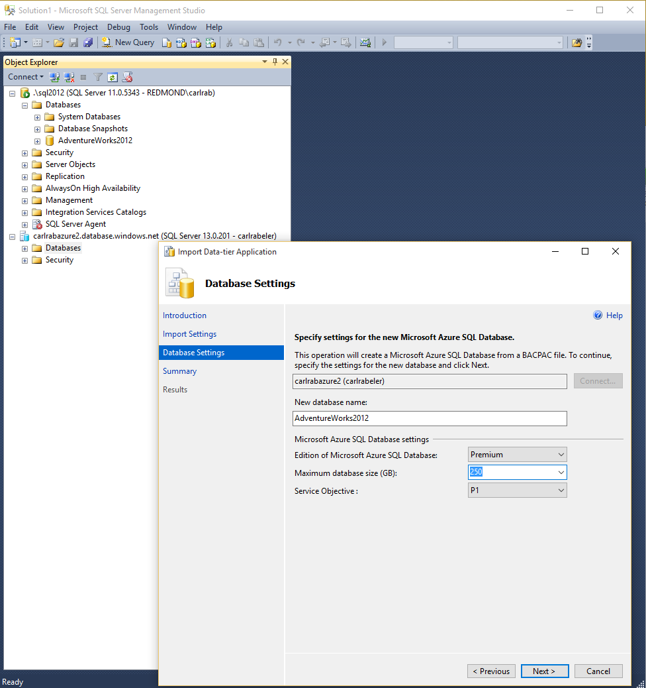

<properties
   pageTitle="将 SQL Server 数据库迁移到 Azure SQL 数据库"
   description="Microsoft Azure SQL 数据库, 数据库部署, 数据库迁移, 导入数据库, 导出数据库, 迁移向导"
   services="sql-database"
   documentationCenter=""
   authors="carlrabeler"
   manager="jeffreyg"
   editor=""/>

<tags
   ms.service="sql-database"
   ms.date="12/17/2015"
   wacn.date="01/15/2016"/>

# 使用 SSMS 从 BACPAC 导入到 SQL 数据库

> [AZURE.SELECTOR]
- [SSMS](/documentation/articles/sql-database-cloud-migrate-compatible-import-bacpac-ssms)
- [SqlPackage](/documentation/articles/sql-database-cloud-migrate-compatible-import-bacpac-sqlpackage)
- [Azure 门户](/documentation/articles/sql-database-import)
- [PowerShell](/documentation/articles/sql-database-import-powershell)

本文说明如何使用 SQL Server Management Studio 中的“导出数据层应用程序”向导从 [BACPAC](https://msdn.microsoft.com/zh-cn/library/ee210546.aspx#Anchor_4) 文件导入到 SQL 数据库。

> [AZURE.NOTE]下面的步骤假定你已预配 Azure SQL 逻辑实例并且手头有连接信息。

1. 确认你安装了最新版本的 SQL Server Management Studio。Management Studio 的新版本将每月更新一次，以与 Azure 门户的更新保持同步。

	 >[AZURE.IMPORTANT]建议始终使用最新版本的 Management Studio 以保持与 Microsoft Azure 和 SQL 数据库的更新同步。[更新 SQL Server Management Studio](https://msdn.microsoft.com/zh-cn/library/mt238290.aspx)。

2. 打开 Management Studio 并连接到你在对象资源管理器中的源数据库。

	

3. 创建 BACPAC 后，连接到 Azure SQL 数据库服务器，右键单击“数据库”文件夹，然后单击“导入数据层应用程序...”

    

4.	在导入向导中，选择你刚导出的 BACPAC 文件，以在 Azure SQL 数据库中创建新的数据库。

    

5.	为 Azure SQL 数据库中的数据库提供**新数据库名称**，设置 **Microsoft Azure SQL 数据库的版本**（服务层）、**最大数据库大小**和**服务目标**（性能级别）。

    

6.	单击“下一步”，然后单击“完成”以将该 BACPAC 文件导入 Azure SQL 数据库服务器中的新数据库。

7. 使用对象资源管理器连接到 Azure SQL 数据库服务器中的已迁移数据库。

8.	使用 Azure 门户查看数据库及其属性。

<!---HONumber=Mooncake_0104_2016-->
