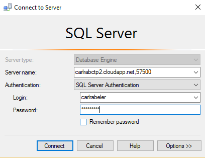

<properties
   pageTitle="使用“将数据库部署到 Microsoft Azure 数据库”向导将 SQL Server 数据库迁移到 SQL 数据库"
   description="Microsoft Azure SQL 数据库, 数据库迁移, Microsoft Azure 数据库向导"
   services="sql-database"
   documentationCenter=""
   authors="carlrabeler"
   manager="jeffreyg"
   editor=""/>

<tags
   ms.service="sql-database"
   ms.date="12/17/2015"
   wacn.date="01/15/2016"/>

# 使用“将数据库部署到 Microsoft Azure 数据库”向导将 SQL Server 数据库迁移到 SQL 数据库

SQL Server Management Studio 中的“将数据库部署到 Microsoft Azure 数据库”向导可将[兼容的 SQL Server 数据库](/documentation/articles/sql-database-cloud-migrate)直接迁移到 Azure SQL 数据库服务器。

## 使用“将数据库部署到 Microsoft Azure 数据库”向导

> [AZURE.NOTE]执行以下步骤假定你有[预配的 SQL 数据库服务器](/documentation/articles/sql-database-get-started)。

1. 确认你安装了最新版本的 SQL Server Management Studio。Management Studio 的新版本将每月更新一次，以与 Azure 门户的更新保持同步。

    > [AZURE.IMPORTANT]建议始终使用最新版本的 Management Studio 以保持与 Microsoft Azure 和 SQL 数据库的更新同步。[更新 SQL Server Management Studio](https://msdn.microsoft.com/zh-cn/library/mt238290.aspx)。

2. 打开 Management Studio 并连接到要在对象资源管理器中迁移的 SQL Server 数据库。
3. 右键单击对象资源管理器中的数据库，指向“任务”，然后单击“将数据库部署到 Microsoft Azure SQL 数据库...”

	

4.	在部署向导中，单击“下一步”，然后单击“连接”以配置与 SQL 数据库服务器的连接。

	

5. 在“连接到服务器”对话框中，输入用于连接到 SQL 数据库服务器的连接信息。

	

5.	为**新数据库名称**提供新数据库名称，设置 **Microsoft Azure SQL 数据库的版本**（[服务层](/documentation/articles/sql-database-service-tiers)）、**最大数据库大小**、**服务目标**（性能级别）以及此向导将在迁移过程中创建的 [BACPAC](https://msdn.microsoft.com/zh-cn/library/ee210546.aspx#Anchor_4) 文件的**临时文件名**。

	

6.	完成向导，以执行数据库迁移。根据数据库的大小和复杂性，部署可能需要花费几分钟到几小时。如果此向导检测到兼容性问题，错误将显示到屏幕上，并且迁移将不会继续。有关如何修复数据库兼容性问题的指导，请转到[修复数据库兼容性问题](sql-database-cloud-migrate-fix-compatibility-issues)。

7.	使用对象资源管理器连接到 Azure SQL 数据库服务器中的已迁移数据库。
8.	使用 Azure 门户查看数据库及其属性。

## 下一步：修复兼容性问题（如果有）

[修复数据库兼容性问题](/documentation/articles/sql-database-cloud-migrate-fix-compatibility-issues)（如果有）。

<!---HONumber=Mooncake_0104_2016-->
