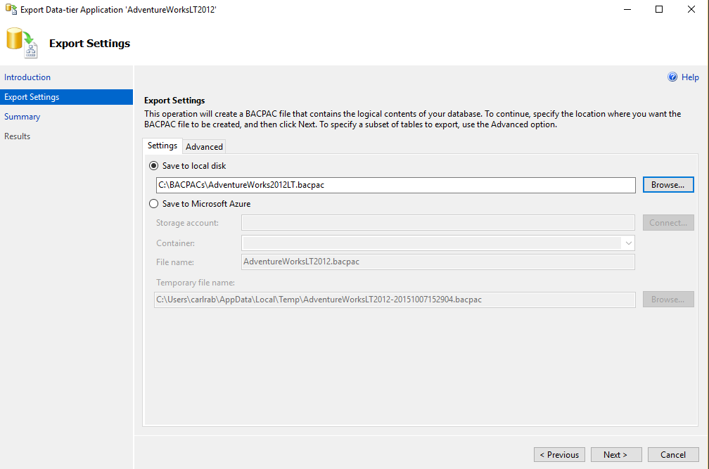

<properties
   pageTitle="使用 SSMS 确定 SQL 数据库兼容性"
   description="Windows Azure SQL 数据库, 数据库迁移, SQL 数据库兼容性, 导出数据层应用程序向导"
   services="sql-database"
   documentationCenter=""
   authors="carlrabeler"
   manager="jeffreyg"
   editor=""/>

<tags
   ms.service="sql-database"
   ms.date="12/17/2015"
   wacn.date="01/15/2016"/>

# 使用 SSMS 确定 SQL 数据库兼容性

> [AZURE.SELECTOR]
- [SqlPackage](/documentation/articles/sql-database-cloud-migrate-determine-compatibility-sqlpackage)
- [SQL Server Management Studio](/documentation/articles/sql-database-cloud-migrate-determine-compatibility-ssms)
 
在本文中，你将了解如何使用 SQL Server Management Studio 中的“导出数据层应用程序”向导确定要迁移到 SQL 数据库的 SQL Server 数据库是否兼容。

## 使用 SQL Server Management Studio

1. 确认你安装了最新版本的 SQL Server Management Studio。Management Studio 的新版本将每月更新一次，以与 Azure 门户的更新保持同步。

 	 >[AZURE.IMPORTANT]建议始终使用最新版本的 Management Studio 以保持与 Windows Azure 和 SQL 数据库的更新同步。[更新 SQL Server Management Studio](https://msdn.microsoft.com/zh-cn/library/mt238290.aspx)。

2. 打开 Management Studio 并连接到你在对象资源管理器中的源数据库。
3. 右键单击对象资源管理器中的源数据库，指向“任务”，然后单击“导出数据层应用程序...”

	

4. 在导出向导中，单击“下一步”，然后在“设置”选项卡上配置导出，以将 BACPAC 文件保存到本地磁盘位置或 Azure Blob。只有在没有数据库兼容性问题时，才会保存 BACPAC 文件。如果有兼容性问题，这些问题将显示在控制台上。

	

5. 单击“高级”选项卡并清除“全选”复选框以跳过导出数据。此时我们的目标仅是测试兼容性。

	

6. 单击“下一步”，然后单击“完成”。在向导验证架构后，将显示数据库兼容性问题（如果有）。

	

7. 如果未显示任何错误，则数据库是兼容的，你已可以进行迁移。如果有错误，你需要修复它们。若要查看错误，请单击“验证架构”所对应的错误。
	

8.	如果 *.BACPAC 文件已成功生成，则数据库与 SQL 数据库兼容，并已准备好迁移。

## 下一步：修复兼容性问题（如果有）

[修复数据库兼容性问题](/documentation/articles/sql-database-cloud-migrate-fix-compatibility-issues)（如果有）。

<!---HONumber=Mooncake_0104_2016-->
