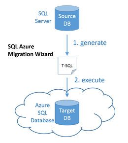

<properties 
   pageTitle="迁移到 Azure SQL Database" 
   description="Microsoft Azure SQL Database, 数据库部署, 数据库迁移, 导入数据库, 导出数据库, 迁移向导" 
   services="sql-database" 
   documentationCenter="" 
   authors="pehteh" 
   manager="jeffreyg" 
   editor="monicar"/>

<tags 
wacn.date="" ms.service="sql-database" ms.date="04/14/2015"/>

# 将数据库迁移到 Azure SQL Database
Azure SQL Database V12 几乎与 SQL Server 2014 的引擎完全兼容。因此，它极大地简化了将大多数数据库从 SQL Server 迁移到 Azure SQL Database 的任务。许多数据库的迁移是一个直截了当的转移操作，它只需对架构做出少量的更改（如果有），并且只需对应用程序做出轻微的改造，甚至不需要任何改造。如果需要对数据库做出更改，你可以更好地限制这种更改的范围。

根据设计，SQL Database 不支持 SQL Server 的服务器设限功能，因此，在迁移依赖于这些功能的数据库和应用程序之前，仍然需要对它们进行某种形式的改造。尽管 SQL Database V12 改进了与 SQL Server 的兼容性，但仍然需要精心规划和执行迁移，对于较复杂的大型数据库尤其如此。

## 概览
可通过不同的方法将 SQL Server 数据库迁移到 Azure，其中的每种方法使用一个或多个工具。有些方法可以快速方便地完成，而有些方法需要较长的准备工作。请注意，迁移复杂的大型数据库可能需要好几个小时。

### 选项 #1
***使用 SQL Server Management Studio (SSMS) 迁移兼容的数据库***

数据库是使用 SSMS 部署到 Azure SQL Database 的。可以直接将数据库部署或导出到 BACPAC，然后导入该数据库以创建新的 Azure SQL Database。当源数据库与 Azure SQL Database 完全兼容时使用。

### 方法 #2
***使用 SQL Azure 迁移向导 (SAMW) 迁移几乎兼容的数据库***

使用 SQL Azure 迁移向导处理数据库，以生成包含架构或者包含架构加上 BCP 格式数据的迁移脚本。当数据库架构需要升级并且向导可以处理所做的更改时使用。

### 选项 #3
***使用 Visual Studio (VS) 和 SAMW 脱机更新数据库架构，然后使用 SSMS 部署***

源数据库将导入 Visual Studio 数据库项目，以便进行脱机处理。然后，配合项目中的所有脚本运行 SQL Azure 迁移向导，以应用一系列的转换和更正操作。项目面向 SQL Database V12 并经过生成，系统将报告所有剩余错误。然后，用户使用 Visual Studio 中的 SQL Server 工具手动解决这些错误。成功生成项目后，将它发布回到源数据库的副本。然后，使用选项 #1 将这个更新的数据库部署到 Azure SQL Database。如果需要进行仅有架构的迁移，则可以将架构直接从 Visual Studio 发布到 Azure SQL Database。当数据库架构所需的更改量超过了 SAMW 单独可处理的数量时使用。

## 确定要用的选项
- 如果你预料到无需更改就可以迁移某个数据库，则应使用选项 #1，因为该选项可以快速方便地完成。如果你不太确定，请根据选项 #1 中所述，先从数据库中导出仅有架构的 BACPAC。如果导出成功且未出错，则你可以使用选项 #1 迁移数据库及其数据。  
- 如果在使用选项 #1 导出期间遇到错误，请根据选项 #2 中所述，使用 SQL Azure 迁移向导 (SAMW) 以仅有架构的模式处理数据库。如果 SAMW 未报告错误，则可以使用选项 #2。 
- 如果 SAMW 报告架构需要额外的工作，则除非这种工作只需要简单的修复，否则最好使用选项 #3，并在 Visual Studio 中结合使用 SAMW 和手动应用的架构更改，来脱机更正数据库架构。然后，就地更新源数据库的副本，并使用选项 #1 将它迁移到 Azure。

## 迁移工具
使用的工具包括 SQL Server Management Studio (SSMS)、Visual Studio 中的 SQL Server 工具（VS、SSDT）和 SQL Azure 迁移向导 (SAMW)，以及 Azure 门户。

> 请务必安装最新版本的客户端工具，因为早期版本与 SQL Database v12 不兼容。

### SQL Server Management Studio (SSMS)
可以使用 SSMS 将兼容的数据库直接部署到 Azure SQL Database，或者将数据库的逻辑备份导出为 BACPAC，然后，仍然使用 SSMS 导入该 BACPAC 来创建新的 Azure SQL Database。

[下载最新版本的 SSMS](https://msdn.microsoft.com/zh-cn/library/mt238290.aspx)，或确保使用 SQL Server 2013 或更高版本中的 CU6。

### SQL Azure 迁移向导 (SAMW)
SAMW 可用于分析现有数据库的架构是否与 Azure SQL Database 兼容，在许多情况下，它可用于生成然后部署包含架构和数据的 T-SQL 脚本。在转换期间，如果该向导遇到了它无法转换的架构内容，则会报告错误。如果发生这种情况，需要进一步编辑生成的脚本，然后才能成功部署脚本。SAMW 处理的某些函数或存储过程的主体通常已在 Visual Studio 中的 SQL Server 工具（参阅下文）执行验证中排除，因此，Visual Studio 单独执行的验证可能不会报告该向导所发现的问题。将 SAMW 与 Visual Studio 中的 SQL Server 工具结合使用可以明显减少迁移复杂架构所需的工作量。

请务必使用 CodePlex 提供的最新版本的 [SQL Azure 迁移向导](http://sqlazuremw.codeplex.com/)。

### Visual Studio 中的 SQL Server 工具（VS、SSDT）
Visual Studio 中的 SQL Server 工具可用于创建和管理数据库项目，该项目包括架构中每个对象的 T-SQL 文件集。可以从数据库或者脚本文件导入该项目。创建后，可将该项目部署到 Azure SQL Database v12；生成项目，然后验证架构兼容性。单击某个错误会打开相应的 T-SQL 文件，然后便可以编辑该文件并更正错误。修复所有错误后，可将项目直接发布到 SQL Database 以创建空数据库，或者发布回到原始 SQL Server 数据库的（副本）以更新其架构，然后，便可以使用上述 SSMS 来部署该数据库及其数据。

请使用包含 Visual Studio 2013 Update 4 或更高版本的[最新 SQL Server Data Tools for Visual Studio](https://msdn.microsoft.com/zh-cn/library/mt204009.aspx)。

## 比较
| 选项 #1 | 方法 #2 | 选项 #3 |
| ------------ | ------------ | ------------ |
| 将兼容的数据库部署到 Azure SQL Database | 生成包含更改的迁移脚本并在 Azure SQL Database 上执行 | 就地更新数据库，然后部署到 Azure SQL Database |
||  |  |
| 使用 SSMS | 使用 SAMW | 使用 SAMW、VS、SSMS |
|简单的过程要求架构兼容。架构按原样迁移。 | SAMW 生成的 T-SQL 脚本包含所需的更改来确保兼容性。某些不受支持的功能将从架构中删除，其中的大多数功能将标记为错误。 | 架构将导入 Visual Studio 中的数据库项目，并（可选）使用 SAMW 进行转换。使用 Visual Studio 中的 SQL Server 工具和所用的最终架构进行其他更新，以就地更新数据库。 |
| 如果导出 BACPAC，则可以选择仅迁移架构。 | 可以将向导配置为编写架构或架构加上数据的脚本。 | 可以从 Visual Studio 只将架构直接发布到 Azure。使用任何所需的更改就地更新数据库，以便能够部署/导出架构和数据。 |
| 始终部署或导出整个数据库。 | 可以选择从迁移中排除特定的对象。 | 全面控制迁移中包含的对象。 |
| 未规定出错时必须更改输出，源架构必须兼容。 | 可能难以根据需要编辑生成的单个整体脚本。可以在 SSMS 或装有 SQL Server 数据库工具的 Visual Studio 中打开并编辑脚本。只有在修复所有错误后，才可以将脚本部署到 Azure SQL Database。| 可以使用 Visual Studio 中的 SQL server 工具的完整功能。脱机更改架构。 |
| 在 Azure 中进行应用程序验证。应该很少，因为无需更改即可迁移架构。 | 迁移后在 Azure 中进行应用程序验证。也可以在本地安装生成的脚本以进行初始应用程序验证。 | 将数据库部署到 Azure 之前，可以在 SQL Server 中执行应用程序验证。 |
| Microsoft 支持的工具。 | 从 CodePlex 下载的受社区支持的工具。 | Microsoft 支持的工具，可以选择使用从 CodePlex 下载的受社区支持的工具。 |
| 轻松配置的单步或双步过程。 | 可以通过一个易用的向导，来安排架构转换与生成以及到云的部署。 | 更复杂的多步过程（如果只部署架构，则更方便一些）。 |

<!---HONumber=66-->