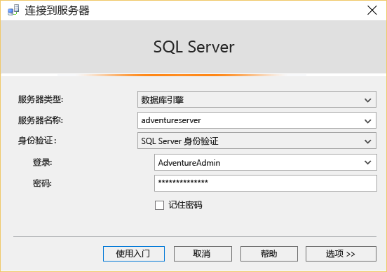
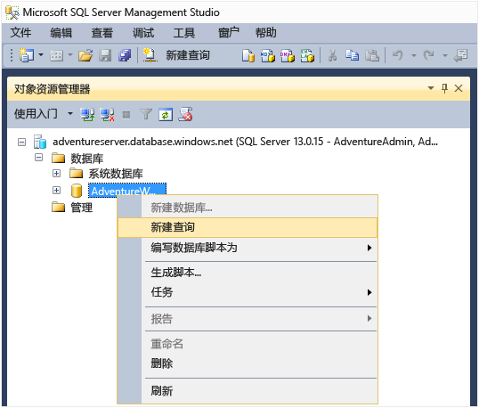
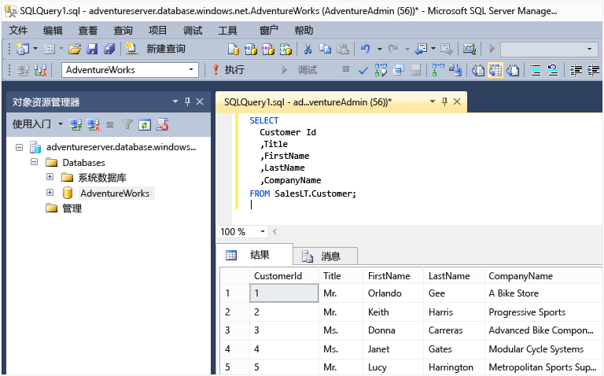

<properties
	pageTitle="如何使用 SSMS 连接到 Azure SQL 数据库 | Microsoft Azure"
	description="了解如何使用 SSMS 连接到 Azure SQL 数据库。"
	metaCanonical=""
	services="sql-database"
	documentationCenter=""
	authors="stevestein"
	manager="jeffreyg" 
	editor="" />

<tags
	ms.service="sql-database"
	ms.date="10/09/2015"
	wacn.date="12/22/2015" />

# 使用 SQL Server Management Studio 进行连接

> [AZURE.SELECTOR]
- [C#](/documentation/articles/sql-database-connect-query)
- [SSMS](/documentation/articles/sql-database-connect-query-ssms)
- [Excel](/documentation/articles/sql-database-connect-excel)

本文介绍如何安装 SQL Server Management Studio (SSMS)，连接到 Azure 中的数据库服务器，然后使用 Transact-SQL 语句执行简单的查询。

你首先需要有一个 Azure 中的 SQL 数据库。你可以按照 [Microsoft Azure SQL 数据库入门](/documentation/articles/sql-database-get-started)中的说明快速创建一个 SQL 数据库。此处的示例基于你参考该文章创建的 AdventureWorks 示例数据库，但直到执行查询前，这些步骤适用于任何 SQL 数据库。

## 安装并启动 SQL Server Management Studio (SSMS)

使用 SQL 数据库时，应使用最新版本的 SSMS。请参阅[下载 SQL Server Management Studio](https://msdn.microsoft.com/zh-cn/library/mt238290.aspx) 以获取最新版本的 SSMS。使用最新版本时，如果有最新的更新，SSMS 会自动通知你。

## 启动 SSMS 并连接到 SQL 数据库服务器

1. 在 Windows 搜索框中键入“Microsoft SQL Server Management Studio”，然后单击桌面应用以启动 SSMS。
2. 在“连接到服务器”对话框的“服务器名称”框中，键入托管你的 SQL 数据库的服务器名称，格式为 *&lt;servername>*.**database.chinacloudapi.cn**。
3. 从“身份验证”列表中选择“SQL Server 身份验证”。
4. 键入创建服务器时设置的“登录名”和“密码”，然后单击“连接”。

	

### 如果连接失败

连接失败的最常见原因是服务器名称、用户名或密码错误，以及出于安全原因，服务器不允许进行连接。请确保服务器的防火墙设置允许来自本地计算机 IP 地址的连接和 SSMS 客户端使用 IP 地址的连接。有时这二者不同。

如果连接由于防火墙设置而失败，最新版本的 SSMS 将在询问后为你创建防火墙规则。若要获取该版本，请参阅[下载 SSMS](https://msdn.microsoft.com/zh-cn/library/mt238290.aspx)。如果你使用早期的版本，则错误消息中会报告 IP 地址，你需要将此 IP 地址添加到服务器防火墙规则。有关详细信息，请参阅[如何：配置防火墙设置（Azure SQL 数据库）](/documentation/articles/sql-database-configure-firewall-settings)。

## 运行示例查询

连接完成后，可以运行示例查询。如果没有使用 [Microsoft Azure SQL 数据库入门](/documentation/articles/sql-database-get-started)中的 AdventureWorks 示例创建数据库，此查询将不会正常工作。请直接跳到“后续步骤”以了解详细信息。

1. 在“对象资源管理器”中，导航到 **AdventureWorks** 数据库。
2. 右键单击数据库，然后选择“新建查询”。

	

3. 在查询窗口中，复制并粘贴以下代码。

		SELECT
		CustomerId
		,Title
		,FirstName
		,LastName
		,CompanyName
		FROM SalesLT.Customer;

4. 单击“运行”按钮。以下屏幕截图显示查询成功。

	

## 后续步骤

可以按照与 SQL Server 基本相同的方法，使用 Transact-SQL 语句来创建和管理 Azure 中的数据库。如果你熟悉如何使用 SQL Server 的 Transact-SQL，请参阅 [Azure SQL 数据库 Transact-SQL 信息](/documentation/articles/sql-database-transact-sql-information)，了解差异摘要。

如果你不熟悉 Transact-SQL，请参阅[教程：编写 Transact-SQL 语句](https://msdn.microsoft.com/zh-cn/library/ms365303.aspx)和 [Transact-SQL 参考（数据库引擎）](https://msdn.microsoft.com/zh-cn/library/bb510741.aspx)。

<!---HONumber=Mooncake_1207_2015-->