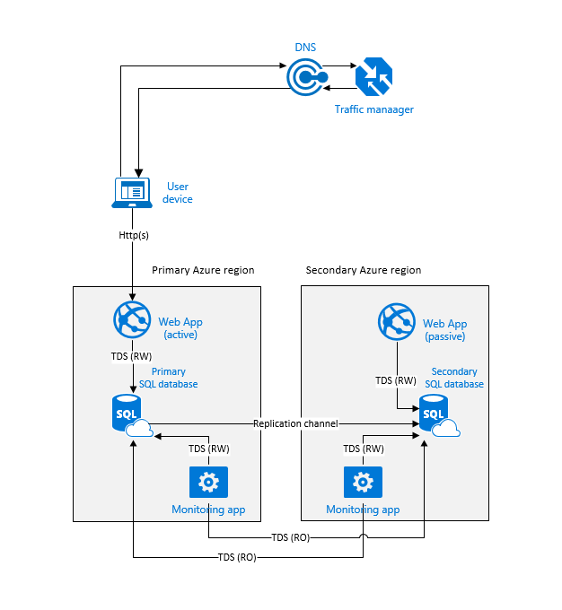
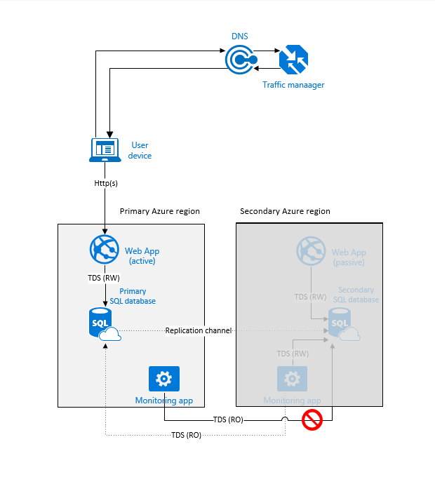
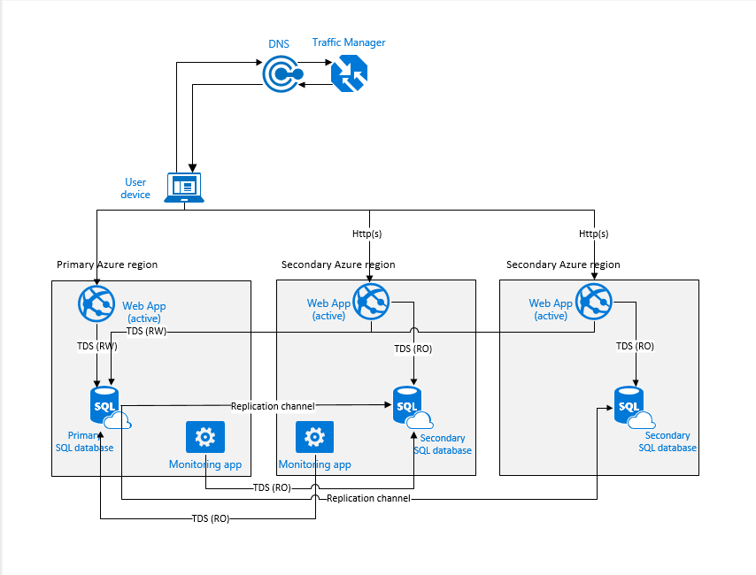

<properties
   pageTitle="云灾难恢复解决方案 - SQL 数据库异地复制 | Azure"
   description="了解如何使用 Azure SQL 数据库中应用程序数据备份的异地复制功能为业务连续性规划设计云灾难恢复解决方案。"
   keywords="云灾难恢复、灾难恢复解决方案、应用程序数据备份、异地复制、业务连续性规划"
   services="sql-database"
   documentationCenter=""
   authors="anosov1960"
   manager="jeffreyg"
   editor="monicar"/>

<tags
   ms.service="sql-database"
   ms.date="02/23/2016"
   wacn.date="04/06/2016"/>

# 使用 SQL 数据库中的异地复制功能为云灾难恢复设计应用程序

了解如何使用 SQL 数据库中的异地复制功能设计包括云灾难恢复解决方案的应用程序。为了业务连续性规划，你要考虑的因素包括应用程序部署拓扑、要采用的服务级别协议、流量延迟和成本。在本文中我们将探讨常见的应用程序模式并讨论每个模式的优点和不足。

## 设计模式 1：使用并置数据库的针对云灾难恢复的主动-被动部署

此选项最适合具有以下特征的应用程序：

+ 在单个 Azure 区域中的活动实例
+ 对数据的读写 (RW) 访问具有很强依赖性
+ 由于延迟和流量成本，应用程序逻辑与数据库之间的跨区域连接是不可接受的    

在这种情况下，当所有应用程序组件均受到影响并且需要作为一个单元进行故障转移时，将针对处理区域灾难对应用程序部署拓扑进行优化。对于地理冗余，应用程序逻辑和数据库将复制到另一个区域但在正常情况下不用于应用程序工作负荷。次要区域中的应用程序应配置为使用辅助数据库的 SQL 连接字符串。流量管理器设置为使用[故障转移路由方法](/documentation/articles/traffic-manager-configure-failover-routing-method)。

> [AZURE.NOTE] [Azure traffic manager](/documentation/articles/traffic-manager-overview) 在整篇文章中仅供说明之用。你可以使用任何支持故障转移路由方法的负载平衡解决方案。

除了主应用程序实例外，你还应考虑部署一个较小的[辅助角色应用程序](/documentation/articles/cloud-services-choose-me/#tellmecs)，以通过定期发出 T-SQL 只读 (RO) 命令来监视主数据库。可使用它自动触发故障转移和/或在应用程序的管理控制台上生成警报。若要确保监视不受区域范围的停机影响，应将监视应用程序实例部署到每个区域，并将它们连接到其他区域中的数据库，但只有次要区域中的实例需要处于活动状态。

> [AZURE.NOTE] 如果你使用的是[活动异地复制](/documentation/articles/sql-database-geo-replication-overview)，可以使两个监视应用程序处于活动状态，并同时探测主数据库和辅助数据库。后者可用于在次要区域中检测故障，并在应用程序未受保护时通知。

下图显示了在发生服务中断之前的此配置。

在主区域中发生服务中断后，监视应用程序检测到主数据库不可访问，并注册了一个警报。根据你的应用程序 SLA，你可以决定在声明数据库服务中断之前，连续的监视探测应失败多少次。若要实现应用程序终结点和数据库的协调故障转移，应让监视应用程序执行以下步骤：

1. [更新主终结点的状态](https://msdn.microsoft.com/zh-cn/library/hh758250.aspx)以触发终结点故障转移。
2. 调用辅助数据库以[启动数据库故障转移](https://msdn.microsoft.com/zh-cn/library/azure/dn509573.aspx)。

在故障转移后，应用程序将处理次要区域中的用户请求，但将保持与数据库处于同一位置，因为主数据库现在位于次要区域中。这一点由下一个关系图说明。在所有关系图中，实线指示活动连接，虚线指示暂停的连接，停止符号指示操作触发。

如果服务中断发生在次要区域中，主数据库和辅助数据库之间的复制链接将暂停，并且监视应用程序将注册公开主数据库的警报。这不会影响应用程序的性能，但它将公开运行，因此在这两个区域同时连续失败的情况下会具有较高风险。

> [AZURE.NOTE] 我们仅建议使用单个 DR 区域进行部署配置。这是因为大多数 Azure 地理位置都有两个区域。这些配置不会保护你的应用程序免受这两个区域的灾难性故障的影响。在此类失败的不可能事件中，你可以使用[地域还原操作](/documentation/articles/sql-database-disaster-recovery/#recovery-using-geo-restore)在第三个区域中恢复数据库。

缓解服务中断后，辅助数据库将自动与主数据库进行同步。在同步过程中，主数据库的性能可能会略微受影响，具体取决于需要进行同步的数据量。下图说明了次要区域中的服务中断。

此设计模式的主要**优点**是：

+ 在应用程序部署期间在每个区域中设置 SQL 连接字符串，并且此连接字符串在故障转移后不会更改。
+ 应用程序的性能不受故障转移影响，因为应用程序和数据库始终在同一位置。

主要**不足**是次要区域中的冗余应用程序实例仅用于灾难恢复。

## 设计模式 2：实现应用程序负载平衡的主动-主动部署
此云灾难恢复选项最适合具有以下特征的应用程序：

+ 数据库读取与写入的比率较高
+ 数据库写入延迟不会影响最终用户体验  
+ 可使用不同的连接字符串将只读逻辑与读写逻辑分开
+ 只读逻辑不依赖于正在与最新更新完全同步的数据  

如果你的应用程序具有这些特征，则将最终用户连接负载平衡到不同区域中的多个应用程序实例上，可以提高性能和改善最终用户体验。若要实现这一点，每个区域应具有应用程序的活动实例，并将读写 (RW) 逻辑连接到主要区域中的主数据库。应将只读 (RO) 逻辑连接到与应用程序实例在同一区域中的辅助数据库。流量管理器应设置为使用[轮循机制路由](/documentation/articles/traffic-manager-configure-round-robin-routing-method)或[性能路由](/documentation/articles/traffic-manager-configure-performance-routing-method)，并为每个应用程序实例启用[终结点监视](/documentation/articles/traffic-manager-monitoring)。

如模式 #1 中所示，你应考虑部署类似的监视应用程序。但与模式 #1 不同的是，它不负责触发终结点故障转移。

> [AZURE.NOTE] 由于前面所述的原因，虽然此模式使用多个辅助数据库，但只有其中一个辅助数据库将用于故障转移。由于此模式需要对辅助数据库进行只读访问，它需要[活动异地复制](/documentation/articles/sql-database-geo-replication-overview)。

应针对性能路由配置流量管理器以引导应用程序实例的用户连接最接近用户的地理位置。下图说明了在发生服务中断之前的此配置。

如果在主要区域中检测到数据库服务中断，你将启动主数据库到某个次要区域的故障转移，这将会更改主数据库的位置。流量管理器将自动从路由表中排除脱机终结点，但会继续将最终用户流量路由到剩余的联机实例。由于主数据库现在位于不同的区域，所有联机实例都必须更改其读写 SQL 连接字符串以连接到新的主数据库。请务必在启动数据库故障转移之前进行此更改。只读 SQL 连接字符串应保持不变，因为它们始终指向同一区域中的数据库。故障转移步骤如下：

1. 更改读写 SQL 连接字符串以指向新的主数据库。
2. 调用指定的辅助数据库以[启动数据库故障转移](https://msdn.microsoft.com/zh-cn/library/azure/dn509573.aspx)。

下图说明了在故障转移后的新配置。

在其中一个次要区域中发生服务中断时，流量管理器将自动从路由表中删除该区域中的脱机终结点。将暂停到该区域中辅助数据库的复制通道。在服务中断期间，由于剩余的区域将获得更多用户流量，应用程序的性能可能会受到影响。缓解服务中断后，受影响区域中的辅助数据库将立即与主数据库进行同步。在同步过程中，主数据库的性能可能会略微受影响，具体取决于需要进行同步的数据量。下图说明了某个次要区域中的服务中断。

此设计模式的主要**优点**是你可以缩放多个辅助数据库上的应用程序工作负荷以获得最佳最终用户性能。此选项的**不足**是：

+ 应用程序实例与数据库之间的读写连接具有不同的延迟和成本
+ 在服务中断期间，应用程序性能会受到影响
+ 应用程序实例在数据库故障转移后需要动态更改 SQL 连接字符串。  

> [AZURE.NOTE] 可以使用类似的方法来卸载专用工作负荷，例如报告作业、商业智能工具或备份。通常这些工作负荷占用大量数据库资源，因此建议你为它们指定其中一个辅助数据库，并使性能级别与预期的工作负荷匹配。

## 设计模式 3：实现保留数据的主动-被动部署  
此选项最适合具有以下特征的应用程序：

+ 任何数据丢失都具有高业务风险，数据库故障转移在服务中断是永久性时只能用作最后的解决措施。
+ 在一段时间内，应用程序可以在“只读模式”下运行。

在此模式下，应用程序在连接到辅助数据库时将切换到只读模式。主要区域中的应用程序逻辑与主数据库在同一位置，并在读写模式 (RW) 下运行，次要区域中的应用程序逻辑与辅助数据库在同一位置，并可以在只读模式 (RO) 下运行。流量管理器应设置为使用[故障转移路由](/documentation/articles/traffic-manager-configure-failover-routing-method)，并为两个应用程序实例启用[终结点监视](/documentation/articles/traffic-manager-monitoring)。

下图说明了在发生服务中断之前的此配置。

当流量管理器检测到连接主要区域失败时，它会自动将用户流量切换到次要区域中的应用程序实例。使用此模式时，你务必要注意在检测到服务中断后**不要**启动数据库故障转移。次要区域中的应用程序将激活，并使用辅助数据库以只读模式运行。下图对此进行了说明。

缓解主要区域中的服务中断后，流量管理器将在主要区域中检测到连接还原，并会将用户流量切换回主要区域中的应用程序实例。该应用程序实例恢复并使用主数据库以读写模式运行。

> [AZURE.NOTE] 由于此模式需要对辅助数据库进行只读访问，它需要[活动异地复制](/documentation/articles/sql-database-geo-replication-overview)。

在次要区域中发生服务中断时，流量管理器会将主要区域中的应用程序终结点标记为降级并将暂停复制通道。但是，在服务中断期间，它不会影响应用程序的性能。缓解服务中断后，辅助数据库将立即与主数据库进行同步。在同步过程中，主数据库的性能可能会略微受影响，具体取决于需要进行同步的数据量。

此设计模式具有多个**优点**：

+ 它在临时服务中断期间可避免数据丢失。
+ 当流量管理器触发恢复时，它不需要你部署监视应用程序。
+ 停机时间仅取决于流量管理器检测到连接故障的速度，此速度是可配置的。

**不足**是：

+ 应用程序必须能够以只读模式运行。
+ 在连接到只读数据库时，需要动态切换到此应用程序。
+ 恢复读写操作需要恢复主要区域，这意味着可能会几小时甚至若干天禁止完全数据访问。

> [AZURE.NOTE] 在区域中发生永久服务中断的情况下，将需要手动激活数据库故障转移并接受数据丢失。应用程序将在次要区域中正常工作，并对数据库具有读写访问权限。

## 业务连续性规划：选择用于云灾难恢复的应用程序设计

特定的云灾难恢复策略可组合或扩展这些设计模式以最好地满足你的应用程序需求。如前所述，所选的策略将基于你要提供给客户的 SLA 和应用程序部署拓扑。为了帮助你进行决策，下表基于估计的数据丢失或恢复点目标 (RPO) 和估计的恢复时间 (ERT) 比较了相关选项。

| 模式 | RPO | ERT
| :--- |:--- | :---
| 使用并置数据库访问进行灾难恢复的主动-被动部署 | 读写访问 < 5 秒 | 故障检测时间 + 故障转移 API 调用 + 应用程序验证测试
| 实现应用程序负载平衡的主动-主动部署 | 读写访问 < 5 秒 | 故障检测时间 + 故障转移 API 调用 + SQL 连接字符串更改 + 应用程序验证测试
| 实现保留数据的主动-被动部署 | 只读访问 < 5 秒，读写访问 = 0 | 只读访问 = 连接故障检测时间 + 应用程序验证测试  读写访问 = 缓解服务中断所用时间

<!---HONumber=Mooncake_0328_2016-->