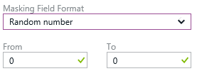
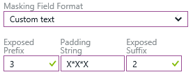
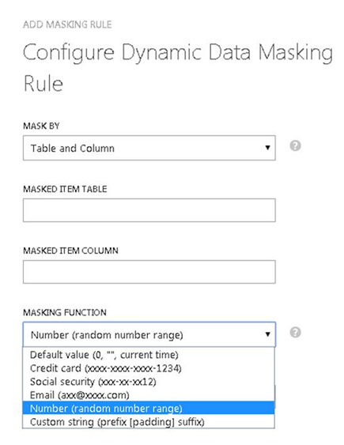

<properties
   pageTitle="SQL 数据库动态数据屏蔽入门（Azure 经典门户）"
   description="如何开始在 Azure 经典门户中使用 SQL 数据库动态数据屏蔽"
   services="sql-database"
   documentationCenter=""
   authors="ronitr"
   manager="jhubbard"
   editor=""/>

<tags
   ms.service="sql-database"
   ms.date="04/11/2016"
   wacn.date="05/16/2016"/>

# SQL 数据库动态数据屏蔽入门（Azure 经典门户）

## 概述

SQL 数据库动态数据屏蔽通过向无特权用户屏蔽敏感数据来控制此类数据的透漏。V12 版的 Azure SQL 数据库支持动态数据屏蔽。

动态数据屏蔽允许客户指定在对应用层产生最小影响的前提下可以透露的敏感数据量，从而帮助防止未经授权的用户访问敏感数据。它是一种基于策略的安全功能，会在针对指定的数据库字段运行查询后返回的结果集中隐藏敏感数据，同时保持数据库中的数据不变。

例如，呼叫中心服务代表可以根据呼叫者的身份证号或信用卡号的多个数字来识别其身份，但这些数据项不应完全透露给服务代表。可以定义屏蔽规则，屏蔽任意查询的结果集中任何身份证号或信用卡号除最后四位数以外的其他所有数字。另举一例，通过定义适当的数据屏蔽来保护个人身份信息 (PII) 数据，开发人员一方面可以查询生产环境以进行故障排除，同时又不违反法规遵从性要求。

## SQL 数据库动态数据屏蔽基础知识

可以在 Azure 经典门户中数据库的“审核和安全性”选项卡下设置动态数据屏蔽策略。

### 动态数据屏蔽权限

Azure 数据库管理员、服务器管理员或安全主管角色可以配置动态数据屏蔽。

### 动态数据屏蔽策略

* **不对其进行屏蔽的 SQL 用户** - 一组可以在 SQL 查询结果中获取非屏蔽数据的 SQL 用户或 AAD 标识。请注意，始终不会对拥有管理员权限的用户进行屏蔽，这些用户可以查看没有任何屏蔽的原始数据。

* **屏蔽规则** - 一组规则，定义将要屏蔽的指定字段，以及要使用的屏蔽函数。可以使用数据库架构名称、表名称和列名称定义指定的字段。

* **屏蔽函数** - 一组方法，用于控制不同情况下的数据透露。

| 屏蔽函数 | 屏蔽逻辑 |
|----------|---------------|
| **默认** |**根据指定字段的数据类型完全屏蔽**  • 对于字符串数据类型（nchar、ntext、nvarchar），将使用 XXXX；如果字段大小小于 4 个字符，则使用更少的 X。 • 对于数字数据类型（bigint、bit、decimal、int、money、numeric、smallint、smallmoney、tinyint、float、real），将使用零值。 • 对于日期/时间数据类型（date、datetime2、datetime、datetimeoffset、smalldatetime、time），将使用 01-01-1900。 • 对于 SQL 变体，将使用当前类型的默认值。 • 对于 XML，将使用文档 <masked/>。 • 对于特殊数据类型（timestamp、table、hierarchyid、GUID、binary、image、varbinary 空间类型），将使用空值。
| **信用卡** |**公开指定字段的最后四位数**，并添加一个信用卡格式的常量字符串作为前缀的屏蔽方法。  XXXX-XXXX-XXXX-1234|
| **身份证号** |**公开指定字段的最后四位数**，并添加一个中国身份证号格式的常量字符串作为前缀的屏蔽方法。  XXX-XX-1234 |
| **电子邮件** | **公开第一个字母并将域替换为 XXX.com**，并使用一个电子邮件地址格式的常量字符串作为前缀的屏蔽方法。  aXX@XXXX.com |
| **随机数** | 根据选定边界和实际数据类型**生成随机数的屏蔽方法**。如果指定的边界相等，则屏蔽函数将是常数。   |
| **自定义文本** | **公开第一个和最后一个字符**，并在中间添加一个自定义填充字符串的屏蔽方法。如果原始字符串短于公开的前缀和后缀，则只使用填充字符串。 前缀[填充字符]后缀   |

## 使用 Azure 经典门户为数据库设置动态数据屏蔽

1. 启动 Azure 经典门户 ([https://manage.windowsazure.cn](https://manage.windowsazure.cn))。

2. 单击要屏蔽的数据库，然后单击“审核和安全性”选项卡。

3. 在“动态数据屏蔽”下，单击“已启用”以启用动态数据屏蔽功能。

4. 键入不应对其进行屏蔽的 SQL 用户或 AAD 标识，允许其访问未屏蔽的敏感数据。这些用户在键入时应该采用分号分隔用户列表的形式。请注意，拥有管理员权限的用户始终可以访问原始的未屏蔽数据。

	>[AZURE.TIP] 若要使应用程序层向应用程序特权用户显示敏感数据，请添加应用程序查询数据库时需要使用的 SQL 用户或 AAD 标识。强烈建议在此列表中包含最少量的特权用户，以最大程度地降低泄露敏感数据的风险。

	

5. 在页面底部的菜单栏中，单击“添加屏蔽”打开屏蔽规则配置窗口。

6. 从下拉列表中选择“架构”、“表”和“列”，以定义要屏蔽的指定字段。

7. 从敏感数据屏蔽类别列表中选择“屏蔽函数”。

	

8. 在数据屏蔽规则窗口中单击“确定”，以更新动态数据屏蔽策略中的屏蔽规则集。

9. 单击“保存”以保存新的或更新的屏蔽策略。

## 使用 Transact-SQL 语句为数据库设置动态数据屏蔽

请参阅 [Dynamic Data Masking（动态数据屏蔽）](https://msdn.microsoft.com/zh-cn/library/mt130841.aspx)。

## 使用 Powershell cmdlet 为数据库设置动态数据屏蔽

请参阅 [Azure SQL 数据库 Cmdlet](https://msdn.microsoft.com/zh-cn/library/azure/mt574084.aspx)。

## 使用 REST API 为数据库设置动态数据屏蔽

请参阅[对 Azure SQL 数据库的操作](https://msdn.microsoft.com/zh-cn/library/dn505719.aspx)。

<!---HONumber=Mooncake_0509_2016-->
