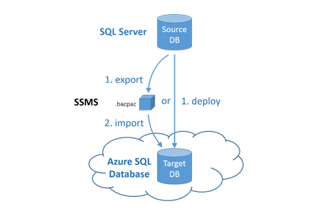
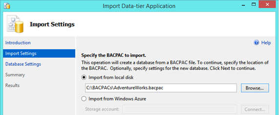
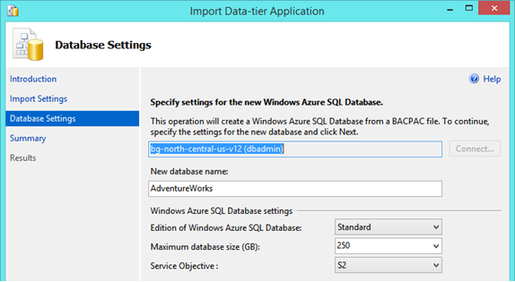

<properties
   pageTitle="Migrating to SQL Database using SSMS"
   description="Microsoft Azure SQL Database, migrate sql database, migrate using ssms"
   services="sql-database"
   documentationCenter=""
   authors="kaivalyah2015"
   manager="jeffreyg"
   editor="monicar"/>

<tags
 wacn.date="05/20/2015" 
   ms.service="sql-database"
   ms.date="04/14/2015"/>

#Migrating a compatible database using SSMS 

If a database schema is already compatible with Azure SQL Database then then migration will be straightforward. If no schema modifications are required, a migration only requires that the database is imported into Azure. This can be done in a single step using SSMS by ‘deploying’ the database to Azure SQL Database, or as a two-step process by first exporting a BACPAC of the current database and then importing that BACPAC to Azure to create a new Azure SQL database. 

You can upload the exported BACPAC to Azure Storage and import it using the portal. Running the import in the cloud will reduce the latency in the import step which will improve performance and reliability of the migration with large databases.

Deploying directly from SSMS will always deploy the schema and data, while export and import always deploys the schema and provides an option to deploy data from all or a subset of the tables.  Whether you deploy from SSMS or export and then import from SSMS (or later the portal) the same DAC technology is used under the hood and the outcome is the same.   

This option is also used as the final step in option #3 to migrate the databases after it has been updated to make it compatible with Azure SQL Database. 

##Using SSMS to Deploy to Azure SQL Database
1.	Provision a logical server using the Azure Management Portal.
2. Locate the source database in the SSMS Object Explorer and execute the task, **Deploy Database to Azure SQL Database…**

	

3.	In the deployment wizard configure the connection to the target Azure SQL Database server provisioned in step. 
4.	Provide the **name** for the database and set the **Edition** (service tier) and **Service Objective** (performance level). See, Choosing a database performance level/pricing tier for migration, for more information on configuring these settings. 

	

5.	Complete the wizard to migrate the database.  
Depending on the size and complexity of the database deployment may take from a few minutes to many hours. If errors occur that indicate that the database schema is incompatible with the SQL Database then a different option must be used. 
##Use SSMS to export a BACPAC and then import it to SQL Database
The deployment process can be broken into two steps: export and import. In the first step a BACPAC file is created which is then used as input in the second step. 

1.	Provision a logical server using the Azure Management Portal.
2.	Locate the source database in the SSMS Object Explorer and select the task, **Deploy Database to Azure SQL Database…**

	

3. In the export wizard configure the export to save the BACPAC file locally. The exported BACPAC always includes the complete database schema and by default data from all the tables. Use the Advanced tab if you wish to exclude data from some or all of the tables. You might, for example, choose to export only the data for reference tables.
	>[AZURE.NOTE] Note: once the Azure management portal supports import running in Azure then you could choose to save the exported BACPAC file to Azure Storage and run the import in the cloud. 

	

4.	Once the BACPAC has been created, connect to the server you created in step1, right click on Databases folder and select Import Data Tier Application...

	 

5.	In the import wizard select the BACPAC file you have just exported to create the new database in Azure SQL Database. 

	

6.	Provide the name for the database and set the Edition (service tier) and Service Objective (performance level). 
	 
7.	Complete the wizard to import the BACPAC file and create the database in Azure SQL Database.

	
 
##Alternatives
You can also use the command line utility sqlpackage.exe to deploy the database or export and import a BACPAC. Sqlpackage.exe uses the same DAC technology as SSMS so the outcome is the same. For more information go [here](https://msdn.microsoft.com/zh-CN/library/hh550080.aspx).
