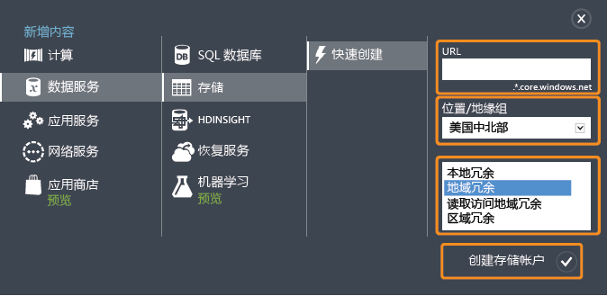
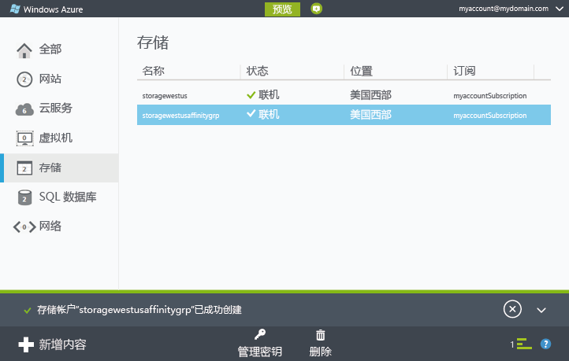
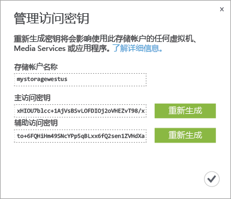

<properties
	pageTitle="如何创建、管理或删除存储帐户 | Windows Azure"
	description="了解如何在 Azure 经典门户中创建、管理或删除存储帐户。"
	services="storage"
	documentationCenter=""
	authors="robinsh"
	manager="carmonm"
	editor=""/>

<tags
	ms.service="storage"
	ms.date="12/04/2015" 
	wacn.date="01/29/2016"/>

# 关于 Azure 存储帐户

[AZURE.INCLUDE [storage-selector-portal-create-storage-account](../includes/storage-selector-portal-create-storage-account.md)]

## 概述

Azure 存储帐户授予你访问 Azure 存储空间中的 Azure Blob、队列、表和文件服务的权限。你的存储帐户为你的 Azure 存储空间数据对象提供唯一的命名空间。默认情况下，只有你，即帐户所有者，才能使用你的帐户中的数据。

有两种类型的存储帐户：

- 标准存储帐户包括 Blob、表、队列和文件存储。 
- 高级存储帐户当前仅支持 Azure 虚拟机磁盘。有关高级存储的详细信息，请参阅[高级存储：适用于 Azure 虚拟机工作负荷的高性能存储](/documentation/articles/storage-premium-storage-preview-portal)。

## 存储帐户计费

我们将根据你的存储帐户，针对你的 Azure 存储空间使用情况收费。存储成本取决于四个因素：存储容量、复制方案、存储事务和数据流出量。

- 存储容量指的是存储帐户中用来存储数据的配额。对数据进行简单存储时，其成本取决于存储的数据量和数据复制方式。
- 复制决定了你某一次的数据副本的保留数量，以及保留位置。
- 事务指的是对 Azure 存储空间的所有读取和写入操作。
- 数据流出量指的是传出某个 Azure 区域的数据。当不在同一区域中的应用程序访问你的存储帐户中的数据时，无论该应用程序是云服务还是某个其他类型的应用程序，都将会针对数据流出量向你收费。（对于 Azure 服务，你可以采取措施将你的数据和服务通过分组分到相同的数据中心内，从而降低或避免数据流出量费用。）  

[存储定价](/home/features/storage#price)页提供了针对存储容量、复制和事务的详细定价信息。[数据传输定价详细信息](/pricing/details/data-transfers/)页提供了针对数据流出量的详细定价信息。

有关存储帐户容量和性能目标的详细信息，请参阅 [Azure 存储空间可伸缩性和性能目标](http://msdn.microsoft.com/zh-cn/library/azure/dn249410.aspx)。

> [AZURE.NOTE] 当你创建 Azure 虚拟机时，如果在部署位置中还没有存储帐户，则会在该位置自动创建一个存储帐户。因此，没有必要按照下面的步骤来创建虚拟机磁盘的存储帐户。存储帐户名称将基于虚拟机名称。请参阅 [Azure 虚拟机文档](/documentation/services/virtual-machines/)以了解更多详细信息。

## 创建存储帐户

1. 登录到 [Azure 经典门户](https://manage.windowsazure.cn)。

2. 单击页面底部任务栏中的“新建”。选择“数据服务”|“存储”，然后单击“快速创建”。

	

3. 在 **URL** 中，输入你的存储帐户的名称。

	> [AZURE.NOTE] 存储帐户名称必须为 3 到 24 个字符，并且只能包含数字和小写字母。
	>  
	> 你的存储帐户名称在 Azure 中必须是唯一的。Azure 经典门户将指出你选择的存储帐户名称是否已经存在。

	请参阅下面的[存储帐户终结点](#storage-account-endpoints)以了解如何使用存储帐户名称来定位 Azure 存储空间中你的对象。

4. 在“位置/地缘组”中，选择靠近你或你的客户的存储帐户的位置。如果其他 Azure 服务（例如 Azure 虚拟机或云服务）将要访问你存储帐户中的数据，你可能需要从列表中选择一个地缘组，以便将你的存储帐户与其他需要用来改进性能和降低成本的 Azure 服务组合到同一个数据中心。

	请注意，在创建存储帐户时，必须选择一个地缘组。不能将现有帐户移到一个地缘组中。有关地缘组的更多信息，请参阅下面的[服务与地缘组的托管](#service-co-location-with-an-affinity-group)。

	>[AZURE.IMPORTANT] 若要确定哪些位置可用于你的订阅，可以调用[列出提供程序](https://msdn.microsoft.com/zh-cn/library/azure/dn790524.aspx)操作。若要从 PowerShell 列出提供程序，请调用 [Get-AzureLocation](https://msdn.microsoft.com/zh-cn/library/azure/dn757693.aspx)。通过 .NET，使用 ProviderOperationsExtensions 类的 [List](https://msdn.microsoft.com/zh-cn/library/azure/microsoft.azure.management.resources.provideroperationsextensions.list.aspx) 方法。
	>
<!--	>Additionally, see [Azure Regions](https://azure.microsoft.com/regions/#services) for more information about what services are available in which region.-->

5. 如果你有多个 Azure 订阅，则会显示“订阅”字段。在“订阅”中，输入要使用存储帐户的 Azure 订阅。

6. 在“复制”中，选择你的存储帐户的所需复制级别。建议的复制选项为地域冗余复制，可为你的数据提供最大耐用性。有关 Azure 存储空间复制选项的详细信息，请参阅 [Azure 存储空间复制](/documentation/articles/storage-redundancy)。

6. 单击“创建存储帐户”。

	创建存储帐户可能需要花费几分钟的时间。若要检查状态，可以监视 Azure 经典门户底部的通知。创建存储帐户后，你的新存储帐户将处于“联机”状态并且随时可供使用。

### 存储帐户终结点

存储在 Azure 存储空间中的每个对象都有唯一的 URL 地址。存储帐户名称构成该地址的子域。特定于每个服务的子域和域名的组合构成你的存储帐户的 *终结点* 。

例如，如果你的存储帐户名为 *mystorageaccount* ，则你的存储帐户的默认终结点为：

- Blob 服务：http://*mystorageaccount*.blob.core.chinacloudapi.cn

- 表服务：http://*mystorageaccount*.table.core.chinacloudapi.cn

- 队列服务：http://*mystorageaccount*.queue.core.chinacloudapi.cn

- 文件服务：http://*mystorageaccount*.file.core.chinacloudapi.cn

创建存储帐户后，你可以在 [Azure 经典门户](manage.windowsazure.cn)的存储仪表板上看到该帐户的终结点。

用于访问存储帐户中某个对象的 URL 是通过将存储帐户中对象的位置附加到终结点而构建的。例如，Blob 地址可能具有以下格式：http://*mystorageaccount*.blob.core.chinacloudapi.cn/*mycontainer*/*myblob*。

此外还可以配置用于存储帐户的自定义域名称。请参阅[为 Azure 存储帐户中的 Blob 数据配置自定义域名](/documentation/articles/storage-custom-domain-name)以了解详细信息。

### 服务与地缘组的归置

*地缘组*是你的 Azure 服务和 VM 及 Azure 存储帐户的地理分组。通过定位同一数据中心或靠近目标用户受众的计算机工作负载，地缘组可提高服务性能。此外，当某个存储帐户中的数据被另一个服务访问，而该服务是同一个地缘组的一部分时，不会对出口流量收费。

> [AZURE.NOTE] 若要创建地缘组，请打开 [Azure 经典门户](manage.windowsazure.cn)的“设置”区域，单击“地缘组”，然后单击“添加地缘组”或“添加”按钮。<b></b><b></b><b></b><b></b>你也可以使用 Azure 服务管理 API 创建和管理地缘组。请参阅<a href="http://msdn.microsoft.com/zh-cn/library/azure/ee460798.aspx">对地缘组的操作</a>以了解更多信息。

## 查看、复制和重新生成存储访问密钥

当你创建存储帐户时，Azure 将生成两个 512 位存储访问密钥，用于在用户访问该存储帐户时对其进行身份验证。通过提供两个存储访问密钥，Azure 使你能够在不中断存储服务的情况下重新生成用于访问该服务的密钥。

> [AZURE.NOTE] 我们建议你避免与其他人共享你的存储访问密钥。若要允许不提供你的访问密钥即可访问存储空间资源，可使用*共享访问签名*。共享访问签名可用于访问你的帐户中的资源，访问时间间隔由你定义，访问权限由你指定。请参阅[共享访问签名教程](/documentation/articles/storage-dotnet-shared-access-signature-part-1)以了解更多信息。

在 [Azure 经典门户](manage.windowsazure.cn)中，可使用仪表板或“存储”页上的“管理密钥”查看、复制和重新生成用于访问 Blob、表和队列服务的存储访问密钥。

### 复制存储访问密钥  

你可以使用“管理密钥”复制要在连接字符串中使用的存储访问密钥。连接字符串需要在进行身份验证时使用存储帐户名称和密钥。有关配置连接字符串以访问 Azure 存储服务的信息，请参阅[配置 Azure 连接字符串](http://msdn.microsoft.com/zh-cn/library/azure/ee758697.aspx)。

1. 在 [Azure 经典门户](manage.windowsazure.cn)中，单击“存储”，然后单击存储帐户名称以打开仪表板。

2. 单击“管理密钥”。

 	“管理访问密钥”页面打开。

	

3. 若要复制存储访问密钥，请选择密钥文本。然后右键单击，并单击“复制”。

### 重新生成存储访问密钥
你应定期更改你的存储帐户的访问密钥，以确保存储连接安全。分配了两个访问密钥，以便在你重新生成其中一个访问密钥时，始终能够使用另一个访问密钥连接到存储帐户。

> [AZURE.WARNING] 重新生成访问密钥会影响虚拟机、媒体服务以及任何依赖于存储帐户的应用程序。必须更新使用访问密钥访问存储帐户的所有客户端，以使用新密钥。

**虚拟机** - 如果你的存储帐户包含任何正在运行的虚拟机，则在重新生成访问密钥后必须重新部署所有虚拟机。若要避免重新部署，请在重新生成访问密钥之前关闭虚拟机。

**媒体服务** - 如果你的媒体服务依赖于存储帐户，则必须在重新生成密钥后将访问密钥与媒体服务重新同步。

**应用程序** - 如果你拥有使用存储帐户的 Web 应用程序或云服务，则重新生成密钥将失去连接，除非你滚动使用密钥。过程如下：

1. 更新应用程序代码中的连接字符串以引用存储帐户的辅助访问密钥。

2. 为你的存储帐户重新生成主访问密钥。在 [Azure 经典门户](manage.windowsazure.cn)中，从仪表板或“配置”页，单击“管理密钥”。单击主访问密钥下的“重新生成”，然后单击“是”以确认要生成新密钥。

3. 更新代码中的连接字符串以引用新的主访问密钥。

4. 重新生成辅助访问密钥。

## 删除存储帐户

若要删除不再使用的存储帐户，请使用仪表板或“配置”页上的“删除”。“删除”操作将删除整个存储帐户，包括帐户中的所有 Blob、表和队列。

> [AZURE.WARNING] 无法恢复已删除的存储帐户，也无法检索删除之前该存储帐户包含的任何内容。请在删除帐户之前务必备份你想要保存的任何内容。对于帐户中的任务资源也是如此 — 一旦你删除了一个 Blob、表、队列或文件 ，则它将被永久删除。
>
> 如果你的存储帐户包含用于 Azure 虚拟机的 VHD 文件，则必须删除使用这些 VHD 文件的任何映像和磁盘，然后才能删除存储帐户。首先，如果虚拟机正在运行，则停止运行，然后将其删除。若要删除磁盘，请导航到“磁盘”选项卡，然后在那里删除存所有磁盘。若要删除映像，请导航到“映像”选项卡，然后删除存储在帐户中的任何映像。

1. 在 [Azure 经典门户](manage.windowsazure.cn)中，单击“存储”。

2. 单击存储帐户条目中除名称以外的任何位置，然后单击“删除”。

	 -或-

	单击存储帐户的名称以打开仪表板，然后单击“删除”。

3. 单击“是”以确认要删除存储帐户。

## 后续步骤

- 若要了解有关 Azure 存储空间的详细信息，请参阅 [windowsazure.cn](documentation/services/storage/) 上的 Azure 存储空间文档。
- 访问 [Azure 存储空间团队博客](http://blogs.msdn.com/b/windowsazurestorage/)。
- [使用 AzCopy 命令行实用程序传输数据](/documentation/articles/storage-use-azcopy)

<!---HONumber=Mooncake_0118_2016-->