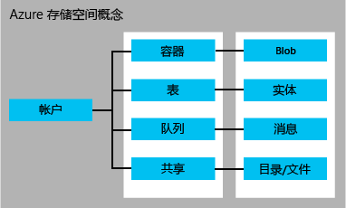

<properties 
	pageTitle="存储简介 | Windows Azure" 
	description="Windows Azure 存储空间概述。" 
	services="storage" 
	documentationCenter="" 
	authors="tamram" 
	manager="adinah" 
	editor=""/>

<tags 
	ms.service="storage" 
	ms.date="10/07/2015" 
	wacn.date="01/21/2016"/>

# Windows Azure 存储服务简介

## 概述

本文面向开发人员、IT 专业人员和业务决策者深入介绍了 Windows Azure 存储服务。通过阅读本文，你将会了解：

- 什么是 Azure 存储服务，以及如何在你的云、移动、服务器和桌面应用程序中利用它
- 你可以使用 Azure 存储服务存储什么类型的数据：Blob、表、队列和文件存储
- 在 Azure 存储服务中如何管理对你的数据的访问
- 如何通过冗余和复制保护你的 Azure 存储数据 
- 接下来要到何处去构建你的第一个 Azure 存储应用程序

若要快速开始使用 Azure 存储服务，请参阅[在 5 分钟内开始使用 Azure Blob、表和队列](/documentation/articles/storage-getting-started-guide)

如果你正在寻找对存储服务的高级别快速概述，请查看这里；如果你要了解产品特定概述，请参阅 Azure Blob、Azure 表、Azure 队列和 Azure 文件。

## 什么是 Azure 存储服务？

对于需要为其数据使用可伸缩的、持久的且具有高可用性的存储的应用程序，云计算使其有了新的方案可供选择，这正是 Microsoft 开发 Azure 存储服务的原因。除了使开发人员可以构建大型应用程序来支持新方案之外，Azure 存储服务还为 Azure 虚拟机提供了存储基础，进一步证明其可靠性。 

Azure 存储服务可以大规模伸缩，因此你可以存储和处理数百 TB 的数据来支持科学、财务分析和媒体应用程序所需的大数据方案。你也可以存储小型商业 WEB 应用所需的少量数据。当你的需求降低时，你只需要为你当前存储的数据支付费用。Azure 存储服务当前存储了数十万亿个唯一的客户对象，平均每秒处理数百万个请求。 

Azure 存储服务是弹性的，因此你可以针对大量的全球受众设计应用程序，并根据需要伸缩这些应用程序 - 在存储的数据量和针对它发出的请求数两个方面。你只需要为你使用的内容付费，并且只需要在你使用它时付费。

Azure 存储服务使用了一个自动分区系统，它可以根据流量自动对你的数据进行负载平衡。这意味着当你的应用程序上的需求增长时，Azure 存储服务会自动分配合适的资源来满足这些需求。 

可以从世界上的任何位置从任何类型的应用程序访问 Azure 存储服务，无论该应用程序是在云中、在桌面上、在本地服务器上运行还是在移动设备或平板电脑设备上运行。你可以将 Azure 存储服务用于移动方案，在这类方案中，应用程序在设备上存储一部分数据，并将其与存储在云中的完整数据集进行同步。

Azure 存储服务支持使用各种操作系统（包括 Windows 和 Linux）及各种编程语言（包括 .NET、Java 和 C++）的客户端以方便开发。Azure 存储服务还通过简单的 REST API 公开数据资源，这些 REST API 可供能够通过 HTTP/HTTPS 发送和接收数据的任何客户端使用。

<!--
Azure 高级存储现在发布了预览版。Azure 高级存储提供高性能、低延迟的磁盘支持，适合在 Azure 虚拟机上运行的 I/O 密集型工作负载。有了 Azure 高级存储，你就可以将多个持久性数据磁盘附加到虚拟机，并根据性能要求对其进行配置。每个数据磁盘在 Azure 高级存储中都有一个后备 SSD 磁盘，以确保最高的 I/O 性能。有关详细信息，请参阅[高级存储：适用于 Azure 虚拟机工作负荷的高性能存储](/zh-cn/documentation/articles/storage-premium-storage-preview-portal)。 
-->
## Azure 存储服务介绍

Azure 存储帐户是一个安全的帐户，它向你授予对 Azure 存储服务中服务的访问权限。你的存储帐户为你的存储资源提供唯一的命名空间。有两种类型的存储帐户：

- 标准存储帐户包括 Blob、表、队列和文件存储。
<!--
- 高级存储帐户当前仅支持 Azure 虚拟机磁盘。Azure 高级存储可通过["Azure 预览版"页](/zh-cn/services/preview)请求提供。
-->
你必须具有 Azure 订阅（这是允许你访问各种 Azure 服务的计划），然后才能创建存储帐户。通过单个订阅，你最多可以创建 100 个唯一的命名存储帐户。请参阅[存储定价详细信息](/home/features/storage/#price)，了解有关批量定价的信息。
<!--
你可以从[免费试用版](/zh-cn/pricing/1rmb-trial)开始使用 Azure。 
一旦决定购买某个计划，你可以从各种[购买选项](/zh-cn/pricing/purchase-options)进行选择。如果你是 [MSDN 订户](/zh-cn/pricing/member-offers/msdn-benefits-details)，则可以获得免费的月度信用，你可以将其用于各种 Azure 服务，包括 Azure 存储服务。
-->
### 标准存储帐户

标准存储帐户可以访问 Blob 存储、表存储、队列存储和文件存储：

- **Blob 存储**用于存储文件数据。Blob 可以是任何类型的文本或二进制数据，例如文档、媒体文件或应用程序安装程序。 
- **表存储**用于存储结构化数据集。表存储是一个 NoSQL“键-属性”数据存储，可以用于实现快速开发以及快速访问大量数据。
- **队列存储**为云服务的各个组件之间的工作流处理和通信提供可靠的消息传送。
- **文件存储**使用标准 SMB 协议为旧版应用程序提供共享存储。Azure 虚拟机和云服务可通过装载的共享在应用程序组件之间共享文件数据，本地应用程序可通过文件服务 REST API 来访问共享中的文件数据。 

每个标准存储帐户可以容纳高达 500 TB 混合的 Blob、队列、表和文件数据。有关标准存储帐户容量的详细信息，请参阅 [Azure 存储服务可伸缩性和性能目标](/documentation/articles/storage-scalability-targets)。

下图显示了标准存储帐户中各种 Azure 存储资源之间的关系：

了解如何创建标准存储帐户，请参阅[创建、管理或删除存储帐户](/documentation/articles/storage-create-storage-account)以获得详细信息。

### 高级存储帐户

Azure 高级存储帐户当前仅支持 Azure 虚拟机磁盘。有关 Azure 高级存储的详细信息，请参阅[高级存储：适用于 Azure 虚拟机工作负荷的高性能存储](/documentation/articles/storage-premium-storage-preview-portal)。
[AZURE.INCLUDE [storage-versions-include](../includes/storage-versions-include.md)]

## Blob 存储

对于有大量非结构化数据要存储在云中的用户，Blob 存储提供了一种经济高效且可伸缩的解决方案。你可以使用 Blob 存储来存储如下内容：

- 文档 
- 社交数据，例如照片、视频、音乐和博客
- 文件、计算机、数据库和设备的备份
- WEB 应用的图像和文本
- 云应用程序的配置数据
- 大数据，例如日志和其他大型数据集

每个 Blob 都组织到一个容器中。容器还提供了一种有用的方式来向对象组分配安全策略。一个存储帐户可以包含任意数目的容器，一个容器可以包含任意数目的 Blob，直至达到存储帐户的容量限制 500 TB。  

Blob 存储提供三种类型的 Blob：块 Blob、追加 Blob 和页 Blob（磁盘）。块 Blob 进行了相应的优化来流化和存储云对象，并且是用于存储文档、介质文件和备份等对象的不错选择。追加 Blob 类似于块 Blob，但针对追加追加操作进行了优化。追加 Blob 仅可以通过将新的块添加到末尾来进行更新。对于需要新数据只能写入到 Blob 结尾的情况，例如日志记录，追加 Blob 是一个不错的选择 。

页 Blob 进行了相应的优化来表示 IaaS 磁盘和支持随机写入，并且最大可以为 1 TB。Azure 虚拟机网络连接的 IaaS 磁盘是一个 VHD，存储为页 Blob。

对于网络限制使得通过线缆向 Blob 存储上载或从其下载数据不可行的每个大型数据集，你可以将硬盘驱动器发运到 Microsoft 以使用 [Azure 导入/导出服务](/documentation/articles/storage-import-export-service)直接通过数据中心导入或导出数据。你还可以在存储帐户内或者在存储帐户之间复制 Blob 数据。

## 表存储

与前几代的必需软件相比，现代应用程序通常要求数据存储具有更高的可伸缩性和灵活性。表存储提供了具有高可用性且可大规模伸缩的存储，因此你的应用程序可以自动伸缩以满足用户需求。表存储是 Windows 的 NoSQL 键/属性存储 - 它具有无模式的设计，使其不同于传统的关系数据库。采用无模式的数据存储，可以很容易地随着你的应用程序需求的发展使数据适应存储。表存储易于使用，因此开发人员可以快速创建应用程序。对于所有类型的应用程序，都可以快速并经济高效地访问数据。对于相似的数据量，表存储的成本通常显著低于传统的 SQL。

表存储是一种“键-属性”存储，这意味着表中的每个值都是随所键入的一个属性名称存储的。属性名称可以用来筛选和指定选择条件。属性集合及其值构成了实体。因为表存储是无模式的，因此同一表中的两个实体可以包含不同的属性集合，并且这些属性可以属于不同的类型。

你可以使用表存储来存储灵活的数据集，例如 WEB 应用的用户数据、通讯簿、设备信息，以及你的服务需要的任何其他类型的元数据。可以在表中存储任意数量的实体，并且一个存储帐户可以包含任意数量的表，直至达到存储帐户的容量极限。

像 Blob 和队列一样，开发人员可以使用标准 REST 协议来管理和访问表存储，不过，表存储还支持 OData 协议的一个子集，这简化了高级查询功能并支持 JSON 和 AtomPub（基于 XML）格式。

对于当前的基于 Internet 的应用程序，NoSQL 数据库（例如表存储）提供了一种用于替代传统的关系数据库的主流方式。 

## 队列存储

在设计应用程序以实现可伸缩性时，通常要将各个应用程序组件分离，使其可以独立地进行伸缩。队列存储为在应用程序组件之间进行异步通信提供了一种可靠的消息传送解决方案，无论这些应用程序组件是在云中、在桌面上、在本地服务器上运行还是在移动设备上运行。队列存储还支持管理异步任务以及构建过程工作流。 

一个存储帐户可以包含任意数目的队列。队列可以包含任意数量的消息，直至达到存储帐户的容量极限。每条消息最大可以为 64 KB。

## 文件存储

Azure 文件存储提供了基于云的 SMB 文件共享，这样你可以将依赖文件共享的旧版应用程序快速迁移到 Azure 且无成本高昂的重写。使用 Azure 文件存储，在 Azure 虚拟机或云服务中运行的应用程序可以在云中装载文件共享，就像桌面应用程序装载典型的 SMB 共享一样。之后，任意数量的应用程序组件可以装载并同时访问文件存储共享。

由于文件存储共享是标准的 SMB 文件共享，在 Azure 中运行的应用程序可以通过文件系统 I/O API 访问共享中的数据。因此，开发人员可以利用其现有代码和技术迁移现有应用程序。IT 专业人员在管理 Azure 应用程序的过程中，可以使用 PowerShell cmdlet 来创建、装载和管理文件存储共享。

像其他 Azure 存储服务一样，文件存储可供 REST API 使用以便访问共享中的数据。本地应用程序可以调用文件存储 REST API 以访问文件共享中的数据。这样，企业就可以选择将某些旧版应用程序迁移到 Azure，并且在其自己的组织内继续运行其他应用程序。注意，装载文件共享只适用于在 Azure 中运行的应用程序；本地应用程序只能通过 REST API 访问文件共享。

分布式应用程序也可以使用文件存储来存储和共享有用的应用程序数据以及开发和测试工具。例如，应用程序可能会在文件存储共享中存储配置文件和诊断数据，例如日志、指标以及故障转储，从而供多个虚拟机或角色使用。开发人员和管理员可以将生成或管理应用程序所需的实用程序存储在一个可供所有组件使用的文件存储共享中，而不是将它们安装在每个虚拟机或角色实例上。

## 访问 Blob、表、队列和文件资源

默认情况下，只有存储帐户所有者可以访问存储帐户中的资源。为保证你的数据的安全性，对你帐户中的资源发出的每个请求都必须进行身份验证。身份验证依赖于一个共享密钥模型。还可以将 Blob 配置为支持异步身份验证。 

在创建你的存储帐户时为其分配了两个用于身份验证的私有访问密钥。设置两个密钥可以确保你的应用程序在你定期重新生成密钥（这是一种常用的安全密钥管理做法）时仍然保持可用。

如果你确实需要允许对你的存储资源进行用户控制访问，则你可以创建一个[共享访问签名](/documentation/articles/storage-dotnet-shared-access-signature-part-1)。共享访问签名是一个可以附加到 URL 的令牌，可以实现对存储资源的委托访问。持有令牌的任何人都可以在令牌有效期间使用它指定的权限访问它指向的资源。从 2015-04-05 版开始，Azure 存储空间支持两种类型的共享访问签名：服务 SAS 和帐户 SAS。

服务 SAS 只能委派对以下一个存储服务中的资源的访问权限：Blob、队列、表或文件服务。

帐户 SAS 可委派对一个或多个存储服务中的资源的访问权限。你可以委派对服务级别操作的访问权限，而这是服务 SAS 所无法提供的。你还可以委派对 blob 容器、表、队列和文件共享执行读取、写入和删除操作的访问权限，而这是服务 SAS 所不允许的。

最后，你可以指定一个容器及其 Blob 或某个特定的 Blob 可供公开访问。当你指定某个容器或 Blob 为公用的时，任何人都可以匿名读取它，不需要进行身份验证。公用容器和 Blob 非常适用于公开在 WEB 应用上托管的资源，例如媒体和文档。若要降低全球受众的网络延迟，你可以通过 Azure CDN 来缓存 WEB 应用使用的 Blob 数据。

有关安全访问你的存储帐户的详细信息，请参阅[管理对 Azure 存储资源的访问](/documentation/articles/storage-manage-access-to-resources)和[Azure 存储服务服务的身份验证](https://msdn.microsoft.com/zh-cn/library/azure/dd179428.aspx)。

## 用于实现持久性和高可用性的复制

[AZURE.INCLUDE [storage-replication-options-include](../includes/storage-replication-options-include.md)]

## 定价

根据以下四个因素向使用 Azure 存储服务的客户收费：使用的存储容量、选择的复制选项、对服务发出的请求数，以及数据流出量。 

存储容量指的是存储帐户中用来存储数据的配额。对数据进行简单存储时，其成本取决于存储的数据量和数据复制方式。针对 Azure 存储服务的每个读取和写入操作还将针对服务发出一个请求。数据流出量是指从某个 Windows Azure 区域传出的数据。当不在同一区域中的应用程序访问你的存储帐户中的数据时，无论该应用程序是云服务还是某个其他类型的应用程序，都将会针对数据流出量向你收费。（对于 Windows Azure 服务，你可以采取措施将数据和服务通过分组分到相同的数据中心内，从而降低或避免进程和数据流出量费用。） 

[存储定价详细信息](/home/features/storage/#price)页提供了针对存储容量、复制和事务的详细定价信息。[数据传输定价详细信息](/zh-cn/pricing/details/data-transfer)提供了针对数据流出量的详细定价信息。你可以使用 [Azure 存储服务定价计算器](/zh-cn/pricing/calculator/?scenario=data-management)来帮助估算成本。

## 针对存储进行开发

Azure 存储服务通过一个 [REST API](https://msdn.microsoft.com/zh-CN/library/windowsazure/dd179355.aspx)  来公开存储资源，任何可以发出 HTTP/HTTPS 请求的语言都可以调用该 REST API。另外，Azure 存储服务还为多种主流语言提供了编程库。这些库通过对细节进行处理简化了使用 Azure 存储服务的许多方面，这些细节包括同步和异步调用、操作的批处理、异常管理、自动重试、操作行为，等等。这些库当前可供下列语言和平台以及正在筹备的其他语言和平台使用：

- [.NET](http://msdn.microsoft.com/zh-cn/library/dn495001.aspx)
- [本机代码](http://msdn.microsoft.com/zh-cn/library/dn495438.aspx)
- [Java](/develop/java)
- [Node.js](/develop/nodejs)
- [PHP](/develop/php)
- [Ruby](/develop/ruby)
- [Python](/develop/python)
- [PowerShell](http://msdn.microsoft.com/zh-cn/library/dn495240.aspx)

## 后续步骤

在开始使用 Azure 存储服务之前，请浏览以下资源：

### 下载

- [Azure 存储 NuGet 包 - 适用于 .NET、Windows Phone 和 Windows 运行时的客户端库](https://www.nuget.org/packages/WindowsAzure.Storage)
- [Azure SDK 和工具](/zh-cn/downloads)
- [Azure 存储模拟器](http://www.microsoft.com/zh-cn/download/details.aspx?id=43709)
- [Azure PowerShell](http://go.microsoft.com/?linkid=9811175&clcid=0x409)

### 源代码

- [适用于 .NET 的 Windows Azure 存储库](https://github.com/Azure/azure-storage-net)

### 文档

- [Azure 存储文档](/zh-cn/documentation/services/storage)
- [Azure 存储服务 REST API 参考](http://msdn.microsoft.com/zh-cn/library/dd179355.aspx)
- [AzCopy 命令行工具参考](/zh-cn/documentation/articles/storage-use-azcopy)

### 面向 PowerShell 用户
- [对 Azure 存储服务使用 Azure PowerShell](/documentation/articles/storage-powershell-guide-full)
- [用于服务管理的 Azure 存储服务 cmdlet](http://msdn.microsoft.com/zh-cn/library/azure/dn806401.aspx)
- [用于 Azure 资源管理器的 Azure 存储服务 cmdlet](https://msdn.microsoft.com/zh-cn/library/azure/mt269418.aspx)

### 面向 .NET 开发人员

- [.NET 客户端库引用](http://msdn.microsoft.com/zh-cn/library/azure/wa_storage_30_reference_home.aspx)
- [如何通过 .NET 使用 Blob 存储](/documentation/articles/storage-dotnet-how-to-use-blobs)
- [如何通过 .NET 使用表存储](/documentation/articles/storage-dotnet-how-to-use-tables)
- [如何通过 .NET 使用队列存储](/documentation/articles/storage-dotnet-how-to-use-queues)
- [如何通过 PowerShell 和 .NET 使用文件存储](/documentation/articles/storage-dotnet-how-to-use-files)

### 面向 Java/Android 开发人员

- [Java 客户端库参考](http://dl.windowsazure.com/storage/javadoc/)
- [如何通过 Java/Android 使用 Blob 存储](/documentation/articles/storage-java-how-to-use-blob-storage)
- [如何通过 Java/Android 使用表存储](/documentation/articles/storage-java-how-to-use-table-storage)
- [如何通过 Java/Android 使用队列存储](/documentation/articles/storage-java-how-to-use-queue-storage)

### 面向 Node.js 开发人员

- [如何通过 Node.js 使用 Blob 存储](/documentation/articles/storage-nodejs-how-to-use-blob-storage)
- [如何通过 Node.js 使用表存储](/documentation/articles/storage-nodejs-how-to-use-table-storage)
- [如何通过 Node.js 使用队列存储](/documentation/articles/storage-nodejs-how-to-use-queues)

### 面向 PHP 开发人员

- [如何通过 PHP 使用 Blob 存储](/documentation/articles/storage-php-how-to-use-blobs)
- [如何通过 PHP 使用表存储](/documentation/articles/storage-php-how-to-use-table-storage)
- [如何通过 PHP 使用队列存储](/documentation/articles/storage-php-how-to-use-queues)

### 面向 Ruby 开发人员

- [如何通过 Ruby 使用 Blob 存储](/documentation/articles/storage-ruby-how-to-use-blob-storage)
- [如何通过 Ruby 使用表存储](/documentation/articles/storage-ruby-how-to-use-table-storage)
- [如何通过 Ruby 使用队列存储](/documentation/articles/storage-ruby-how-to-use-queue-storage)

### 面向 Python 开发人员

- [如何通过 Python 使用 Blob 存储](/documentation/articles/storage-python-how-to-use-blob-storage)
- [如何通过 Python 使用表存储](/documentation/articles/storage-python-how-to-use-table-storage)
- [如何通过 Python 使用队列存储](/documentation/articles/storage-python-how-to-use-queue-storage)
 

<!---HONumber=79-->