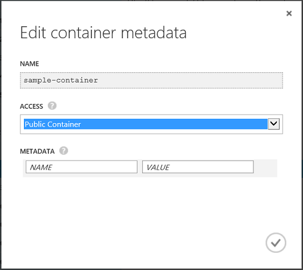

<properties 
	pageTitle="管理对容器和 blob 的匿名读取访问 | Azure" 
	description="了解如何使容器和 blob 可供匿名访问，以及如何对其进行程序式访问。" 
	services="storage" 
	documentationCenter="" 
	authors="micurd,tamram" 
	manager="jahogg" 
	editor=""/>

<tags 
	ms.service="storage" 
	ms.date="01/05/2016" 
	wacn.date="02/25/2016"/>

# 管理对容器和 blob 的匿名读取访问

## 概述

默认情况下，只有存储帐户的所有者可访问该帐户中的存储资源。如果是 Blob 存储，则可设置容器的权限，允许对容器及其 Blob 进行匿名读取访问，这样即可授予对这些资源的访问权限而不必共享你的帐户密钥。

如果你想要始终允许对某些 Blob 进行匿名读取访问，则最好是启用匿名访问。若要进行更精细的控制，则可以创建一个共享访问签名，这样即可使用不同的权限在指定时间间隔内委派受限访问。有关创建共享访问签名的详细信息，请参阅[共享访问签名：了解 SAS 模型](/documentation/articles/storage-dotnet-shared-access-signature-part-1)。

## 授予对容器和 blob 的匿名用户权限

默认情况下，仅存储帐户的所有者能够访问容器以及其中的所有 Blob。要授予匿名用户对容器及其 Blob 的读取权限，你可以设置容器权限以允许公共访问。匿名用户可以读取可公开访问的容器中的 Blob，而无需对请求进行身份验证。

容器提供了下列用于管理容器访问的选项：

- **完全公共读取访问：**可通过匿名请求读取容器和 Blob 数据。客户端可以通过匿名请求枚举容器中的 Blob，但无法枚举存储帐户中的容器。

- **仅针对 Blob 的公共读取访问：**可以通过匿名请求读取此容器中的 Blob 数据，但容器数据不可用。客户端无法通过匿名请求枚举容器中的 Blob。

- **无公共读取访问：**仅帐户所有者可读取容器和 Blob 数据。

你可以通过以下方式来设置容器权限：

- 通过 [Azure 管理门户](https://manage.windowsazure.cn/)。
- 通过使用存储客户端库或 REST API 以编程方式进行。
- 通过使用 PowerShell 进行。若要了解如何通过 Azure PowerShell 来设置容器权限，请参阅[对 Azure 存储空间使用 Azure PowerShell](/documentation/articles/storage-powershell-guide-full#how-to-manage-azure-blobs)。

### 通过 Azure 门户设置容器权限

若要通过 Azure 门户设置容器权限，请按以下步骤操作：

1. 导航到存储帐户的仪表板。
2. 从列表中选择容器名称。请注意，你必须在“名称”列的右侧单击来选择容器名称。单击该名称即可向下钻取到相应容器以显示其 blob。
3. 从工具栏中选择“编辑”。
4. 在“编辑容器元数据”对话框的“访问权限”字段中，选择所需的权限级别，如以下屏幕截图所示。

	

### 使用 .NET 通过编程方式设置容器权限

若要使用 .NET 客户端库设置容器的权限，请先调用 **GetPermissions** 方法以检索容器的现有权限。然后，设置 **GetPermissions** 方法返回的 **BlobContainerPermissions** 对象的 **PublicAccess** 属性。最后，使用更新的权限调用 **SetPermissions** 方法。

以下示例将容器的权限设置为完全公共读取访问。若要将权限设置为仅针对 blob 的公共读取访问，请将 **PublicAccess** 属性设置为 **BlobContainerPublicAccessType.Blob**。若要删除匿名用户的所有权限，请将该属性设置为 **BlobContainerPublicAccessType.Off**。

    public static void SetPublicContainerPermissions(CloudBlobContainer container)
    {
        BlobContainerPermissions permissions = container.GetPermissions();
        permissions.PublicAccess = BlobContainerPublicAccessType.Container;
        container.SetPermissions(permissions);
    }

## 匿名访问容器和 blob

如果某个客户端需要以匿名方式访问容器和 blob，则可以让该客户端使用不需要凭据的构造函数。以下示例显示了如何通过多种不同的方法以匿名方式引用 Blob 服务资源。

### 创建匿名客户端对象

你可以创建一个新的进行匿名访问的服务客户端对象，只需提供帐户的 Blob 服务终结点即可。不过，你还必须知道该帐户中允许进行匿名访问的容器的名称。

    public static void CreateAnonymousBlobClient()
    {
        // Create the client object using the Blob service endpoint.
        CloudBlobClient blobClient = new CloudBlobClient(new Uri(@"https://storagesample.blob.core.Chinacloudapi.cn"));

        // Get a reference to a container that's available for anonymous access.
        CloudBlobContainer container = blobClient.GetContainerReference("sample-container");

        // Read the container's properties. Note this is only possible when the container supports full public read access.
        container.FetchAttributes();
        Console.WriteLine(container.Properties.LastModified);
        Console.WriteLine(container.Properties.ETag);
    }

### 以匿名方式引用容器

如果你有容器的 URL，而该容器可以通过匿名方式来使用，则可使用该 URL 来直接引用容器。

    public static void ListBlobsAnonymously()
    {
        // Get a reference to a container that's available for anonymous access.
        CloudBlobContainer container = new CloudBlobContainer(new Uri(@"https://storagesample.blob.core.Chinacloudapi.cn/sample-container"));

        // List blobs in the container.
        foreach (IListBlobItem blobItem in container.ListBlobs())
        {
            Console.WriteLine(blobItem.Uri);
        }
    }

### 以匿名方式引用 blob

如果你有 blob 的 URL，而该 blob 允许进行匿名访问，则可使用该 URL 来直接引用 blob：

    public static void DownloadBlobAnonymously()
    {
        CloudBlockBlob blob = new CloudBlockBlob(new Uri(@"https://storagesample.blob.Chinacloudapi.cn/sample-container/logfile.txt"));
        blob.DownloadToFile(@"C:\Temp\logfile.txt", System.IO.FileMode.Create);
    }

## 对匿名用户可用的功能

下表显示了在将容器的 ACL 设置为允许公共访问时匿名用户可调用的操作。

| REST 操作 | 具有完全公共读取访问权限 | 具有仅针对 Blob 的公共读取访问权限 |
|--------------------------------------------------------|-----------------------------------------|---------------------------------------------------|
| 列出容器 | 仅所有者 | 仅所有者 |
| 创建容器 | 仅所有者 | 仅所有者 |
| 获取容器属性 | 全部 | 仅所有者 |
| 获取容器元数据 | 全部 | 仅所有者 |
| 设置容器元数据 | 仅所有者 | 仅所有者 |
| 获取容器 ACL | 仅所有者 | 仅所有者 |
| 设置容器 ACL | 仅所有者 | 仅所有者 |
| 删除容器 | 仅所有者 | 仅所有者 |
| 列出 Blob | 全部 | 仅所有者 |
| 放置 Blob | 仅所有者 | 仅所有者 |
| 获取 Blob | 全部 | 全部 |
| 获取 Blob 属性 | 全部 | 全部 |
| 设置 Blob 属性 | 仅所有者 | 仅所有者 |
| 获取 Blob 元数据 | 全部 | 全部 |
| 设置 Blob 元数据 | 仅所有者 | 仅所有者 |
| 放置块 | 仅所有者 | 仅所有者 |
| 获取块列表（仅提交的块） | 全部 | 全部 |
| 获取块列表（未提交的块或所有块） | 仅所有者 | 仅所有者 |
| 放置块列表 | 仅所有者 | 仅所有者 |
| 删除 Blob | 仅所有者 | 仅所有者 |
| 复制 Blob | 仅所有者 | 仅所有者 |
| 快照 Blob | 仅所有者 | 仅所有者 |
| 租赁 Blob | 仅所有者 | 仅所有者 |
| 放置页面 | 仅所有者 | 仅所有者 |
| 获取页面范围 | 全部 | 全部 |
| 追加 Blob | 仅所有者 | 仅所有者 |

## 另请参阅

- [Azure 存储空间服务的身份验证](https://msdn.microsoft.com/zh-cn/library/azure/dd179428.aspx)
- [共享访问签名：了解 SAS 模型](/documentation/articles/storage-dotnet-shared-access-signature-part-1)
- [使用共享的访问签名委托访问](https://msdn.microsoft.com/zh-cn/library/azure/ee395415.aspx) 

<!---HONumber=Mooncake_0215_2016-->