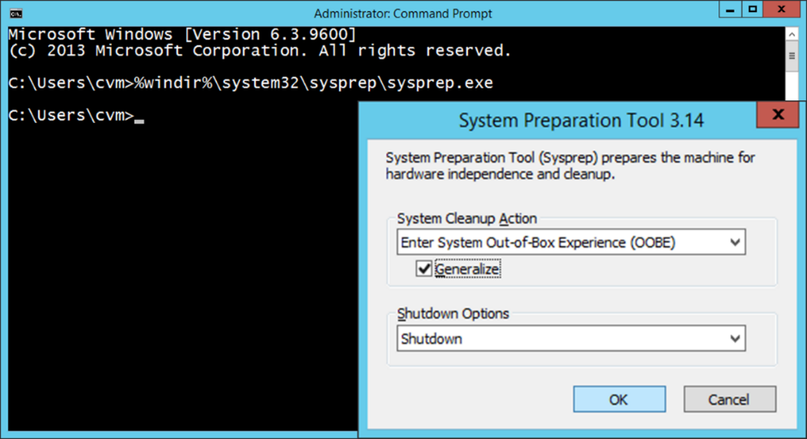
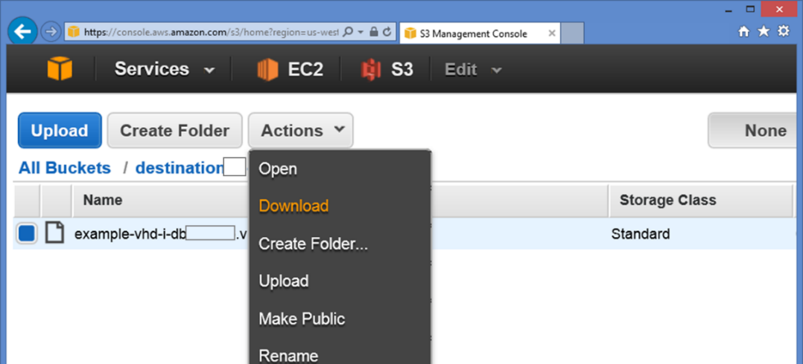

<properties 
			pageTitle="迁移到 Azure 高级存储 - Auzre 教程"
            description="迁移到 Azure 高级存储，以便为 Azure 虚拟机上运行的 I/O 密集型工作负荷提供高性能、低延迟磁盘支持。 "
            services="storage"
            documentationCenter="na"
            authors="tamram"
            manager="adinah"
            editor="" />

<tags 
	wacn.date="05/15/2015"
	ms.service="storage"
     ms.workload="storage"
     ms.tgt_pltfrm="na"
     ms.devlang="na"
     ms.topic="article"
     ms.date="04/14/2015"
     ms.author="tamram" />

# 迁移到 Azure 高级存储

## 概述

Windows Azure 高级存储将数据存储在采用最新技术的固态硬盘 (SSD) 上，为 Azure 虚拟机上运行的 I/O 密集型工作负荷提供高性能、低延迟磁盘支持。使用高级存储，每个 VM 的应用程序最多拥有 32 TB 的存储，每个 VM 可达到 50,000 IOPS（每秒输入/输出操作次数），读取操作的延迟极低。本文提供有关如何将你的磁盘、虚拟机 (VM) 从本地或标准存储或不同云平台迁移到 Azure 高级存储的准则。若要获取 Azure 高级存储产品的详细概述，请查看[高级存储：适用于 Azure 虚拟机工作负载的高性能存储](/documentation/articles/storage-premium-storage-preview-portal)。

## 开始之前

将应用程序迁移到高级存储之前，请确保已满足如下所述的先决条件，并使自己熟悉可用于你的应用程序的不同性能选项。

### 先决条件
- 你将需要 Azure 订阅。如果你没有，则可以创建一个月的[试用](/pricing/1rmb-trial)订阅或访问 [Azure 定价](/pricing)以获得更多选项。
- 若要执行 PowerShell cmdlet，你将需要 Windows Azure PowerShell 模块。若要下载该模块，请参阅 [Azure 下载](/downloads)。
- 当你计划使用在高级存储上运行的 Azure VM 时，你需要使用 DS 系列 VM。你可以将标准和高级存储磁盘用于 DS 系列 VM。在将来更多 VM 类型将提供高级存储磁盘。有关所有可用 Azure VM 磁盘类型和大小的详细信息，请参阅 [Azure 的虚拟机和云服务大小](https://msdn.microsoft.com/zh-CN/library/azure/dn197896.aspx)。

### 设计注意事项

将应用程序迁移到高级存储之前，请考虑以下设计决策，使你的应用程序性能处于最佳状态。

#### VM 大小
下面概述的是 DS 系列 VM 大小及其特征。查看这些高级存储产品的性能特征并选择最适合你的工作负荷的 Azure 磁盘和 VM 的最合适选项。确保 VM 上有足够的带宽来驱动磁盘通信。

|VM 大小|CPU 内核|最大 IOPS|最大磁盘带宽|
|:---:|:---:|:---:|:---:|
|**STANDARD_DS1**|1|3,200|每秒 32 MB|
|**STANDARD_DS2**|2|6,400|每秒 64 MB|
|**STANDARD_DS3**|4|12,800|每秒 128 MB|
|**STANDARD_DS4**|8|25,600|每秒 256 MB|
|**STANDARD_DS11**|2|6,400|每秒 64 MB|
|**STANDARD_DS12**|4|12,800|每秒 128 MB|
|**STANDARD_DS13**|8|25,600|每秒 256 MB|
|**STANDARD_DS14**|16|50,000|每秒 512 MB|

#### 磁盘大小
有三种类型的磁盘可用于你的 VM，每种磁盘都具有特定的 IOPS 和吞吐率限制。根据你的应用程序在容量、性能、可伸缩性和峰值负载方面的需要为你的 VM 选择磁盘类型时，需要考虑这些限制。

|高级存储磁盘类型|P10|P20|P30|
|:---:|:---:|:---:|:---:|
|磁盘大小|128 GB|512 GB|1024 GB (1 TB)|
|每种磁盘的 IOPS|500|2300|5000|
|每种磁盘的吞吐量|每秒 100 MB|每秒 150 MB|每秒 200 MB|

#### 存储帐户的可伸缩性目标

高级存储帐户除了 [Azure 存储空间可伸缩性和性能目标](/documentation/articles/storage-scalability-targets)外还具有以下可伸缩性目标。如果你的应用程序需求超过了单个存储帐户的可伸缩性目标，则在生成应用程序时请让它使用多个存储帐户，并将数据分布在这些存储帐户中。

|总帐户容量|本地冗余存储帐户的总带宽|
|:--|:---|
|磁盘容量：35TB 快照容量：10 TB|入站 + 出站最高每秒 50 Gbps|

有关高级存储规范的详细信息，请查看[使用高级存储时的可伸缩性和性能目标](/documentation/articles/storage-premium-storage-preview-portal#scalability-and-performance-targets-when-using-premium-storage)。

#### 附加数据磁盘
根据你的工作负荷，确定你的 VM 是否需要附加数据磁盘。你可以将多个持久性数据磁盘附加到你的 VM。如有需要，可以跨磁盘条带化，以增加卷的容量与性能。如果你使用[存储空间](https://technet.microsoft.com/zh-CN/library/hh831739.aspx)来条带化高级存储数据磁盘，应该以使用的每个磁盘一个列的方式来配置它。否则，条带化卷的整体性能可能会低于预期，因为磁盘之间的通信分配不平均。对于 Linux VM，你可以使用 mdadm 实用工具来实现同一目的。有关详细信息，请参阅文章[在 Linux 上配置软件 RAID](/documentation/articles/virtual-machines-linux-configure-raid)。

#### 磁盘缓存策略
默认情况下，所有高级数据磁盘的磁盘缓存策略都是"只读的"，所有附加到 VM 的高级操作系统都是"读写的"。为使应用程序的 IO 达到最佳性能，建议使用此配置设置。对于频繁写入或只写的磁盘（例如 SQL Server 日志文件），禁用磁盘缓存可获得更佳的应用程序性能。可以使用 Azure 门户或  *Set-AzureDataDisk* cmdlet 的 *-HostCaching* 参数更新现有数据磁盘的缓存设置。

#### 位置
选择 Azure 高级存储可用的位置。有关可用位置的最新信息，请参阅[需要了解的有关高级存储的重要事项](/documentation/articles/storage-premium-storage-preview-portal#important-things-to-know-about-premium-storage)。与存储 VM 的磁盘的存储帐户位于同一区域中的 VM 与它们在单独的区域中时相比，将提供更优异的性能。

#### 其他 Azure VM 配置设置

在创建 Azure VM 时，将要求你配置某些 VM 设置。请记住，在 VM 的生存期内有一些设置是固定不变的，而你以后可以修改或添加其他设置。请查看这些 Azure VM 配置设置，并确保这些设置都正确配置以满足你的工作负荷要求。有关更多详细信息，请参阅 [VM 配置设置](https://msdn.microsoft.com/zh-CN/library/azure/dn763935.aspx)。

## 准备 VHD 以便进行迁移

以下部分提供了从 VM 准备 VHD，使它们准备好迁移的准则。VHD 可以是：

- 可用于创建多个 Azure VM 的通用操作系统映像。
- 可用于单个 Azure 虚拟机实例的操作系统磁盘。
- 可附加到 Azure VM 作为持久存储的数据磁盘。

### 先决条件

- Azure 订阅、存储帐户以及你将在其中复制 VHD 的存储帐户中的容器。请注意，目标存储帐户可以是标准或高级存储帐户，具体取决于你的需求。
- 用于通用化 VHD 的工具（如果你计划从中创建多个 VM 实例）。例如，sysprep for Windows 或 virt-sysprep for Ubuntu。用于将 VHD 文件上载到存储帐户的工具。例如，[AzCopy](/documentation/articles/storage-use-azcopy) 或 [Azure 存储资源管理器](http://blogs.msdn.com/b/windowsazurestorage/archive/2014/03/11/windows-azure-storage-explorers-2014.aspx)。本指南介绍使用 AzCopy 工具的步骤。对于大量带宽有限的数据，可以考虑通过将硬盘驱动器运送到 Azure 数据中心来使用 [Windows Azure 导入/导出服务](/documentation/articles/storage-import-export-service)来传输数据。使用导入/导出服务可以仅将数据复制到标准存储帐户。当数据在标准存储帐户后，你将使用[复制 Blob API](https://msdn.microsoft.com/zh-CN/library/azure/dd894037.aspx) 或 AzCopy 将数据传输到高级存储帐户。
- 用于复制 VHD 的工具可以在与 VHD 在同一区域中的 Azure VM 上运行。
- Windows Azure 仅支持固定大小的 VHD 文件。不支持 VHDX 文件或动态 VHD。如果你有动态 VHD，可以使用 [Convert-VHD](https://technet.microsoft.com/zh-CN/library/hh848454.aspx) cmdlet 将其转换为固定大小。

### 准备 VHD

此处所述的方案介绍如何准备 VHD 以便进行迁移。

#### 用于创建多个 VM 实例的通用操作系统 VHD

如果你要上载**将用于创建多个泛型 Azure 虚拟机实例的 VHD**，必须先使用 sysprep 实用工具通用化 VHD。这适用于本地或云中的 VHD。Sysprep 将从 VHD 中删除任何计算机特定的信息。

**重要提示：**在通用化你的 VM 之前，请创建它的快照或对其进行备份。运行 sysprep 将删除 VM 实例。

按照以下步骤对 Windows OS VHD 运行 sysprep 命令。请注意，运行 Sysprep 命令时将要求你关闭虚拟机。有关 Sysprep 的详细信息，请参阅 [Sysprep 概述](https://technet.microsoft.com/zh-CN/library/hh825209.aspx)或 [Sysprep 技术参考](https://technet.microsoft.com/zh-CN/library/cc766049(v=ws.10).aspx)。

1. 以管理员身份打开"命令提示符"窗口。
2. 输入以下命令以打开 Sysprep： **%windir%\system32\sysprep\sysprep.exe**
3. 在系统准备工具中，选择**"进入系统全新体验(OOBE)"**，选中**"通用化"**复选框，选中**"关闭"**，然后单击**"确定"**。这将通用化操作系统，并关闭系统。

对于 Ubuntu VM，使用 virt-sysprep 实现同一目的。有关更多详细信息，请参阅 [virt-sysprep](http://manpages.ubuntu.com/manpages/precise/man1/virt-sysprep.1.html)。有关其他 Linux 操作系统，另请参见一些开放源代码 [Linux 服务器设置软件](http://www.cyberciti.biz/tips/server-provisioning-software.html)。|

#### 用于创建单个 VM 实例的唯一操作系统 VHD

如果你有在 VM 上运行的应用程序需要计算机特定的数据，请不要通用化 VHD。**非通用化 VHD 可用于创建唯一的 Azure VM 实例。**例如，如果你在 VHD 上有域控制器，执行 sysprep 将使其作为域控制器失效。在通用化 VHD 之前，请查看 VM 上运行的应用程序，以及 sysprep 对它们的影响。

#### 要附加到 VM 实例的数据磁盘 VHD

如果你在云存储中有要迁移的数据磁盘，必须确保关闭使用这些数据磁盘的 VM。对于本地的数据磁盘，请创建一致的 VHD。|
现在，VHD 已准备就绪，请按照下一节所述的步骤将 VHD 上载到 Azure 存储空间，并将其注册为操作系统映像、设置的操作系统磁盘或设置的数据磁盘。

## 将 VHD 复制到 Azure 存储空间

### 源

#### 从 Azure 存储空间复制 VHD

如果你要从标准 Azure 存储帐户到高级 Azure 存储帐户迁移 VHD，必须复制 VHD 容器的源路径、VHD 文件名和源存储帐户的存储帐户密钥。

1. 转到"Azure 门户">"虚拟机">"磁盘"
2. 从"位置"列复制并保存 VHD 的容器 URL https://*AccountName*.blob.core.chinacloudapi.cn/*ContainerName*/

#### 从非 Azure 云复制 VHD

如果你要将 VHD 从非 Azure 云存储迁移到 Azure，必须首先将 VHD 导出到本地目录中。复制存储 VHD 的本地目录的完整源路径。

1. 如果你要使用 AWS，请将 EC2 实例导出到 Amazon S3 存储桶中的 VHD。按照[导出 Amazon EC2 实例](http://docs.aws.amazon.com/AWSEC2/latest/UserGuide/ExportingEC2Instances.html)中所述的步骤安装 Amazon EC2 命令行界面 (CLI) 工具，并运行命令将 EC2 实例导出到 VHD 文件。运行命令时，请务必对 DISK_IMAGE_FORMAT 变量使用 **VHD**。导出的 VHD 文件将保存在你在该过程中指定的 Amazon S3 存储桶中。

	

2. 从 S3 存储桶中下载 VHD 文件。选择"VHD 文件">**"操作"**>**"下载"**。

	

#### 从本地复制 VHD

如果你要从本地环境迁移 VHD，则将需要 VHD 的存储位置的完整源路径。这可以是服务器位置或文件共享。

### 目标

创建用于维护 VHD 的存储帐户。规划 VHD 的存储位置时，应考虑以下几点。

- 目标存储帐户可以是标准或高级存储，具体取决于你的应用程序需求。
- 存储帐户位置必须与你将在最后阶段创建的 DS 系列 Azure VM 相同。你可以复制到新的存储帐户，也可以根据你的需求计划使用同一存储帐户。
- 为下一阶段复制并保存目标存储帐户的存储帐户密钥。
- 对于数据磁盘，你可以选择在标准存储帐户中保留一些数据磁盘（例如，具有冷却存储功能的磁盘），而在高级存储帐户中则保留具有大量 IOPS 的一些数据磁盘。

### 使用 AzCopy 复制 VHD

使用 AzCopy 可轻松通过 Internet 上载 VHD。根据 VHD 的大小，这可能需要时间。请记住，在使用此选项时，检查存储帐户传入/传出限制。你可以在[此处](azure-subscription-service-limits#storage-limits)找到 Azure 存储限制。

1. 从此处下载并安装 AzCopy：[AzCopy](http://aka.ms/downloadazcopy) 的最新版本
2. 打开 Azure PowerShell，并转到安装 AzCopy 的文件夹。
3. 使用以下命令从"Source"将 VHD 文件复制到"Destination"。**AzCopy /Source:***&lt;Source&gt;* **/SourceKey:***&lt;Source-Storage-Key&gt;* **/Destination:***&lt;Destination&gt;* **/DestKey:***&lt;Dest-Storage-Key&gt;* **/BlobType:page /Pattern:***&lt;File-Name&gt;*
  - *&lt;Source&gt;：*包含 VHD 的文件夹或存储容器 URL 的位置。
 - *&lt;Source-Storage-Key&gt;：*源存储帐户的存储帐户密钥。
 - *&lt;Destination&gt;：*要将 VHD 复制到的存储容器 URL。
 - *&lt;Dest-Storage-Key&gt;：*目标存储帐户的存储帐户密钥。
 - /BlobType:page：指定目标是页 Blob。
 - *&lt;File-Name&gt;*：要复制的 VHD 文件的名称。
 - /Pattern:*&lt;File-Name&gt;：*指定要复制的 VHD 文件名。

此命令将 *&lt;Source&gt;* 中的所有文件都复制到 *&lt;Destination&gt;* 容器。有关使用 AzCopy 工具的详细信息，请参阅 [AzCopy 命令行实用工具](/documentation/articles/storage-use-azcopy)入门。
### 用于上载 VHD 的其他选项

- [Azure 存储复制 Blob API](https://msdn.microsoft.com/zh-CN/library/azure/dd894037.aspx)
- [Azure 导入/导出服务](https://msdn.microsoft.com/zh-CN/library/dn529096.aspx)

>[AZURE.NOTE]导入/导出可用于只复制到标准存储帐户。你将需要使用 AzCopy 等工具从标准存储复制到高级存储帐户。

## 使用高级存储创建 Azure VM

将 VHD 上载到所需的存储帐户后，请按照本部分中的说明将 VHD 注册为 OS 映像或 OS 磁盘（具体取决于你的方案），然后从中创建 VM 实例。在创建后，可以将数据磁盘 VHD 附加到 VM。

### 注册 VHD

若要从 OS VHD 创建 VM 或将数据 VHD 附加到新的 VM，必须先注册它们。请按照以下步骤进行操作，具体取决于你的方案。

<table>
    <tr>
        <th>方案</th>
        <th>注册 VHD 的步骤</th>
    </tr>
    <tr>
        <td>用于创建多个 Azure VM 实例的通用操作系统 VHD</td>
        <td>
            
将通用 OS 映像 VHD 上载到存储帐户后，将其注册为 <b>Azure VM 映像</b>，以便可以从中创建一个或多个 VM 实例。 

            
使用以下 PowerShell cmdlet 将你的 VHD 注册为 Azure VM OS 映像。提供 VHD 已复制到的完整容器 URL。

            
<code>Add-AzureVMImage -ImageName "OSImageName" -MediaLocation "https://storageaccount.blob.core.chinacloudapi.cn/vhdcontainer/osimage.vhd" -OS Windows</code>

            复制并保存这个新的 Azure VM 映像的名称。在上面的示例中，它是"OSImageName"。
        </td>
    </tr>
    <tr>
        <td>用于创建单个 Azure VM 实例的唯一操作系统 VHD</td>
        <td>
            
将唯一的 OS VHD 上载到存储帐户后，将其注册为 <b>Azure OS 磁盘</b>，以便可以从中创建 VM 实例。

            
使用这些 PowerShell cmdlet 将 VHD 注册为 Azure OS 磁盘。提供 VHD 已复制到的完整容器 URL。

            <code>"https://storageaccount.blob.core.chinacloudapi.cn/vhdcontainer/osdisk.vhd" -Label "OS Disk" -OS "Windows"</code>
复制并保存这个新的 Azure OS 磁盘的名称。在上面的示例中，它是"OSDisk"。

        </td>
    </tr>
    <tr>
        <td>要附加到新的 Azure VM 实例的数据磁盘 VHD</td>
        <td>
            
将数据磁盘 VHD 上载到存储帐户后，将其注册为 Azure 数据磁盘，以便可以将它附加到新的 DS 系列 Azure VM 实例。

            
使用这些 PowerShell cmdlet 将你的 VHD 注册为 Azure 数据磁盘。提供已将 VHD 复制到的完整容器 URL。

            <code>Add-AzureDisk -DiskName "DataDisk" -MediaLocation "https://storageaccount.blob.core.chinacloudapi.cn/vhdcontainer/datadisk.vhd" -Label "Data Disk"</code>
复制并保存这个新的 Azure 数据磁盘的名称。在上面的示例中，它是"DataDisk"。

        </td>
    </tr>
</table>

### 创建 DS 系列 Azure VM

注册 OS 映像或 OS 磁盘后，便可以创建新的 DS 系列 Azure VM 实例了。你将使用你注册的操作系统映像或操作系统磁盘名称。从高级存储层选择 VM 类型。在下面的示例中，我们将使用"Standard_DS2"VM 大小。

>[AZURE.NOTE] 更新磁盘大小，以确保它满足你的容量、性能要求和可用的 Azure 磁盘大小。

按照下面的分步 PowerShell cmdlet 创建新的 VM，

首先，设置公共参数：

$vmSize ="Standard_DS2"
$adminName = "youradmin"
$adminPassword = "yourpassword"
$vmName ="yourVM"
$location = "China North"

其次，根据你的方案，从你注册的 OS 映像或 OS 磁盘创建 Azure VM 实例。

<table>
    <tr>
        <th>方案</th>
        <th>步骤</th>
    </tr>
    <tr>
        <td>用于创建多个 Azure VM 实例的通用操作系统 VHD</td>
        <td>
            使用你注册的 <b>Azure OS 映像</b>创建一个或多个新的 DS 系列 Azure VM 实例。创建新的 VM 时，在 VM 配置中指定此 OS 映像名称，如下所示，  
            <code>
                $OSImage = Get-AzureVMImage -ImageName "OSImageName"
                $vm = New-AzureVMConfig -Name "NewVM" -InstanceSize
                $vmSize
                -ImageName $OSImage.ImageName
            </code>
              
            <code>
                Add-AzureProvisioningConfig -Windows -AdminUserName $adminUser
                -Password $adminPassword -VM $vm
                New-AzureVM -ServiceName "NewVM"
            </code>
        </td>
    </tr>
    <tr>
        <td>用于创建单个 Azure VM 实例的唯一操作系统 VHD</td>
        <td>
            使用你注册的 <b>Azure OS 磁盘</b>创建新的 DS 系列 Azure VM 实例。创建新的 VM 时，在 VM 配置中指定此 OS 磁盘名称，如下所示，  
            <code>
                $OSDisk = Get-AzureDisk -DiskName "OSDisk"
                $vm = New-AzureVMConfig -Name "NewVM" -InstanceSize $vmSize
                -DiskName $OSDisk.DiskName
            </code>
              
            <code>
                Add-AzureProvisioningConfig -Windows -AdminUserName $adminUser
                -Password $adminPassword -VM $vm
                New-AzureVM -ServiceName "NewVM"
            </code>
        </td>
    </tr>
</table>

指定其他 Azure VM 信息，例如云服务、区域、存储帐户、可用性集和缓存策略。请注意，VM 实例必须与关联的操作系统或数据磁盘同位，因此，所选的云服务、区域和存储帐户必须都与这些磁盘的基础 VHD 位于同一位置中。

### 附加数据磁盘

最后，如果你已注册数据磁盘 VHD，请将它们附加到新的 DS 系列 Azure VM。

使用以下 PowerShell cmdlet 将数据磁盘附加到新的 VM，并指定缓存策略。在下面的示例中，缓存策略设为 ReadOnly。

$vmName ="yourVM"
$vm = Get-AzureVM -ServiceName $vmName -Name $vmName
Add-AzureDataDisk -ImportFrom -DiskName "DataDisk" -LUN 0 -HostCaching ReadOnly -VM $vm | Update-AzureVM

>[AZURE.NOTE] 本指南可能未涵盖支持你的应用程序所需的特定步骤。

## 后续步骤

有关虚拟机迁移的特定方案，请参阅以下资源：

- [创建 Windows Server VHD 并将其上载到 Azure。](/documentation/articles/virtual-machines-create-upload-vhd-windows-server)
- [创建并上载包含 Linux 操作系统的虚拟硬盘](/documentation/articles/virtual-machines-linux-create-upload-vhd)
<!--- [Migrating Virtual Machines from Amazon AWS to Microsoft Azure](http://channel9.msdn.com/Series/Migrating-Virtual-Machines-from-Amazon-AWS-to-Microsoft-Azure)-->

另请参阅以下资源，以了解有关 Azure 存储空间和 Azure 虚拟机的详细信息：

- [Azure 存储空间](/documentation/services/storage)
- [Azure 虚拟机](/documentation/services/virtual-machines)
- [高级存储：适用于 Azure 虚拟机工作负载的高性能存储](/documentation/articles/storage-premium-storage-preview-portal)

[1]:./media/storage-migration-to-premium-storage/storage-migration-to-premium-storage-image1.png
[2]:./media/storage-migration-to-premium-storage/storage-migration-to-premium-storage-image2.png
[3]:./media/storage-migration-to-premium-storage/storage-migration-to-premium-storage-image3.png

<!--HONumber=53-->