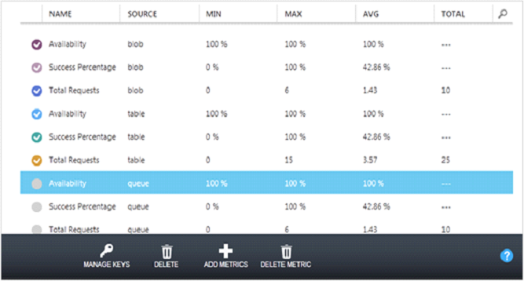
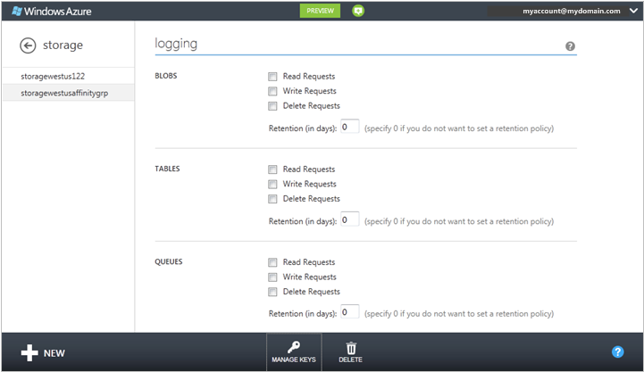

<properties
	pageTitle="如何监视存储帐户 | Azure"
	description="了解如何使用 Azure 门户在 Azure 中监视存储帐户。"
	services="storage"
	documentationCenter=""
	authors="tamram"
	manager="adinah"
	editor="cgronlun"/>

<tags
	ms.service="storage"
	ms.date="04/06/2016"
	wacn.date="05/23/2016"/>

# 监视 Azure 门户中的存储帐户

## 概述

你可以从 [Azure 管理门户](https://manage.windowsazure.cn)监视你的存储帐户。在配置您的存储帐户用于通过门户进行监视时，Azure 存储空间使用[存储分析](http://msdn.microsoft.com/zh-cn/library/azure/hh343270.aspx)跟踪帐户和日志请求数据的指标。

> [AZURE.NOTE] 在 [Azure管理门户](https://manage.windowsazure.cn)中查看监视数据会产生相关的额外费用。有关详细信息，请参阅<a href="http://msdn.microsoft.com/zh-cn/library/azure/hh360997.aspx">存储分析和计费</a>。 

> Azure 文件存储目前支持存储分析指标，但尚不支持日志记录。可以通过 [Azure 管理门户](https://manage.windowsazure.cn)为 Azure 文件存储启用指标。

> 有关使用存储分析及其他工具来识别、诊断和排查 Azure 存储相关问题的深入指导，请参阅[监视、诊断和排查 Azure 存储空间问题](/documentation/articles/storage-monitoring-diagnosing-troubleshooting)。

## 如何：为存储帐户配置监视

1. 在 [Azure 管理门户](https://manage.windowsazure.cn/)中，单击“存储”，然后单击存储帐户名称以打开仪表板。

2. 单击“配置”，然后向下滚动到 Blob、表和队列服务的“监视”设置。

	

3. 在“监视”中，为每项服务设置监视级别和数据保留策略：

	-  若要设置监视级别，请选择以下一项：

      **最少** - 收集经过汇总的有关 Blob、表和队列服务的入口/出口、可用性、延迟及成功百分比等度量值。

      **详细** – 除最少监视度量值外，在 Azure 存储服务 API 中为每项存储操作收集一组相同的度量值。通过详细监视度量值可对应用程序运行期间出现的问题进行进一步分析。

      **关闭** - 关闭监视。现有监视数据将一直保留到保留期结束。

- 若要设置数据保留策略，请在“保留期(天)”中，键入要保留数据的天数，范围介于 1 到 365 天之间。如果不需要设置保留策略，请输入零。如果没有保留策略，则是否删除监视数据由你自己决定。建议你根据要将帐户的存储分析数据保留多长时间来设置保留策略，以便可以由系统免费删除旧数据和未使用的分析数据。

4. 完成监视配置后，单击“保存”。

大约一小时后，您应当可以开始在仪表板和“监视”页上看到监视数据。

在您为存储帐户配置监视之前，不会收集任何监视数据，且仪表板和“监视”页上的度量值图表为空。

在设置监视级别和保留策略后，你可以选择要在 [Azure 管理门户](https://manage.windowsazure.cn)中监视哪些可用指标，以及要在指标图表上显示哪些指标。将在每个监视级别显示一组默认度量值。您可以使用“添加度量值”在度量值列表中添加或删除度量值。

度量值存储在存储帐户中的以下 4 个表中：$MetricsTransactionsBlob、$MetricsTransactionsTable、$MetricsTransactionsQueue 和 $MetricsCapacityBlob。有关详细信息，请参阅[关于存储分析度量值](http://msdn.microsoft.com/zh-cn/library/azure/hh343258.aspx)。

## 如何：针对监视功能自定义仪表板

在仪表板上，您可以从 9 个可用度量值中最多选择 6 个要显示在度量值图表上的度量值。对于每项服务（Blob、表和队列），“可用性”、“成功百分比”和“请求总数”均可供选择。对于最少监视或详细监视，仪表板上提供的度量值是相同的。

1. 在 [Azure 门户](https://manage.windowsazure.cn/)中，单击“存储”，然后单击存储帐户名称以打开仪表板。

2. 若要更改显示在图表上的度量值，请执行以下操作之一：

	- 要向图表中添加新的度量值，请单击该图表下方表中度量值标题旁的彩色的复选框。

	- 要隐藏显示在图表上的某个度量值，请清除该度量值标题旁的彩色复选框。

	

3. 默认情况下，该图表显示趋势，以便仅显示每个度量值的当前值（选择图表顶部的“相对”选项）。若要显示 Y 轴以便能够看到绝对值，请选择“绝对”。

4. 若要更改度量值图表显示的时间范围，请在图表顶部选择 6 小时、24 小时或者 7 天。

## 如何：自定义“监视”页

在“监视”页上，您可以查看您的存储帐户的一组完整度量值。

- 如果您的存储帐户已配置最少监视，将汇总有关 Blob、表和队列服务的入口/出口、可用性、延迟及成功百分比等度量值。

- 如果你的存储帐户已配置详细监视，那么除了服务级别的汇总之外，将以各项存储操作的更高分辨率提供度量值。

使用以下过程可选择要在“监视”页上显示的度量值图表和表中查看哪些存储度量值。这些设置不会影响存储帐户下监视数据的收集、汇总和存储。

## 如何：向度量值表中添加度量值

1. 在 [Azure 门户](https://manage.windowsazure.cn/)中，单击“存储”，然后单击存储帐户名称以打开仪表板。

2. 单击“监视”。

	此时将打开“监视”页。默认情况下，度量值表显示可用于监视的度量值的子集。下图中显示的是为所有三项服务配置了详细监视的存储帐户的默认“监视”视图。可使用“添加度量值”从所有可用度量值中选择要监视的度量值。

	

	> [AZURE.NOTE] 在选择度量值时应考虑成本。在刷新监视视图时会产生相关的事务和数据传出费用。有关详细信息，请参阅[存储分析和计费](http://msdn.microsoft.com/zh-cn/library/azure/hh360997.aspx)。

3. 单击“添加度量值”。

	最少监视中可用的汇总度量值位于列表顶部。如果选中该复选框，则度量值将显示在度量值列表中。

	

4. 将鼠标指针悬停于对话框右侧时会显示滚动条，你可以拖动它以在视图中滚动查看其他度量值。

	

5. 单击度量值旁边的向下箭头，以展开该度量值范围内所包括的操作的列表。选择要在 [Azure 管理门户](https://manage.windowsazure.cn)的度量值表中查看的每项操作。

	在下图中，“授权错误百分比”度量值已展开。

	

6. 在您为所有服务选择度量值后，单击“确定”（复选标记）以更新监视配置。所选度量值将添加到度量值表中。

7. 若要从度量值表中删除某个度量值，请单击该度量值以选中它，然后单击“删除度量值”。

	

## 如何：在“监视”页上自定义度量值图表

1. 在存储帐户的“监视”页上的度量值表中，最多可选择 6 个要显示在度量值图表上的度量值。要选择度量值，请单击其左侧的复选框。若要从图表中删除度量值，请清除复选框。

2. 若要在相对值（仅显示的最终值）和绝对值（显示的 Y 轴）之间切换图表，请选择图表顶部的“相对”或“绝对”。

3.	若要更改度量值图表显示的时间范围，请在图表顶部选择“6 小时”、“24 小时”或者“7 天”。

## 如何：配置日志记录

对于您的存储帐户中提供的每项存储服务（Blob、表和队列），您可以保存“读取请求”、“写入请求”和/或“删除请求”的诊断日志，并且可以为其中每项服务设置数据保留策略。

1. 在[管理门户](https://manage.windowsazure.cn)中, 单击“存储”，然后单击存储帐户名称以打开仪表板。

2. 单击“配置”，然后使用键盘上的向下箭头向下滚动到“日志记录”。

	

3. 为每项服务（Blob、表和队列）配置下列内容：

	- 要记录的请求类型：“读取请求”、“写入请求”和“删除请求”。

	- 保留记录数据的天数。如果不需要设置保留策略，请输入零。如果不设置保留策略，则是否删除日志由你自己决定。

4. 单击“保存”。

诊断日志保存在你的存储帐户下名为 $logs 的 Blob 容器中。有关访问 $logs 容器的信息，请参阅[关于存储分析日志记录](http://msdn.microsoft.com/zh-cn/library/azure/hh343262.aspx)。

<!---HONumber=Mooncake_0516_2016-->