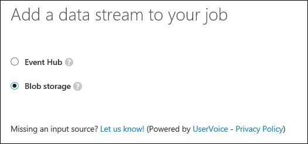
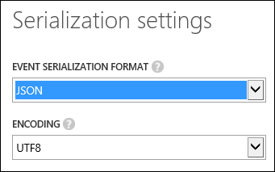
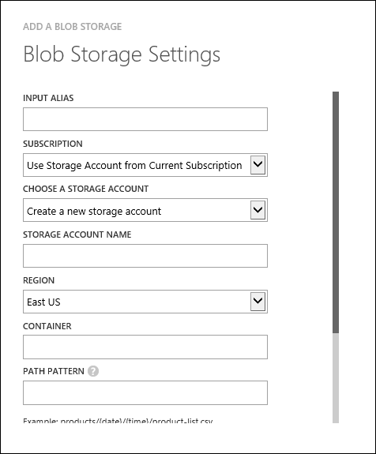

<properties 
	pageTitle="创建流分析输入 | Windows Azure" 
	description="了解如何连接到用于流分析解决方案的输入源并对其进行配置。"
	documentationCenter=""
	services="stream-analytics"
	authors="jeffstokes72" 
	manager="paulettm" 
	editor="cgronlun"/>

<tags 
	ms.service="stream-analytics" 
	ms.date="10/05/2015" 
	wacn.date="11/12/2015"/>

# 创建流分析输入

## 了解流分析输入
---
根据定义，流分析输入是指到数据源的连接。流分析在作业订阅内外与 Azure 源（事件中心和 Blob 存储）进行高级集成。将数据发送到数据源时，流分析作业会使用该数据并对其进行实时处理。输入分为两种不同类型：数据流输入和引用数据输入。

## 数据流输入
---
流分析作业必须包含至少一种可供作业使用和转换的数据流输入。Azure Blob 存储和 Azure 事件中心均可作为数据流输入源。Azure 事件中心用于从多个设备和服务（例如传感器提供的社交媒体活动源、股票交易信息或数据）收集事件流。此外，Azure Blob 存储也可用作可引入大量数据的输入源。

## 引用数据输入
---
流分析支持称为引用数据的第二类输入。此类数据为辅助数据，通常用于执行关联性操作和查找操作，而且通常为静态数据或不会频繁更改的数据。目前只支持使用 Azure Blob 存储作为引用数据的输入源。引用数据源 blob 存在 50 MB 的大小限制。

## 创建事件中心数据输入流
---
### 事件中心概述
事件中心是高度可伸缩的事件引入器，是最常用的数据引入方法，可将数据引入流分析作业。事件中心和流分析结合在一起，为客户提供了进行实时分析的端到端解决方案 -- 事件中心允许客户将事件实时馈送到 Azure 中，而流分析作业则可实时处理这些事件。例如，客户可以将 Web 点击操作、传感器读数、联机日志事件发送到事件中心，然后创建流分析作业，将事件中心用作输入数据流，以便进行实时筛选、聚合和联接操作。事件中心还可用于数据输出。有关事件中心的更多详细信息，请参阅[事件中心](/documentation/services/event-hubs/ "事件中心")文档。

### 使用者组
应对每个流分析事件中心输入进行配置，使之拥有自己的使用者组。如果作业包含自联接或多个输入，部分输入可能会由下游的多个读取器读取，这会影响单个使用者组中的读取器数目。为了避免超出针对事件中心设置的每个分区每个使用者组 5 个读取器的限制，最好是为每个流分析作业指定一个使用者组。请注意还有一项限制，即每个事件中心最多只能有 20 个使用者组。有关详细信息，请参阅[事件中心编程指南](/documentation/articles/event-hubs-programming-guide/)。

## 创建事件中心输入数据流
---
### 将事件中心添加为数据流输入  ###

1. 在流分析作业的输入选项卡上，单击**“添加输入”**，选择默认选项**“数据流”**，然后单击右侧的按钮。

    

2. 接下来，选择**“事件中心”**。

    

3. 键入或选择以下字段，然后单击右侧按钮：

    - **输入别名**：一个友好名称，将用于作业查询，以便引用此输入  
    - **Service Bus 命名空间**：Service Bus 命名空间是包含一组消息传递实体的容器。当你创建新的事件中心后，你还创建了 Service Bus 命名空间。  
    - **事件中心**：事件中心输入的名称  
    - **事件中心策略名称**：可以在事件中心的“配置”选项卡上创建的共享访问策略。每个共享访问策略都会有名称、所设权限以及访问密钥。  
    - **事件中心使用者组**（可选）：可以从事件中心引入数据的使用者组。如果未指定，流分析作业将使用默认使用者组从事件中心引入数据。建议为每个流分析作业使用不同的使用者组。  

    

4. 指定以下设置：

    - **事件序列化格式**：为了确保查询按预计的方式运行，流分析需要了解你会对传入数据流使用哪种序列化格式（JSON、CSV 或 Avro）。  
    - **编码**：目前只支持 UTF-8 这种编码格式。  

    

5. 单击相应勾选按钮以完成该向导的操作，确保流分析可以成功连接到事件中心。

## 创建 Blob 存储数据流输入
---
对于需要将大量非结构化数据存储在云中的情况，Blob 存储提供了一种经济高效且可伸缩的解决方案。通常情况下，可以将 Blob 存储中的数据视为“静态”数据，但这些数据可以作为数据流由流分析进行处理。流分析使用 Blob 存储输入的一种常见情况是进行日志处理，即首先从某个系统捕获遥测数据，然后根据需要对这些数据进行分析和处理以提取有意义的数据。 
务必注意的是，流分析中 Blob 存储事件的默认时间戳是创建 blob 的时间戳。若要在事件负载中使用时间戳以流方式处理数据，必须使用 [TIMESTAMP BY](https://msdn.microsoft.com/zh-cn/library/azure/dn834998.aspx) 关键字。有关 Blob 存储的详细信息，请参阅 [Blob 存储](/services/storage/)文档。

### 以数据流输入方式添加 Blob 存储  ###

1. 在流分析作业的输入选项卡上，单击**“添加输入”**，选择默认选项**“数据流”**，然后单击右侧的按钮。

    

2. 选择**“Blob 存储”**，然后单击右侧的按钮。

    

3. 键入或选择以下字段：

    - **输入别名**：一个友好名称，将用于作业查询，以便引用此输入  
    - **存储帐户**：如果存储帐户与流式处理作业不属于同一个订阅，则必须填写“存储帐户名称”和“存储帐户密钥”。  
    - **存储容器**：可以使用容器对存储在 Windows Azure Blob 服务中的 blob 进行逻辑分组。将 blob 上载到 Blob 服务时，必须为该 blob 指定一个容器。  

    

4. 单击**“配置高级设置”**框，以便选择相应的选项来配置读取自定义路径中的 blob 所需的“路径前缀模式”。如果未指定此字段，流分析将读取容器中的所有 blob。

    

5. 选择以下设置：

    - **事件序列化格式**：为了确保查询按预计的方式运行，流分析需要了解你会对传入数据流使用哪种序列化格式（JSON、CSV 或 Avro）。  
    - **编码**：目前只支持 UTF-8 这种编码格式。  

    

6. 单击相应勾选按钮以完成该向导的操作，确保流分析可以成功连接到 Blob 存储帐户。

## 创建 Blob 存储引用数据
---
Blob 存储可以用于定义流分析作业的引用数据。此类数据是一种静态的数据或变化缓慢的数据，用于执行查询操作或数据关联操作。
使用 {date} 和 {time} 令牌在输入配置中指定路径模式即可启用刷新引用数据的功能。流分析将根据此路径模式更新引用数据定义。例如，使用 `"/sample/{date}/{time}/products.csv"` 模式时，日期格式为“YYYY-MM-DD”，时间格式为“HH:mm”，这是告诉流分析在 2015 年 4 月 16 日下午 5:30（UTC 时区）提取更新的 blob `"/sample/2015-04-16/17:30/products.csv"`。

> [AZURE.NOTE] 目前，仅在该时间与 blob 名称中编码的时间一致的情况下，流分析作业才会查找引用 blob 刷新数据。例如，流分析作业会查找 2015 年 4 月 16 日 那天下午 5:30 和 5:30:59.999999999（UTC 时区）之间的 /sample/2015-04-16/17:30/products.csv。当时间到达下午 5:31 时，流分析作业会停止查找 /sample/2015-04-16/17:30/products.csv，开始查找 /sample/2015-04-16/17:31/products.csv。

仅在作业开始的时候，才会考虑以前的引用数据 blob。在作业开始的时候，作业会查找其名称中编码的最新日期/时间的值早于作业开始时间的 blob（在作业开始时间之前的最新引用数据 blob）。这样做是为了确保在作业开始时存在非空的引用数据集。如果找不到此类数据集，则作业会失败，将向用户显示一个诊断通知：

### 将 Blob 存储添加为引用数据  ###

1. 在流分析作业的输入选项卡上，单击**“添加输入”**，选择**“引用数据”**，然后单击右侧的按钮。

    

2.	键入或选择以下字段：

    - **输入别名**：一个友好名称，将用于作业查询，以便引用此输入  
    - **存储帐户**：如果存储帐户与流式处理作业不属于同一个订阅，则必须填写“存储帐户名称”和“存储帐户密钥”。  
    - **存储容器**：可以使用容器对存储在 Windows Azure Blob 服务中的 blob 进行逻辑分组。将 blob 上载到 Blob 服务时，必须为该 blob 指定一个容器。  
    - **路径模式**：用于对指定容器中的 blob 进行定位的文件路径。在路径中，你可以选择指定一个或多个使用以下 2 个变量的实例：{date}、{time}  

    

3. 选择以下设置：

    - **事件序列化格式**：为了确保查询按预计的方式运行，流分析需要了解你会对传入数据流使用哪种序列化格式（JSON、CSV 或 Avro）。  
    - **编码**：目前只支持 UTF-8 这种编码格式。  

    

4.	单击相应勾选按钮以完成该向导的操作，确保流分析可以成功连接到 Blob 存储帐户。

    

## 获取帮助
如需进一步的帮助，请尝试我们的 [Azure 流分析论坛](https://social.msdn.microsoft.com/Forums/zh-CN/home?forum=AzureStreamAnalytics)

## 后续步骤

- [Azure 流分析简介](/documentation/articles/stream-analytics-introduction)
- [Azure 流分析入门](/documentation/articles/stream-analytics-get-started)
- [缩放 Azure 流分析作业](/documentation/articles/stream-analytics-scale-jobs)
- [Azure 流分析查询语言参考](https://msdn.microsoft.com/zh-cn/library/azure/dn834998.aspx)
- [Azure 流分析管理 REST API 参考](https://msdn.microsoft.com/zh-cn/library/azure/dn835031.aspx)

<!---HONumber=79-->