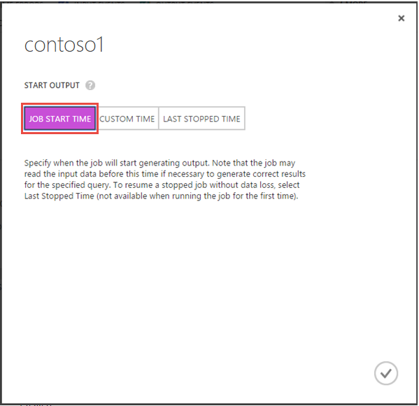

<properties 
	pageTitle="运行作业 | Windows Azure" 
	description="运行作业的学习路径段。"
	documentationCenter=""
	services="stream-analytics"
	authors="jeffstokes72" 
	manager="paulettm" 
	editor="cgronlun"/>

<tags 
	ms.service="stream-analytics" 
	ms.date="09/09/2015" 
	wacn.date="11/12/2015"/>

# 运行作业

当作业的输入、查询和输出均已指定时，你可以启动流分析作业。

若要启动你的作业：

1.	请在作业仪表板上，单击页面底部的“启动”。

    

2.	在出现的对话框中，指定一个“开始输出”值以确定此作业何时开始生成输出。之前尚未启动作业的默认设置为“作业开始时间”，表示作业将立即开始处理数据。也可以指定一个过去（从消耗历史数据）或将来（延迟处理直到将来某个时间）的“自定义”时间。当作业已经启动和停止时，可以使用“上次停止时间”选项，从上次输出时间恢复作业并避免数据丢失。

    

3.	单击对话框底部的复选按钮。作业状态将更改为“正在启动”，然后在作业已经启动后很快转变为“正在运行”。你可以在通知中心中监视开始操作的进度：

    

## 获取帮助
如需进一步的帮助，请尝试我们的 [Azure 流分析论坛](https://social.msdn.microsoft.com/Forums/zh-CN/home?forum=AzureStreamAnalytics)

## 后续步骤

- [Azure 流分析简介](/documentation/articles/stream-analytics-introduction)
- [Azure 流分析入门](/documentation/articles/stream-analytics-get-started)
- [缩放 Azure 流分析作业](/documentation/articles/stream-analytics-scale-jobs)
- [Azure 流分析查询语言参考](https://msdn.microsoft.com/library/azure/dn834998.aspx)
- [Azure 流分析管理 REST API 参考](https://msdn.microsoft.com/library/azure/dn835031.aspx)

<!---HONumber=79-->